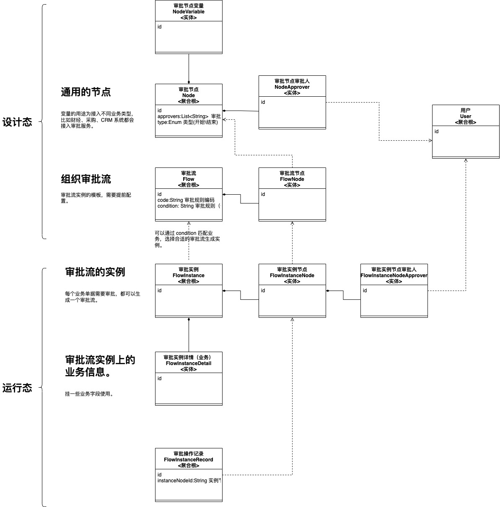
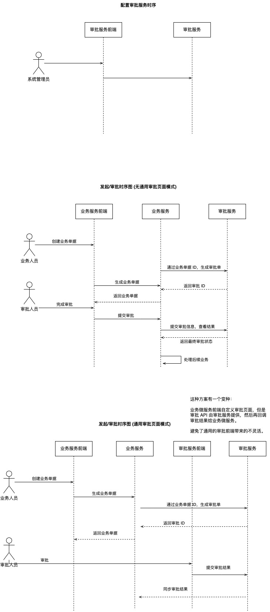

## 话题聚焦

审批流的一般实现方式。

## 问题

1. 审批流的一般实现方式？

- 搭建开源服务，比如有 Apache flowable、Camunda，出自 Activity 团队，兼容 BPMN 2.0 规范。 优点是不用开发，直接使用，可以考虑独立部署、后台操作，也可以集成到自己的产品中。如果自己实现界面集成，集成成本非常高，还不如自己实现。
- 自己实现一个审批服务。使用几个简单的模型即可完成高度定制的开发，缺点是没有什么规范了，需要自己解决什么问题。

2. 常见审批流的功能特性有哪些？

- 审批动态配置，可视化配置，可以做成拖拽的方式配置。
  - 一种方式将审批人和流程写死在规则中。
  - 在审批时再选审批人。
- 驳回处理，二次审批。
- 分支流程，分支上带条件和规则，比如业务金额达到某个规模匹配某个审批流或者节点，自动决策。
- 委托审批。
- 转审流程。
- 会签。

3. 审批人的数据权限设定，如何设计？

一个陷阱就是审批人是否能审批那些数据不能完全依赖通用的数据权限，使用单独的审批人权限，当时这两个事情都要检查。

- 用户能有相关数据的维度访问权限，改审批人有采购单维度（机构、产品、团队）的数据权限。
- 用户被加入到审批人列表中，比如采购单生成的审批流需要加入该用户。

4. 如果自己实现一套审批流？如何设计（领域模型、时序图或流程图）？

领域模型图：

时序图：

5. 【难点】审批界面上展示业务信息怎么处理？

- 如果审批界面是业务微服务或者 BFF 提供，那么 BFF 编排即可。
- 审批服务存放 key-value 的数据展示即可，业务微服务把数据整理好，通用的审批页面作为参数渲染（key-value 数据）即可。
- 审批服务不提供通用界面，业务服务自己做界面。
- Camunda 可以通过嵌入一个 HTML block，能解决部分静态页面问题。

6. 【难点】审批时需要做一些额外的操作怎么处理，比如审批时修改数据，然后审批通过？

能想到一个方案，就是业务自己通过后端审批 API 再编写一套前端，不依赖通用的审批界面。

7. 【争议较多】业务服务和审批服务之间的职责关系。

方案 1：审批服务提供审批 API、审批后台配置、测试 Mock，不提供统一的页面。
方案 2：审批服务提供审批 API、审批后台配置、提供统一的页面，如果统一的页面不满足需求，业务服务可以自己实现。

## 后续问题

1. 一个技术方案用那些图来表达?

比如，四加一，下周六。

## 录屏分享

链接: https://pan.baidu.com/s/1S4ViACGDSzgD_3OlqY1V1g?pwd=v52i 提取码: v52i 
