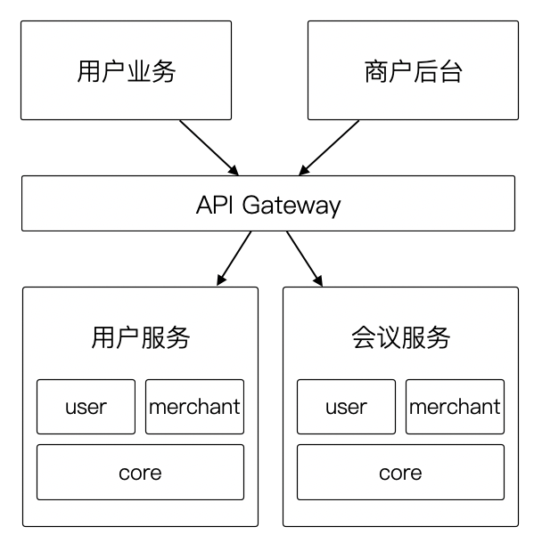
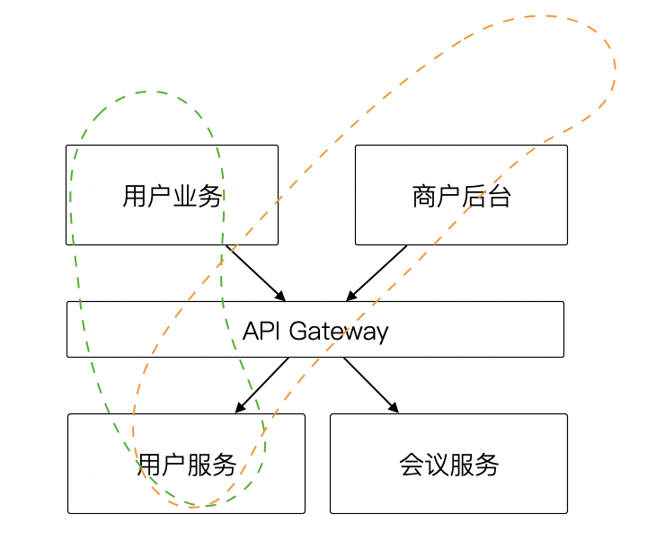

在云原生的时代，微服务已经变成了一个默认选项。但大部分开发者反馈，他们的微服务总是有这样那样的问题，明明是一个非常好的实践，但是感觉带来的问题，比解决的问题还多。

今天就来聊一聊，微服务为什么让我们觉得不对劲。

最根本的原因，还是我们对微服务概念本身的定义和理解有所偏差。微服务，不是一个全新、炫酷、能解决很多问题的架构，而是一个极其昂贵的分布式系统。如果用一句话去概括，它可以被描述为：

>  基于松耦合通信协议（HTTP）的分布式应用系统.。

这也是我们在 DDD 社区给微服务的一个基本定义。从这个定义来说，它有两方面的含义。

第一，首先是一个分布式系统。既然是一个分布式系统，就会带来分布式系统各种各样的问题和不得不做出取舍。

第二，松耦合协议。是相对于 SOA 这种面向服务的架构来说，使用 HTTP 等松耦合的通信协议取代 RPC，做到独立开发和发布。可以把它看作为 SOA 架构的变种，这也是维基百科给它的定义。

那么，既然是一个分布式系统，而且会带来这么多的问题。为什么会流行起来呢?

实际上，在做技术选型的时候，有很多的制约条件。微服务的流行，实际上是大厂随着开发人员的扩大和系统容量的要求不得已将单体的应用划分为可以独立开发、部署的单元，让数量巨大的开发人员能有效协同。

所以说：

> 大厂选择分布式系统可不是为了炫酷，而是不得已为之。

对于三五个人几条枪的小开发团队来说，微服务的使用从收益和付出来看并不划算。并且我们有的时候没有意识到微服务相对于单体架构来说，它的成本是巨大的。

## 01. 分布式系统代价

对于客观原因，我们又不得不采用分布式系统来解决我们的问题，当我们意识到微服务是一个分布式系统的时候，就可以使用分布式系统的一些原理，指导和解决在做微服务开发的过程中遇到的各种问题。

下面聊一聊微服务系统中有哪些代价和问题需要我们去解决。

**分布式鉴权**

首先，微服务被拆分出来之后，带来一个明显的问题，就是分布式的授权体系。这是一个很容易被忽略的代价，即使是只有由有两个服务组成的最小微服务系统，也不得不提供一个单独的鉴权中心。

最简单的实现方式，就是共享一个中心的会话状态库（实际上这不是分布式授权）。如果是基于 Session 的鉴权系统，分布式化后可以使用 SSO 单点登录，通过维护全局会话、本地会话的方法解决分布式授权的问题。

如果使用 token 的方式鉴权，可以使用 OAuth2 等开放授权协议进行授权。但分布式授权系统会面临一个矛盾：

> 性能和实时可撤销的矛盾。

如果每一次请求都去授权中心检查授权会带来性能问题，授权中心故障后业务也会受到影响。但是如果使用本地授权（例如 JWT），在一定时间内，无法撤销发送的凭证。这刚好就是 CAP 定理所说的，在选择分区容忍性的条件下，一致性和可用性之间存在矛盾。

如果不使用分布式的思路去设计鉴权体系，就会出现这样或者那样的毛病，还不知道为什么会这样。

**有分就需要合**

分布式系统第二个问题矛盾就是:

>  服务拆分的越小，就越是需要有地方编排。

微服务系统总是需要一个编排者，但是大家不知道它叫什么。当订单和产品属于不同的服务，就必须要通过某个服务来整合他们的数据和流程，这就是编排。

很多架构师不愿意承认这一点，他们总是希望服务是可以端到端独立交付的，如果使用编排层，往往会破坏团队端到端独立交付的能力。

但是编排的诉求不会凭空消失，而是进入了前端或者领域层。前端编排具有非常大的不确定性，泄漏到领域层就会丧失服务的复用能力，这都是为后续暴雷埋下的坑。

上图是一个企业即时通讯软件的架构。在架构早期，用户服务和会议服务都是被直接暴露出去，但是用户业务和商户后台的业务对复用的逻辑造成了冲击。由于用户服务是单独的一个团队在维护，不得不妥协成上面的样子。未来可能暴雷的地方在于，用户服务中的 user 模块和会议服务中的 user 模块会造成冲突。

**分布式事务**

分布式事务是微服务系统中另外一个比较麻烦的问题。Fischer 在他的论文中，证明了在总会存在故障的分布式系统中，达成实时共识是不可能的。

CAP 定理就是这个证明的进一步演绎：分区容忍性、一致性、可用性只能同时选择其二。

>  一致性和可用性的矛盾。

但是有些架构师对 CAP 定理的错误理解是，只能选择其二，忽略了 “同时” 这个关键要素。虽然分布式系统不可能达成实时共识，但是能达到近似的共识。如果达成共识的时间足够短，就能当做取得共识。

这就是分布式事务协调器的基本原理。

**团队治理**

我们最开始使用微服务的时候，其中有一项诉求是开发服务的团队能够实现端对端的交付。但是有意思的是，我们往往没有意识到这其中有一个矛盾，如果我们需要做到能力的复用，就必然不可能实现端到端的交付。举个例子来说，如果用户服务被多个场景使用，端到端团队怎么设计呢？

>  追求复用能力和端到端交付之间的矛盾。

**分布式查询**

微服务拥有各自的数据库并存储在不同的地方，这样可以降低数据库的压力，做到垂直分库。而代价是，如果业务中有跨数据库联表，并需要展示在相同的视图上，那么对于查询，带来一个非常大的困扰。

如果是同一个数据库，可以通过列表的方法，或者构建视图的方法来解决这个问题，但是在分布式系统下（尤其是分布式应用系统，不是分布式数据库的设计），就不得不使用其他的方法来解决这个矛盾。

>  集合的远程连接诉求和笛卡尔运算失效的矛盾
>
解决这个麻烦的方法有：

1. 使用数据冗余，降低范式。
2. 使用 IN 语句，并带上让索引起作用的额外过滤条件，避免全表扫描。
3. 使用搜索引擎，通过空间换取时间。

**其他工程问题**

当然，分布式系统还有各种各样其他的问题，当服务被部署到不同的服务器节点上，需要追踪调用关系去解决问题时，debug 的难度就陡然上升。

其次，每一个服务的业务逻辑，会把日志放到不同的日志当中，无法顺序的去跟踪一个完整的流程和结果。

另外，也有版本发布的问题，一个服务在发布时，强烈的依赖其他服务的更新，会造成发布过程中的各种问题。

## 02. “糟糕”微服务的原因

即使分布系统有这样那样的问题，但是设计一个良好的分布式系统也是可能的，它的前提有两个：

1. 对系统中服务承担的角色做合理的设计。
2. 服务能够独立的提供能力，避免将服务划分得过小。

对于第 1 个前提，可以使用一个形象的比喻。如果我们服务承担的角色不够明确，比如缺乏编排的角色，就好比我们去政务中心办理业务的时候，缺乏一个接待员。就需要依赖办事的人通晓办理业务的所有流程，自己跑完全部的窗口。

对于第 2 个前提，也有另外一个比喻。如果一个服务不具备独立提供能力，那么就会频繁的依赖其他的服务、数据耦合、分布式事务等等一系列问题，就像一个无法独立完成任务的实习生，总会在办公室到处求助一样。

## 参考资料

[1]. Michael J. Fischer, Nancy A. Lynch, and Michael S. Paterson. 1985. Impossibility of distributed consensus with one faulty process. <i>J. ACM</i> 32, 2 (April 1985), 374–382. DOI:https://doi.org/10.1145/3149.214121

[2]. An Illustrated Proof of the CAP Theorem.https://mwhittaker.github.io/blog/an_illustrated_proof_of_the_cap_theorem
