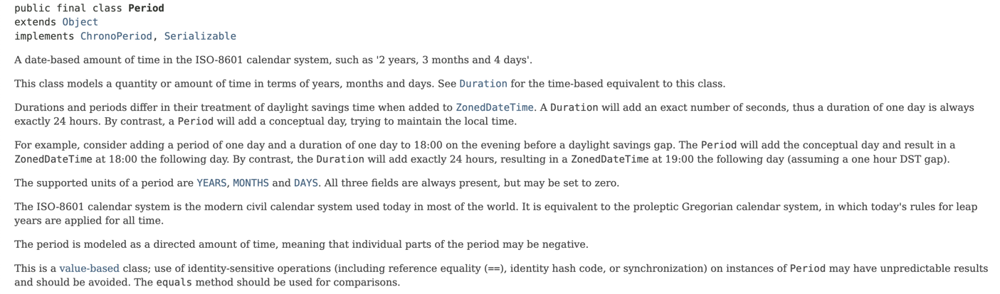

写作的价值不仅仅是传播想法，更在于总结和反馈。 系统设计系列收到了一些读者的反馈和补充，定期整理更新。

## 时间方案中补充频率表达格式

在 《系统设计中需要考虑到的时间问题》文章中我们讨论了时间的标准化表达格式，在其中提到了 ISO-8601 规范。

其实 ISO-8601 中有非常多很有价值的表达方式，只不过使用不够频繁没有拿出来讲。 我们应该尽可能使用现有的规范来实现业务，可以少走一些弯路。

在 ISO-8601 中，时间段表达法非常有用。如果我们需要做一个会议、日历系统，需要表达会议周期，在保险、金融行业，也需要表达期限，同样需要类似的数据格式，否则需要存储为多个字段。这时，我们可以使用时间段格式。

例如，P1Y3M5D 可以表达为 1 年 3 月 5 天，P1Y3M5DT6H7M30S 可以表达 1 年 3 月 5 天 6 小时 7 个月 30 秒。

在 Java 中可以使用 Period 这个类来解析出相关信息，而自己定义的格式通用性、拓展性都不好。

相关文档说明：

## 服务器推技术补充 SSE 推送

在《实时协作应用的设计》一文中，我们讨论了很多服务器推送的技术，在文章发出后，收到反馈：还有一种叫做 SSE 的技术可以选用。

SSE 的全称是 Server-Sent Events，中文叫做服务器推送事件。

相对于 WebSocket 来说，SSE 其特点是单向通道，只能由服务器向浏览器发送。本质是一个基于 HTTP 未关闭的下载流，所以无法实现双向通信。如果需要往服务器发送信息，则需要发起另外一个 HTTP 请求。

目前几乎所有现代浏览器原生支持，且被定义在 HTML5 规范中，其传输的媒体类型为 `text/event-stream`。

由于其简单的特性，SSE 有相比 WebSocket 的优点：

- 充分利用 HTTP 协议，不用拓展新协议。
- Webflux 等响应式框架都支持 SSE，实现成本极低。
- JavaScript 原生 API 容易使用。
- 使用文本传输数据，方便调试和开发。
- 消耗资源较少。

在合适的场景下，SSE 是一个不错的服务器推送方案选择。ChatGPT 发送文字的方式就是采用了 SSE，可见其效果。

## DSL 补充案例

在《设计和解析 DSL》中，邓老师（研讨会分享者）分享了他使用 DSL 语法设计了一套比较通用的表达搜索、过滤的语法，在不增加后端开发工作量的情况下完成条件过滤的开发逻辑。

项目参考：https://github.com/bobdeng/dslquery

该项目的 DSL 示例： 

> (or(and(field equal value)(fieldb greaterthan value))(or(fieldc lessthanorequal value)(fieldd notequal value)))

在这个项目中作者自己实现了字符串解析，没有使用解析器生成工具。另外值得一提的是，存在一个标准用来表达 eq、notequal 等语法，这类语法被使用得比较普遍。

这个标准叫做：SCIM Query syntax

参考文档： https://bookstack.soffid.com/books/scim/page/scim-query-syntax

RFC 文档：https://datatracker.ietf.org/doc/html/rfc7644#section-3.4.2.2

## 高精度计算相关库

在《高精度计算》中，我们讨论了 Java 中 BigDecimal 的原理，以及如何安全的使用 BigDecimal，经朋友反馈，补充了一些可以参考的类库：

- NumberUtils https://commons.apache.org/proper/commons-lang/
- https://commons.apache.org/proper/commons-math/
- https://www.joda.org/joda-money/
- https://java.net/projects/javamoney/pages/Home
- https://github.com/eobermuhlner/big-math
- https://www.quantlib.org/

## 导入和导出补充

在《导入和导出》中，我们讨论了应用系统如何实现数据的导入导出。对于 PDF 导出的技术方案，这里补充另外一种实现方式。

即：通过 HTML 模板编写页面，并通过模板引擎获取渲染后的 HTML 页面，再将其转换为 PDF。

其优点是可以更加灵活的排版。

在 Java 中可以采用 FreeMaker 作为模板引擎，使用 openhtmltopdf 这个库实现 PDF 生成。

该库通过封装 pdfbox 实现 PDF 操作，支持 CSS2.1、SVG和Base64图片等常用功能，且 License 开放，可以代替 iText。

## 补充流程引擎、规则引擎、公式引擎区别

在《处理业务公式》我们讨论了公式引擎，因此在反馈中衍生出规则引擎、流程引擎的概念。

这三个概念有一定程度的重叠，但是边界还算清晰。补充如下：

- 公式引擎：用于执行一段表达式的工具库，一般用于求值，有些可以支持一些 if 语句，可以作为规则来使用。
- 规则引擎：在满足一些条件时，出发一些规则，也可以通过配置文件进行编排。例如 Drools、LiteFlow。
- 流程引擎：用于编排系统之间的能力，用于系统集成、审批，一般支持 BPM 等模型。例如，Flowable、Activiti。

## 其它参考材料

部分参考链接已经贴在文中，补充其它有用的参考材料如下。

[1] Server-Sent Events 教程 https://www.ruanyifeng.com/blog/2017/05/server-sent_events.html

[2] https://www.baeldung.com/spring-server-sent-events

[3] https://bookstack.soffid.com/books/scim/page/scim-query-syntax
