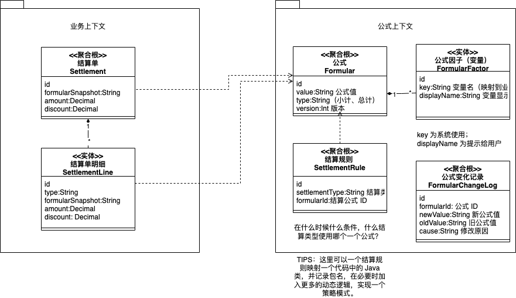
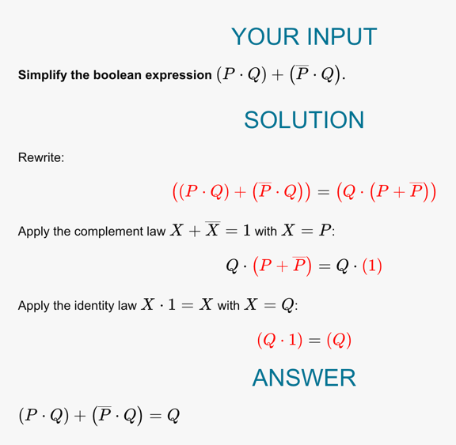

假如一个保险、CRM 系统，财务结算模块的结算方式有如下特点：

- 计算方式非常复杂
- 计算模式非常多 
- 业务人员不希望把计算规则写到代码中，而是能保持业务可见性
- 当规则变化时不影响既往的业务单据 
- 业务希望看到每类单据的计算方式和取值过程（计算透明化）
- 希望规则能版本化，比如保险政策变化时候能够提示用户使用了新的计算规则 
- 某些计算需要一些准入条件，例如根据规模和用户评级采取不同的计算策略

根据一般经验，我们可能会考虑使用公式和规则引擎来完成，在财务领域，这些公式可能会有如下特点： 

- 有一些常量、变量、计算量（子公式）
- 小计（行公式）、总计（单头公式）、计算阶梯（规则）

而使用公式涉及两个问题：

- 技术选型怎么做？
- 模型如何设计？

这期的技术方案，我们来聊聊如何通过公式处理业务规则的问题。

## 表达式类型

我在数个项目实践过通过表达式来解决业务问题，不过和一开始想的不一样，往往没有一套完美的解决方案处理所有场景，所以我们需要先对表达式类型进行分类。

对于可以用于公式执行的业务类型其实有这么几种：

- 布尔表达式：支持输入一些布尔变量，并得出布尔结果，这类表达式通常应用于条件匹配，例如前面说到的计算阶梯。
- 数学表达式：支持输入一些数字并进行数学运算，常用于财务领域的公式计算，对于公式引擎来说，一般需要支持高精度计算。
- 自定义函数的计算：有时候数学运算不能满足所有的需求，可以自定义一些函数，这些函数可以被用于数学表达式。例如，求和、取最大值、最小值。一些公式引擎往往内置一些函数。
- 条件表达式：根据一些条件返回特定的值，这类场景往往比较少，更应该使用原生语言实现这类需求。

注意： 如果把布尔表达式、条件语句、数学表达式放到一起执行，这和图灵完备的通用计算机语言就没有区别了，而后者的性能更好，功能更多。

## 技术选型

在过去几年我调研了一些框架可以完成上面的需求，不过其各有特点：

- Spring EL 表达式：Spring 项目自带，基本上能兼容 Java 语法，能和 Java 无缝对接，被广泛用于 Spring 框架，因此也可以用于业务的表达式求值。 
- MVEL 表达式引擎：相当强大的表达式引擎，几乎支持通用语言的常见语法，一定程度上和 Spring EL 等同，接近 Java 语法。
- JDK JS 引擎：也可以可以使用 Java 自带的表达式引擎（Rhino、Nashorn），也可以使用 JS 脚本来写业务规则。 
- QLExpress：阿里开发的规则引擎，QLExpress 的语法比较贴近业务，具有高精度计算、对公式中的变量进行标签替换等能力。

总体使用下来，Spring EL 适合一些技术规则的配置，对业务语言并不是很友好，Spring 的项目直接可以使用；MVEL 这类通用、强大的表达式引擎反而找不到场景使用；JDK JS 引擎适合把 JS 当做一种 DSL 使用，不过缺点是性能比较差；QL express 适合用于业务上希望配置规则和表达式的场景，通过标签替换的能力输出让业务人员容易理解的表达式。

## 模型设计

在模型设计上一般会有四个部分： 

- 数学计算公式
- 条件匹配规则
- 公式变量（计算因子）
- 公式修改历史

如果有必要还可以增加公式执行的事务（transaction）或者执行记录。

可以参考的模型如下：



## 实现自己的表达式求值库

在某些特殊情况下，如果特殊的场景没有现有的框架和工具满足需求，我们也可以自己编写相关事项，甚至我们可以使用 ANTLR 和 JavaCC 来实现一套自己的领域特定语言（DSL）。

表达式求值是一个经典的编译原理领域的问题，相关知识有：逆波兰表达式和栈。

对于最简单的四则运算来说，一个表达式包含三个部分：

- 操作数：也就是表达式中的变量。
- 运算符：单目或者双目运算符，例如加、减、乘、除、min、max 等。
- 分界符：一般是圆括号，用于指示运算顺序。

表达式求值本质是是将人类能理解的语句转换成抽象语法树（AST）。


图片来源：https://oi-wiki.org/misc/expression/

人类使用四则运算是一种中缀表达式（即中序遍历语法树的结果），即操作符在操作数之间。而为了更容易实现栈操作，我们必须换一种策略，一种让计算机容易实现的计算策略。

计算机科学家发现，如果我们使用后缀表达式，也就是后序遍历，我们就能得到非常容易处理的线性序列。

例如，表达式 (2-3)/5，是我们熟悉的中缀表达式，但是不得不识别括号来构建 AST，如果将其改成后缀表达式，即 "23-5/" 这样操作数先进入栈，直到遇到操作符，将前面的操作数出栈进行计算，并将结果重新入栈。

这样表达式求值变得极其简单，这就是经典的**逆波兰表达式**。

这里有一个简单的 Java 表达式求值实现（把思路理清楚后，就可以交给 AI 实现）： 

```java

import java.util.*;

public class ArithmeticEvaluator {
    private static final Map<Character, Integer> precedence = Map.of(
            '+', 1,
            '-', 1,
            '*', 2,
            '/', 2
    );

    public static void main(String[] args) {
        String infixExpression = "3 + 5 * ( 2 - 6 )";
        double result = evaluateExpression(infixExpression);
        System.out.println("Result: " + result);
    }

    public static double evaluateExpression(String infixExpression) {
        List<String> postfixExpression = infixToPostfix(infixExpression);
        return evaluatePostfix(postfixExpression);
    }

    public static List<String> infixToPostfix(String infixExpression) {
        List<String> postfix = new ArrayList<>();
        Stack<Character> operatorStack = new Stack<>();

        String[] tokens = infixExpression.split("\\s+");
        for (String token : tokens) {
            char firstChar = token.charAt(0);
            if (Character.isDigit(firstChar)) {
                postfix.add(token);
            } else if (firstChar == '(') {
                operatorStack.push('(');
            } else if (firstChar == ')') {
                while (!operatorStack.isEmpty() && operatorStack.peek() != '(') {
                    postfix.add(String.valueOf(operatorStack.pop()));
                }
                operatorStack.pop(); // Pop the '('
            } else {
                while (!operatorStack.isEmpty() && precedence.getOrDefault(firstChar, 0) <= precedence.getOrDefault(operatorStack.peek(), 0)) {
                    postfix.add(String.valueOf(operatorStack.pop()));
                }
                operatorStack.push(firstChar);
            }
        }

        while (!operatorStack.isEmpty()) {
            postfix.add(String.valueOf(operatorStack.pop()));
        }

        return postfix;
    }

    public static double evaluatePostfix(List<String> postfixExpression) {
        Stack<Double> operandStack = new Stack<>();

        for (String token : postfixExpression) {
            char firstChar = token.charAt(0);
            if (Character.isDigit(firstChar)) {
                operandStack.push(Double.parseDouble(token));
            } else {
                double operand2 = operandStack.pop();
                double operand1 = operandStack.pop();
                double result = performOperation(firstChar, operand1, operand2);
                operandStack.push(result);
            }
        }

        return operandStack.pop();
    }

    public static double performOperation(char operator, double operand1, double operand2) {
        switch (operator) {
            case '+':
                return operand1 + operand2;
            case '-':
                return operand1 - operand2;
            case '*':
                return operand1 * operand2;
            case '/':
                if (operand2 == 0) {
                    throw new ArithmeticException("Division by zero");
                }
                return operand1 / operand2;
            default:
                throw new IllegalArgumentException("Unknown operator: " + operator);
        }
    }
}
```

在这份代码清单中，先使用将中缀表达式转换为逆波兰表达式的函数 infixToPostfix，以及计算逆波兰表达式的值的函数 evaluatePostfix 和 performOperation。

## 补充知识 1： 逻辑表达式化简

对于一些布尔条件的公式场景，补充一个非常有用的经验和技巧。

产品经理和 BA 整理出来的规则匹配公式往往可以进行逻辑化简。例如，某个场景中，需要匹配符合条件的客户为：客户分级大于 3 级，且用户积分大于 500 或者客户分级小于 3 级，且用户积分大于 500。

因为客户分级大于 3 级和小于 3 级互斥，当出现在或语句中可以被化简。

这里设 P = 客户分级大于 3 级， ˜P  = 客户分级小于 3 级，Q = 用户积分大于 500。

条件匹配表达式为: (P∧Q)∨(~P∧Q)，进行化简后为 Q，说明匹配规则其实和用户分级无关，这也符合我们的直观认识。

这个例子比较简单，但是当出现几十个布尔语句时，我们会发现大量可以简化的布尔表达式。

我们可以通过布尔代数完成这些工作，或者参考一些工具完成，例如下面这个网站给出了化简的过程，甚至给出了真值表用来验证结果是否正确。




图片来源：https://www.emathhelp.net/en/calculators/discrete-mathematics/boolean-algebra-calculator/

## 补充知识 2： DSL 的实现 

相对四则运算表达式求值而言，有时候可能需要设计一些非常复杂的表达式或者语句。

我们可以设计出自己的 DSL 来完成相关工作，不过 DSL 设计对编译原理的要求非常高，所以并不容易。

好在有一些库可以在一定程度上帮助我们减少工作量，例如：ANTLR、JavaCC。

ANTLR 是一个非常流行的 DSL 设计库，Spark SQL、Hive SQL 都采用了 ANTLR。 我们可以使用 ANTLR 实现一个四则运算的 DSL。

ANTLR 的使用教程可以参考《编程语言实现模式》这本书，这本书的作者同时也是 ANTLR 的作者。

由于 ANTLR 需要使用构建工具生成解析器和访问器等代码，在后面的内容我们会讨论如何使用 ANTLR 设计自己的 DSL，包括一个四则运算表达式引擎。

## 总结

业务规则公式化、表达式求值这些都是工作中常用的技术方案内容，也是架构师面试常考的内容之一。

掌握表达式求值相关知识，甚至编写 DSL 解决领域特定问题，在工作中非常有帮助。

常用的知识点有公式引擎技术选型、领域建模、四则表达式求值原理、布尔表达式化简、编译原理和 DSL 设计等。

## 参考资料

[1] 表达式求值 https://oi-wiki.org/misc/expression/

[2] 布尔表达式化简 https://www.emathhelp.net/en/calculators/discrete-mathematics/boolean-algebra-calculator/

[3] http://mvel.documentnode.com/

[4] Oracle Nashorn: A Next-Generation JavaScript Engine for the JVM https://www.oracle.com/technical-resources/articles/java/jf14-nashorn.html

[5] Automated reasoning https://en.wikipedia.org/wiki/Automated_reasoning

[6] Symbolab，让数学更简单 https://zs.symbolab.com/

[7] The Problem of Simplifying Logical Expressions https://www.jstor.org/stable/2964570

[9] 卡諾圖 https://zh.wikipedia.org/zh-hk/%E5%8D%A1%E8%AF%BA%E5%9B%BE

[10] Spring Expression Language (SpEL) https://docs.spring.io/spring-framework/reference/core/expressions.html

[11] How to create AST with ANTLR4? https://stackoverflow.com/questions/29971097/how-to-create-ast-with-antlr4
