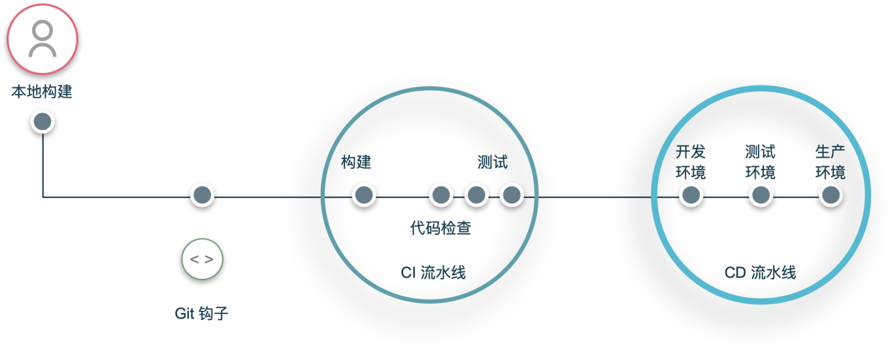
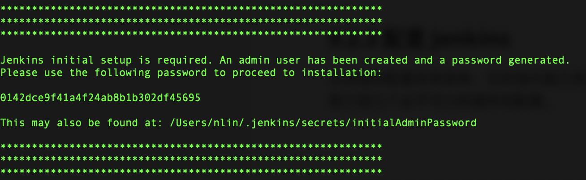

企业在使用微服务架构时，虽然会获得微服务架构的一些便利，但是也需要付出一些基础设施成本，而集成和部署就是其中一部分。

持续的集成和部署通常被叫做 CI/CD，意思是通过一个工具平台，在代码被推送后自动构建、部署，以此提高软件研发和集成效率。



这一期的系统设计，就来聊聊如何搭建持续集成和部署流水线。

## CD/CD 简介

CI/CD 是 Continuous integration and continuous delivery 的缩写，通常会和 DevOps 一起来说，可以认为它是 DevOps 理念的一部分，或者说实践之一。

在 CI/CD 流行之前，发布软件是一项困难的任务，更新不频繁，有时一年只发布一次，而且更新通常很大。由于技术限制，软件发布和更新都是通过手动或者极其简陋的脚本完成的，因为没有这么强烈的需求驱动工具的改进。

其实 CI/CD 这两个概念非常早，Grady Booch 在 1991 年的《Object-Oriented Analysis and Design with Applications》一书中就提出了 Continuous integration 这个概念。他建议定期尽可能频繁的开发者的工作代码库与主分支合并。

在后来的 Scrum、Kanban 等增量软件开发思想都强调了这一实践。不过由于没有足够好用的工具，这一概念并没有流行开。直到 2001 年，随着 CruiseControl 的发布，我们才有了第一个能够更容易地实现持续交付的开源工具。

CruiseControl 最早是 ThoughtWorks 的员工创建的，后来演化成了另外一个叫做 GoCD 的工具，拓展了 CI 的概念到 CI/CD。

在此之后，相关工具和思想不断涌现。例如随之而来的 Jenkins，占据了 CI/CD 工具的主要开源市场。 随后一些商业化的产品让这项实践变得极为简单，例如 Bamboo、CircleCI、TravisCI，以及被开源界广泛使用的 GitHub Actions。

关于 CI/CD 另外一个不得不提的概念是流水线（Pipeline）。在很多 CI/CD 工具中，可以通过设置构建任务的前后关系以此整合整个 CI/CD 过程的工具链。这个过程就像水在管道中流动一样，因此被称作流水线，类似工厂的流水线作业，其构建的软件也被称为制品（Artifact）。

## CI/CD 工具选型

在信息化成熟的公司，一般都会有自己的 CI/CD 平台。但是对于大部分团队来说，需要使用开源工具或者购买一些 SaaS 服务，以降低成本。

基于前面提到的一些工具，下面整理了一些常用工具选型。

### Jenkins

Jenkins 是社区最流行的开源 CI/CD 工具，它构建在 Java 平台上，因此非常容易安装。Jenkins 流行的主要原因还是它强大的插件系统，通过插件系统可以实现几乎现在关于 CI/CD 大部分功能，拓展性极强。

对于上规模的团队，可以基于 Jenkins 二次开发（国内很多团队也正是这样做的）。

### GoCD

和前面提到的一样 GoCD 是 Thoughtworks 的 CI/CD 产品，分为开源版和商业版。GoCD 天然具有流水线特性，通过输入、输出的设计思路，可以轻松地配置依赖关系。

如果想要开箱即用，不想了解 Jenkins 那么多插件的用法和配置，可以考虑使用 GoCD。相比 Jenkins 来说，GoCD 轻量化一点。

### GitHub Actions

GitHub Actions 是 GitHub 的 CI/CD 产品，最大的特点是和 GitHub 集成到一起，用于开源软件的构建和发布。GitHub Actions 通过 Yaml 文件描述构建过程，可以通过引用现有镜像的方式获取构建环境，也可以引用开源的构建脚本简化构建脚本的开发工作，这一特性让开发构建脚本的工作被极大地简化。

### CircleCI

CircleCI 和 GitHub Actions 非常类似，它是一个 SaaS 平台，用于小团队快速搭建 CI/CD 基础设施。但是随着 GitHub Actions 的出现，CircleCI 的竞争力非常弱。类似的还有 Travis CI，看起来没有特别的竞争力。

### Bamboo

Bamboo 是 Atlassian 公司开发的持续集成产品，Atlassian 公司以 Jira 为人们所熟知。对于选择 Atlassian 公司生态产品的团队来说，Bamboo 除了具备其他持续集成工具的基本能力之外，也能很好地与 Bitbucket、Jira、Confluence 等平台集成。

### TeamCity

TeamCity 是由 JetBrains 公司开发的持续集成产品，这款工具本身没有特别多的亮点，主要是可以和 IDE 产品较好地集成。

### 国内商业工具

前面提到的一些工具都是开源或者海外的 SaaS 平台，对于国内使用不是很方面。在国内往往云厂商都提供了 CI/CD 工具平台，例如华为伏羲、阿里云效、Ping Code、腾讯 CODING 等。

### 关于 CI/CD 工具的小结

目前市面上 CI/CD 非常多，其主要功能上已经大同小异，唯一区别的是相关生态。例如：

- Jenkins 有开源插件生态，需要灵活性比较强的团队可以考虑。
- TeamCity 对于使用 JetBrains 全家桶的团队非常友好。
- GitHub Actions 对于 GitHub 开源项目非常友好。
- Bamboo 对于使用 Atlassian 公司产品的团队非常友好，可以集成 Jira 等项目管理工具。
- 国内的一些工具对于国内环境更加友好。

## Jenkins 快速搭建教程

对于小团队来说，使用 Jenkins 是较低成本的搭建一个 CI/CD 平台的方式。所以这里简单说明一下基本概念和搭建过程，详细内容可以参考官网的教程。

### 基本概念

在 Jenkins 中有一些概念和其它 CI/CD 工具一致，对理解整套体系比较重要。例如 Project、Task、Step、Pipeline、Stage、View、Artifact、Credentials等。下面逐一解释一下：

- Project：在 Jenkins 一套构建过程就是一个项目，往往我们会把一个项目、一个代码仓库、一个部署服务统一起来。项目可以分为普通项目、流水线项目、多分支流水线项目等。
- Task：一个普通项目可以设置多个任务，例如构建、代码扫描、部署等。
- Pipeline：流水线项目是指将多个阶段串起来，通过插件可以看到构建过程和视图。
- Stage：流水线的阶段，流水线中的一段，例如构建阶段。
- Step：一个阶段可以设置多个步骤，但是在视图上一般都只看阶段。
- View：流水线视图，可以为流水线设置看板和告警，放置到团队易于发现的地方。
- Artifact：制品，每个阶段会产生中间文件这些都被叫做制品，制品可以通过制品仓库来存放，例如 Jar、Zip 包、Docker 镜像。
- Credentials：凭证，为了进行权限管控，有时候需要凭证来防止意外发布。

### 流水线设计

除了一些简单的任务，大部分场景下都会使用流水线项目。

常见的流水线有几种形态：

- 单条线：只能一条线跑到底。
- 树形结构：有多个阶段，不过每个阶段可以并行跑几个任务。
- 网状结构：可以进入分支，也可以汇合。

一般我们会使用单条线较多，或者树形结构。

常见的流水线会有这些阶段：

- 构建，例如 Java Build 命令。
- 质量检查，可以并行运行。
  - 静态扫描（扫描源文件）：不需要构建就可以完成，比如 Checkstyle、JsLint。 
  - 动态扫描（扫描编译后的字节码）：Sonar、FindBugs。 
  - 开源检查：检查那些开源包不符合要求 。
  - OWASP：有很多安全类型，比如 Dependence Check 可以扫描依赖包中的 CVE。
- 自动化测试 。
- 镜像打包推送仓库。
- 部署到 DEV 环境，用于开发人员联调、验证、自测。
- 部署到 QA/ST 环境，用于 QA 执行测试用例。
- 部署到 UAT 环境，用于预发上线，模拟线上环境，或者用户验收测试。

对于这些阶段往往会有一些触发策略：

- 构建触发：Web Hook 代码自动提交触发流水线，如果提交频繁，可以使用节流机制。
- 部署到 DEV：自动部署或者由开发人员触发。
- 部署到 QA/ST：由测试人员才能权限触发，保证测试环境的稳定。
- 部署到 UAT：只能部署满足发版要求的版本才能部署，保证环境稳定，并且没有奇怪的测试数据。

### 安装和配置

Jenkins 的安装和配置比较简单，如果只是体验一下，可以使用 War 包、Docker 镜像启动，如果是为了搭建开发平台，最好还是安装为 Linux 的服务。

下面是一个简易教程：

1. 进入一个工作目录，下载 War 包：

> wget http://mirrors.jenkins.io/war-stable/latest/jenkins.war

2. 启动 Jenkins 服务:

> java -jar jenkins.war --httpPort=8080

3. 打开浏览器相关链接，进入 Web 控制台 http://localhost:8080 开始初始化系统。进入 Web 控制台后，需要从日志中读取一个初始密码，输入到 Web 控制台中。


4. 选择需要安装的插件，对于刚体验的朋友可以按照推荐安装即可。

5. 填写管理员密码和站点网址即可完成安装。填写站点网址的目的是为了后期与其他服务集成，能从外部回调 Jenkins。这样可以配置 Webhook 在代码提交时触发流水线构建。

6. 安装完成后，在左上角点击 New item 进入创建 Jenkins 项目的第一步，然后选择流水线项目，可以根据配置页面填写源代码仓库，在下方会提示一些示例脚本。通过阅读示例脚本，很容易理解如何使用 Jenkins 流水线。

流水线脚本是通过 Groovy 编写的，下面提供了一份 Jenkins 流水线脚本示例。

## 一份基本可用的 Jenkins 配置

````groovy
pipeline {
    // 声明 agent none 意味着下面每个阶段都需要单独定义 agent
    agent none
    options {
        disableConcurrentBuilds()
    }
    stages {
        // 运行代码风格检查
        stage('Checkstyle') {
            agent {
                label 'slave'
            }
            steps {
                // 在同一级的目录中定义一个 Shell 脚本运行自己的检查机制。sh 命令可以执行 Shell 脚本
                // sh './ci checkstyle'
                echo 'run checkstyle'
            }
        }
        // 运行单元测试
        stage('Unit Test') {
            agent {
                label "slave"
            }
            steps {
                script {
                    // sh './ci unitTest'
                    echo 'run unitTest'
                }
            }
        }
        // 运行构建脚本，发布制品到仓库
        stage('Build Image') {
            agent {
                label 'slave'
            }
            steps {
                // sh './ci build'
                echo "image built"
            }
        }
        // 部署到开发环境
        stage('Deploy DEV') {
            agent {
                label 'slave'
            }
            environment {
                ENV = 'dev'
            }
            steps {
                sh 'env'
                // sh './ci deploy'
                echo "image deployed"
            }
        }
        // 运行 API 测试
        stage('API Test') {
            agent {
                label "slave"
            }
            steps {
                //  sh './ci apiTest'
                echo 'run apiTest'
            }
        }
        // 部署到测试环境
        stage('Deploy QA') {
            agent {
                label 'slave'
            }
            environment {
                ENV = 'qa'
            }
            steps {
                // 如果构建一直无人处理，900 秒后自动关闭
                timeout(time: 900, unit: 'SECONDS') {
                    // 需要测试人员确认才能部署成功
                    input(message: 'deploy to QA?')
                }
                sh 'env'
                //  sh './ci deploy'
                echo "image deployed"
            }
        }
        // 部署到预发环境
        stage('Deploy UAT') {
            agent {
                label 'slave'
            }
            environment {
                ENV = 'uat'
            }
            steps {
                timeout(time: 900, unit: 'SECONDS') {
                    // 只有在名单中的人能部署到预发环境
                    input(message: 'deploy to UAT?', submitter: 'zhangsan,lisi')
                }
                sh 'env'
                //  sh './ci deploy'
                echo "image deployed"
            }
        }
        // 部署到生产环境
        stage('Deploy PROD') {
            agent {
                label 'slave'
            }
            environment {
                ENV = 'prod'
            }
            input {
                message 'deploy to PROD?'
                submitter 'zhangsan'
                parameters {
                    // 约束只有在名单中人能部署到预发环境，并且需要输入一段确认文本
                    string(name: 'PASSWORD', defaultValue: '', description: 'Say the words...')
                }
            }
            steps {
                script {
                    if (PASSWORD != "PROD")
                        error "SORRY, YOU DON'T HAVE THE PASSWORD!"
                }
                sh 'env'
                //  sh "./ci deploy"
                echo "image deployed"
            }
        }
    }
}
````

## 参考资料

[1] https://thenewstack.io/a-brief-devops-history-the-road-to-ci-cd/

[2] https://www.jenkins.io/
