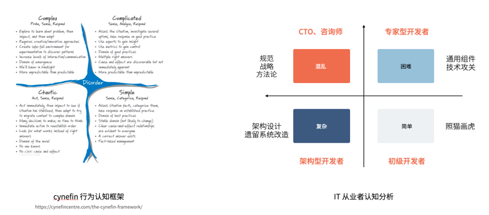

项目启动前如果把会遇到的问题都考虑好，那么是否可以大大的提高开发效率呢?

所以我们在每个项目前都会根据技术选型，打磨一套打样（Demo）工程。在迭代开始后，开发人员就可以根据打样工程和提前设计的领域模型、数据库设计编写代码。

这样对于开发人员来说，很容易知道应该在何处编写何样的代码了。做好一套打样工程，我们需要讨论很多细节。

## 认知分级

用认知能力来构建团队梯队，为每个人找到合适的位置。有经验丰富的团队成员或 TL 来设计打样工程和数据库，有技术热情的人来做技术预研，经验欠佳的团队成员照猫画虎即可。

下图是某一年大会分享时，借用了 Cynefin 模型整理的 IT 从业者的认知行为分析。

在项目前期可以有 TL 和有经验的开发者进行打样，在迭代开始前完成领域模型、数据库设计，初级开发者就可以很快上手，开发者甚至连命名都不用考虑。 配合 AI 工具加持，可以提高开发效率。

## CRUD 还是 CQRUD？

CRUD是“Create，Read，Update，Delete”的缩写，用于描述标准的数据存储操作。这些操作在大多数应用程序中都是必需的，所以大多数简单的业务都可以看做是 CRUD 操作。

这种朴素地划分是导致很多问题的原因，"Read" 在实际场景中除了读取单个对象外，还包含了读取列表和根据分页、排序、查询条件进行搜索。

Greg Young 提出了 CQRS 的概念，提倡将数据的更新操作好查询操作分开。不过，这个概念常常和 Event Sourcing 混到一起，因此我这里使用了 CQRUD 作为新的术语，将查询从普通的 CRUD 中的剥离。

如果我们将 Q 和 CRUD 分离，在使用一些流行的 DDD 项目模板中就非常清晰了。 例如，DDD 四层架构，或者 DDD 结合整洁架构的代码模式如下：

作者注：这里假设使用 Mybatis 作为技术选型。 国内技术选型已经倾向于使用 Mybatis 和所谓的 DDD 整洁架构，为了干净（领域层对象上无注解），让原本框架作为基础设施层的实现，不得不在基础设施层再包装一次。我并不完全赞同这种做法，这样会导致样板代码非常多，有条件还是尽量使用 Spring Data 和 OpenFien 保持代码精简。

设计要点：

1. 用操作者和被操作者标注每种对象（主客体思想）
2. 实现 Q，操作工序：Controller + Query 对象 → AppService → QueryPO（或者复用 PO） → Response 对象
3. 实现简单 CRUD，操作工序：Controller + Command → AppService → Repository → Response 对象
4. 实现复杂或者有复用逻辑的 CRUD，操作工序：Controller + Command → AppService → DomainService → Repository → Response 对象

Query 操作使用独立的 Mapper 且不经过领域层会有很多好处：

- 方便以后做读写分离。使用专门的 QueryMapper 可以匹配到读库的数据源
- Query 对象、分页对象不用映射到领域层
- 直接通过 PO 转换为 Response，无需多次转换，且查询对象往往不需要在业务逻辑中使用

## 各种 PO 如何区分？

非常不推荐使用 PO、DTO、VO 这样的对象后缀，而是使用贴合业务场景的命名方式。

- 接入层：使用 Spring 框架的 ResponseEntity
- 应用层：
  - 使用 Command 表达创建、更新操作或其它业务动作需要的参数
  - 使用 Query 表达查询参数。可以使用另外一个 Page 对象承接分页、排序参数
  - 使用 Response 表达返回的结果。在导出的场景中，也可以使用 Export 等其它名称描述导出
- 领域层：
  - Entity：表达领域模型的实体，聚合根可以看做一种特殊的实体
  - ValueObject：表达领域模型中的值对象
- 基础设施层：
  - 使用 PO 表达持久化对象
  - 使用 Request/Response 表达外部 API 调用的对象

差不多这些对象类型能满足日常需求，并能得到一套清晰的结构。 补充这些完整 PO 以及可能的其它对象，代码结构的完整示意图如下：

## 低 SQL 开发

即使使用了 Mybatis，很多场景下我们也希望尽可能的不使用 SQL，原因是：

- 使用 SQL 会造成字段名称被硬编码到代码中，破坏类型安全，难以重构
- 使用 SQL 无法灵活组合查询条件

如果尽可能地避免使用 SQL，但又需要灵活地查询，可以有下面几个方案：

- 使用 Mybatis 的 QueryWrapper 和 LambdaQueryWrapper
- 使用 QueryDsl
- 使用 JPA Criteria 灵活构建查询条件

如果在部分地方实在需要硬编码字段名，可以使用 @FieldNameConstants 注解，它会为对象生成一个静态内部类，并自动映射字符串名称，这种操作在 C# 中可以通过原生 nameof 实现。

例如，获取用户对象的 "username" 变量名，可以用 User.Fields.username 获取。

## 领域模型和 PO 之间的差异

如果将领域模型和 PO 分开，会有一个小的问题。它们的定位和操作方式可能会有变化。

领域模型按照面向对象的思想组织，它有组合关系。而 PO 的目的是为了映射数据库表结构，那么建议不要在 PO 上赋予层级结构，且字段类型和数据库完全一致。

如果我们有一个订单 Order 模型，以及 OrderItem，那么在 OrderItem 中就不应该再有一个 order_id 属性。因为任何业务逻辑都可以使用 Order.id 完成。

在持久化时，可以通过 OrderRepository 组合 OrderMapper、OrderItemMapper，OrderItemPo 中就需要一个 order_id 属性用于记录两个对象之间的关联信息。

另外，如果希望做到低 SQL 编程，在领域层也尽可能不使用 JOIN，而是通过多次查询的方式来组合结果并用于后续的业务逻辑。

在 Spring Data JPA 中，通过 EntityGraph 注解可以做到无 N+1 问题的 Join 操作。但是在 Mybatis 和 Mybatis Plus 中，做到无 SQL 实现 Join 比较困难。

## 对象的通用审计字段

由于 Entity 和 PO 都会放置一些通用的字段，例如 id、created_by、updated_by、created_time、updated_time。

审计字段的创建有多种做法：

1. 领域模型在创建时生成，不依赖基础设施，在应用应用内生成
2. 通过 PO 生成，创建完成后再反向转换成领域模型使用
3. 通过数据库函数生成

在过去，我们依赖数据库的自增 ID，同时往往也使用了数据库的函数自动填充审计字段。随着 UUID 的使用，推荐使用方案 1 的生成方法，这样避免了基础设施的差异，另外在领域对象创建后马上就能使用相关字段。

## 对象转换方案

使用了所谓的整洁架构严格将应用层、领域层、技术设施层分开，带来的一个麻烦是如何处理这么多对象的转换问题，这是享受强类型语言方便性带来的成本。

有几个方案可以考虑：

- 手动转换。配合 Lombok 的 @Builder @SuperBuilder @Data 等注解和特性减少样板代码。
- 使用 Apache 的 BeanUtils 工具。BeanUtils 的实现原理是 Java 反射机制，会有一定的性能开销，类似的工具还有 ModelMapper。
- 使用 Mapstruct 在编译期生成类似手动的转换代码，从性能和样板代码上都可以兼得，推荐使用 Mapstruct 工具。

在对象转换上有很多细节需要注意，比如：

- 如果有父类的情况，无法使用 @Builder 获取父类的属性，可以使用 @SuperBuilder 来实现。
- 在设计对象的结构上尽可能一致，这样不需要额外的配置映射注解。
- 可以使用一些全局的转换方法，例如返回值中出现了枚举类型，可以自动转换为带名称的值对象。

## 使用 Common 包消除重复

一些样板代码可以封装起来放到 common 包中作为 Jar 包发布，这样不同的领域服务可以给共享同一套机制。

打样工程中的常见代码可以放到这里。

- 一些常见的基类，比如包含审计字段的领域模型、PO、Response
- 一些常见的工具类，比如 Excel 导出、时间格式化、JSON 解析工具
- 异常基类和错误码基类
- 认证鉴权的拦截机制和用户上下文类
- ControllerAdvice
- Swagger、Redis、缓存等配置文件

## 测试策略

一套完整的打样工程还需要考虑测试，这个话题展开来说内容非常多，这里介绍常用的测试策略和一些工具。

测试策略：

- 代码扫描。包括 Checkstyle、SonarLint 等，使用构建工具（Maven、Gradle）配置即可
- 单元测试。验证 Domain 层相关的逻辑，不启动应用上下文，快速验证业务逻辑。如果有依赖对象，使用 Mockito 模拟即可。
- API 测试。验证端到端的接口实现情况，需要验证所有的字段是否合适返回，不验证或者较少验证业务逻辑规则。

单元测试常用技术选型：

- Junit5
- Mockito

API 测试常用技术选型：

- spring-boot-testing-starter
- Junit5（已包含）
- Mockito（已包含）
- DbUnit。准备测试数据并将数据库还原，保持下一次测试的干净状态。
- MariaDB4J。一种和 Mysql 兼容的内存数据库 Java 库，它的原理是在本地安装原生的数据库，并通过 Java 调起。
- RestAssured。API测试框架。
- WireMock。第三方 API 依赖模拟框架，可以模拟调用的第三方 API。

## 总结

网络上有各种各样号称 xx 框架的打样项目，这些项目有一些非常优秀。但是遗憾的是，往往都不能拿过来直接使用，而是需要根据实际情况修改。

本文只是介绍了一个打样项目案例，可以参考自己的实际情况调整实现。

