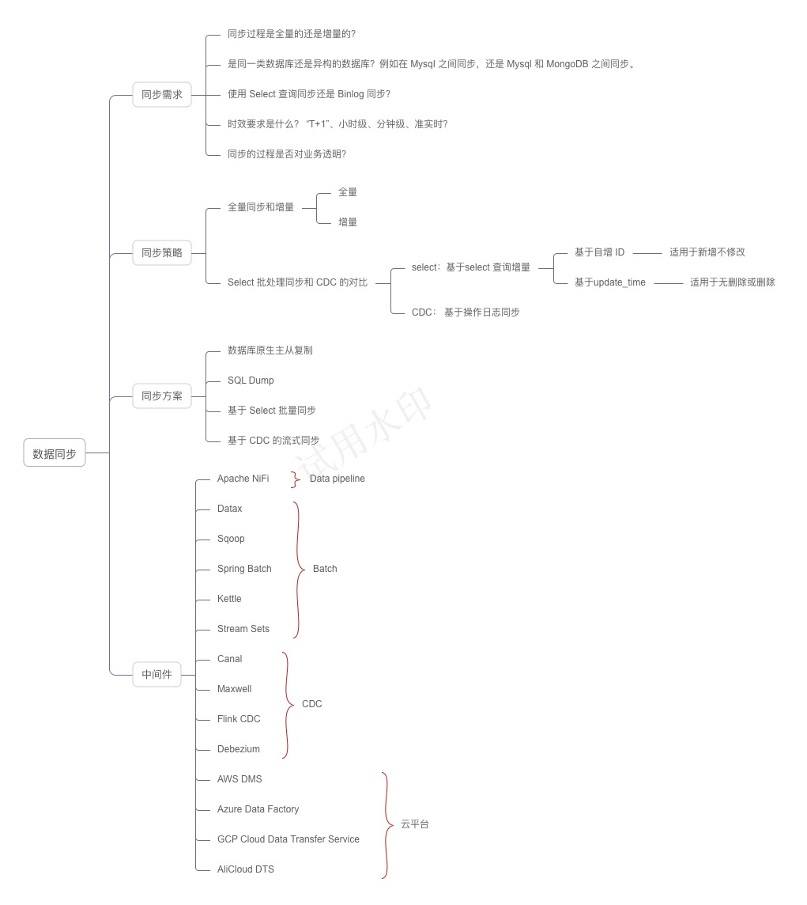

数据同步的需求在日常工作中非常频繁，几乎每个公司或多或少会考虑调研数据同步的方案。不过在不同的场景下，需要考虑的问题有所不同，根据这些问题，我们可以制定相应的同步策略。

## 01 同步策略

下面是一些分析同步策略时需要考虑的问题：

- 同步过程是全量的还是增量的？
- 是同一类数据库还是异构的数据库？例如在 Mysql 之间同步，还是 Mysql 和 MongoDB 之间同步。
- 使用 Select 查询同步还是 Binlog 同步？
- 同步过程中是否有表映射或者逻辑处理？
- 时效要求是什么？ “T+1”、小时级、分钟级、准实时？
- 同步的过程是否对业务透明？

### 全量同步和增量同步对比

全量同步，顾名思义，就是每天晚上夜间作业，将数据以数据库或者表为单位全量同步一次。适合数据量不大，每天既有新数据插入，又有修改和删除的场景。

增量同步相对全量同步来说，每个同步周期只对修改的内容进行同步。增量同步又有基于Select 批处理同步和 CDC 两种实现。

### Select 批处理同步和 CDC 的对比

为了实现增量同步，需要把源数据中的数据变化识别出来。

一种方式是通过 select 条件来实现，例如通过 update_time 来识别变化后的数据，也可以通过自增 ID 来实现。通过 update_time 需要记录上一次同步后的时间，作为 select 查询的条件，类似的自增ID 通过记录上一次的 ID。通过 select 实现的好处是对数据库技术细节不敏感，例如不会因为数据库版本变化导致同步失效。缺点是，通过 ID 作为筛选条件只适用于只增不更新的场景，而通过 update_time 则删除场景无法满足，需要应用代码支持软删除。

Change Data Capture (CDC) 是一种用于捕捉和处理数据变化的技术，类似数据库原生主从复制，通过解析 binlog 来实现同步。


### 双向同步处理策略


## 02 同步方案

基于上述的问题和策略，可以讨论业界通常的同步方案。

### 数据库原生主从复制

原生主从复制是一种用于在多个数据库服务器之间复制数据的机制。它通过将主服务器上的数据变更传播到一个或多个从服务器上，实现数据的分发和冗余，一般关系型数据库都支持此类主从复制。

以 Mysql 为例，主从复制的原理为： 

1. 主服务器（Master）记录所有数据更改操作（如INSERT、UPDATE、DELETE）到 binlog。
2. 从服务器（Slave）通过读取主服务器上的 binlog，获取数据更改的详细信息。 
3. 从服务器将这些日志内容写入自己的中继日志（relay log），然后重放这些日志，从而使自身的数据与主服务器保持一致。

Mysql 的主从复制有多种模式：

1. 异步复制：在异步复制模式下，主服务器在提交事务后立即返回给客户端，而不等待从服务器的确认。
2. 半同步复制：在半同步复制模式下，主服务器在提交事务后，等待至少一个从服务器确认收到事务日志后，才返回给客户端。
3. 全同步复制：在全同步复制模式下，主服务器在提交事务后，等待所有从服务器确认收到事务日志后，才返回给客户端。
4. 延迟复制： 在延迟复制模式下，从服务器以预设的延迟时间重放从主服务器收到的事件。

在实际生产环境中，最常见的配置是异步复制和半同步复制：

- 异步复制是默认和最常用的模式，适用于大多数读写分离的应用场景。这种模式下的主服务器性能最佳，适合对数据一致性要求不高的场景。
- 半同步复制用于对数据一致性要求较高的场景，比如金融交易系统等。这种模式提供了数据一致性和性能之间的平衡。

Mysql 默认同步模式是异步复制，所以从库我们一般用来查询展示，而不用于读回内存进行更新。

主从复制的优点：主从复制的应用场景是读写分离、多区域容错、数据备份等场景、实时性高。

主从复制的局限性：**同一个数据库系统内的不同实例之间传递数据的。** 如果作为不同数据库之间数据迁移来说，主从同步就不适合了。

### SQL Dump

通过 SQL Dump 实现跨库的数据同步可以是一种简单粗暴的方法，适合数据全量同步、且无法做到异构同步，灵活性比较差。

SQL Dump 实现起来非常简单，通过一个 Python 或 Shell 脚本即可完成（代码参考 AI 工具生成）。

在某些场景下，SQL Dump 算是一种简单有效的方案，不过适用面太小。

### 基于 Select 批量同步

工作流程如下：

1. 从目标数据源获取最新的一条数据记录，获取其更新时间或自增 ID，作为增量数据查询游标。
2. 根据查询游标在源数据获取增量数据，并发送到目标数据库。
3. 目标数据库写入数据。

如下图所示：


基于 Select 批量同步需要注意几个问题：

- 需要注意一次任务处理的数据量。
- 需要注意一次任务处理的时间，避免一次任务还未完成就发起了第二次任务。
- 注意设置查询字段的索引，提高查询效率，避免为源数据库带来过高负载。
- 如果查询字段为 updated_time 时，删除操作需要使用标记删除（软删除），否则已删除的数据无法被同步。
- 如果通过自增 ID 实现增量数据查询时，只能用于只插入不修改的场景。
- 这种方案只能实现单一数据源同步，如果目标数据库也有额外的数据插入，可以把游标存在某个地方，实现多数据源同步。

### 基于 CDC 的流式同步

CDC 是通过捕捉数据库的操作日志来实现实时数据同步的，从原理上来说和原生的主从复制往往差不多，和原生的主从复制一般不同的是，会通过一个 MQ 中间件来实现事件的分发，这样的好处是，可以做到数据源和数据目标。

工作模式如下： 


对于 Mysql 来说，Mysql 的 Binlog 有 statement-based、row-based 和 mixed-based 三种格式。

Statement-based 记录执行的 SQL 语句，一般我们不会用它来做数据同步。

Row-based 记录每行被修改的数据，例如：

```text
### INSERT INTO table_name
### WHERE
###   @1=1 /* INT meta=0 nullable=0 is_null=0 */
###   @2='data' /* VARSTRING(255) meta=255 nullable=1 is_null=0 */
### SET
###   @1=2
###   @2='new_data'

```

Mixed-based 的工作机制是根据具体的 SQL 语句类型和复杂度，自动选择合适的日志格式，所以得到的内容是混合的，对解析并不方便。

PostgreSQL 的日志叫做 WAL（Write-Ahead Logging）， 虽然只提供了一种数据格式，但是内容比较复杂。

MongoDB 的日志为 Oplog，记录了对数据库的所有写操作，为 JSON 格式，便于阅读和处理。

由于解析 Binlog 比较麻烦，所以通常来说我们会考虑采用某些中间件来实现。例如，Debezium 就是典型的基于 CDC 进行数据同步的中间件。

## 02 同步中间件对比


## 03 复杂的数据同步案例

这是一个从数据库主从同步改造为其它同步方式的例子，作为一个数据同步案例。

### 问题


背景：

1. 一家做全球航运管理的公司，有很多服务在远洋运行的船上，通过卫星网络连接，用于船上货物的仓储管理 APP。
2. 使用了一种叫做 Couch DB 的数据库来实现双向同步，且支持离线同步。
3. 在船上通过 WIFI 网络支持用户通过平板操作，这些平板也可能离线，所以使用了 puchdb 来和 Couch DB 同步。

痛点：

1. CouchDB/Pouchdb  双向同步，经常发生冲突。
2. CouchDB/Pouchdb 表结构发生变化时，如果客户端没有及时更新就开始同步，产生严重错误。

### 多数据来源同步

上面案例中出现了多数来源同步的问题，CouchDB/Pouchdb 支持多数据来源和双向同步，在同步中会出现冲突的问题。

CouchDB 使用多版本并发控制 (MVCC) 和一种称为“懒惰冲突检测”的机制来处理数据冲突。虽然 MVCC 通过多种策略处理冲突，例如基于时间戳、基于优先级或其它自定义规则合并冲突数据。

但由于 CouchDB 的冲突过程发生在数据库层面，当冲突非常复杂时，无法通过简单的规则处理这个冲突。对于这类场景，建议优先使用应用能控制的数据同步方案，这样可以让应用来完成业务决策，避免数据冲突。

另外一个原因是，如果数据库层面的同步发生在客户端，会有一个表结构的问题。当客户端没有升级时，表结构不同，强行同步会出现严重错误。

如果服务器之间进行数据同步，使用对业务无感知的同步尚可，因为数据库都在被管理的范围内。

### 双向同步拆解为单向的技巧

在很多场景中，我们实际上都需要双向同步，这种场景在 IoT 领域非常常见，那么是怎么做的呢？

**在逻辑上拆解**。寻找业务决策点，一路数据同步，一路事件下发。将双向同步拆解为同步+数据两个通道，数据同步通道直接接受数据变化，而接受事件下发的一方需要根据当前数据状态，处理如何应用事件。


在这个例子中，根据分析大量数据都是从船上产生的，并需要同步到云上。而只有一些非常基础的元数据需要从云上下发到船上，所以这里的规则可以设计为：以船主要数据源同步给云，并将云的修改记录为事件下发到船上（用户操作页面可见是否下发成功）。

**在时空上拆解**。同一时刻，同一单位的数据单向传输。这个例子常常发生在遗留系统迁移的过程中，老系统向新系统同步数据，且两个系统都可以使用。这样就会产生冲突，如何做到两个系统都可以使用呢？

有几种策略：

1.【同一单位】 其中一方系统产生的数据在另外一方只读，不能操作。
1.【同一时刻】其中一方系统开启某些功能时，另外一方关闭这些功能，在时间长避开冲突。

## 04 总结

这里有个思维导图作为总结。

