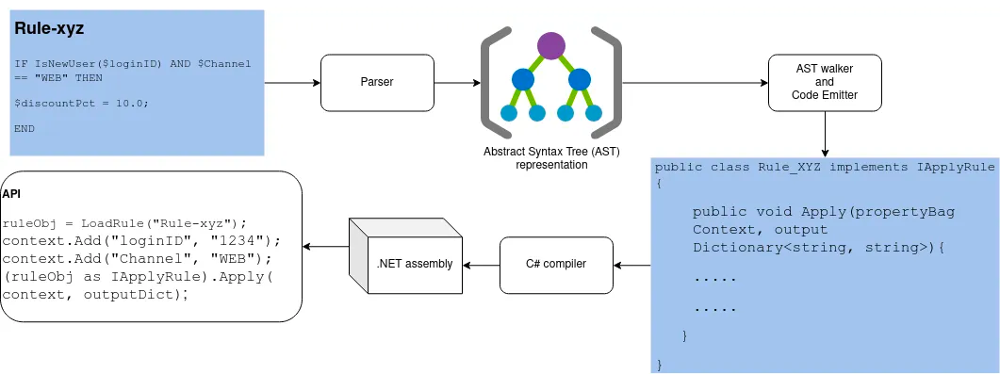
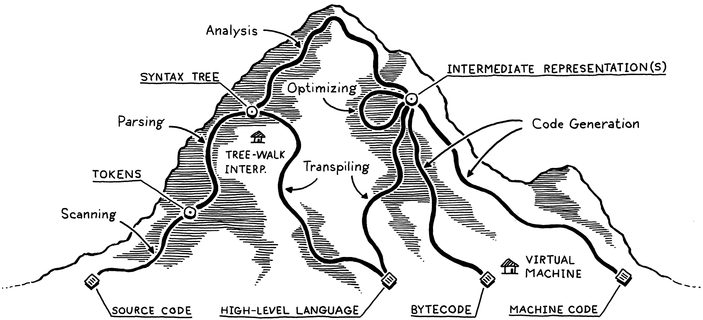
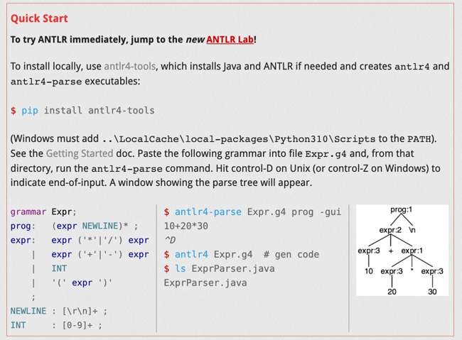
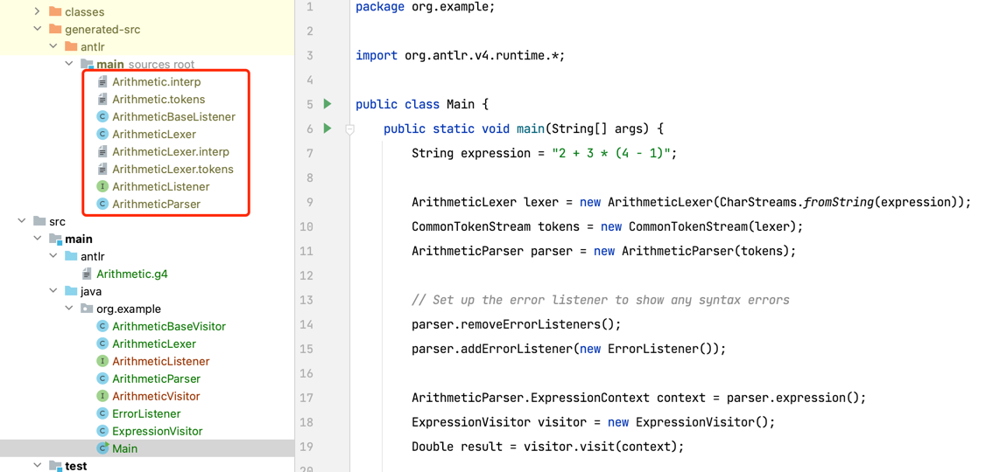

在过去几年一直对编程语言本身很敬畏。一方面编译原理本身是非常困难的领域，另外一方面图灵完备的语言完全满足日常需求。

直到最近，在一些技术问题上不得不尝试使用 DSL（领域特定语言，相对于 GPL，即通用编程语言）去解决。在和一些伙伴交流后把相关经验整理下来，收录到系统设计专栏中，当产生 DSL 需求时再拿出来看。

## 什么时候会考虑使用 DSL 或者 GPL？

DSL 语言实际上无处不在。对于前端程序员来说，用来表达文档结构的 HTML 标记语言，以及样式表 CCS 都是 DSL；对于后端程序员来说，用于配置业务规则的 Yaml 文件也可以看做一种 DSL。

DSL 相对于 GPL 最大的特点是：DSL 是非图灵完备的。

这里引用 Wikipedia 对图灵完备语言的定义：

> 用于表示任何现实世界通用计算机或计算机语言都可以近似模拟任何其他现实世界通用计算机的计算方面、用途的计算机或计算机语言。

那么我们既然有图灵完备的语言不用，为啥还需要 DSL 呢？

例如 JSON 实际上是 JavaScript 语言中的一部分，如果我们希望在 Java 中使用 JSON 这种数据格式，直接使用 JavaScript 语法即可。

不过在某些场景下，往往使用 GPL 有两个明显的制约：

1. 实现解析器的成本和运行开销太高。
2. 特定场景下找不到合适的 GPL 来表达。

例如，我们需要实现一个这样一个业务：对于产品规格（尺寸、重量）达到一定条件就会触发审批要求。

所以我们常常可以通过一些表达式来完成，形如：product.weight > upperLimitWeight。这样也能给业务人员展示同样的表达式，但是对于工厂来说，由于计量精确性问题存在一个容忍范围，也就是业务给出的规则是这样的：产品重量大于上限重量（浮动 500g）。在配置审批规则时，浮动值也需要能配置。

普通的四则表达式、逻辑表达式都不能满足这个需求，虽然可以通过一些奇怪的方法将显示的表达式和执行运算的表达式分开，但是这样会将问题弄得复杂。

为什么我们不涉及一个自己的表达式呢？然后通过解析器解析成想要的数据集即可。

这样可以设计表达式：product.weight > upperLimitWeight~floatWeight。通过引入一个新的操作符来解决这个问题。

## 一些理论基础

要驾驭 DSL 还需要一些基础知识。

**解析器**

按照自己的想法设计一个语法格式并不难，可以尽可能发挥我们的创造力。 但是麻烦在于，编写一个解析器并不容易。

编译原理属于 CS 课程中非常难的课程之一。好在我们可以借助一些解析器代码生成工具来完成，只需要通过一个 DSL 自定义想要的语法规则即可通过生成器生成解析器。

例如： 

- Antlr：最流行的解析器之一，支持主流语言，我主要在 Java 语言中使用它。
- JavaCC：专注于 java 语言的解析器生成器。
- Peg.js：专注于 JavaScript 的语言解析器。

当然，一些简单的场景也可以自己实现解析器。将中缀表达式转换为逆波兰表达式的过程就是最简单的一种解析器实现。

**构建流水线**

无论是否使用解析器生成工具，我们都需要一个流程将 DSL 转换为目标语言或者实现。

对于 GPL 来说，往往存在文件读取、词法分析、语法解析、语义分析、中间代码生成、编译为目标代码、对目标代码进行链接等过程。 

参考这篇文章理解编译过程： https://craftinginterpreters.com/a-map-of-the-territory.html

而 DSL 语言往往比较简单，中间过程往往只需要得到抽象语法树（AST），并将其转换为目标代码，或者使用目标代码读取 AST 完成某些业务目标即可。
甚至将 AST 转换为目标代码的过程大多可以使用模板引擎完成。

下面是一个 DSL 构建的流程：



图片来源：https://medium.com/redbus-in/a-dsl-rule-engine-755cfee59cc6

**各种模式**

如果使用解析器生成工具生成解析器（以 Antlr 为例），我们可以直接得到一套解析器（词法分析器 Lexer、语法分析器 Parser），额外的还可以得到访问器 Visitor。

我们简单说明一下这几个的区别。

Lexer 和 Parser 很好理解：

- Lexer：分析词法（token），扫描出源代码中关键字和词汇。以自然语言来说，类似分词。
- Parser：解析关键字之间的关系，构建抽象语法树（AST）。以自然语言来说，就像识别出文章的句子、主谓宾结构。

笔者注：Lexer 和 Parser 在实现上会使用大量的设计模式、算法，非常有意思，但非常难，有大量递归下降、回溯等算法。非常惭愧的是笔者对这些算法只能说略知一二，没能掌握，属于"龙书"劝退者之一。

这里有一张图可以帮助我们理解整个过程：



Antlr 在生成代码时，如果指定了参数 "-visitor" 会生成一个访问器。访问者模式在编程语言处理中非常重要但不是必须的。访问者模式提供了一种编程接口，帮助 AST 的使用者减少遍历和递归操作，很多 AST 相关的库都提供了类似的接口，例如著名 Java 库 ASM。

抱歉，实在无法在一篇文章中讲明白访问者模式的细节。简单来说，访问者模式分为内部访问者和外部访问者。我们说的访问者模式通常是指外部访问者模式，访问是指使用者不需要自己遍历 AST，AST 自己具备遍历能力，使用者只需要实现相关接口，这样 AST 在被遍历的时候每个节点会触发接口中的相关动作。

访问者模式有点类似操作系统钩子（Hook）。在 ASM 中，每个类的方法、成员变量都作为 AST 的节点，这些节点在被遍历时，会触发使用者定义的 visit 方法，并完成相关操作（例如插桩、打印信息）。

如果不使用访问器，也可以自己遍历 AST。

## Antlr 使用教程

以 Antlr 为例，我们可以快速实现一个 DSL，而不需要编写复杂的解析器。Antlr 提供了一种语法来描述 DSL 的语法规则，甚至 Antlr 语法可以描述自己的语法（自举）。

Antlr 常用的部分有：Dev Tools、Library。

使用 Dev Tools 可以将语法规则转换为解析器，进一步得到 AST；而生成的解析器会依赖 Library 中的一些基类。

这里直接贴一张官网的 Quick Start 图片，就不再赘述了。



图片来源：https://www.antlr.org/

除了使用 Python 外，在 Java 中也可以使用 java 命令行的方式。

> java -jar antlr-4.x.x-complete.jar YourGrammarFile.g4

另外也可以使用 Gradle、Maven 的插件生成解析器，这样可以更容易集成
Antlr 到工程中。

下面是一个 Gradle 脚本的定义可以参考：

```groovy
plugins {
    id 'java'
    id 'antlr'
}

group 'org.example'
version 'unspecified'

repositories {
    mavenCentral()
}

dependencies {
    antlr "org.antlr:antlr4:4.7.1"
    compile "org.antlr:antlr4-runtime:4.7.1"
}

generateGrammarSource {
    maxHeapSize = "64m"
    arguments += ["-visitor", "-long-messages"]
}

```

将语法规则文件以 *.g4 的后缀放到 src/main/antlr 目录中，然后执行 Gradle 的 generateGrammarSource 命令即可。

-visitor 参数即访问者模式，用于生成访问器。

执行生成命令后，antlr 会生成一堆文件，我们一般使用 Lexer、Parser、Visitor 即可。

## 使用 Antlr 实现数学表达式

我们以数学四则运算为例，运行一下 Antlr 这部分代码是参考 AI 生成的结果，大家也可以使用 AI 来获取这些代码。不过 AI 生成出来的内容不一定能跑通，需要改一改。

**step1 创建 Arithmetic.g4 文件**

```antlr
// src/main/antlr grammar 后面的规则名必须和文件名同名
grammar Arithmetic;

// 解析规则，从根到原子规则进行组装
expression : additiveExpression ;
additiveExpression : multiplicativeExpression ((ADD | SUBTRACT) multiplicativeExpression)* ;
multiplicativeExpression : atom ((MULTIPLY | DIVIDE) atom)* ;
atom : NUMBER | LPAREN expression RPAREN ;

// 词法关键字 token，在解析规则中被使用
ADD : '+' ;
SUBTRACT : '-' ;
MULTIPLY : '*' ;
DIVIDE : '/' ;
LPAREN : '(' ;
RPAREN : ')' ;

// 匹配操作数
NUMBER : DIGIT+ ( '.' DIGIT+ )? ;
fragment DIGIT : [0-9] ;

// 忽略空白文件
WS : [ \t\r\n]+ -> skip ;
```

这里有一份详细的语法规则文档：https://github.com/antlr/antlr4/blob/master/doc/lexer-rules.md。
另外，antlr 提供了一个包含非常多场景的规则库：https://github.com/antlr/grammars-v4

**step2 生成相关解析器代码**

定义好 Arithmetic.g4 后可以生成相关解析器代码，并将需要的解析器代码拷贝到代码中（也可以用构建工具按照 class 文件夹引入）。



我们把这几个文件拿过来：

- ArithmeticBaseVisitor：用于后续通过继承的方式编写访问器
- ArithmeticLexer：词法分析器
- ArithmeticListener：监听器接口，用来处理错误
- ArithmeticParser：解析器
- ArithmeticVisitor：访问器接口

**step3 实现访问器**

上面的文件不需要修改，编写下面的文件即可：

- Main：程序入口
- ErrorListener：错误监听器
- ExpressionVisitor：实现访问器，在遍历 AST 时，实现四则运算的逻辑，可以视为简单的解释器。

main 方法比较简单如下：

```java
 public static void main(String[] args) {
        String expression = "2 + 3 * (4 - 1)";

        ArithmeticLexer lexer = new ArithmeticLexer(CharStreams.fromString(expression));
        CommonTokenStream tokens = new CommonTokenStream(lexer);
        ArithmeticParser parser = new ArithmeticParser(tokens);

        // Set up the error listener to show any syntax errors
        parser.removeErrorListeners();
        parser.addErrorListener(new ErrorListener());

        ArithmeticParser.ExpressionContext context = parser.expression();
        ExpressionVisitor visitor = new ExpressionVisitor();
        Double result = visitor.visit(context);

        if (!ErrorListener.hasErrorOccurred()) {
            System.out.println("Result: " + result);
        }
    }
```

下面是逐行备注的访问器代码，要理解这个代码先要理解解析树结构。

```text
(expression
  (additiveExpression
    (multiplicativeExpression
      (primaryExpression
        (NUMBER 2)))
    (PLUS +)
    (additiveExpression
      (multiplicativeExpression
        (primaryExpression
          (NUMBER 3)))
      (MUL *)
      (multiplicativeExpression
        (primaryExpression
          (NUMBER 4)))))))
```

这棵树是异型解析树（节点不是自相似的），根节点为 expression，然后下一级是加法运算（加减运算）additiveExpression，再下一级是乘法运算(乘和除)，最后是原子取数（操作数、左右括号）。

我们再来看代码：

```java

// 通过继承实现访问器，其实也可以直接实现接口即可，不用继承
public class ExpressionVisitor extends ArithmeticBaseVisitor<Double> {
    // 用来临时存放数据的空间
    private Stack<Double> stack = new Stack<>();
    
    // 在语法规则定义中 expression 为语法树根节点，这是访问器入口
    @Override
    public Double visitExpression(ArithmeticParser.ExpressionContext ctx) {
        return visit(ctx.additiveExpression());
    }

    // 访问加法节点
    @Override
    public Double visitAdditiveExpression(ArithmeticParser.AdditiveExpressionContext ctx) {
        // 计算最左边的下一级结果
        Double result = visit(ctx.multiplicativeExpression(0));

        // 以此计算从左到右的节点
        for (int i = 1; i < ctx.multiplicativeExpression().size(); i++) {
            // 检查操作符是加法还是减法
            if (ctx.ADD(i - 1) != null) {
                // 加法计算
                result += visit(ctx.multiplicativeExpression(i));
            } else {
                // 减法计算
                result -= visit(ctx.multiplicativeExpression(i));
            }
        }
        // 返回结果
        return result;
    }

    // 访问乘法节点
    @Override
    public Double visitMultiplicativeExpression(ArithmeticParser.MultiplicativeExpressionContext ctx) {
        // 和加法节点类似，先访问最左边
        Double result = visit(ctx.atom(0));

        // 和加法节点类似，依次访问右边节点
        for (int i = 1; i < ctx.atom().size(); i++) {
            // Check if the operator is MULTIPLY or DIVIDE
            if (ctx.MULTIPLY(i - 1) != null) {
                result *= visit(ctx.atom(i));
            } else {
                result /= visit(ctx.atom(i));
            }
        }
        return result;
    }

    // 原子节点访问，这是最关键的一个节点类型，它既可能是数字，也可能是一个子表达式，如果是子表达式，则需要递归访问
    @Override
    public Double visitAtom(ArithmeticParser.AtomContext ctx) {
        // 获取数字字符串，将其解析为数字，在实践中也可以换成 BigDecimal
        if (ctx.NUMBER() != null) {
            return Double.parseDouble(ctx.NUMBER().getText());
        } else {
            // 递归访问子表达式
            return visit(ctx.expression());
        }
    }
}
```

## 总结

这篇文章为了保持整个主线清晰，有很多内容被省略掉了，只给出了参考连接，我们可以补充学习。

- 编译原理相关可以参考：龙书《Compilers: Principles, Techniques and Tools》
- 编程语言实现模式可以参考：Antlr 作者的《编程语言实现模式》
- DSL 设计可以参考：Martin Fowler 的 《Domain-Specific Languages》 以及他的网站 https://martinfowler.com/dslCatalog/

后面有机会聊聊更复杂的 DSL 设计。

## 参考资料

[1] https://cloud.tencent.com/developer/article/1833276

[2] antlr的各种语法格式 https://github.com/antlr/grammars-v4

[3] https://javacc.github.io/javacc/

[4] https://asm.ow2.io/

[5] https://craftinginterpreters.com/a-map-of-the-territory.html

[6] https://www.jianshu.com/p/1f1049d0a0f4
