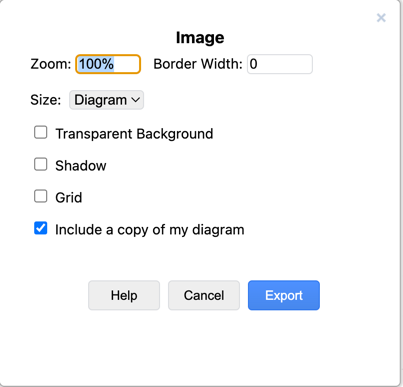

## 技巧 1

作为一名 "PPT工程师"，经常需要画架构图。在整理公司内部一些图例时，发现了一个非常实用的小技巧，解决了长期困扰的问题。

简单来说我们日常出技术方案往往会使用 KeyNote 或者 PowerPoint 来画图，并生成 PDF，这样归档和邮件发送都比较方便和专业。

麻烦的是有一些图例如架构图、类图、E-R 图，不太适合使用 KeyNote、PowerPoint 等工具绘制，所以一般会使用 Drawio、Excalidraw 来绘制。但是源文件又难以同步更新和保存，经常忘记同步更新。

直到有一天，我导出 Excalidraw 图片时，发现导出时可以包含画布数据。

这样就可以导出为 PNG 格式的图片，并且能拖拽进入软件继续编辑，非常方便。

既然 Excalidraw 可以做到，那么 Drawio 应该也是支持的，所以尝试导出了一下 Drawio 文件。

Drawio 使用保存功能，在保存时选择可以编辑的位图、矢量文件即可。

也可以使用导出功能选中选中包含的图片数据副本即可。

更详细的技巧查看 Drawio 的官方网站博客：[https://www.diagrams.net/blog/diagram-data-image-formats](https://www.diagrams.net/blog/diagram-data-image-formats)

## 技巧 2

如果把图片拖拽/导入到 Keynote 中就可以把所有图的源文件保留下来了，但是需要更新的时候怎么办呢？

Keynote 中的图可以导出来进行二次编辑，只需选中图片拖拽出来即可，方法如下：

这个技巧比较隐晦，日常可能比较难注意。

## 图片藏数据的原理

由于之前一个项目需要阅读过一些 drawio 的源码，就想知道这个方法的原理是什么，那么这个技巧也可以运用到其它地方，所以查了一下。

.drawio 实际上是一个 xml 文件，而 PNG 是一个二进制文件格式。在很多年前流行 PNG 藏种子的习惯，这种既可以作为数据包又可以作为图片显示的技术并不新鲜，但确实足够有用。

drawio 的藏数据和压缩包藏数据原理不一样，这里简单分别说明一下。

drawio 将图放到 PNG 图片的某个区块（zTXt）中，正常渲染不会使用这部分数据，所以程序在需要的时候读取即可。压缩包藏图的原理是，把需要隐藏的数据追加到图片文件尾部，读取软件为了兼容性考虑往往会扫描全文件然后读取可解析的数据，所以可以隐藏各种数据。

drawio 图中藏数据的代码见： [https://github.com/jgraph/mxgraph/blob/ff141aab158417bd866e2dfebd06c61d40773cd2/java/src/com/mxgraph/util/png/mxPngTextDecoder.java](https://github.com/jgraph/mxgraph/blob/ff141aab158417bd866e2dfebd06c61d40773cd2/java/src/com/mxgraph/util/png/mxPngTextDecoder.java)

