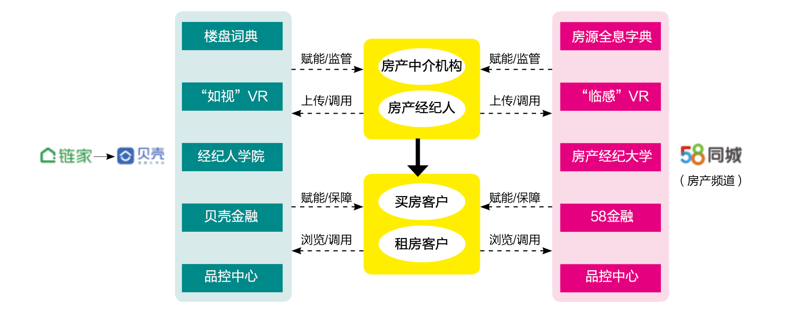

辩证唯物主义告诉我们，社会的发展是由矛盾推动的。软件行业的上一次矛盾是”人们对信息获取便利性的诉求和行业信息化不足的之间的矛盾“。这些矛盾的积累掀起了软件行业的互联网革命的浪潮，迸发巨大的能量。

在国内互联网发展到下半场的阶段，新的矛盾在哪里？新的发展引擎在哪里？经过大量的咨询和行业观察，咨询师们敏锐的注意到新的矛盾：

> 企业对支持多渠道、多用户、多应用的平台建设诉求和模型建立能力不足之间的矛盾。

这个矛盾是推动行业头部企业进行资源整合、平台化、规模化发展的内在因素。

根据长尾理论，互联网化的行业往往 80% 是通用业务，20% 是定制化的诉求。但是这 20% 的定制需求产生了绝大部分成本，同时降低了通用平台的能力，拖慢研发速度，让企业在竞争中处于不利的地位。头部企业的目标是识别 80% 的通用业务，获得绝对的控制权和主场优势，然后以生态系统的方式满足 20% 业务诉求，实现行业的健康发展。

行业需要实现规模化，就必须先将自己规范化。完全没有规范化的业务，就只能采用高能力的人，让员工发挥主观能动性；半标准化的工作，可以快速培训人员，用成熟的模式赋予人员能力；完全标准化的工作，可以使用机器代替。企业规范自己领域内的能力的过程，就是对流程方法的梳理、分析、抽象和建模。

在这个过程中，模型更加匹配发展潮流的新兴势力不断挑战原有的市场霸主，而在原有市场中的传统企业也在积极谋求数字化转型。这种冲突让竞争变得无比激烈，但无论如何，他们都试图要建立更合适自己的企业架构模型，这既是挑战，又是机遇。

## 什么是企业架构？

企业架构 (Enterprise Architecture) 最早诞生于 IBM 的信息系统建设理念，始于 1987 年 Zachman 的一篇著名论文 《A Framework for Information Systems Architecture》。企业架构关注业务的结构和行为，尤其是创建和使用业务数据的业务角色和流程。它已被定义为 “用于进行企业分析、设计、规划的体系方法，具有定义明确、长期主义、综合应用的特点，用于制定和执行企业战略。“

企业架构发展了三十多年，有很多专家与组织都企业架构的内涵进行解释和补充，企业框架组织很多，业界比较著名的有：

- Zachman 架构框架
- FEAF 联邦总体架构框架
- TOGAF 开放组织架构框架

TOGAF 是目前最主流的企业架构框架，后来发展为企业架构领域名气最大的论坛组织，在全球有 350 个大型企业会员， IBM 是其中 6 个董事会成员之一。业界使用 TOGAF  的案例较多，主要集中在制造业、银行和航空等行业。

在 TOGAF 中，企业被定义为具有共同使命和目标的组织，并不是商业上的 ”企业“ 含义。它可以是一个完整的商业体，也可能是政府组织、公司部门，TOGAF 用于诠释怎么组织企业中的资源、角色等元素。

尽管企业架构概念相当抽象，但可以明显看出企业架构是和企业管理是相通的，最终的目的是提高企业的一体化程度，更好的实现企业的战略目标。在信息化无法阻挡的当下，企业架构也包含业务和技术的一体化。企业架构，不是为了让信息系统的建立更”省心“，而是要解决企业战略目标落地的具体问题。

因此企业架构和平台化趋势息息相关，呈互相依存的形势。

## 企业架构面临的新挑战

事物的发展是螺旋上升的。

“平台化” 是从过去到现在，每一轮技术革命都被反复提及的主题。从蒸汽时代到信息时代，从信息化到数字化。量变带来质变，相似的场景再现，但相同的解决方案却有心无力。

传统企业架构目标是一体化企业内的信息系统，实现规模化。互联网产品产业赋能平台是面向更大的受众，实现更大的规模化。信息系统的规模化和制造业的规模化有异曲同工之妙。

福特通过流水线对汽车的生产过程的统一实现规模化，享受大生产、大市场的优势。而丰田模式将这种模式进一步发展，丰田的理念是去除每一个不必要的动作，把最有效率的动作确定为 ”标准动作“。

但是，事物都有它们相反的一面。采用标准化构件和过程的生产，意味着对个性化、定制化市场的取舍。

企业架构建模的新挑战就来自于，相对 80% 通用业务的 20% 定制问题。建模的目的就是要识别、分析、隔离个性化业务，从变化中找出不变，才能顺利实现平台化能力。

随着互联网的发展，”打磨产品“ 的理念让企业把资源转移到产品设计上。这也对平台的系统架构设计提出了更高的要求，以便于更好地服务产品，让产品快速地获得市场。

产品驱动的策略，在第一阶段获得大量收益的同时，却提前透支了架构的弹性能力。重复建设、技术异构等问题为企业带了负担，对产品的持续成长、深入发展带来伤害。这也是为什么大型的互联网公司在初期获客阶段和后期盈利阶段的策略完全不同的原因。

当产品在市场站住脚后，企业迫切的需要业务的一致性、完整性，于是企业架构和领域建模出现在架构师的视野。甚至成为成熟的传统行业龙头往数字化转型的理论依据和方向。

于是在这种情况下，对企业架构提出了新的挑战：

1. 如何区分业务 ”应用“ 和通用服务，识别通用的业务能力，避免具体的 ”应用“ 污染平台通用能力？
2. 如何识别新的模型，如何验证新的模型的是否能在未来的业务中具有竞争优势？
3. 如何处理向新的模型过渡中的各种问题，以及完成系统的架构重构？

如果不能应对这些挑战，企业架构反而会让正在转型中的企业处于被动，面临过长的 ”脱壳期“，遭受来自竞争对手的打击。

## 建模带来的新机遇

规模化带来的护城河效应是 “互联网下半场” 的新机遇。

2020 年在互联网行业发生了一起悄无声息的变革，8月13日晚间，贝壳找房正式在纽交所挂牌交易。从链家到贝壳网，彻底击败以 58 为中心的中介联盟，地产中介行业重新洗牌。

产业赋能平台对垂直领域洗牌成为经典商业案例，80% 效应再次发挥威力 ——  “集中优势兵力在局部形成绝对优势”。58 同城始终坚持信息平台模式，提供混杂的信息，覆盖房屋中介、家政、二手物品等领域。

建模就是要找到处理 80% 的业务的最优方案，贝壳网在建设中提取了链家门店、链家网的专业中介流程，把中介场景规范化为最优的流程，形成规模化。而 58 虽然和各个地产中介结盟，但是在地产中介领域却不占优势。合纵不及连横，58 身配 “六国相印” 也无法在地产中介领域的竞争中占优。

云原生架构的兴起的背后是互联网公司对规模化的天然诉求，水平拓展能力成了 “硬通货”，不过这还只是 “术”。关键还是找到福特的“标准构件”和丰田的 “标准动作”，这才是企业成功的 “道”。

这些内容恰恰就是现代企业架构的研究方向，企业架构把这些建模过程，分解了几个层次。

1. 业务层。企业的业务层面的建模和架构，研究企业各类业务的运作模式及业务之间的关系结构，它关注的是业务问题、用户和场景。可以用流程图、用例图、业务原型等模型来规范业务表达方式。
2. 应用层。企业的信息系统应用能力的建模和架构，研究信息系统的构建、设计以及提供的功能（注意区别领域驱动设计（Domain-Driven Design）中的应用层）。在平台化的信息系统中，又需要分为应用和服务，应用为面向业务场景的信息系统，服务为提供无差别通用能力的核心 API。关注对业务的抽象和统一，可以用领域模型、架构图、UML来表达模型。
3. 数据层。企业的信息层面的建模和架构。关注于数据架构，建立企业级的数据标准体系、数据仓库、数据湖等。处理内、外部数据，进行度量、分析和预测，用于战略决策和包装为特定的数据产品。可以使用数据对象、数据流水线等方式表达模型。
4. 技术层。企业的技术设施和资产的建模和架构。技术架构和建模包括使用哪种研发模式（敏捷方法等）、哪种技术设施（混合云、Devops平台）等，关注在技术基础设施的架构，为其他层提供能力。

现代企业架构研究的方向已经从企业内的信息系统建设发展到支撑开放性产品的阶段，这一阶段的明显特征是平台的重要性越来越凸显。建模是构建平台必要的理论基础，为了更好的服务于平台构建的过程，建模的必要性越来越突出。

Design Thinking 的兴起也说明了产品经理对业务层的模型有了更深入的认识，用户画像、同理心地图、服务蓝图等这些创新的思维工具可以更好的为业务建模服务；领域驱动设计（Domain-Driven Design）可以将业务层的模型转换为领域模型，从而为应用层的建模服务。数据工程中的一些新兴建模方法，例如星型模型和雪花模型可以为数据层的建模服务；如火如荼的云原生、Deveops等新的技术架构模式也可以服务于技术层的建模和架构。

## 参考资料

1. 《A Framework for Information Systems Architecture》 John Zachman
2. 《产业赋能平台:智能时代的商业模式变革》 刘绍荣
4. 《从福特模式到丰田模式》К.多瑟
4. 《从火爆的_中台_看企业架构》陈璐璐

