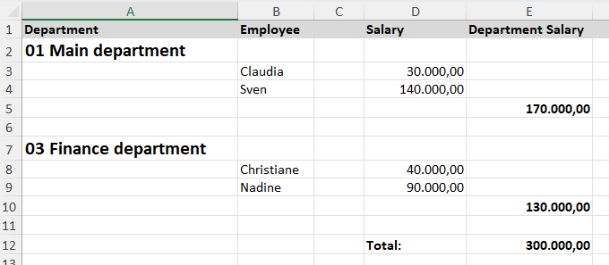
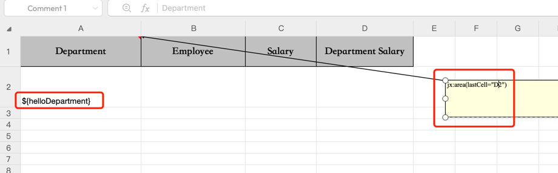
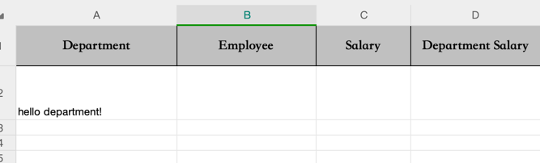
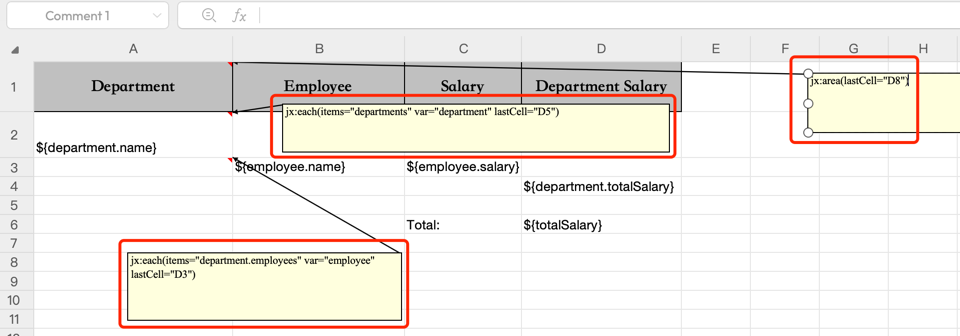
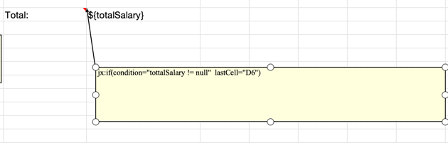

如果遇到需要导出 Excel 的场景应该如何实现？这个问题在大多数应用中都会出现，所以今天把用过的一些方案整理一下，如果有更好的方案欢迎留言补充。

相对 PDF 导出来说，Excel 导出需要踩的坑就非常多了。

在 Excel 导出方面常见的需求有两大类：

- 列表数据导出
- Excel 详情导出

列表数据导出比较简单，而 Excel 详情导出稍显麻烦。

## 01 Excel 列表

如果是单纯的列表数据，可以使用的而方案比较多，可以使用 Apache POI 库，Apache POI 是一个非常强大的 Excel 库，但是提供的 API 比较基础，需要自己操作单元格级别的数据填充。

下面看一个例子（这种例子完全可以使用 AI 生成，这里只贴关键代码了）：

```java
Workbook workbook = new XSSFWorkbook();
Sheet sheet = workbook.createSheet("Users");

// Create header row
Row headerRow = sheet.createRow(0);
Cell headerCell1 = headerRow.createCell(0);
headerCell1.setCellValue("Name");
Cell headerCell2 = headerRow.createCell(1);
headerCell2.setCellValue("Age");
Cell headerCell3 = headerRow.createCell(2);
headerCell3.setCellValue("Email");

// Fill data
int rowNum = 1;
for (User user : users) {
    Row row = sheet.createRow(rowNum++);
    row.createCell(0).setCellValue(user.getName());
    row.createCell(1).setCellValue(user.getAge());
    row.createCell(2).setCellValue(user.getEmail());
}

// Resize columns
for (int i = 0; i < 3; i++) {
    sheet.autoSizeColumn(i);
}

// Write to file
try (FileOutputStream fileOut = new FileOutputStream(filePath)) {
    workbook.write(fileOut);
}

// Closing the workbook
workbook.close();
```

对于列表导出这种场景来说，有两个缺点：

- 代码太繁琐了。当然也可以自己封装一个通用的导出工具，传一个 POJO 进来即可
- 性能不好。POI 的强大能力，做的事情太多，导致性能相对比较差，不过可以通过优化成流式输出提高一部分性能。

所以在实际工作中，导出列表一般不用 POI，有点杀鸡用牛刀的感觉。 下面介绍另外一个库 EasyExcel 更简单的实现导入导出。

EasyExcel 抛弃了 POI 的一些做法，因为就导出来说，不需要构建完整的 Excel 对象，所以显得更加轻量化。

假设我们有一个 User POJO 对象，这个对象有 name、age、email三个字段。

定义一个 POJO 对象。

```java
@Getter
@Setter
@ToString
@AllArgsConstructor
public class User {
    @ExcelProperty("Name")
    private String name;

    @ExcelProperty("Age")
    private int age;

    @ExcelProperty("Email")
    private String email;
}
```

EasyExcel 已经把 API 封装到非常简单的程度了，所以基本上没有啥你可以讲的。

```java
List<User> users = Arrays.asList(
        new User("Alice", 30, "alice@example.com"),
        new User("Bob", 25, "bob@example.com"),
        new User("Charlie", 35, "charlie@example.com")
);
EasyExcel.write("user.xlsx", User.class)
        .sheet("默认")
        .doWrite(() -> users);
```

默认情况下 EasyExcel 是往文件中写入内容，但是对往 HTTP 流中写数据，需要构建一个自定义的 Writer。

```java
// 设置HTTP头
response.setContentType(CONTENT_TYPE);
response.setHeader("Content-Disposition", "attachment; filename=\"" + URLEncoder.encode(fileName, StandardCharsets.UTF_8); + "\"");

// 返回一个 Writer，可以继续调用 write 方法写入内容，并在最后调用 finish 完成写入。
EasyExcel.write(response.getOutputStream(), User.class).build();

```

## 02 Excel 详情

如果是 Excel 套打表单，可能需要组合非常多的数据，这些内容中间会有循环、条件（如果内容不存在的情况）等场景，这种场景就比列表写入复杂得多了。

比如下面这个例子上前面的线性结构完全不同，如果要实现出来需要费很大的功夫。



在实践中我们有两个选择：

1. 用 POI 在单元格级别去拼装
2. 使用 jxls 这类的库，通过 Excel 模版和脚本语言来完成。

jxls 是一个 Excel 库，允许通过模版来渲染复杂的 Excel 表格布局，在模版中可以使用 Excel 的注释来作为脚本媒介。

它其实也是通过 Apache POI 来实现 Excel 生成的，只不过提供了更高级的 API。

比如我现在准备了一个模版，我们可以在单元格 A1 上插入一个注释，jx:area(lastCell="D2") 含义是从 A1 到 D2 的这些区域都可以生效表达式赋值。



把这个 Excel文件保存为 template.xlsx, 准备一些数据生成我们想要的 Excel 文件。

参考下面代码(这段代码需要在 Java 11 下工作，jxls 有点坑的地方在于版本升级马上用了 Java 的新特性，导致如果 JDK 还比较老，官网的代码没有参考价值)，利用 jxls 生成 Excel 文件：

```java
URL url = Resources.getResource("template.xlsx");
try (
        InputStream inputStream = Resources.asByteSource(url).openStream();
        OutputStream outputStream = new FileOutputStream(new File("detail-report.xlsx"))
) {
    Context context = new Context();
    context.putVar("helloDepartment", "hello department!");
    JxlsHelper.getInstance().processTemplate(inputStream, outputStream, context);
} catch (IOException e) {
    e.printStackTrace();
}
```

生成的效果如下：



## 循环

其实它也可以实现列表类的数据，只不过需要手动编写循环语句。

这里准备复杂一点的数据，实现前面那一张复杂的例子。

```java

Context context = new Context();
    context.putVar("totalSalary", new BigDecimal("300.000"));
    context.putVar("departments",
               Arrays.asList(
                       Department.builder()
                        .name("01 Main department")
                        .employees(Arrays.asList(
                                Employee.builder().name("Claudia").salary(new BigDecimal("30.000")).build(),
                                Employee.builder().name("Sven").salary(new BigDecimal("140.000")).build()))
                        .totalSalary(new BigDecimal("170.000")).build(),
                        Department.builder()
                        .name("03 Finance department")
                        .employees(Arrays.asList(
                                Employee.builder().name("Christiane").salary(new BigDecimal("40.000")).build(),
                                Employee.builder().name("Nadine").salary(new BigDecimal("90.000")).build()))
                        .totalSalary(new BigDecimal("130.000")).build())
                );
    JxlsHelper.getInstance().processTemplate(inputStream, outputStream, context);
} catch (IOException e) {
    e.printStackTrace();
}
```

请注意下面这个模版中的脚本写法。这里两个循环，一个是 departments 的循环，另外一个是 department 下的 employees 的循环。在循环中，可以通过 var 变量暴露循环中的临时变量，作为嵌套的子循环。

lastCell 参数是指影响循环的范围，指定了 lastCell，即使后面没有数据也会保留空行。



## 条件

在复杂的场景下，如果有一些字段不存在，那么我们希望整块区域都不显示，这也是非常常见的需求，这种情况可以使用条件语句判断即可。

在上述的例子中，假设 totalSalary 为空，我们可以判断是否为 null，并显示相关区域。

就像这样： 



## 参考资料

- https://jxls.sourceforge.net/if.html
- https://easyexcel.opensource.alibaba.com/docs/current/quickstart/write


