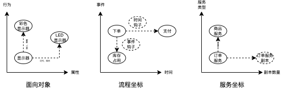
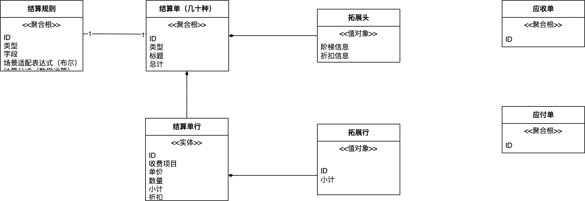
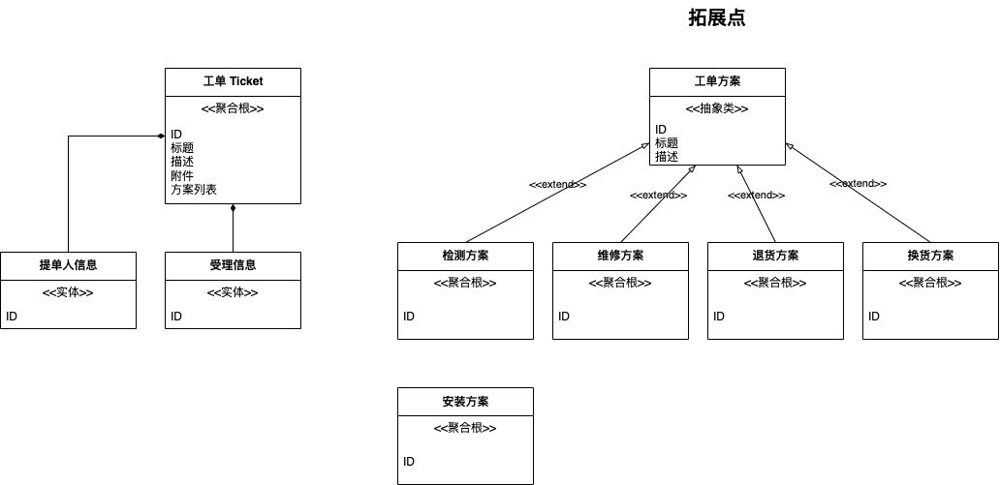

对于大型系统或者大型企业来说，业务系统需要支撑的场景往往多到超过想象，这也是大厂业务复杂的原因。

我们需要对这些场景进行抽象，并设计合理的拓展点。例如：

某电子产品的售后工单系统，需要处理各种场景：咨询、安装、维修、退换货、配件销售等场景，这些场景都有不同的字段，但是工单流转过程类似，如何设计模型？

财务结算系统，需要处理各种来源结算场景，生成不同的结算单，如何使用结算单统一不同的场景，以及存储这些场景中的结算字段？

外卖场景，不同品类（花卉、药品、商超、水果等）会有一些特有的信息或者延伸服务。例如，系统识别订单为花卉时，需要处理留言、贺卡等信息。

保险行业，保单上对于不同的保险品种的字段差异巨大，如寿险、财险、车险、社会保险，如何处理这些额外的字段信息，并预留拓展点？

需要审批的业务场景，审批服务如何支持很多场景？

这样的例子还能列举非常多，下面我们讨论一些设计出拓展性好的模型需要了解什么。

## 找到拓展"坐标"

拓展性是一个非常模糊的词汇，在线研讨会中，有一位朋友引入了"坐标"这个概念，让模糊的拓展性可以被清晰的描述。

"坐标" 是一个非常好的词汇，最早被引入到数学中是笛卡尔，而数学是典型的形式化语言，坐标系的存在让人们对"数"的范围有了清晰的定义和直观的认识。

当我们谈论拓展性时，如果借用"坐标"的概念，那么就能知道我们在拓展什么：

- 面向对象坐标：领域模型拓展可以参考的坐标系，可以用属性、行为两个维度来构建坐标。不变的属性、和通用的行为属于不变点，模型上引申出来的子类、组合类可以拓展属性，策略类、工厂类可以拓展行为。
- 流程坐标：描述软件过程的坐标系，主要维度可以有事件、时间，表述软件在运行时候在时间和事件维度上发生的事实。这样就能在事件上埋入钩子完成拓展性设计。
- 服务坐标：类似于 ZFK 拓展立方体，可以建立两个维度，服务的种类和服务的副本数量，这样就是我们所说的垂直拓展和水平拓展了。

服务坐标、流程坐标在其它文章中被讨论得非常多了，这篇文章主要聚焦于面向对象坐标，也就是如何拓展领域模型的字段、逻辑。

## 识别拓展点和不变点

对于领域模型来说，我们的拓展点依然围绕面向对象的坐标进行。那么这里就需要介绍另外两个概念：

- 拓展点：和场景不同的部分，包括字段、行为。
- 不变点：不同场景或者大部分场景下相同的字段，行为。

拓展点和不变点是一对此消彼长的兄弟，当拓展点非常多时，不变点就非常少，也就意味着可复用的东西非常少。

过度拓展的代码非常空洞，换句话说就是没什么用。 如果需要识别和设计拓展点，那么一定要找到不变点，找到不被业务变化扰动的部分，并对其进行抽象。

举个例子来说，一套财务结算系统，可能有 30 种结算单，有些结算会计算阶梯价，有些会匹配折扣。

## 案例说明

### 结算单案例

我们使用几个案例来描述领域模型中的拓展点设计。对于结算单系统，我们可能会得到下面的模型：

几十种结算单被抽象为结算单（头）、结算单行模型，这两个模型可以作为不变点。

关键的字段信息有：结算类型、标题、总计、单价、数量、小计、折扣等。

为了处理不同的结算单，我们可以增加结算单的拓展头、拓展行模型，不同的场景下相关拓展头、行分别使用 JSON 数据结构序列化到结算单上即可。

跟进一步，还可以将结算规则提取出来，用来拓展行为。为每一个结算规则设计一个策略类，就能处理不同类型的结算单，在不变点不被破坏的情况下完成字段和行为的拓展。

### 工单案例

对于工单系统来说，我们可以将工单流转设计为不变点，而将工单延伸出来的具体服务抽象为工单方案。

模型如下：

对于工单系统来说，工单关注于状态和受理进度的流转上，而具体的售后处理方案可以拓展出去作为拓展点。

这样原本需要全部放置到工单上的模型，可以抽象到工单方案上。甚至一个工单也可以支持多种工单方案，获得更强的能力。

甚至在未来，可以进化到服务坐标，将工单抽象为服务，不同的工单方案独立为微服务并接入到工单系统中，为构建更大的系统成为可能。

## 总结

拓展点设计作为大厂架构师不得不考虑的问题，其问题的本质还是建立在业务深刻理解上的，只有抓住了问题的核心才能分离不变点和拓展点。

比较困难的地方在于有时候不变点和拓展点往往混淆到一起，不同的业务之间无法建立规律，强行抽象的代价为对不同的业务线造成耦合，反而不利于业务演进。

那么需要思考的问题是，拓展性设计是 PPT 需要还是真正在项目中需要呢？
