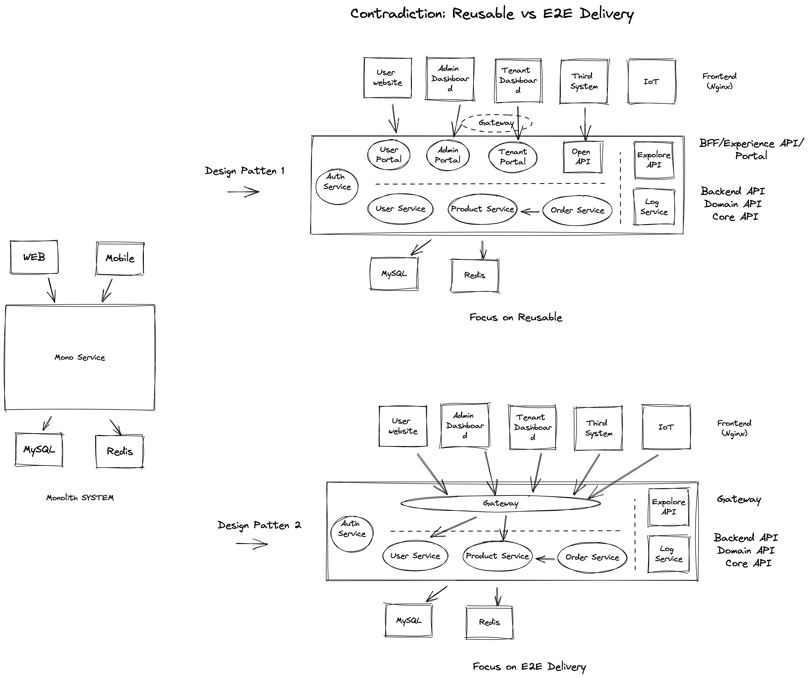

微服务架构中的一些概念非常模糊，业界往往没有取得共识。对于应用来说，其原因是业务背景多种多样，往往单一的模式不能满足现实需要。个人认为这是架构意识形态之争的根本原因。

今天来辨析一下微服务架构中 BFF，其含义和两种架构形态。

## 胖瘦 BFF 之争

我自 2015 年开始参与的所有应用系统都是服务化的了，都算比较大型的系统，这可能是解决大型复杂应用的必然之路。

在服务化的系统中规划阶段，有一些必然会被讨论的话题：

> 要不要 BFF?要不要编排层？要不要网关？什么是网关？应用网关和网关的区别是什么？后端（领域服务）服务之间要不要互相调用？要不要使用 BFF 来编排后端服务？BFF 是不是编排层？BFF 能不能宏观上对应 DDD 的应用层？

在这些问题中，最显著的问题倒不是用来接用户流量的服务叫什么名字，而是它应该直接转发数据还是需要为每个 API 重新编写一次实现，并调用后端 API。

其结论会决定我们在 BFF 中是否编写大量代码，所以我把它们的区别称之为"胖瘦 BFF"。不同 BFF 的考量会决定微服务架构的两种形态。

在开始讨论 BFF 之前，我们先对齐一下语言。

目前还比较少关于微服务架构的标准，我参考了中国通信标准化协会发布的 《分布式应用架构通用技术能力要求 第1部分:微服务平台》中的概念"应用服务"来代表 BFF。

BFF 的全称为：Backend for Frontend，意思是由于微服务众多，需要一个统一入口作为前端集成使用，这类服务我们一般叫做 BFF。

其实这类入口服务有很多种称呼，我所知或者听到的就有：

- BFF
- 编排层
- 编排服务
- 应用网关
- 服务网关（通信协会标准中使用的名称）
- Portal API （意思是系统的不同入口）
- 前台（一些电商系统喜欢这么叫，区别于后台、领域服务、Domain Service 或者中台）
- Experience/User  API （用于用户体验使用的 API）

在本文范围内暂且使用 BFF 吧。

## 胖 BFF

在有一些架构中形态中，BFF 会有以下职责：

- 鉴权
- 限流、熔断、服务降级、灰度路由等
- 接入多种协议和设备，比如 MQTT 服务、WebSocket 等
- 编排领域服务，尽量避免后端服务之间互相依赖，统一由 BFF 处理
- 不同类型的客户端一套 BFF
- 非常接近 DDD 四层架构中的应用层，处理面向场景的业务

为了区分另外一种相反的架构思路，我暂且叫做胖 BFF，因为它的职责比较多。

胖 BFF 的好处是：

- 可以对不同类型的客户端定制一套 API，且各自之间不受干扰
- 领域服务可以设计得比较原子化，比较少的侵入特定场景信息到领域服务中
- 容易适配更多类型的客户端
- 比较容易实现个性化的鉴权、特定用户群的交互逻辑
- 方便实现准确、统一的 API 文档

但是这类架构也有非常多的弊端，导致很多架构师非常抗拒：

- 破坏了端到端交付能力，如果按照上下文划分微服务，刚好这些微服务和前端业务和需求对应，那么跨功能团队的交付效率会更高
- 重复劳动，一些接口的模型不仅在领域服务实现一次，还需要在 BFF 做一次
- 难以分工，维护后端服务的人员都会和这个服务集成

在海外的一些文章和书籍中，他们也会有类似的困惑。很多架构师把这种结构叫做编排（Orchestration），而相对的就是 BFF 仅仅扮演转发的作用，我将其成为“瘦 BFF”，也就成了我们口中的网关，有时候被称为 Choreography 架构，中文是编舞。

## 瘦 BFF

瘦 BFF 可以等同于 Choreography 架构，其职责可能更少：

- 鉴权
- 透明转发流量到后端服务
- 和胖 BFF 类似，也有限流、熔断、服务降级、灰度路由等职责

它的好处是：

- 端到端交付，前端开发人员直接使用后端领域服务的 API 文档
- 开发效率高，避免多编写一层 BFF
- 减少一次集成

对应的，它的弊端可想而知： 

- 没有编排层，服务之间相互依赖
- 编排行为落入前端或者领域服务，拓展性差
- 领域服务之间调用关系复杂
- 领域服务职责过多，侵入业务场景，难以被复用

## 两种形态对比

我们把这两种常见的架构放到一起如下所示：

Design Pattern 1 的架构中，对不同的来源请求都使用了各自的入口服务承接，这种结构成本很大，但是对于接入渠道多样的系统来说非常适合。

Design Pattern 2 的架构中，前端直接调用后端服务，忽略掉了 BFF，适合接入差异较小的应用。

## 权衡

那么在什么场景下，更合理的选择这两种结构之一呢？ 

受到不同业务场景的影响，这就是不同架构师之间不同意见的由来。 我和很多人交流过这个问题，他们都有各自的偏好，而且都觉得理所当然。

对于电商、互联网产品的开发者来说，他们会觉得胖 BFF 架构非常自然，甚至会觉得为什么会有公司连 BFF（或者说前台）都不要。如果没有胖 BFF，如何应对多种多样的用户群和客户端将是一个难题。

以互联网金融产品为例，他们的业务渠道非常多：APP、第三方集成、官网、代理商后台、管理后台等，这些渠道的接入方式多种多样，甚至可以看做不同的产品。

但是，以企业内部使用的应用系统来说，即使用户规模非常大，但是他们的用户群非常固定、交互方式统一、数据权限能找到规律，这类应用做起来就会发现胖 BFF 中写了非常多重复代码。

不过，唯一例外的是，对于企业内部应用来说，在系统集成方面又会变得多种多样。那么对于用户侧的 BFF 来说可以简化，对于 Open API 中的逻辑往往省略不掉，Open API 作为系统防腐层，非常有必要设计为具有编排能力的 BFF。

## 总结

无论是胖瘦 BFF，其实都是基于场景对单体系统拆分的结果。因此非常取决于所属场景，并选择一个能忍受其缺点的技术方案。

正是由于应用开发中需求的多样性，我们还不能找到一个一劳永逸的技术架构，这也解释了为什么目前还没有形成统一的技术方案和观念。

## 参考资料

- 微服务的结构 https://shaogefenhao.com/libs/webinar-notes/java-solution-webinar-3.html
- https://medium.com/gbtech/orchestration-pattern-3d8f5abc3be3
- https://orkes.io/blog/why-is-microservice-orchestration-important-now
- https://medium.com/geekculture/microservices-orchestration-vs-choreography-technology-5dbe612cf7e9
