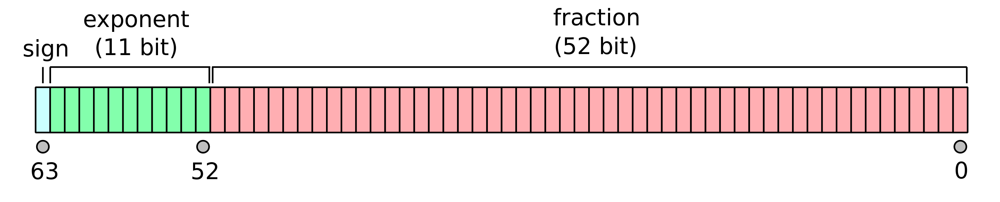

在金融、保险、电商等涉及金额计算的领域，常常需要高精度计算。但是由于计算机原理受限，普遍存在精度丢失问题。

例如，使用 JavaScript 在浏览器控制台输入：

> (0.1+0.2) == 0.3

我们会得到一个 false 的计算结果。

如果使用编程语言原生的计算方法会大量遇到精度问题。一般来说，我们可以优先考虑使用整数计算，例如在电商领域为了简单往往以分为单位计算金额。另外也可以使用编程语言提供的解决方案——高精度数据类型 Decimal。

所以今天我们以 Decimal 数据类型在应用设计中的使用来聊聊高精度计算（在 Java 中还有 BigInteger，但是基本上用不到暂时略过）。

## 计算机科学中的精度问题

在很多编程语言中，基本的数据类型可以用双精度浮点数和单精度浮点数表示。float 占 4 个字节 32 位，double 占 8 个字节 64 位（可以表达十进制 16 位数）。有限的长度也就意味着精度有限，其次基本数据类型在使用四则运算时会得到意想不到的结果，不能用于金额、利率、汇率等有精度要求的计算场景。
    
例如，在金融领域利率可能需要计算到小数点后面 7-10 位，小数点前 10 位，使用基本数据类型需要手动处理比较、取整等问题。 所以一般我们在 Java 中使用 BigDecimal 这个包装类型来表达高精度数据。

但这都不是我们使用 BigDecimal 的本质原因，更重要的原因是 **double 是浮点数，而在高精度计算的场景中，我们需要定点数。**

这又需要回答另外一个问题，为什么 double 不精确却在计算机中需要使用 double 呢？ 这就要从计算机如何表示数说起。

对于整数来说，大家都知道可以直接使用二进制 0 和 1 来表示，例如二进制 01 为十进制的 1，11 为 3 等。如果是 32 位无符号整数，则有 2 的 32 次方种可能，表达 2 的 32 次方个值。

对于小数来说，1 到 2 之间有无数种可能，使用二进制表达小数的本质就是"除半"。比如十进制 0.5 表达 1 的一半，在二进制中将小数点后一位标记为 1，即可表达为 "0.1"，二进制的 "0.1" 其实就是十进制的 "0.5"。

将 10 进制的小数转换位二进制的方法为，对小数点以后的数乘以 2，取整数部分即可。于是能用十进制表达的数，在转换为二进制时，只能用近似表示方法来无限接近，这是进制转换中无法避免的问题。

所以，0.5 在使用十进制作为字面量转换为二进制时，没有丢失精度。但 0.2、0.3 在转换为二进制时候就会出现精度丢失。

这也是为什么，0.2 + 0.3 在计算时不等于 0.5，而 0.5+0.5 等于 1。

因为计算机寻址的原因，常常需要使用固定的位数来表达这些无限的小数，因此科学家想出来一个办法，通过科学计数法来存储小数。

比如以 8.5 来说， 使用 IEEE 754 格式来表达二进制小数，转换为二进制后即为 1000.1，可以记为 1.0001 x 2³。这样的好处是，通过 32 位固定的宽度，就可以表达极大和极小的数。只不过和十进制的科学计数法类似，在超过其表达精度范围后精度就会丢失。

因为**使用科学计数法计数，指数部分是变化的，相应的小数点也会浮动，这就是浮点数的缘来。**


图片来源：维基百科

在 IEEE 754 规定中，32 位表达的小数为单精度数，也就是平常说的 float，分为三个部分：

- sign：左侧第一个 bit 表达符号位，即正负数。
- exponent：中间 8 个 bit 表达科学计数法后的指数部分。
- fraction：右侧 23 个 bit 表达小数部分。

因此一个浮点数的精度，由 exponent、fraction 共同决定。

由于 32 位实在太小，IEEE 754 又规定了 64 位的双精度类型，也就是 double。



讨论到这里，初步结论是：double 是定宽的，但在现实中表达不同精度的数据字面量是不定宽的，例如 0.1 和 0.01 就不是定宽的，后者通过多位表达更精确的数字。

在计算机中定宽的数据结构不会产生内存碎片，可以线性取数对 CPU 寻址非常有利，而在大多数情况下 double 的精度都可以满足。

**计算机对数据定宽要求导致了小数采用了科学计数法，科学计数法是定宽的，而现实中小数不是定宽并可以无限往后续写，这就是根本矛盾。**

所以我们现在可以回答这一些列问题了吗?

- 为什么 0.2 + 0.3 不等于 0.5? 因为计算机使用了浮点数，浮点数会丢失精度。
- 为什么计算机要使用浮点数？因为计算机通过科学计数法表达无限小数。
- 为什么计算机要通过科学计数表达无限小数？因为十进制转二进制会产生无限小数，且计算机科学中希望使用定宽的数据类型。
- 为什么十进制转二进制会产生无限小数？因为小数的本质是分数，当分母数量不够表达另外一种进制的小数时，就会出现无限小数。
- 为什么计算机科学中希望使用定宽的数据类型？因为 CPU 线性寻址的效率最高，也可以使用非线性寻址的数据结构，这时会发生太多程序跳转，性能降低。

前面说明了程序精度问题产生的原因，那么怎么避免精度问题呢? 一般来说有几个要求：

- 不要使用浮点数。例如 double，小数部分有 52 位，转换为十进制有16 位，但是这 16 位是整数、小数通过浮动共用的，因此精度得不到保证。
- 不要发生十进制转换二进制的行为，这样会造成精度丢失。
- 对于整数来说比较简单，使用可变宽度的整数类型即可，例如 Java 中的 BigDecimal。

基于上面两点我们需要使用 Decimal 并且注意一些坑，避免使用了 Decimal 还是导致精度问题。

在很多编程语言中，都实现了 Decimal 这类高精度数据类型用于高精度计算。它的原理一般来说都是：

- 使用定点数。使用整数表达小数点前后的数字。
- 使用可拓展的宽度。根据表达的数字宽度动态拓展内存空间，例如，将数字放到数组中，每一次数字的变化，都会开辟足够大的新内存空间，通过这些内存空间存储数字。因此 Decimal 的实现方式有点像动态数组，频繁发生内存操作导致性能低下。

## Java 高精度类型 BigDecimal 注意事项 

在 Java 使用了名为 BigDecimal 的高精度类型，我们这里聊聊相关的注意事项。 

**构造 BigDecimal**

构造 BigDecimal 常使用三种方法：double 参数的构造方法、double 参数的 valueOf 方法、字符串参数的构造方法。   

得到的结果分别如下： 

```Java
// 输出 0.01000000000000000020816681711721685132943093776702880859375
System.out.println(new BigDecimal(0.01));
// 输出 0.00999999977648258209228515625
System.out.println(new BigDecimal(0.01f));
// 输出 0.009999999776482582
System.out.println(BigDecimal.valueOf(0.01f));
// 输出 0.01
System.out.println(BigDecimal.valueOf(0.01));
// 输出 0.01
System.out.println(new BigDecimal("0.01"));
```

这几种构造 BigDecimal 的方法发生了不同的行为：

- new BigDecimal(0.01) 转换为了二进制的双精度数，会尽可能的使用尽可能高的精度构建，但会造成预期之外的期望。
- new BigDecimal(0.01f) 转换为了二进制的单精度数，同样会造成预期之外的期望。
- BigDecimal.valueOf(0.01f) 转换为单精度浮点数，再通过 Double 的标准字符串的方式解析为 BigDecimal。
- BigDecimal.valueOf(0.01) 这里没有发生转换，直接使用 Double 的标准字符串的形势解析 BigDecimal，0.01 等同于 "0.01" 可以参考 Java 文档上的转换方式 https://docs.oracle.com/javase/7/docs/api/java/lang/Double.html#toString%28double%29。
- new BigDecimal("0.01") 直接使用字符串的形式构造 BigDecimal。

比较推荐的方式是通过使用 new BigDecimal("0.01") 方式构建 BigDecimal 避免误用，否则使用了 BigDecimal 依然会出现精度问题。

**BigDecimal 的运算**

BigDecimal 不是对应基本类型的包装类型，因此没有自动的拆装箱，无法使用原生的运算符。需要使用相关方法实现数学运算。

常用示例如下： 

```java
BigDecimal bigDecimal1 = new BigDecimal("0.3");
BigDecimal bigDecimal2 = new BigDecimal("0.2");
BigDecimal bigDecimal3 = new BigDecimal("0.5");
BigDecimal bigDecimal4 = new BigDecimal("0.7");
// 输出 0.5
System.out.println(bigDecimal1.add(bigDecimal2));
// 输出 0.3
System.out.println(bigDecimal3.subtract(bigDecimal2));
// 输出 0.06
System.out.println(bigDecimal1.multiply(bigDecimal2));
// 输出 0.71429
System.out.println(bigDecimal3.divide(bigDecimal4,5, BigDecimal.ROUND_HALF_UP));
// 报错 java.lang.ArithmeticException: Non-terminating decimal expansion; no exact representable decimal result.
System.out.println(bigDecimal3.divide(bigDecimal4));
```

我们会发现加减乘除的效果都和现实中四则运算一样了。但是有一个特殊情况是它的除法会报错，这是因为 BigDecimal 存储的都是精确值，在除法的结果中需要指定舍入模式和舍入精度，否则会抛出 ArithmeticException 错误，这个错误和除以 0 的错误是类似情况。

在 BigDecimal 类中定义了多种舍入模式需要和业务规则匹配，令人意外的是除了日常使用到的四舍五入、向上取、向下去之外还有这么多种方式，因此我请教了 ChatGPT 得到的详细说明：

- ROUND_UP：向远离零的方向舍入，即向正无穷方向舍入。例如，1.1会舍入为2，-1.1会舍入为-2。
- ROUND_DOWN：向接近零的方向舍入，即向负无穷方向舍入。无论正负数，都直接舍去小数部分。例如，1.9会舍入为1，-1.9会舍入为-1。
- ROUND_CEILING：向正无穷方向舍入。如果为正数，则与ROUND_UP行为相同；如果为负数，则与ROUND_DOWN行为相同。
- ROUND_FLOOR：向负无穷方向舍入。如果为正数，则与ROUND_DOWN行为相同；如果为负数，则与ROUND_UP行为相同。
- ROUND_HALF_UP：四舍五入，如果舍弃部分大于等于0.5，则进位；否则舍去。例如，1.5会舍入为2，1.4会舍入为1。
- ROUND_HALF_DOWN：五舍六入，如果舍弃部分大于0.5，则进位；否则舍去。例如，1.5会舍入为1，1.6会舍入为2。
- ROUND_HALF_EVEN：银行家舍入法，也称为"四舍六入五取偶"。如果舍弃部分大于0.5，则进位；如果舍弃部分等于0.5，则舍入到最近的偶数。例如，1.5会舍入为2，2.5会舍入为2。
- ROUND_UNNECESSARY：表示精确舍入，如果舍入后的小数部分不为零，则抛出ArithmeticException异常。

BigDecimal 还可以完成取绝对值、取余、指数计算等操作，可以见相关文档就不展开了。

**BigDecimal 的比较**

由于 BigDecimal 是一个具有特殊业务行为的对象，不能直接使用 == 和 equals 方法进行比较。

比较 BigDecimal 有多种方式，示例如下：

```java
BigDecimal bigDecimal1 = new BigDecimal("0.2");
BigDecimal bigDecimal2 = new BigDecimal("0.3");
BigDecimal bigDecimal3 = new BigDecimal("0.1");

// 输出 0
System.out.println(bigDecimal1.compareTo(bigDecimal1));
// 输出 -1
System.out.println(bigDecimal1.compareTo(bigDecimal2));
// 输出 1
System.out.println(bigDecimal1.compareTo(bigDecimal3));
// 输出 0.2
System.out.println(bigDecimal1.min(bigDecimal2));
// 输出 0.3
System.out.println(bigDecimal1.max(bigDecimal2));
```

在 BigDecimal 中，我们经常会使用 compareTo 来比较数值的大小，输出结果为 0、-1、1。 BigDecimal 重写了 equals 方法不仅会比较数值大小，还会比较精度，可以参考源码验证其行为。

**在序列化时的问题**

在 Spring Boot 中，默认情况下，BigDecimal 对象会被序列化为数字而不是字符串。

Spring Boot 使用 Jackson 作为默认的 JSON 序列化库，Jackson 会根据 BigDecimal 对象的实际类型选择适当的序列化策略。但是，序列化为数字后往往会被截断导致精度丢失，所以我们需要改成字符串的形式序列化并通过 JSON 传输。

如果是对特定字段修改序列化方式，可以使用： 

```Java
@JsonFormat(shape = JsonFormat.Shape.STRING)
private BigDecimal bigDecimal;
```

如果是全局设置可以使用： 

```java
@Bean
public Jackson2ObjectMapperBuilder jacksonBuilder() {
    Jackson2ObjectMapperBuilder builder = new Jackson2ObjectMapperBuilder();
    builder.featuresToEnable(SerializationFeature.WRITE_BIGDECIMAL_AS_PLAIN);
    return builder;
}
```

**在单元测试和 API 测试时的问题**

在 API 测试时，需要对 BigDecimal 进行设置才能有效断言。

参考配置：

```java
RestAssured.config = newConfig().jsonConfig(jsonConfig().numberReturnType(NumberReturnType.BIG_DECIMAL))
```

在 JSON path 断言中使用字符串即可断言 BigDecimal 数据类型的结果。

**BigDecimal 的原理**

前面聊了 BigDecimal 这么多注意事项，这里简短的讨论一下 BigDecimal 的原理，这样我们可以更好的理解并使用它。

BigDecimal 有几个特点：

- 支持任意精度、大小数据
- 不可变
- 进行无精度损失的计算
- 非浮点数

其原理一句话概括：**使用分段的整数来模拟小数，大整数依赖 BigInteger，BigInteger 中采用数组实现，原理类似 String 对象之于 char。**

BigDecimal的原理基于以下几个关键概念：

- 内部数据表示（intVal）： BigDecimal 使用一个整数数组（基于 BigInteger）来存储小数的每一位数值。数组中的每个元素表示一组十进制数位，通常是 9 位或者 10 位。数组的每个元素都是一个 int 类型的值，表示对应位上的数值。
- 小数点位置（scale）：BigDecimal 还存储了一个整数值，表示小数点的位置。这个值可以是负数，用于表示小数点左边的零位数。
- 精度（precision）：BigDecimal 提供了精度控制，可以指定小数的精度（即小数点后的位数）。精度由一个整数值表示。

精度（precision）可以理解为表达数值以十进制的长度，小数点位置（scale）可以理解为小数点后的位数。

例如：

- 0.12345 的精度为 5，小数点后位数为 5 位。
- 对于 0 约定为精度 1，小数点后位数 1。

## Mysql 数据库

在 Mysql 的文档中，将 DECIMAL, NUMERIC 描述为精确值类型，或定点值数字类型。DECIMAL 是 NUMERIC 的具体实现，因此在 Mysql 中我们都会使用 DECIMAL 定义相关字段，这两个类型没有差异。

Mysql DECIMAL 的定义格式为: 

> DECIMAL(M,D)

其中： 

- M 为精度，1 <= M <= 65,默认值 为 10
- D 为小数点后的位数，0 <= D <= 30，且 D <= M，默认值为 0

在实现原理上，DECIMAL 类型的小数部分和整数部分分开存储，并通过每 4 个字节表达 9 位数字，超出的部分使用额外的字节存储。在 Mysql 的官方文档中给出了一张表格和参考源码： 

| Leftover Digits | Number of Bytes |
| :-------------- | :-------------- |
| 0               | 0               |
| 1–2             | 1               |
| 3–4             | 2               |
| 5–6             | 3               |
| 7–9             | 4               |

例如，DECIMAL(18,9) 整数和小数部分各有 9 位，刚好分别使用 4 个字节即可，共需 8 个字节。DECIMAL(20,6) 有 14 位整数和 6 位小数，所以整数部分除了原有的 4 个字节外，额外还需要 3 个字节存储，小数部分也仅需 3 个字节，共 10 个字节。

在存储上，Mysql 会去除冗余的 0 和符号位，例如 "+0003.1" 会被转换为 "3.1"；Mysql 也不允许存储超过支持的数值范围，所以在设计字段时需要预留足够的位数。

Mysql 也支持高精度的表达式计算和舍入规则，但是我们平常不会使用数据的表达式来实现 DECIMAL 的计算，其计算规则类似于 Java 中的 BigDecimal 类，如果需要在的存储过程中使用可以参考相关文档。

参考文档和源码： https://dev.mysql.com/doc/refman/8.0/en/precision-math.html

## 前端

在前端有一些类似 Java BigDecimal 的库，例如 decimal.js 支持几乎所有的数学计算。

其原理和注意事项和前面讨论的部分非常类似，就不再赘述。

常见的库有：bignumber.js、decimal.js、big.js 等。

## BigDecimal 的缺点

BigDecimal 使用了字符串、整数模拟了小数，因此在性能上低于浮点数，在非必要的情况下不应该使用 BigDecimal。

另外，BigDecimal 不能使用运算符操作，在 Java 中计算上会稍稍麻烦，而对于一些支持运算符重载的语言来说，不能使用运算符重载也是一个缺点。
    
## 在金融领域的精度问题

在金融领域高精度计算非常常见，有一些经验记录如下。

**常见的精度**

在金融领域常常会有利率、汇率、税率、金额等数据需要高精度表示，其取值分别有：

- 金额类一般使用 18,2 精度，即使用两位小数表示，或者精确到分。
- 利率、汇率、税率类一般使用 11,7 - 11,9，即使用 7-9 位小数。


**常见单位**

在金融项目遇到的一个坑是单位混乱，经常出现小数、百分比、万元单位、加减点。比较好的做法是在计算、存储、传输过程中使用基本单位，在输入输出的场景格式化为合适的单位。

换算关系为：

- 百分比：1% = 0.01
- 加减点：1bps = 0.0001
- 万元：顾名思义，1 万 = 10000


## 参考资料

- 從 IEEE 754 標準來看為什麼浮點誤差是無法避免的 https://medium.com/starbugs/see-why-floating-point-error-can-not-be-avoided-from-ieee-754-809720b32175
- 为什么叫浮点数? https://www.zhihu.com/question/19848808/answer/2480255398
- Double-precision floating-point format https://en.wikipedia.org/wiki/Double-precision_floating-point_format
- Java double.MAX_VALUE? https://stackoverflow.com/questions/16146219/java-double-max-value
- 不掌握这些坑，你敢用BigDecimal吗？https://juejin.cn/post/7121852516228136996
- 小数计算为什么要用BigDecimal而不是使用Double直接运算 https://juejin.cn/post/7107141352336392206
- Class BigDecimal https://docs.oracle.com/javase/1.5.0/docs/api/java/math/BigDecimal.html
- 饿了么技术专家总结之——double与BigDecimal使用姿势 https://zhuanlan.zhihu.com/p/94144867
- 你以为用了BigDecimal后，计算结果就一定精确了？ https://developer.aliyun.com/article/785039
- 11.1.3 Fixed-Point Types (Exact Value) - DECIMAL, NUMERIC https://dev.mysql.com/doc/refman/8.0/en/fixed-point-types.html
