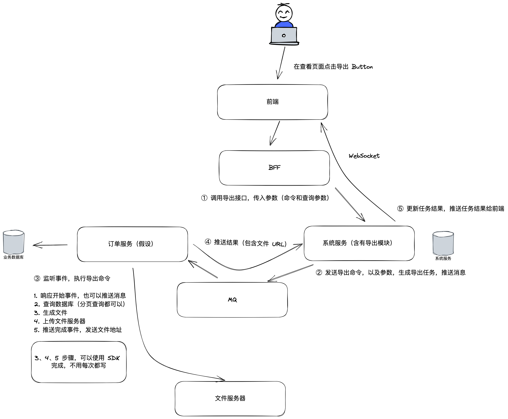

在项目上我们经常会遇到一些导入导出的场景，常见的有 Excel 的导入导出，以及 PDF 的导出。

这一期的技术方案总结一下相关的技术方案和实现。

## Excel 的导出和导入

我们先放开脑洞枚举一下有哪些导入导出的方案。

Excel 的导出方案有：

1. 前端导出，直接在前端导出所有的数据，甚至后端可以复用分页的查询数据接口。
2. 由具体的领域微服务实现同步导出。
3. 由 BFF 通过领域微服务的接口实现同步导出。
4. 由单独的导出微服务实现导出 API，并通过事件传递到领域微服务，实现异步导出。
5. 由具体的领域微服务实现同步导出，但是可以将其上传到文件服务服务器，并异步下载。

以前来说方案 1 是一个脑洞，不过在浏览器发展到今天，SheetJS、xlsx-style 等开源项目完全能实现相关需求。由前端来处理数据并导出可以分散服务器压力到客户端，并且实现成本更低。在条件满足的情况下，可以考虑直接使用方案 1。

方案 3 的缺点是如果让 BFF 来处理导出的工作会破坏领域服务的端到端交付能力，业务不够内聚，团队工作划分问题也不太好处理；方案 5 会将问题变得复杂，并且没有带来收益。

所以如果方案 1 不满足的情况下，我们许多项目不需要异步导出的场景下直接使用方案 3；而在有异步导出需求的情况下使用方案 5。

类似地同样的，Excel 的导入方案有下面几个，不过会有一点点差异：

1. 前端导入，通过前端解析 Excel 并通过批量新增接口传送到后端。
2. 由具体的领域微服务实现同步导入，领域微服务直接解析导入的文件。
3. 由 BFF 解析文件后，再调用后端的领域微服务，批量插入或者更新数据。
4. 由单独的导入微服务实现导入 API，负责处理文件，并通过事件传递到领域微服务，实现异步导入。
5. 前端先把文件上传到文件服务器，获取到文件 ID 后，通过文件 ID 直接和领域微服务交互实现导入。

导入方案对于导出方案来说会有一点不同，导入的附件数据往往有时候需要在服务之间、外部系统之间传递，所以即使是同步导入我们也可能会考虑先把文件上传到资源服务器，再由前端把文件 ID 发送到需要的领域服务处理后续业务，这样更容易处理附件，即方案 5。

而对于异步导入来说，推荐方案 4，通过事件的方式由单独的微服务来处理导入问题（往往是一个单独的导入导出微服务，或者是通用的基础服务实现），甚至可以实现进度条功能（HTTP 协议允许不断往客户端发送进度信息，不过很多时候会做一个假的进度条）。

异步导入导出方案可以参考下图：

 

## PDF 导出

对于 PDF 导入导出来说，PDF 导入识别的场景比较少，而 PDF 导出的场景非常多。

往往有几种思路： 

1. 直接使用前端的 PDF 库，可以通过绘图的方式生成 PDF，也可以将 HTML 文档渲染成为 PDF。
2. 使用 Java 的 Apache poi 等项目在后端实现。
3. 使用一个单独的服务来实现，例如使用无头浏览器 Puppeteer 做浏览器页面快照。

这三种方案各有适合的场景：

1. 方案 1 适合一些简单的场景，复杂的场景非常容易让浏览器崩溃（Crash）。
2. 方案 2 适合单据生成，可以使用一些模板文件生成 PDF，这类 PDF 布局往往比较简单。缺点是排版上没有那么灵活，开发起来也不太方便，往往后端开发人员不熟悉界面开发相关的技巧。
3. 方案 3 可以做到不对业务造成侵入，适合一些复杂的排版、页面渲染场景，缺点是资源消耗大和性能比较差，毕竟启动和运行浏览器的开销比较大。

整体来说如果是业务系统尽量采用方案 2，在用户体验、性能开销、维护性上比较中庸，但相对保守；从开发成本上来说，其余两个方案优势明显，近年来越来越多的项目开始采用统一的 PDF 生成服务为众多的场景提供 PDF 生成能力。

## 参考资料 

[1] Generate a PDF with JavaScript https://medium.com/coderbyte/generate-a-pdf-with-javascript-3e53ca7b47e

[2] https://github.com/parallax/jsPDF

[3] Webinar http://shaogefenhao.com/libs/webinar-notes/java-solution-webinar-8.html
