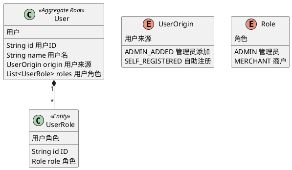
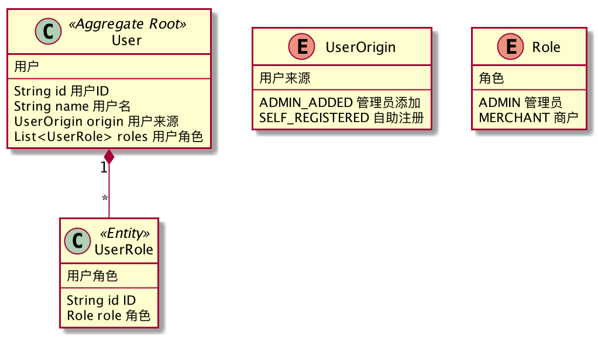
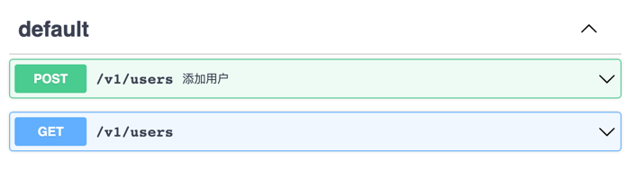
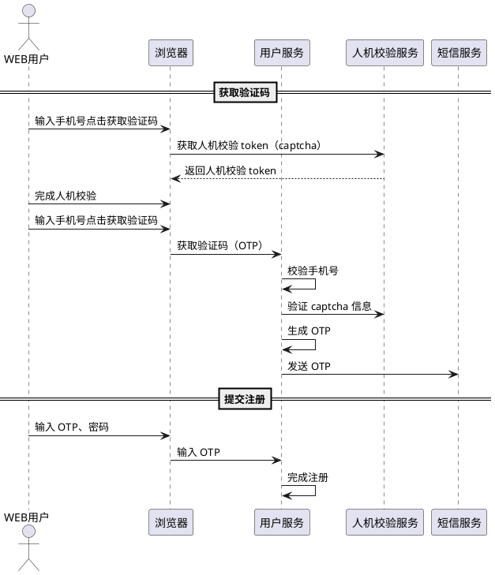
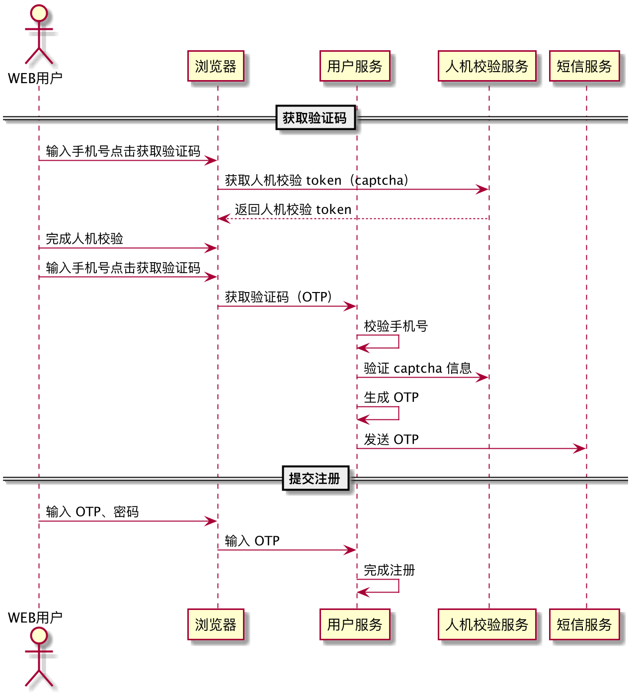

我们在《系统设计 | 如何表达技术架构？（规划篇）》中讨论了一个新的项目启动时如何表达技术架构，类似的我们还需要在敏捷项目的迭代前进行更细致的技术方案设计。

进入迭代的技术方案可以类比为瀑布模型中的详细设计，其目的是为了能让迭代中的具体开发工作能顺利进行。

本文，整理了一些日常项目上进入迭代前的技术方案输出物。

## 迭代技术方案的逻辑

迭代技术方案和规划类的技术方案不同，为了让迭代交付更顺利，它有一些更具体的要求。

1. 区分设计态和完成态：设计态文档用完即丢，完成态尽量使用**活文档**作为交付文档，通过代码即文档的思想表达业务含义，以下说的设计文档均为设计态。 
2. 准确性：技术设计文档应该严谨，可以直接方案的定义的结果，其服务名、表名、字段名应该谨慎斟酌，为后期团队沟通带来便利。 
3. 文本化：采用容易版本管理的形式存放，因为是技术文档所以不用考虑业务人员的使用，一般都会放到代码仓库。 
4. 形式化：尽量使用标准的形式语言描述，可以容易使用它做代码生成和其它自动化的用途。 
5. 可被反合：利用形式化的便利，将其解析能对比设计和实现的差异。 
6. 做够用的设计：只做关键设计，不做事无巨细的设计。

## 挑选一些模型承载设计

编程的本质是对业务形式化，相比直接使用非形式化的文档，使用形式化的模型承载技术方案可以精确的完成这一转换。

在够用的设计这部分，我参考以往的团队实践，一般包含如下内容，并找了一些模型承载其实现：

- 领域模型设计：输出为精确的类图，通过 PlantUML 表达，至少包含类、属性、名称和枚举值。
- 数据库设计：输出物为数据库 DDL 语句。
- API 设计：输出物为 OpenAPI 或其他 DSL，至少包括名称、路径、HTTP Method。
- 交互流程：输出物为 PlantUML，通过时序图表达。
- 技术调研的 Demo：无固定的输出物，推荐使用 Markdown。
- 外部系统文档：在线协作的表格，用于系统之间共同商定契约，或者使用 Markdown。

根据这些输出物的特点我们会发现，技术方案的主要做一些**定义**，这样团队成员拿到后可以顺利并行工作，然后再集成。

## 领域模型 PlantUML

我问过很多人一个问题：什么是领域模型？ 很多人的回答模棱两可，甚至有些会非常玄。

根据逻辑指导实践的原则，我对领域模型的定义为： 

> 用于表达领域实体概念的模型叫做领域模型，一般表现形式为类图。

UML 非常适合表达领域模型，而在众多 UML 工具中 PlantUML 非常适合作为迭代技术方案的设计工具。

- 它是文本化的，容易被版本管理。
- 它是形式化的，可以精确表达必要信息。
- 它可以方便的渲染为图形，同时也方便被解析做后续处理。

在很多时候有必要将 UML 的用途拆分开，在战略设计中，我们不会精细到字段，更关注**模型和模型的关系。**
而在迭代技术方案中（战术设计）我们更关注字段、属性等信息，所以这两种模型是不同的。

在迭代技术方案中，我们对领域模型图的产出要求有： 

- 英文优先，中文可选：避免进入迭代后未经评审的英文翻译造成歧义。
- 全量字段信息和成员变量：可以直接转换为 Java 代码。
- 准确使用和定义枚举及枚举选项：枚举值可以进一步作为前后端契约。

下面是一个 PlantUML 版本领域模型的例子。

代码：



渲染图：



## 数据库模型 SQL

如果有了领域模型图来表达实体之间的关系，就不需要数据库库模型来承担这部分职责。

在技术方案中，只体现单表的 DDL 即可。

我们可以通过一些约定让领域模型和数据库模型之间的关系更清晰。

- 聚合根、实体在需要存储的情况下一一对应为数据库表。
- 实体命名需要使用聚合根作为前缀，实体对应的数据库表中需要有聚合根主键作为外键。
- 值对象可以通过 JSON 存储到实体上，或者将其展开放到实体上。

注：以上只是一种约定，根据实际项目取舍和选择。

这样在技术方案中不再需要传统的 E-R 图了，直接输出可以使用 DDL 即可。

DDL 输出要求：

- 包含表名、表注释、字符集。
- 包含字段列名称、列注释、数据类型、长度、是否必填等要素。
- 包含主键、审计字段(created_by、created_time、updated_by、updated_time)
- 包含乐观锁、软删除字段（version、deleted）

由于没有必要提前进行性能优化考虑，可以在后期补充索引定义。

下面是一份 DDL 例子：

```sql
CREATE TABLE `demo`.`user` {
    `id` VARCHAR(64) NOT NULL COMMENT '用户ID',
    `name` VARCHAR(64) NOT NULL COMMENT '用户名',
    ...
    --  审计字段
    `createdupdated_by` VARCHAR(64) NOT NULL COMMENT '创建人',
    `created_time` DATETIME NOT NULLL DEFAULT CURRENT_TIMESTAMP COMMENT '创建时间',
    `updated_by` VARCHAR(64) NOT NULL COMMENT '更新人',
    `updated_time` DATETIME NOT NULLL DEFAULT CURRENT_TIMESTAMP
	`onupdate` CURRENT_TIMESTAMP COMMENT '更新时间',
    PRIMARY KEY(`id`)
} ENGINE=Innodb DEFAULT CHARSET=utfmb4 COLLLATE=utfmb4_bin COMMENT='用户';
```

## API 模型 OpenAPI

设计态的 API 可以使用 Swagger 的 OpenAPI 格式描述，这样可以用来生成 Controller 等样板代码。

OpenAPI 输出要求： PATH 路径、描述和 HTTP Method，请求体、返回体、错误码可能在技术方案阶段很难罗列完所有的字段，可以在实现时参考领域模型的字段风格实现，可以不用做过多的设计。

API 模型在方案设计中主要为了决定服务端提供多少个**用例**，把用例描述清楚就能把握 API 设计的基线要求。

下面是一份 OpenAPI 例子。

代码：

```yaml
openapi: 3.0.3
info:
  title: 用户
  version: "1"
paths:
  /v1/users:
    post:
      summary: 添加用户
    get:
      summary: 查询用户
```

渲染图：



## 流程模型 Sequence

描述关键流程在技术方案中不是完全必须的，因为有些场景下流程并不难以理解。

流程模型推荐使用时序图，时序图和流程图的差异在于精确性，流程图的缺点是。

所以时序图的要求有：

- 每个参与者必须是准确的，在微服务的项目中，建议以服务作为时序图的颗粒度来绘制。
- 明确调用关系，澄清同步、异步调用。
- 可以省略服务背后的基础设施，例如 Redis、DB，以接口的颗粒度表达时序。

下面是一份时序图的例子。

代码：



渲染图：



## 文档工具 Markdown 等

部分技术方案不能使用上述的模型来描述，或者需要补充一些描述性说明。

我们可以使用标记语言来作为文档工具和输出物。

因为尽量需要放到版本管理中管理设计文档，可以考虑使用 Markdown 等标记语言来写作，可以在维护成本较低的情况下也能获得不错的排版效果。

除了 Markdown 之外还有一些不错的工具： 

- Adoc：Adoc 的语法比 Markdown 更多，更加利于多章节管理，适合写小册子和书，对排版更加友好。
- reStructuredText: 使用 reStructuredText 的原因是可以使用 Sphinx，有很多开源软件的文档都是使用的 Sphinx 来编写的，和 Adoc 类似，Sphinx 可以方便生成电子书形态的文档，并支持多种输出格式。

这两个标记语言带来了更多特性当然也变得更加复杂。

## 关于代码生成器

使用文本格式、形式化模式表达技术方案的好处之一就是可以应用于后续的代码生成器上来。

虽然代码生成器的潮流早已经过去，但是它还是有很多方便之处。

1. 可以简化样板代码的工作量。 
2. 可以让整个团队写出的代码骨架保持一致。

#1 虽然在 AI 编程工具的加持下已经聊胜于无，但是 #2 带来的隐形福利则非常有益。

由于 AI 生成的内容具有不确定性和随机性，通过代码生成器作为脚手架非常适合迭代前期的准备工作，即使它不能很完美的解决所有问题，但是能解决 80% 的重复代码生成。

代码生成器另外一个问题是如何保持更新？

一方面在使用代码生成器之前，我们就不要对生成的代码有自动更新的期待，它只是做好初始化的工作就好了。（尤其是所谓整洁架构+DDD+微服务的项目，一套 CRUD 需要初始化几十个文件，没有代码生成器效率非常低）。

另一方面，也可以在架构上做一些牺牲，将模型代码和逻辑代码分离。

1. 将领域模型、PO 等可以通过模型生成的代码单独隔离出来，放弃充血的理念，将业务逻辑写在引用模型的服务中。
2. 将 Controller 和 AppService 分离，Controller 只通过 OpenAPI 来生成，这样只需要维护 OpenAPI 即可。

## 关于完成态的活文档

在软件工程中理解设计态和完成态的文档分离的过程，是架构师和自己和解的过程。

我们必须要承认，完美和代码映射的文档是不存在的，即使有也需要巨大的成本去维护。 在一线工作过的程序员都应该能理解这个观点，除非是"十指不沾阳春水"的领导。

在迭代前的设计文档是为了表达、评审和传递技术方案、设计意图。

一旦开发完成，迭代前的文档基本上就没有用了。 Martin Flower 一派的论调常常反对文档的由来之一，不过这是从一个极端走向另外一个极端。

西里尔·马特雷尔在《活文档：与代码共同演进》一书中提出，要从代码中提取出文档，并称其为"活文档"。

软件工程虽然经常被类比为建筑，但是软件更像是写作工程，软件是由几十上百人一起编写的庞大系列图书。

完成的代码本身就是文档，而我们需要的文档是从这部巨著中提取出来的部分实现模型，用来帮助人们理解整个系统。

所以我们的活文档其实就是讲解如何将代码再次转换为模型，而这些过程都可以自动生成。

- 领域模型：从实现代码中提取 UML 类图。
- API：根据注解生成的 Swagger 文件。
- 交互流程：通过 APM 工具分析出的调用链，可以轻松转换为时序图。
- 数据库模型：从数据库提取出 DDL。

对活文档进一步理解是：IT 系统对业务人员透明化。

例如，对于一个财务系统来说，可以将计算公式、业务规则、枚举值、参数表都提取出来，除了 Java 代码无法展示出来之外，其余内容都可以在界面上保留给运维、业务人员帮助他们理解整个系统。

## 总结

迭代方案的本质还是模型，从模型进入迭代，实现代码后又生成模型帮助后续的开发者理解整个系统，如果需要进一步理解系统的细节，代码才是最准确的信息源。

做到这一点就必须对技术方案严肃对待，通过形式化的途径表达设计意图，做到用词精确，才能最大程度通过代码本身解释业务逻辑。

## 参考资料

[1] Plant UML https://www.plantuml.com/

[2] Open API 规范 https://swagger.io/specification/

[3] Markdown https://www.markdownguide.org/

[4] Online DDL Operations https://dev.mysql.com/doc/refman/8.0/en/innodb-online-ddl-operations.html

[5] https://asciidoc.org/

[6] https://docutils.sourceforge.io/rst.html
