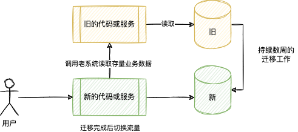

在当前的环境下，为新业务设计系统的场景非常少了，很多系统开发工作都需要对原有系统进行迁移和切换。

不得不说，系统切换和迁移的难度有时候比新开发还大。这一期，我基于研讨会总结的内容，整理了一些迁系统迁移和切换的经验和模式。

## 问题和挑战

为了避免空谈，我们根据经验整理一些常见的场景，并以此分开讨论：

1. 某企业开发了一套新的办公（OA）系统，需要将原有的审批信息迁移到新的办公系统。
2. 某大型通信设备制造企业，拥有上万个售后网点，他们需要对售后系统进行升级，但是该系统和数十个内部系统（供应链、官网、小程序）耦合，如何完成切换？
3. 某国内企业，根据国家监管要求，需要将加密算法换成国密，如何实现替换。
4. 某创业工作开发了一款社交 APP，该 APP 在此前使用自己构建的存储服务存储用户图片等资料，现需要将其切换到 AWS 的对象存储上，改如何设计？
5. 某团队持续维护了一套保单系统，但是该系统采用的技术栈过于陈旧难以维护，IT 团队的负责人希望进行技术改造以适应未来的用户需求？
6. 某团队采购了一套现有的项目管理软件，随着开发人员规模越来越大，团队越来越多，CTO 希望将其替换为自研的平台，并和其它工具链平台打通。
7. ……

无论是对应用的局部重构，还是重写，都属于遗留系统改造的范畴，而遗留系统改造和重构往往都依赖数据迁移和应用切换。

我将这些场景进行归纳分类，这些分类按照对用户和业务的影响依次扩大，以适应后续总结的模式：

1. 局部重构：以类、模块为颗粒度的修改，往往对用户无感知，实现对一些局部代码的重构。例如场景 #3。
2. 组件升级：以服务或者基础设施为颗粒度的修改，实现部分组件级的无感替换。例如场景 #4。
3. 系统重写：将单个系统或者产品重写，并将数据迁移到新的系统，或者两个系统共存。例如场景 #1、#2、#5。
4. 平台迁移：对整套产品的所有系统重新开发，并最终完成切换。例如场景 #5、#6。

不同的场景我们需要根据实际情况制定合适的策略，保证迁移可靠、安全。

## 系统设计要点

对于遗留系统设计来说，代码升级并不困难。比较困难的地方在于对数据的处理上，包括存储的数据和流动的数据。

- 存储的数据：数据库、文件、消息中间件中的消息等。
- 流动的数据：用户请求、外部系统、定时任务、报表统计任务等。

因为程序本身可以做到无状态，在测试的保护下进行重构难度并不高。 而有状态的数据处理则更具有挑战，也是改造和迁移工作的突破口。

另外，对于考虑停机时间对方案和迁移模式差异比较大，这里将影响进行分级：

- 完全无感：对用户完全无感，且平滑上线，服务分批部署，无需停机上线。
- 分钟级停机：仅在部署时停机，需要先将旧系统停止服务，用户感知到几十分钟内的服务不可用。
- 小时级停机：长时间停机用于数据迁移，需要将旧系统停止服务，期间进行数据迁移工作，用户感知到数小时或者数天的服务不可用。

## 常见模式

基于数据出发整理了一些改造和迁移模式。

假设我们需要对一套新的系统或者系统中部分模块进行改造。新的应用程序需要使用新的数据库结构和存储，数据迁移过程需要持续数天或者数周。

### 模式 1：数据共享

在数据共享的模式中，可以将用户流量切换到新的系统，允许新的系统读取旧系统的数据库实现兼容存量数据，从而实现对用户无感知和平缓迁移。完成迁移工作后，移除新的系统中对存量数据的兼容代码。

优点：

- 实现比较简单，无需数据同步机制。
- 通常来说新的代码添加兼容代码更加容易。
- 无需停机，对用户完全无感。

缺点：

- 迁移期数据存在两个地方，对于统计类需求无法实现。
- 系统同事依赖两套基础设施，可靠性降低。

### 模式 2：代理分流

在数据共享的模式中，可以将用户流量切换到新的系统，允许新的系统调用旧系统的 API 实现兼容存量数据，从而实现对用户无感知和平缓迁移。完成迁移工作后，移除新的系统中对存量数据的兼容代码。

优点：

- 无需侵入数据库，条件允许下，可以减少兼容代码。
- 其它和共享数据同样的优点。

缺点：

- 部分功能可能无法实现。
- 其它和共享数据同样的缺点。

### 模式 3：数据双写

在数据双写模式下，提前将数据写入新的系统，并开始迁移，这样在迁移工作完成时新系统也有全量数据，再进行流量切换。

优点：

- 实现比较简单，无需数据同步机制。
- 安全，在数据未准备好前，不进行流量切换。
- 无需停机，对用户完全无感。

缺点：

- 双写数据可能会失败，但是可以被迁移工作补偿。
- 迁移期双写会拖慢旧系统的性能。

衍生模式：去掉数据双写，可以将本模式降级为分钟级停机。

### 模式 4：同步

在同步模式下，将旧系统数据库迁移并开启实时同步到新系统，数据迁移完成后，切换流量到新系统。

优点：

- 异步数据交换对性能无影响。
- 安全，在数据未准备好前，不进行数据迁移。
- 无需停机，对用户完全无感。
- 为后续灰度和共存模式提供基础。

缺点：

- 需数据同步机制，实现成本更大。

衍生模式：去掉同步，可以将本模式降级为分钟级停机。

### 模式 5：停机迁移

在停机迁移模式下，停止服务，完成数据迁移后上线新的服务。

优点：

- 无需额外的双写、同步机制。
- 无需迁移过渡期。
- 可完成其它迁移动作，例如和外部系统一起切换。

缺点：

- 对用户有感知，较长时间影响用户使用。

### 模式 6：灰度和共存

在灰度和共存模式下，允许用户同时使用新旧系统，这样可以进行灰度测试和试点。旧系统的数据会被同步到新系统（甚至可以把新系统的数据同步回去），为了避免两套系统的数据冲突，可以通过对同步的数据只读处理。

优点：

- 用户无感，且能同时使用新旧系统完成业务。
- 可以实现用户试点，进行灰度测试。
- 对性能没有影响。

缺点：

- 复杂，需要建设同步机制，还需要对同步回来的数据做限制和约束，否则会出现逻辑错误。

## 后续讨论内容

遗留系统改造有一些注意事项，放到后续文章中讨论：

1. 新的逻辑对旧数据的兼容性，或者将旧数据进行转换为合适的格式？
2. 如何验证所有数据和场景？
3. 新旧版本或者多个团队如何协作？
4. 并存期如何安全度过？
5. 是否支持试点和灰度？
6. 如何可靠的切换数据？
7. 是否支持回退预案？

## 参考资料

[1] https://martinfowler.com/articles/patterns-legacy-displacement/

[2] https://www.infoq.cn/article/cebfobzp21aqv4eaydeq

[3] https://www.aliyun.com/product/dts 

