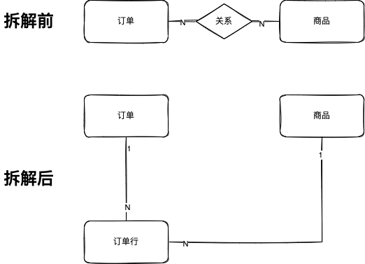
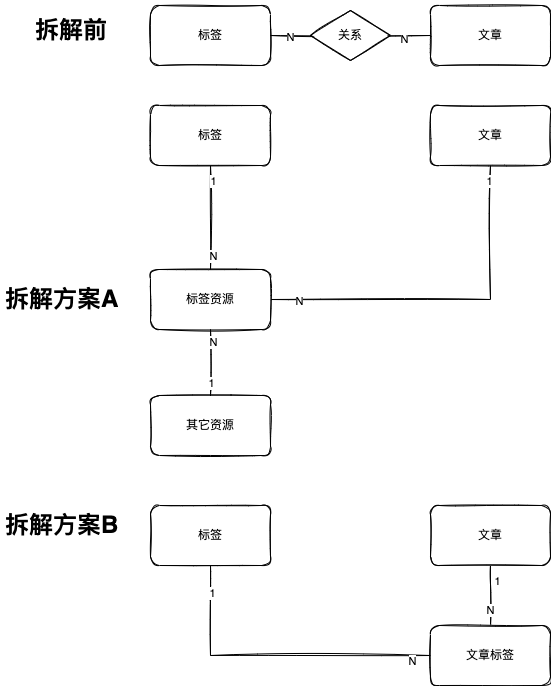
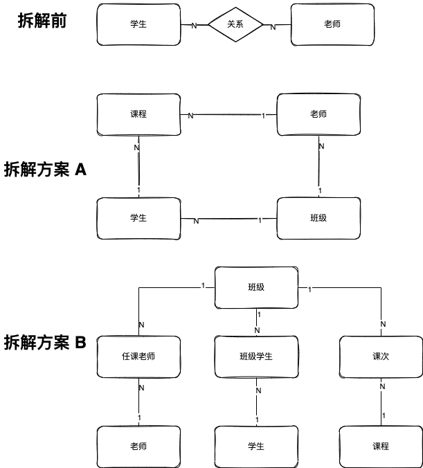
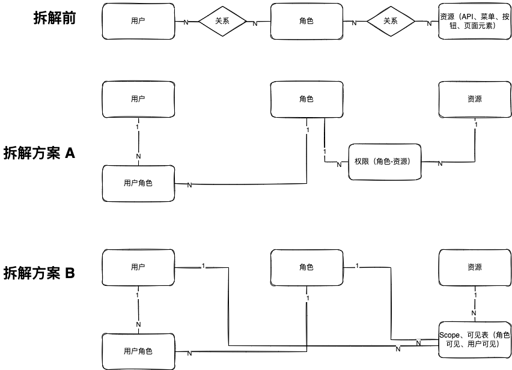
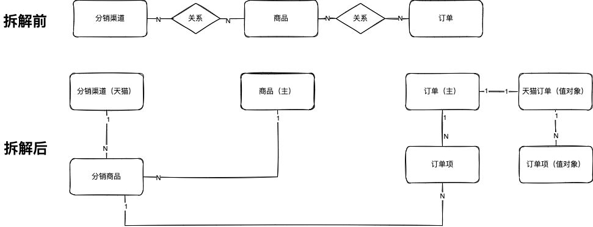
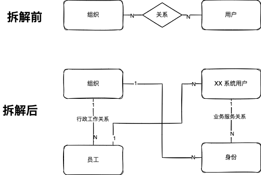

一般来说，有经验的程序员不会使用多对多关系。因为存在"多对多关系"说明领域模型在设计时丢失了一些重要概念，无法建立清晰的模型。

这篇文章整理了一些多对多关系拆解的案例，作为日常领域模型设计的参考资料。

为了让图更简洁，本文使用 E-R 图作为分析模式来描述，在实际工作中可以转换为类图。

## 订单和商品

订单和商品是最常见的多对多关系，一个订单中可以有多个产品构成的订单行，而商品可以被多个订单使用。

如果我们认为这是一个多对多关系，在项目中会遇到不少麻烦，因为多对多关系丢失了一个订单行或者叫做订单项的概念，并且通常来说不是商品的引用，而是商品的快照。

商品的变化通常不会导致订单的变化。

## 群和用户

群和用户也是一个常见的例子，很容易丢失群成员的概念。增加群成员后，对象的生命周期管理会变得更简单。

群和用户的"关系"归属于群，这样在权限控制、API 设计上都会变得清晰、简洁。

另外，如果没有成员的概念，某些业务会无法实现。比如记录成员加入群的时间、在群中的昵称等信息。

## 标签和文章

在文章或者 CMS 系统中，一个标签可能关联多个文章，一篇文章可能使用多个标签。

对于这个场景可能会有两种拆解方案：

- 拆解方案 A：将关系设计为标签项，纳入标签管理。
- 拆解方案 B：将关系设计为文章标签，纳入文章管理。

这两种方案各有优缺点。

如果业务上希望标签也为其它资源使用，方案 A 就非常自然，甚至可以设计一个标签服务为各种资源实现标签索引能力。这种模型，有一点像搜索引擎的倒排索引。

但是方案 A 的成本非常高，如果没有对不同资源打标签的场景，可以使用方案 B，简单的归属到文章上即可，甚至可以序列化为 JSON 作为文章的一个属性存在。

## 学生和老师

在教务系统中，一名学生可以选择多名老师的课程，一名老师可以教授多门课，因此学生和老师的关系是多对多。

使用多对多描述学生和老师的关系是非常朴素的观念，中间往往缺了非常多模型，我们可以逐步拆解出来。

首先，在方案 A 中，学生和老师的关系被课程、班级取代。如果需要提取一个公共的课程概念，并多次开设，可以叫做班次。同理，在籍学生每年进入的班级都不同，那么学生应该进入多个班级，因此模型演化为方案 B。

## 用户、角色和资源

用户、角色构成了常见的 RBAC 模型，除此之外往往还需要抽象一个资源，避免将权限直接和 API 等具体资源绑定，所以它们看起来构成了多对多关系。

用户和角色的多对多关系可以拆解为用户角色，用户角色是某个用户拥有的角色。

某个角色能访问的资源可以设计为权限，类似于 ACL 访问控制列表，这样就能将所有多对多关系拆解完成。

对于权限来说，还有一种设计方案 B，可以将访问控制信息放到资源上，这样就看起来非常类似于 ABAC。

## 分销渠道和商品

对于一些分销系统或者供应链系统，对于不同渠道商可能需要维护自己的商品构成多对多关系，这样它的概念就和系统中全局的商品不一致了。

可以将其拆解为分销商品。类似的，订单也可能有分销商自己的属性和逻辑，可以设计一些拓展点。

## 组织和用户

在大型系统中，组织和用户往往具有多对多关系，但是这个关系没有这么简单。

在组织中承担行政工作关系的往往叫做员工，作为员工在某个应用系统中的身份可能和组织中的行政关系不一致，所以需要设计一个身份的概念。

这种拆解方式在 CRM 系统中比较常见。

## 总结

多对多关系往往是一个信号，意味着有隐藏的模型没有被提取，或者说找不到一个好的名字来描述隐藏的模型。

一般来说，添加一个隐藏模型即可拆解多对多关系。在某些时候，中间多对多关系可能被拆解出多个隐藏模型。

更为复杂的情况是，如何将拆解出来的隐藏模型找到合适的归属，这样才能在微服务划分时候，确定其明确的边界。

多对多关系往往是一把系统设计的钥匙，帮助我们找到更多隐藏的模型。
