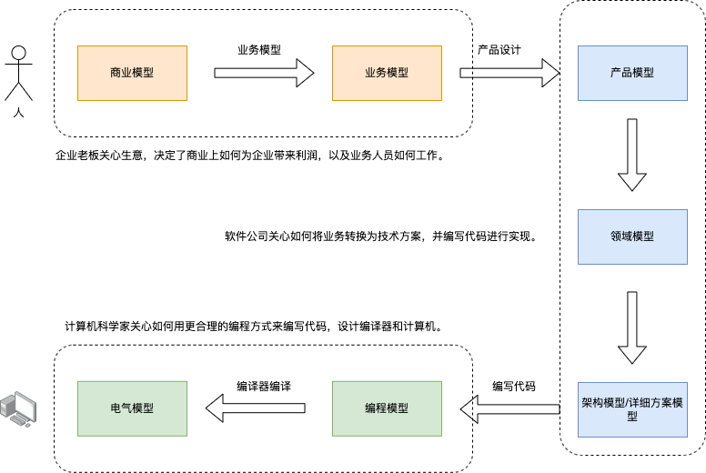
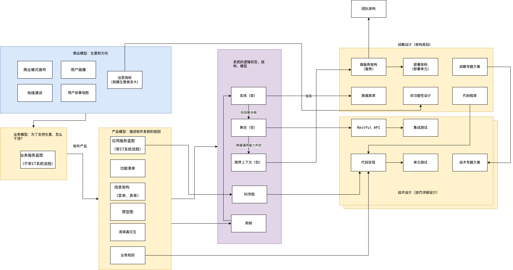

经历了大大小小几十个软件系统的设计和开发，我总结了一些规律和逻辑。这里使用当下非常流行的第一性原理来描述软件系统设计的逻辑：

- 如何产生易于维护和高质量的软件？答案：做好技术方案详细设计。
- 如何做好技术方案详细设计？答案：对软件系统进行充分的规划和建模。
- 如何充分的规划技术方案？答案：基于领域模型和技术指标进行设计。
- 如何获得领域模型？答案：基于业务模型。
- 如何获得高质量的业务模型？答案：基于业务背后的商业目标。

我发现关注系统设计的软件工程师，不能仅仅像大学所教的那样，只关心数据和技术。而需要从商业出发，理解系统背后的"生意"，梳理支撑商业的业务流程，并提取领域模型，从而指导技术方案。

软件行业一直都在寻找一套系统设计的推导方法，甚至希望能通过一套自动化的方法，通过业务人员简单的配置就能生成软件。不过，这个理想并不是那么容易实现。

原因是业务需求和可以被计算机执行的代码之间有一道巨大的鸿沟，这个鸿沟就是**形式化**。

业务人员通常在描述需求时，使用的是自然语言（Natural Language），也就是人类讲的语言，它是自然人类发展中自然形成的，比如汉语、英语。

这类语言不是经过特别设计的，而是通过自然进化的。它的特点是语法规则只是一种规律，并非需要严格遵守的规则，这种语言含有大量的推测，以及对话者本身的认知背景（比如东西方不同的文化背景形成了大量的哩语）。认知背景赋予了词汇、概念的不同含义，比如，豆腐脑这个词，不说东西方差异，就是国内南北都会有争议。

著名的白马非马争论在于自然语言的不确定性：

- 从概念上说，白马这个概念不是马这个概念，所以白马非马。

- 从谓词（“是” 这个谓词）逻辑来说，白马这个概念代表的事物集合属于马这个概念代表的事物集合。所以白马是马（白马属于马，但是白马这个概念不是马这个概念）。

而让计算机执行特定任务需要的语言是形式语言，这种语言就像数学公式一样精确，这样计算机才能正常工作。当然在 AI 的时代，计算机也开始能听懂自然语言了，但一般来说编程语言都是形式化的。

软件工程师就是一个对现实业务形式化的工作岗位，将需求这种自然语言转变为代码这种形式语言。正因为如此，需求和沟通的矛盾不可能避免，除非提出需求的人也是用形式语言，那么软件工程师的价值也就没有了。

在多年以前，计算机科学家们认为编写 Java 代码的人不算程序员，可以由业务人员直接编写业务软件。就像 Javascript 被认为是给 UI 设计师使用的一样，Java 被设计出来是给业务人员用的，因为 Java 不在需要关心太多计算机底层的细节，而关注点都业务逻辑上。 在 Java 被金融公司的交易员采纳的早期，确实由业务人员自己编写代码，实现业务。

大量的 Java 程序员还没有失业，说明各行各业的领域专家想要掌握形式化的编程语言并不容易，即便人们重新拿出了低代码、无代码等概念，依然难以消除非形式化的业务逻辑到计算机程序这道鸿沟。

## 模型思维：系统设计就是模型的转换

为了完成非形式化到形式化的转换并不容易，好在我们有模型。

模型这个词常常会听到，通常出出现在某个 PPT 或者一篇商业评论中，社会和经济学中的模型往往比较朴素，金字塔、V 型图、四象限会以各种形式出现在不同场合中；软件工程师的模型会更加形式化，UML、E-R 图等，能用较为精确的形式语言描述；数学模型就更加精确，马尔可夫、蒙特卡洛等模型可以用数学语言描述。

维基百科将广义的模型定义为：“用一个较为简单的东西来代表另一个东西，这个简单的东西被叫做模型。”

人们天生就有用简单的东西代表另外一个东西的能力，比如幼儿园数数用的竹签，学习物理时的刚体、真空中的球形鸡，都是模型。通俗来说模型就是经验的抽象集合，平时听到的谚语、公式、定理本质上都是一种模型。

为了理解模型，斯科特·佩奇在 《模型思维》一书中给出了模型的几个特征：

- 模型是简化的。 正是因为我要认识的事物非常复杂，因此需要通过简化找出最一般的规律，才能一语中的。“天圆地方”学说就是最简单的古人认识世界的模型之一；毛主席的”阶级划分论“ 简单、直接的指出旧中国的社会状态。

- 模型是逻辑的。 例如用金字塔原理描述社会阶层，每层的定义是明确的而非模糊的，数学模型能用数学符号系统和公式描述，模型中的元素能用一种逻辑关系做到自洽。

- 模型是错误的。 因为模型是一种抽象，所有的模型都是错误的，只能在一个方面反映事物的特征。场景变了，模型就需要修正，连牛顿、爱因斯坦的定律都没能逃脱这个规律。好的模型能在尽可能简单的情况下较好的拟合事物，完全匹配现实的模型就不再满足简化特征了。

为了建立和利用模型，模型思考有几个层次：

- 数据。 我能直接观察到的现实情况，比如下雨了，并且雨下的很大。
- 信息。 信息需要从观察到的情况中采样，转换成具体的的数字，比如某个地区某年的降雨量。
- 知识。 知识是面对信息的处理方式，比如我利用信息，将信息中的一般规律找出来，建立模型。比如某地区降雨量和年度呈现一定相关性，建立一个周期性降雨模型。
- 智慧。 面对不同情况需要使用不同的模型和修正模型的能力，并能用它指导实践，比如根据周期性降雨模型修建水利设施。

在斯科特·佩奇在《模型思维》一书中，使用了一张形象的图例，如图所示：

我们可以尝试用这种方式来看待原本很困难的知识，比如去简化复杂问题，并理解它。通过模型思维来看待软件开发，我们会发现，软件从设计到开发的过程就是各种模型的转换。

商业模型是企业老板关心的，现实中商业是复杂的，但其逻辑却又非常简单。例如食材配送的商业模式就非常简单，为企业配送食材，赚取食材销售的利润。

而为了实现商业模型，需要搭建业务团队，让业务人员做合适的事情来完成商业目标，这就是业务模型。在很多公司，甚至会有专门的人来优化企业流程和分工，以实现工作流程的最大化。

软件公司为了把这些业务搬到软件中，产品经理需要设计软件产品，他们通过规划软件的菜单、界面和交互方式，可以将这些工作看作软件的产品模型设计。

对于软件工程师来说，需要考虑产品模型中的业务概念，将其提炼为所在领域的模型，并产出架构和详细设计的方案。例如，对于携程来说，机票、酒店属于不同的业务概念，但在软件系统中可能需要抽象出订单等概念，来承载软件系统中的业务逻辑，并规划出需要多少个服务、绘制 API 调用的时序图等，这些都可以看作系统设计中的模型。

当程序员编写出代码后，剩下的就交给编译器了。计算机科学家关心的是，如何构建一套合适的编程模型，交给程序员更好地描述现实业务。

好在计算机科学家发明了各种各样的编程语言，也发明了函数式、面向对象这类编程范式，如果我们也可以将其看作模型。即使业务代码被编译成二进制，也需要计算机来完成计算。计算机的设计制造过程涉及了更多的模型，PCB 电路的绘制，芯片的设计，都离不开模型的呈现，否则人类无法处理如此之大的认知负担。

对于应用开发的软件工程师来说，核心的问题并非如何编写代码，而是如何将非形式化的业务输入（模型）进行合理抽象、设计，并转换为形式化的过程。 有意思的是，某种程度上来说，通过高级语言编写的代码也是一种模型，只不过转换为机器码可以被编译器自动完成。

好在，对于软件工程师来说，不必关心计算机是如何被制造出来的，在这里我希望更多地讨论普通应用软件设计过程所需要考虑的模型，也即是如何从商业分析到完成技术方案这个过程。

## 软件开发模型地图

结合多年的工作经验，将整套软件系统设计过程中用到的工具、输出物整理到下图：

这张图串联系了应用系统设计中的所有要素：

|模型的类型 |模型的承载物 |解决的问题
|---|---|---|
|商业模型 | 商业模式画布、用户故事地图、业务规模等 |描述商业逻辑
|业务模型 | 业务服务蓝图、业务流程图等 |描述现实业务过程
|产品模型 | 应用服务蓝图、功能清单、电梯演讲、信息架构、软件交互和 UI、变更需求等|描述软件形态
|领域模型 | 限界上下文、聚合、实体等|描述软件逻辑结构
|架构模型 | 非功能性需求、技术选型、C4 模型、代码框架和打样项目、技术规范等|描述软件技术规划
|详细设计模型 | 细化的领域模型、数据库模型、API 模型、专题方案（流程图、文档）等|描述软件详细设计

列表中的项目会在后面的内容中详细展开。由于对于应用系统设计来说，不太关心计算机科学家该操心的事情，而应该把注意力放到最容易被忽略的内容上。

这些模型有一个显著的特点，它揭示了一个规律：有时候我们认为是一个技术问题，其实可能是一个业务或者商业问题。

例如，一个多租户的系统，一名用户可以同时出现在多个租户下，那么该用户的信息由谁来维护？从管理上来说，虽然是同一个人，在不同租户下应该具有不同的身份，那么在现实和系统中就变得都合理了。

另外一个规律是，这张图左侧的元素对右侧的元素具有决定性的影响。这也是为什么软件工程师不喜欢需求变更。

商业模型的变化意味着生意变了，那么服务于商业模式的业务流程就会翻天覆地的变化，而相应的软件系统也需要调整才能满足需要。

这种改变有点像把一家消防站的楼在不推到重建的情况下改建为一家医院。如果把软件比喻成建筑的话，商业模式是这栋建筑的用途；而业务模式是用户怎么用；产品模型是站在设计师角度构建哪些功能；领域模型则是对建筑的构建作出定义，什么是梁、窗和构造柱；架构则是有哪些分区、大的功能组件；详细设计便是需要画到图纸上的技术细节。

在建设的过程中，除了外观的颜色和装饰物，其它的修改则都是“伤筋动骨”。系统设计的目标则是在一定设计周期内，将不确定的事情尽量定下来，减少开发成本和问题。

软件工程中总是有解决不完的矛盾，不做设计同过度设计、过早设计就是典型的矛盾。不做设计无法多人工作，无法计算出相对准确的工作量和成本；而过度设计、过早设计则设计准确性不高，无法敏捷地响应变化，毕竟很多时候也需要看到成效后才能对下一阶段作出准确的设计。

所以我常常会把系统设计分为：规划 + 详细设计两个部分，通常被叫做 1+N 开发模式，即一次规划，多次迭代。

规划是为了前期准备，去决定哪些不好改的事情，这个过程往往又被描述为架构设计。

详细设计是为了接下来的时间完成开发任务，在敏捷项目中，会在每个迭代前准备好详细设计方案，这样就能估算出工作量、设计好相应的方案，以便多人共同开发，为进度管理提供基本条件。