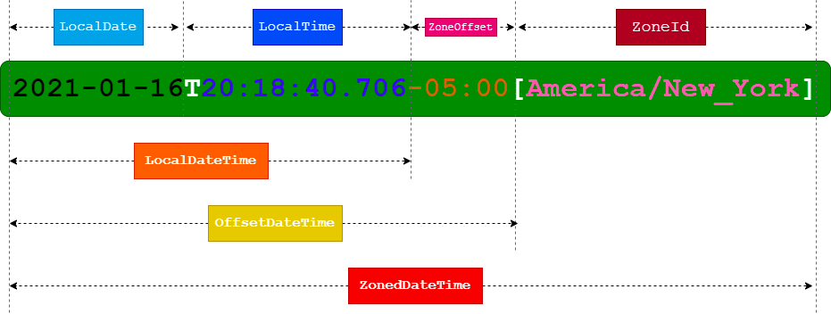

大部分程序员都会遇到过类似的 Bug：用户创建或者更新的数据在查询时偏移了 8 个小时。

我们有时候会在网上找一些文章，胡乱的配置后问题修复了，但是过一段时间后往往又会出现。

时间和时区的问题往往就像幽灵一样发生在程序员身上。

这一期的系统设计话题我们来盘点一下时间的问题，澄清相关的概念，以及相关的解决方案。

## 生活中的时间和时区

古人尸佼说，天地四方曰宇，往古来今曰宙，其中宙就是指的时间。

从古至今，时间都是一个非常重要的话题。 古人在观察月亮运行轨迹的时候，发现每一轮季节的交替，月亮会亏盈 12 次。于是他们定义了年、月、日、时。

- 年：四季交替一次
- 月：盈亏一次
- 日：日出日落一次
- 时：没有明显特征，于是参考 12 个月，将日继续划分为 12 份

古人称为四柱，每柱用天干地支两个字表示，所以达到古人的计时精度用八个字表示，这就是四柱八字的由来。

计时方法到日这个粒度世界各地几乎没有差异，但是日的精度不能满足生产生活需要，需要进一步划分。一种解释是按照一年中的月数，这样就有了12个时辰；另外一种解释是手的食指至小指之间地指骨个数，据说这是西方 24 小时制的起源，比较严谨的说法是 "古希腊天文学家，包括希巴谷和托勒密，定义太阳日的24分之一为时。"

时被分割为 60 分，分又被分割为 60 秒，六十进位制来自巴比伦，其原理是对圆的划分。精确定义分钟和秒钟是通过摆钟完成的，由于摆钟的振动频率主要取决其引用摆长，因此可以通过定义标准的摆长。在地球表面，一米的单摆一次摆动周期的时间大约一秒。

随着秒的定义，逐渐得到了 年、月、日、时、分、秒 6 个时间单位，其中秒是时间的标准单位。可以使用秒作为后置词表示不同精度的单位，例如分秒、厘秒、毫秒、微秒等。在国际单位制中，比秒长的时间也可以用秒定义，例如十秒、千秒，但不符合人们计时习惯，除了科学界基本不会使用。

总体来说，时间单位是一笔糊涂账，其中包含有 12/24  进制、60 进制、10 进制，以及不同地区的表示方法和历法。

由于比日小的单位是通过对日的划分，而世界各地人们对于日出日落感知并不相同，于是不得不考虑各个地区的需求，在同一套计时系统下，某些地区的 24:00 在中午，有些地区却在深夜。在农业社会影响不大，各地使用自己的计时系统，但是进入工业社会后跨时区交流变得频繁，迫切需要统一的计时系统。

1870 年代加拿大铁路工程师史丹佛·佛莱明首次提出世界按统一标准划分时区，1884 年华盛顿召开的子午线国际会议确立了世界标准时制度。

由于历史上格林威治皇家天文台以格林威治天文台子午仪中心的一条经线作为天文观测参考线并具有一定权威，子午线国际会议确定将会议将格林威治子午线设定为本初子午线，于是以格林威治平时 (GMT, Greenwich Mean Time) 作为世界标准时 UT（Universal Time）的参考。

国际上以子午线作为偏移作为理论时区的划分依据，每 15° 划分一个时区共 24 个时区。但是在实际操作中，按照理论时区的划分方法会切割国境线，导致同一个国家的被划分到不同时区带来不便，因此大多数国家使用国家行政线作为时区划分依据，大一点的国家可能会使用多个时区，这就是法定时区，即人为约定的时区。

虽然以 GMT 时区作为参考基线，UT 却不完全等同于 GMT 时间，现代世界标准时是 UTC（Coodinated Universal Time），为协调世界时。UTC 基于 GMT 并结合各国时间同步协调和原子钟精确测算得到的标准时间用于更高精度场景。在军事上，协调时间会使用 Z 作为代号，在无线电中使用 "Zulu" 作为呼号，所以协调世界时有时候被叫做 "Zulu time"。

不同的地区使用偏移量表示时区，例如我国采用的北京时间位于东八区，可以表示为 +08:00。也可以使用代号表示时区，但是代号不一定准确。例如 CST 可以视为中国、古巴的标准时间或美国、澳大利亚的中部时间。为了使用方便也可以使用地理位置名称作为时区，但是还是和法定时区对应。Asia/Chongqing 是重庆的时区代号，但是偏移量依然+8，属于北京时间。

为了更清晰地说明时间，接下来聊聊时间的标准表示法。

在 ISO 8601 （等效我国国标）标准中，规定了标准的日期字符串表示方法，时间表示法常用规则简叙如下：

- 年份: 为了规避千年虫问题，标准要求至少使用四位数来表示年份（YYYY），以公元为基线，可以使用正负号表示公元前后。
- 日期：日期的基本格式为"YYYYMMDD"，扩展格式为"YYYY-MM-DD"，表示21 世纪时可以省略前两位。也可以退化到表示月，格式为 "YYYY-MM"。日期也可以使用星期表示法，表示第几个星期的第几天，不过并不常用。
- 时间：基本格式为 "HH:mm:ss"，表达毫秒为 "HH:mm:ss.S"。
- 时区：UTC 偏移量用 "±\[hh]:\[mm]、±\[hh]\[mm]" 表示，直接跟在日期字符串后面，如果是 UTC 时间直接在时间字符串后面增加 "Z"。
- 每日开始：标准中约定，00:00:00 为一天的开始。
- 每日结束：标准中约定，24:00:00 为一天的结束。
- 日期和时间组合表示：合并表示时，要在时间前面加一大写字母T，例如 "2004-05-03T17:30:08+08:00"。
- 时间段表示：标准中还约定了表达时间段的方法，前面加一大写字母P，但时间段后都要加上相应的代表时间的大写字母。例如，表达贷款期限，5 年 6 个月可以用 P5Y6M。
- 其他时间表示方法： 标准中还约定了时间间隔表示方法、循环时间表示方法，这些表示方法冷门，需要时可以查阅相关文献。

## 计算机中的时间

前面把生活中时间聊明白了，但是在计算机中时间并没有这么简单。

由计算机的原理决定，将时间存储为字符串会非常不方便，其本身占用的空间大不说，时间对比、排序也非常麻烦。因此在 Unix 诞生的时候，使用了 32 位整数来表示时间，被成为 Unix 时间，也就是时间戳。

时间戳名称的来源是办公室使用的接收信件使用的印章，在计算机出现后，开始含义为为文件打上一个时间标签，因此称为时间戳，不过现在其含义演变为了一种计算机中的时间格式。

取 1970 的原因主要是为了照顾更早或者更后面的时间，这样在有限的范围内勉强足够使用。32 位 Unix 时间戳的范围最大到 2038 年，也就是 Unix 2038 bug。即使将表示时间的范围扩大到 64 位，在计算机中也是通过数字来表示的。

在编程的过程中，我们会经常获取系统的时间。在 Java 中，可以使用 System.currentTimeMillis()。

对于程序员来说，我们只需要调用操作系统 API 就可以获得时间，那么你是否想过操作系统的时间怎么来的了？如果是离线的服务器，还能保证自己的时间吗？

对于操作系统来说，往往时间来源有这么几个：

1. 硬件时间：由主板电池供电来维持运行，系统启动时读取这个时间，该时间也可以配置。
2. 虚拟化宿主机时间：由宿主的服务器提供。 
3. NTP 授时：由美国 Delaware 大学 David L .Mills 教授设计，是最早的网络时钟同步协议。在主流服务器上都安装 NTP 服务器和客户端，并可以从国家授时中心服务器中获取权威时钟信号源。
4. 原子钟：在一些高端服务器上，会配备原子钟模块。例如 Google 的分布式数据库服务器中，使用了原子钟来实现分布式服务器节点之间共识算法。
5. GPS 授时：在一些 IOT 设备中，无法使用网络获取标准时间，可以从 GSP 信号中读取时间。

## Java 中的时间

在 Java 中由各种各样的时间类，我们需要选择合适的时间类，下面讨论这些时间类的用途。我们常用的有：

- Date
- Instant
- Calendar
- LocalDate
- LocalDateTime
- OffsetDateTime
- ZonedDateTime
- Timestamp

以及一些时间格式化类： 

- DateFormat
- SimpleDateFormat
- DateTimeFormatter

**Date**

Date类是Java早期的日期和时间类，用于表示特定的日期和时间。它提供了一些方法来处理日期和时间的操作，但在Java 8之后已被废弃，推荐使用新的日期和时间API。

**Instant**

Instant类是Java 8中引入的日期和时间类，用于表示时间线上的一个特定**时刻**。它是基于UNIX时间戳的，提供了精确到纳秒级别的时间操作和计算

Instant 是无时区的，可以在系统内部使用。 无时区的意思是该值不带时区信息，而非 0 时区，在转换为有时区数据类型时，需要指定时区。

时刻可以看做一个客观时间，可以说东 8 区的时刻，也可以说 0 时区的时刻。

**Calendar**

Calendar类是Java中用于操作日期和时间的类。它提供了一组方法来获取和设置年、月、日、时、分、秒等时间字段，并支持日期之间的比较和计算。但在Java 8之后，推荐使用新的日期和时间API来替代Calendar类。

**LocalDate**

LocalDate类是Java 8中引入的日期类，用于表示日期，不包含时间和时区信息。它提供了一组方法来处理日期的操作，如获取年、月、日等，以及日期之间的比较和计算。

**LocalDateTime**

LocalDateTime类是Java 8中引入的日期时间类，用于表示日期和时间，不包含时区信息。它提供了一组方法来处理日期和时间的操作，如获取年、月、日、时、分、秒等，以及日期时间之间的比较和计算。

**OffsetDateTime**

表示带有时区偏移的日期和时间，可以看做 LocalDateTime 和时区的组合类。

**ZonedDateTime**

Java 8引入的新的日期和时间API中的一部分。ZonedDateTime类用于表示带有时区信息的日期和时间。它是 Java 时间体系中最复杂的一个类，我从网上找到了一张图清晰的说明了LocalDateTime、OffsetDateTime、ZonedDateTime 之间的关系。

来源地址：https://blog.csdn.net/f641385712/article/details/112732546

在项目中，我们常常会使用 LocalDateTime、OffsetDateTime 作为系统内外交互的时间格式，而在系统内部可以使用 Instant 类（也可以直接使用 OffsetDateTime 避免转换），方便做一些格式化和解析，方便做一些计算和比较。如果是非本地时间，统一使用 UTC 时间处理。

在时区处理上，通过上述的 Java 类完全可以满足需求，如果需要更多的时间类型可以考虑引入 Joda 时间库作为补充。

另外在时间格式化上，需要考虑线程安全，常用的类如下： 

**DateFormat**

DateFormat是一个抽象类，用于定义日期和时间的格式化和解析，项目中一般不直接使用该类。

**SimpleDateFormat**

SimpleDateFormat是DateFormat类的具体实现，它提供了一种简单的方式来定义日期和时间的格式。通过指定日期格式模式，可以将日期对象格式化为符合特定模式的字符串，或将符合特定模式的字符串解析为日期对象。SimpleDateFormat还支持对日期字段进行格式化和解析时的本地化处理。

**DateTimeFormatter**

DateTimeFormatter类是Java 8引入的日期和时间格式化类。因为它线程安全，在实际项目中，我们一般用它比较多。

## Java-Mysql 时间格式映射

如果没有数据库，一般程序不会出现时区问题，时区问题往往是和数据库时间转换的时候出错。

在 Mysql 中，我们通常可以使用的时间类型为：

- DATE：DATE类型用于存储日期值（年、月、日），格式为'YYYY-MM-DD'。它表示一个日期，不包括时间。
- TIME：TIME类型用于存储时间值（时、分、秒），格式为'HH:MM:SS'。它表示一个时间，不包括日期。
- DATETIME：DATETIME类型用于存储日期和时间值（年、月、日、时、分、秒），格式为'YYYY-MM-DD HH:MM:SS'。它表示一个完整的日期和时间。
- TIMESTAMP：TIMESTAMP类型用于存储日期和时间值，格式为'YYYY-MM-DD HH:MM:SS'。它与DATETIME类型类似，但在存储时会自动转换为UTC时间，并且具有时区转换的功能。在更新记录时，TIMESTAMP类型会自动更新为当前时间。
- YEAR：YEAR类型用于存储年份值（4位数），范围为1901到2155。它用于表示年份，不包括月份和日期。
- INT：也可以使用 INT 或者 BIG_INT 来存储时间，但是在查看和使用上非常不便。

在 Java 的 java.sql 包中，刚好 Date、Time、Timestamp 可以映射，对于 YEAR 来说可以用 java.time.Year 映射。

在实际项目中，不推荐使用 INT、TIMESTAMP 作为数据库时间类型，其原因是 TIMESTAMP 存储的范围不够，而 INT 在查询数据时不方便，且需要自己实现转换器，TIMESTAMP 的自动转换功能会有一些不确定的副作用，且依赖数据库的时区设置。一般也不会使用 Year 而是通过 INT 来实现。

另外，DATE 无法表示时区信息，我们可以基于 DATETIME 对时间部分用 0 填充。DATETIME 在 Mysql 内部使用 BIG_INT 实现，其范围会比较大，相比来说是比较折中的选择。

因此在大多数项目中，我们仅会使用 DATETIME、TIME 两种数据类型表达时间的需要。方便进行映射：

| 类型 |  Java   |  Mysql   |
|-----|-----|-----|
|  日期 |  Instant、LocalDateTime、OffsetDateTime  |   DATETIME  |
|  时间 |  Time  |   TIME  |

## 前端中的时间

时间在前端中比较简单，建议后端直接返回 ISO 标准本地时间，避免 UTC 在前端再次格式化和处理时区，这样会把问题变得更加复杂（时区设置只发生在应用服务器中）。如果有需要处理跨时区的业务场景需，可以让用户选择时区，并在任何时候都将处理后的时区信息放到时间字符串中。

前端的时间格式化比较简单，可以使用 Day.js 和 Moment.js 等时间库来完成。

正是因为前面讲到的法定时区以及时区别名问题，Moment.js 为了处理时区问题，使用了一个巨大的 JSON 文件记录了不同年份之间、不同国家、不同经纬度的时区信息，另外这些信息还会和语言信息绑定导致文件非常巨大。

我们项目中使用 Moment.js 实现多时区、多语言、本地化时间格式，可以通过 moment-timezone-data-webpack-plugin 等插件在构建时候做相应的裁剪。

## 编程中其它注意事项

在编程中还有一些额外的坑可能需要注意，罗列如下。

- 使用 Java 参数或者环境变量配置时区信息，没有特别业务说明的情况下，使用服务器来裁决时区，因此确保服务器配置的时区相同。
- 如果是跨国交易或者数据同步的时候，根据客户端连接到的服务器来决定时区。
- 依赖 Java（应用） 服务器的时区信息做时区裁决，不要依赖数据库的时区设置，数据库使用透明存放。
- 时区配置来源有操作系统、环境变量、数据库时区、Java 启动参数，建议统一使用 Java 启动参数，避免配置出错，数据库不要做时区自动转换，避免使用 TIMESTAMP 类型。
- 在高并发的场景中获取系统时间可能有性能问题，需要特别处理。
- 有时候在处理业务时，需要考虑自然月问题，需要特别注意。

## 补充知识：夏令时

夏令时（Daylight Saving Time，简称 DST）是一种常见的时间制度，旨在充分利用夏季长日光时段，通过向钟表调整的方式将日常活动时间与自然光线更好地对应。夏令时通常在夏季开始时将钟表前调一个小时（通常是在凌晨2点），并在冬季结束时将钟表后调一个小时，使人们能够更早地享受到自然光线。

夏令时的目标是节约能源、减少照明成本，以及提高人们在白天的活动时间。在夏令时期间，由于钟表调快了一个小时，晚间更长时间保持明亮，使人们能够在白天完成更多的活动而不依赖人工照明。这种时间调整通常适用于那些地区，夏季日照时间相对较长，日出和日落时间发生较大变化的地方。

关于夏令时的问题，人们褒贬不一。夏令相当于在某一天整体让大家时间调快，来统一调整社会生活和生产的节奏。在计算系统中，一般后端不会处理夏令时，在 在Moment.js中，可以使用isDST()方法来检查日期时间对象是否处于夏令时，并做相应的处理，在程序中提示给用户即可。

那么为什么我国没有夏令时呢？ 其实不使用夏令时也能实现节约能源、减少照明成本的目的，只不过把调整人们生活节奏的权利给到了具体场景。在学校，会使用夏季和冬季课表，在工作环境中，某些公司也会针对下冬夏调整上班时间。

## 补充知识：格里高利历

在计算机中，统一使用的历法为格里高利历（Gregorian calendar），也就是现在通用的公历。由教皇格里高利十三世在公元1582年引入，以替代当时使用的朱利安历（Julian calendar）。它是目前世界上最常用的日历系统，被大多数国家和国际机构所采用。

在有些场景中，需要使用中华历法（Chinese Calendar），在中文语境下阳历往往就是指的公历也就是格里高利历。而阴历常常指农历，在英文中被称为 Chinese Lunar Date，其实是阴阳合历。

在 unicode-org/icu 项目中定义了一套 Chinese Calendar 规范，可以通过 icu4j 项目获取 Java 实现。

## 参考资料

- https://en.wikipedia.org/wiki/Time_zone
- https://zh.wikipedia.org/wiki/ISO_8601
- https://www.lmlphp.com/user/79320/article/item/2024070/
- https://en.wikipedia.org/wiki/System_time
- https://www.iplocate.com/
- https://en.wikipedia.org/wiki/Timestamp
- 《代码中的时间》 https://zhuanlan.zhihu.com/p/410295448
- 公司内部博客：《拨开时间迷雾》
- https://info.support.huawei.com/info-finder/encyclopedia/zh/NTP.html
- https://blog.csdn.net/f641385712/article/details/112732546
