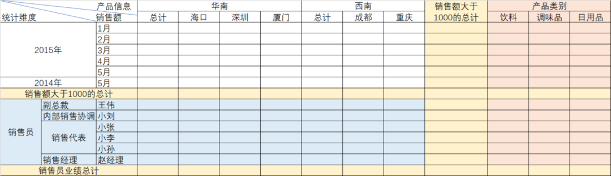
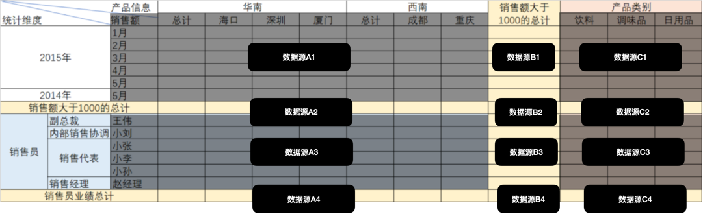
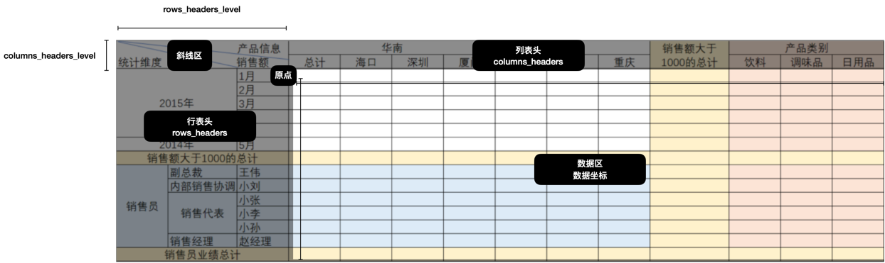
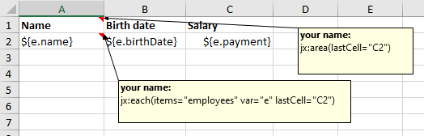
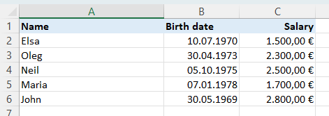
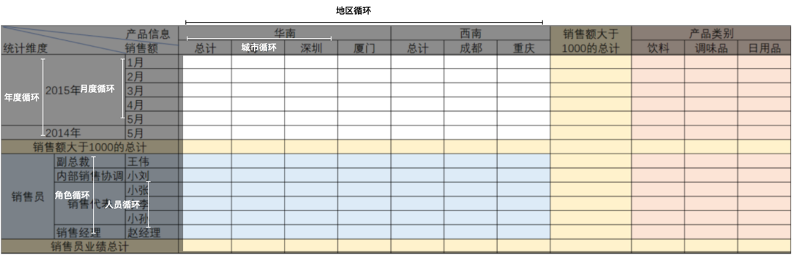
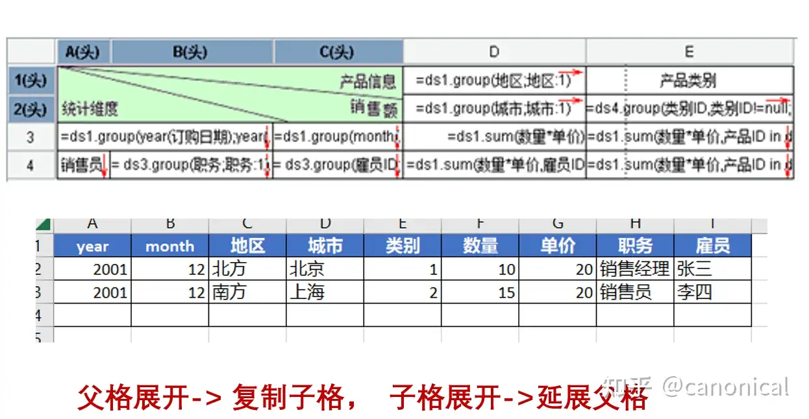

在之前转发过 NOP 框架作者 canonical 的一篇文章《非线性中国式报表引擎NopReport源码解析》canonical 非常强悍的在 NOP 框架中实现了一个报表引擎，并推荐了一本书《非线性报表模型原理》。

这本书被我找到了电子版的图片版，我重新制作了一下，都这里分享出来。

《非线性中国式报表引擎NopReport源码解析》这篇文章理解起来比较困难，我尝试整理复杂报表的来龙去脉和相关技术选型，在类似的场景下或许用得上。

## 01 非线性报表复杂在哪里？

本文的主角是非线性报表，也被称为中国式报表。这个概念的来源还有一段故事，以及一个重要的人物。

报表软件起源于 20 多年前，很多公司没有自己的信息化系统，所以依赖报表软件来管理数据，也就是说把数据呈现的各种诉求一揽子压力给到了报表系统。

这些复杂的报表需求有：

1. 多维表：二维或者超过二维的嵌套数据，把地区、时间、产品数量、订单数量等全部合并到一个报表中。
2. 多数据源：由于多维表的需求，那么自然数据源也来自不同的数据表，需要集成多数据源。
3. 表间计算：一些不在维度中的统计数据也需要单独列出来，例如总产品数量、总订单数量。

这些需求别说 Excel 了，当时国外的软件，例如水晶报表都很难满足中国老板的需求，毕竟人家也不需要把所有数据揉到一起。所以很长一段时间内，这些复杂的报表都让开发者头疼。

直到润乾软件创始人蒋步星在研究很多报表后，凭借数学功力，搞了一个数学模型解决了这个问题，还写了一本《非线性报表模型原理》书，这本书的电子版我附录在本文末了。

由于这种报表不是往往是多维的，所以又被成为非线性报表、交叉表、多维报表。

下面是一个例子：



它的特点是：

- 复杂嵌套的表头
- 来自不同的数据源
- 多个维度、斜线多

### 难在哪里？

非线性报表是相对于线性报表而言，线性报表只能往一个方向延展，一般是固定的列，而行的方向是可以拓展的，这和数据库中的表结构模型一致，我们很容易通过 EasyExcel 这样的工具库导出成 Excel。

如果使用 SQL 来实现交叉表，假设只是获取统计数据，其实并不难，难在如何把这个 HTML 渲染出来或者把 Excel 做出来。而最难的是报表引擎如何做到通过模版的方式展开里面的数据。

通常来说报表引擎会通过一个模版来表达表格的结构，然后自动填充表格。如果不同报表引擎就需要使用 POI 逐行、逐单元格来生成 Excel。

遇到需要把多个数据源拼装到一起的时候，即使不用报表引擎，通过 Java 代码逐行、逐单元格来生成 Excel 也不容易。

## 02 通过代码如何做出交叉表？

分析一下这个复杂的报表结构，在不用报表引擎的情况下，如何设计数据结构并实现这个报表。



这张报表本质上是一堆报表的组合（在10多年前有幸做过类似的报表，只不过是 HTML 的版本）。

我们先考虑一下数据结构，我们可以只考虑最小单位的统计值，上一级单位可以通过最小单位再次统计得到。

例如华南可以通过海口、深圳、厦门等数据再次统计，所以数据源中得到按城市统计即可。

数据源A1、B1、C1 虽然在同一行本质是三个数据源，分别是地区销售额、大于1000销售额、产品类别销售额。只不过可以通过月份关联起来，我之前的做法是根据年+月份生成一个唯一 ID 来标识所有行的数据。

类似的逻辑对于后面的数据源也适用，可以通过每行的最小单位找到一个 key 作为标识符，来关联多块数据。这个 Key 的选择可以用每个层级组合起来，例如销售员的销售额可以用 “销售员_销售代表_小李” 来表达数据结构。

所以完成上面的报表统计，需要进行至少 12 次 SQL 统计，每次统计可能使用两个 Group 字段，这样就可以加工出需要的数据了。

如何画出这样的 Excel 呢或者生成一个 HTML 表格呢？

难在如何计算什么时候合并单元格。例如销售员需要计算需要合并单元格的数量，销售代表则又不同，如果我们的数据结构是一颗树的话，那么需要计算出叶子节点的数量。

所以多维表的问题是需要在多维结构中找到线性规律。 以 HTML 为例，我之前采用了一个比较笨的办法（我相信有更好的办法，可以在评论区告知），

先根据数据结构把表头建立起来，把整个表格画出来，再填充数据。



因此我们可以把表头分为几个区域：

- 斜线区，这里一般固定三个，可以根据列表头深度、行表头深度合并单元格然后绝对定位就行。
- 列表头，根据列表头的嵌套深度，决定渲染多少层，以及何时合并单元格。
- 行表头，根据行表头的嵌套深度，决定渲染多少层，以及何时合并单元格。

所以在设计数据结构上，可以设计为表头数据 + 数据记录。

我这里展示一个表头的数据结构：

```json

{
    columns_headers_level: 2,
    rows_headers_level: 3,
    columns_headers:[
		{
			key: '华南',
			level: 1, 
			rowspan: 1,
			colspan: 7,
			children: [
				{
					key: '总计',
					level: 1, 
					rowspan: 1,
					colspan: 7,
				},
				{
					key: '海口',
					level: 1, 
					rowspan: 1,
					colspan: 7,
				}
			]
		},
		{
			key: '销售额大于一千的总计',
			level: 1,
			rowspan: 2,
			colspan: 1,
		}
	],
	rows_headers:[
		{
			key: '2015年',
			level: 1, 
			rowspan: 5,
			colspan: 1,
			children: [
				{
					key: '1月',
					level: 3
				}
			]
		}
	]
}
```

其实就是两棵树互相垂直，rowspan、colspan 可以根据叶子节点计算得到。先循环 columns_headers 再循环 rows_headers。

循环 rows_headers 的时候可以带上数据一起循环，但是这样不太好处理。可以先填写为空，然后再把数据表遍历一次写值就行了。

如果建立了这个报表结构，数据区域就是一个矩阵，我之前的做法是每个行、列都创建一个编码，甚至可以做到不用遍历就能访问每一个坐标，在 HTML 标签上放上坐标信息，就能用相关数据更新表格了（无论数据来源几个地方）。

例如 2025 年1月华南总计，可以编码为: "2025-1_huanan-total"。

这样统计数据只需要整理成线性结构就可以了：

```json

{ 
  "2025-1_huanan-total": 10000,
  ……
}

```

表头结构和数据统计结果分离非常好维护和增加新的功能，不用担心增加一行、一列导致数据映射错误。

当然这是非常朴实无华的做法，我这里只提供一个基本的实现思路供没做过的朋友了解。

## 03 报表引擎是怎么做的？

实际上这样复杂的报表一般都会采购报表引擎，把原始数据清洗成必要的字段即可使用。例如前面这张报表中，原始数据还是以订单维度，只是有城市、日期、订单额、销售人员、产品类别即可。甚至大多数报表平台，可以通过联表得到一张视图再统计数据。

通过人工实现这个功能已经挺困难的了，居然报表引擎能做出来就非常厉害了。

如果是一维表，jxls 框架提供了一种基于 Excel 备注的模版方案，可以编写模版就可以拓展数据源。

模版效果如下：



结果如下：



但是对于上面我们手动实现的报表来说 jxls 框架无能为力，因为：

- 类似纵向的横向数据拓展
- 多个数据块拼装到一起

本质需要解决了一个问题，模版坐标和数据拓展后的坐标问题。所以在报表引擎中会有一个数据展开的问题，初接触还挺难理解报表为啥要做数据展开。

我们想通过模版引擎实现这个循环就很难了。



在模版中一个循环语句占用了一个单元格，但是结合数据后拓展了数个、几十个行或者列。其实报表引擎的思路和我们上面手动实现的思路类似，只不过需要处理开发者定义的模版，然后再根据数据展开，并填充数据。

填充数据并不难，难在展开，《非线性报表模型原理》提供了一些数学理论和概念来帮助我们完成这个过程，也奠定了报表的基础。

Canonica 在 NopReport 项目中实现了类似的小型非线性报表引擎，这里有一张图更加形象表达这一点，我们前面说的构建报表头的过程，在 NopReport 中被称为报表展开。



前面我们知道，本质结构是垂直的交叉的两棵树，通过在两个方向把循环的模版展开，就得到了最终的表格，然后再填充即可。在润乾报表理论中，这个概念叫做**行列对称**。

整体思想是： 自上而下，自左而右，递归执行。

具体过程是：

1. 读取模版文件到内存中，解析模版文件
2. 先自上而下，根据列表头的数据深度展开足够的行数
2. 根据列表头的树和模版语法自左而右递归增加列数
3. 根据行表头的树和模版自上而下递归增加行数

非线性报表的引擎实现比较困难，我还不太能拓展 jxls 框架实现一个通用的报表引擎，如果对这块原理感兴趣的朋友可以查看参考资料中的文章，以及参考 NOP Report 源码。

## 04 参考资料

- NOP Report 中对报表引擎原理的解释 https://zhuanlan.zhihu.com/p/663964073
- 非线性报表模型 https://www.raqsoft.com.cn/r/r-model
- https://zhuanlan.zhihu.com/p/689149081
- https://www.zhihu.com/tardis/bd/art/36552380?source_id=1001
- https://zhuanlan.zhihu.com/p/688793604
- 蒋步星介绍 https://www.raqsoft.com.cn/about/founder
- 非线性报表模型原理.pdf 链接: https://pan.baidu.com/s/1nK-nZ3y6sriNa6VGxp7zJw?pwd=ghft 提取码: ghft

## 大佬的反馈

大部分内容差不多吧，主要是最后的
具体过程是：
读取模版文件到内存中，解析模版文件
先自上而下，根据列表头的数据深度展开足够的行数
根据列表头的树和模版语法自左而右递归增加列数
根据行表头的树和模版自上而下递归增加行数
这四个步骤的描述不对。按照蒋步星的推导，先展开行还是先展开列结果是一样的，但是实际做的时候是从左向右，从上到下逐个去展开单元格。如果是行展开，则复制行，如果是列展开，则复制列。
复制的时候，如果考虑单元格的父子关系，复制父格的时候会复制子格，而复制子格的时候会修改父格的span。
一般情况下按顺序去做展开的时候父格会排在前面，会先展开，但是报表引擎允许直接设置单元格的父格或者子格，结果就可能导致父格出现在子格的后面，因此实际实现的时候需要引入一个Queue。发现父格还没有展开的时候要先把当前单元格放回队列，先展开父格。

你对于报表引擎的关键点的理解是正确的，即报表引擎里最关键的是层次坐标，每个单元格最终在层次坐标体系中都有一个唯一的坐标，然后在报表表达式中可以利用这种层次坐标，通过相对位置等取到关联的单元格的值进行计算。 具体做展开的时候也是先展开上级的坐标，然后再展开下级的坐标。比如说模板中A1和B1两个单元格，A1做行展开，B1的缺省行父格为A1, 则A1展开成三个单元格，每个A1展开的时候会管辖一个行的区域，即它的所有行子格所构成的行。也就是说如果不和A1在同一行，但是行父格设置为A1，则A1展开的时候也会导致该行被复制。在B1单元格中的表达式中写A1这个坐标的时候，它指向的是离它最近的A1，也就是它的父格A1。因为A1展开成三个，这样当不同的B1在展开或者执行报表计算的时候，通过A1就可以获取到与它关联的那个A1单元格。如果在B1中引用了非父子关系中的某个单元格，比如A3, 那么它就指向的是所有的A3（如果A3展开就是多个，否则就是一个）。

在报表引擎中配置的时候，我们经常只需要指定当前单元格对应的字段名，但是因为它的行父格和列父格分别有对应的字段名，所以实际执行的结果相当于是按照多维坐标（行父格和列父格的坐标）从数据集中过滤出子集数据，然后再根据字段名获取具体的值。报表引擎有一定的计算能力，DataSet本质上就是一个列表数据。

假设当前单元格有一个行父格和一个列父格，当前单元格对应一个值，则执行的计算类似于如下代码

cell.value = dataSet.filter(row=> row[rowParent.field] == rowParent.value)
.filter(row=> row[colParent.field] == colParent.value)
.first()[cell.field]

也就是说根据父格的字段和对应的值过滤得到唯一的一个数据行，然后再获取对应字段值。具体引擎执行的过程中为了保证性能实际都是每个父格执行完毕后都会记录当前过滤得到的数据子集，然后求数据集的角。

rowParent.subList = dataSet.filter(row=>row[rowParent.field] == rowParent.value)
colParent.subList = dataSet.filter(row=>row[rowParent.field] == colParent.value)
cell.subList = intersect(rowParent.subList, colParent.subList)
cell.value = cell.subList.first()[cell.field]

比较复杂的情况下最细粒度的单元格仍然对应一组数据记录，此时可以通过汇总表达式来求出一个汇总值，一般的报表引擎可能会得到一个列表，然后用逗号分隔显示。

cell.value = cell.subList.map(row=> row[cell.field]).sum() 或者
cell.value = cell.subList.map(row=> row[cell.field]).join(',')

模板中的B1在展开后就变成了 B1[3]{A1[2]} 这种情况了，首先要确定自己的父格的坐标，然后自己在父格中是第几个复制出来的实例。如果只看行或者列一个方向，那就是构成一个Tree，自己要确定自己在Tree的第几层，而且是第几个复制实例。因为同时存在行和列两个Tree，所以管理起来要更复杂一些，但是原则上是差不多的

所谓的单元格展开，如果指定了field，就是上是一个groupBy
Map<Object,List> expanded = subList.groupBy(cell.field) 按照 指定field的值 进行拆分，每个key对应一个列表，每个列表产生一个新的cell。这个新的cell.value = entry.key, cell.subList = entry.value。实际引擎实现会更复杂一些，展开得到的值是expandedValue，可以通过valueExpr重新计算得到一个value。缺省cell.value = cell.expandedValue

