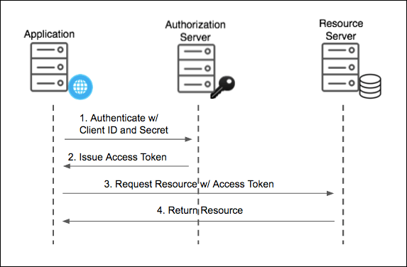

OAuth2 不是一个很难的话题，但是我发现在很多场景下被反复讨论，特别是以下几个常见的问题：

- OAuth2 被设计出来到底是解决什么问题？
- 常见的几种模式到底怎么选择？
- 为什么需要 access_token 和 refresh_token？
- 用了 OAuth2 之后，还需要 JTW token 吗？
- 如何用户退出后，access_token 撤回？   
- OAuth2 和 SSO 有什么关系？

## 01 OAuth2 解决的问题

OAuth2 解决的是分布式授权的标准问题，现实中 OAuth2 被拿来当做微服务授权，所以**有很多错误使用**。

这里先区分一下两个概念：

- 认证：当前会话的用户是谁，目的是获得认证后的用户上下文。
- 授权：识别当前用户能做什么，目的是获得用户的权限。

一般来说授权都是认证后再做，但是在分布式系统中，认证和授权是两个不同的问题。

可以不用做认证也能做授权，这就是 OAuth2 干的事情；也可以基于授权之上做认证，把用户 ID 当做一种权限发送，这就是 OAuth2 之上的 OpenID Connect。

OAuth2 所有的特性和复杂逻辑都是基于上面的前提，否则不需要 OAuth2 这么复杂的过程。

在某个场景中，用户访问 A 公司（或者部门）提供的资源，但是当前系统使用的 B 公司的认证服务。

B 公司不可能把用户的密码直接告诉 A 公司，所以用户在不需要暴露密码给 A 公司的情况下，B 公司把认证后的权限给到 A 公司，并允许用户访问。

这就是 OAuth 核心解决的问题。

## 02 常见的几种模式

OAuth2 有几种模式：

1. 授权码模式（Authorization Code）：一般来说我们讨论的都是这种模式
2. 授权码模式的增强版本（PKCE）：用于没有后端 client 的场景，一般用于 App 场景，例如 Android 应用
3. 客户端凭据模式（Client Credentials）：服务对服务授权
4. 设备码模式（Device Code）：针对没有键盘的设备设计
5. 隐式授权模式（Implicit Flow）：老式客户端授权模式，已经不用了
6. 密码授权模式（Password Grant）：资源所有者密码模式，已经不用了

我们主要说一下授权模式和客户端凭据模式，因为这两个比较典型。

### 授权码模式（Authorization Code）

（这是我在网上找的一张图）

这里面有四个重要的角色：

- 资源所有者（Resource Owner）：一般是用户
- 客户端（Client）：一般是应用
- 授权服务器（Authorization Server）：一般是 OAuth2 服务器
- 资源服务器（Resource Server）：一般是应用服务器

这里我们以 Google 登陆为例。

- 用户需要访问 Resource Server，例如这里的 Resource Server 是一个音乐服务
- 当用户在使用 Client 的功能时，Client 需要 Resource Server 的权限，就会把用户重定向到 Authorization Server
- 用户在 Authorization Server 登陆，并授权给 Client
- Authorization Server 会返回一个授权码（一次性的）给 Client
- Client 会用授权码去请求 Authorization Server，获取 access_token/refresh_token
- Client 会用 access_token 去请求 Resource Server，获取资源

Resource Server 可以有两种方式检查 access_token 的有效性：

1. 直接用 access_token 去请求 Authorization Server，检查是否有效
2. 使用 JWT token，提前配置 Keys 验证 JWT token 的信息

一般来说，我们都会使用后者，毕竟这是分布式授权，方案 1 会对授权服务造成极大的压力。

我们用一个比喻来说明这个过程：

A 公司的员工需要去一个第三方仓库提货，但他没有仓库的密码。于是仓库门卫告诉他，先去公司行政部门开具一个授权书，行政部门把授权书给到员工，员工带着授权书来到仓库门卫，并致电行政部门验证授权书的有效性，行政部门指导是刚刚我放出去的人，给了员工一张2小时的临时通行证。

这里的比喻对应就是：

- 资源 Owner： A 公司员工
- 仓库：资源服务
- A 公司行政部门：授权服务
- 客户端：仓库门卫
- Authorize Code：授权书
- access_token：临时通行证

然后该名员工就可以用这张临时通行证去仓库提货了。

**一般来说 Resource Server 和 Client 是可以相互信任的，所以可以放到一个服务器中，这样更加简化。**

正是因为如此，OAuth2 做到了极致的抽象，来满足 Resource Server 和 Client 不信任的场景，但是这也给 OAuth2 增加了一定的复杂度，导致难以理解。

### 客户端凭据模式（Client Credentials）

这里又要引入两个概念：

- H2M(Human to Machine) 认证授权：前面的授权码模式就是 H2M 模式，是以用户为主体的模式。
- M2M(Machine to Machine) 认证授权：客户端凭据模式就是 M2M 模式，是以机器为主体的模式。

很多人经常把这两种鉴权方式弄混，但是实际上这两种模式的区别还是比较大的。

虽然有时候 H2M 和 M2M 是共存的。比如 Open API 提供给第三方服务的 API 先要经过 M2M 认证，对调用者验明真身，然后再验证当前的用户主体。

客户端凭据模式就是 M2M 认证，以机器为主体获取访问权限。

## 03 refresh_token

为什么需要一个 refresh_token？

其实这里是一个系统设计上的矛盾：**分布式授权下，access_token 需要时间短和避免用户频繁登出的问题。**

access_token 是资源服务的临时凭证，access_token 一般是 JWT 每次业务请求，不会再询问鉴权中心，否则鉴权中心的访问量极大。

access_token 时间过长系统存在风险，尤其是用户退出后，access_token 还有短期时间可以访问资源服务。

但是 access_token 时间过短，会导致用户每次都要重新登陆，用户体验不好。

解决这个矛盾的权衡就是 refresh_token。让 access_token 过期时间非常短，通过 refresh_token 定期更换 access_token，既保证了鉴权的去中性化，又可以一定程度上保证安全。

总之来说：

- refresh_token 是短时间来代表用户的密码，用来判定用户登陆是否还有效。
- access_token 访问资源的临时凭证，用来判定用户是否有访问特定资源的权限。

沿用上面仓库的例子来说。

如果 A 公司的员工需要经常访问仓库，不可能每次都回行政部门开一个介绍信（需要密码）。于是说，索性我给你一个月卡，拿着这个月卡，需要访问仓库的时候，仓库门卫就用这个月卡来验证用户的身份，然后发放 access_token。

## JWT 和 Opaque Token

用了 OAuth2 之后，一定要用 JTW token 吗？ 

OAuth2 是一个快递流程协议，定义谁能寄、谁能收、怎么查。JWT 是一种快递盒子格式，可以透明（JWT），也可以密封 opaque。

OAuth2 可以完全不使用 JWT Token，但这就丧失了两个能力：

1. 分布式能力。不依赖于 Authorization Server 来验证 access_token。
2. 无状态。Token 关联的信息都在 Token 中，不需要在服务器端存储。

如果不使用 JWT Token，在 OAuth2 的场景中，Resource Server 可以验证 Access Token 后自己管理。

例如，在 Resource Server 中存储 access_token 对应的用户信息（这种方式可以看作本地 Session），或者每次调用 Authorization Server（可以视为全局 Session）。

## access_token 撤回

这是一个常见的面试题。

要分开来看：

- 如果使用 JWT Token 且完全独立无状态的验证 Token。用户退出时，发送事件到各个服务，各个服务收到事件后，通过黑名单的方式，来撤回 access_token。
- 如果使用 opaque Token, 且 Resource Server 自己通过 Redis 来管理 access_token, 收到撤回事件后，直接从 Redis 中删除 access_token。
- 如果使用 opaque Token, 每次 token 验证都是通过调用 Authorization Server 来验证，这种场景天然就具有可撤回性。

**所以可以撤回也是和分布式场景相关的矛盾，比较平衡的做法是 Resource Server 在本地管理自己的 access_token，不管什么 token 类型，验证一次 Redis 毕竟也没什么开销。收到撤回事件后，直接从本地删除 access_token。**

## OAuth2 和 SSO 

很多时候我们容易把 OAuth2 和 SSO 搞混，但是实际上这两种模式的区别还是比较大的。

- OAuth2 是一个授权协议，解决的是不信任的鉴权过程。
- SSO 是一个单点登录协议，解决的是多个应用复用一个登陆会话的问题。

虽然 OAuth2 可以作为 SSO 的解决方案，但很多时候这两个不能完全等同。

把用户的 ID 看作资源，如果能授权拿到这个 ID 就是视为全局登陆成功，然后剩下的事情就是本地会话了。

所以基于 OAuth2 的 SSO 一般使用 OpenID Connect (OIDC)。

现实中很多项目只用了 OAuth2 然后剩下的部分手搓，导致很不标准，后续很难和其他系统拓展。

## 总结

我在很多大量认证/授权的相关技术方案后，最大的感悟是人们对于系统边界的定义决定了如何理解和使用这些技术。

如果我们不需要分布式授权，那么 OAuth2 就没有必要使用（虽然依然被大量使用）。

比如一个集团内部的系统，集团本身提供了 IAM 系统，那么这个系统内部（即使有很多个服务）就不需要再做一个 OAuth2 的认证授权服务了（实际上很多项目这样做的）。

因为这个系统内部的服务不需要实现分布式授权，可以直接连接到同一个 Redis 服务中，或者共享同一套 Key 来验证 JWT token。

正确使用安全组件实际上有很多挑战。

我的建议是：根据奥卡姆剃刀原则，如无必要勿增实体。