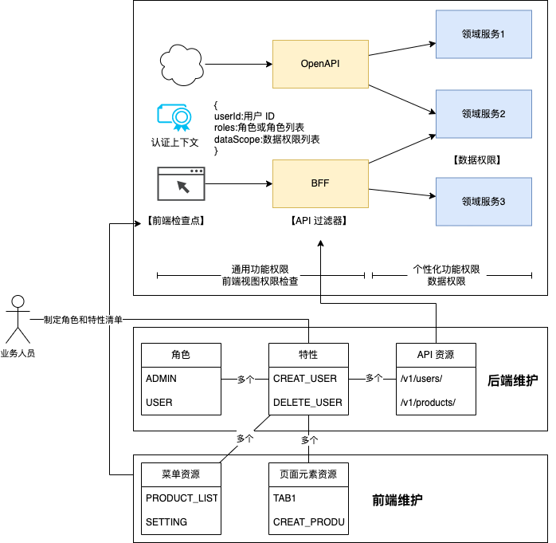

很多文章都在讨论认证和鉴权等相关话题，我自己几年前也写过几篇类似的文章，但在实际工作中，我们常常会忽略一部分设计。我们需要思考的是，用户在完成认证并获取访问凭证后，应该在哪里验证其访问权限。

这类问题尤其是在微服务场景下非常突出，如果没有统一的方案或者约定，会造成不同的开发人员在不同服务使用不同的策略实现。

## 微服务下有哪些鉴权类型？
 
权限检查点设计一个要点是，不能一刀切，需要根据实际情况按照不同的鉴权需求和类型梳理，并给出相应的方案。

权限在前端的表现为：

- 路由权限：是否能进入某个路由，看到对应的页面
- 菜单权限：是否能看到菜单，并进行操作
- 页面元素权限：是否能在页面内部看到标签页、按钮和某些被权限控制的页面元素
- 列权限：是否能看到列表中的某一列数据

权限在后端的表现为：

- API 权限：用户是否能访问某个 API 
- 通用数据权限：根据用户能访问的数据范围，约束数据范围
- 个性化操作权限：用户在某些条件下被允许做特定操作，例如在文章管理系统中，只有创建者才能删除自己创建的文章

API 权限和通用数据权限可以通过一些全局的拦截处理，而个性化操作权限可以视为具体的业务规则或者逻辑，不纳入通用的权限设计中。

另外，权限在业务视角下表现为：

- 功能权限：用户能实现某个特性，背后是各种各样的前后端权限约束

权限检查的原则是：**后端必须进行权限检查以确保系统的安全性，而前端在调用 API 前可以选择进行权限检查以提升用户体验。**

## 通用权限检查点设计

基于上述的权限类型和分析，我们可以得到下面的权限检查点设计。

设计要点：

- 拓展 RBAC 模型，抽象出特性（功能）、资源的概念，不要将角色直接和资源挂钩，而是通过业务人员能理解的功能或者特性来设计权限规则，由开发人员关联特性需要的前后端资源
- 用户认证后的上下文中含有：角色、数据权限清单
- 角色用户控制功能权限，数据权限清单用于控制数据权限，这两者为互相正交的关系
- 维护一套权限元数据，包括角色、特性（功能）、资源（包括 API、菜单、按钮等页面元素）

权限的元数据可以在前后端分开维护，这样避免频繁的前后端协作。抽象出资源的好处非常明显。在非常通用的场景下，可以使用全局拦截。在需要根据条件的进行判断权限的场景，也可以使用用户的角色程序化的检查权限，二者可以相互补充。

前端显示和 API 过滤器的实现思路为：

输入：用户认证上下文、权限元数据

实现过程：

1. 读取用户拥有的角色
2. 读取该角色支持的所有特性
3. 读取所有特性要求（claim）的资源清单并去重
4. 全局使用
   - API 过滤 
   - 菜单显示
   - 前端路由守卫

## 数据权限设计要点

将数据权限和功能权限分开对权限设计非常友好。一般来说数据权限无法在靠近用户侧实现，由于分页、搜索条件的限制，往往在领域服务中根据用户认证上下文实现 SQL 查询条件的补充来完成。

但是设计数据权限时，也需要注意：

- 数据权限维度选择。很多系统中，会根据机构、组织来设计数据体系，因此可以作为数据权限的维度，并赋予给用户。
- 数据权限颗粒度问题。颗粒度尽可能大，避免 SQL 超长以及性能问题，例如全国性机构可以使用省级单位作为数据权限粒度。
- 数据权限和功能权限的正交性。有时候数据权限可能会和角色在业务上相关，但是还是建议分开设计，在数据权限上关联来源角色，保持正交性。
- 数据权限和分库分表设计配合。尽量使用数据权限维度，作为分库分表的分区键，提高查询效率，且方便数据管理。
- 通用数据权限的适用范围。不要滥用数据权限，某些场景属于功能业务规则，这种场景避免使用通用数据权限实现。

## 总结
 
权限检查点设计只是认证和鉴权下非常小的一部分，但确实项目中争论最多的地方。非常重要的一点是，需要避免过于理想化的设计。

例如，某些系统将权限元数据落表设计为用户可以自行配置。看起来一劳永逸，其实维护性非常差。因为添加一个特性或者 API 本身就需要进行开发和部署上线，将这些信息放到配置文件中反而能起到保护程序的作用，避免误修改和不同环境的数据差异。

对于用户来说，只需要关系角色和特性这些概念就行了，至于这些特性需要要求哪些资源，则由开发者（前后端）控制。
