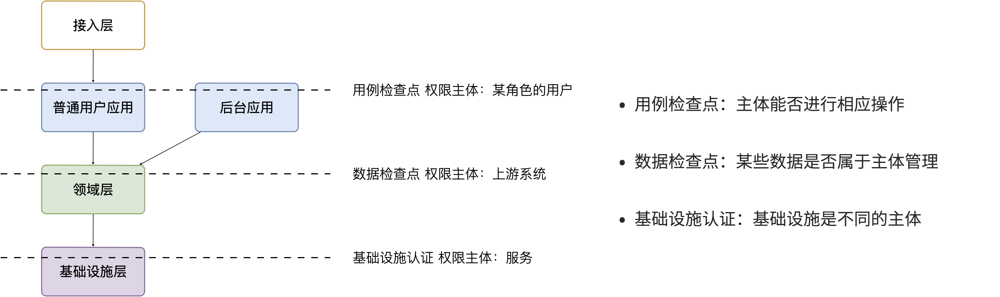
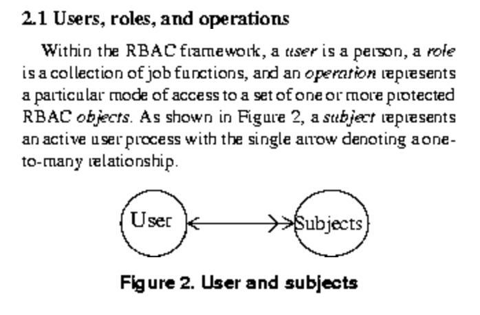
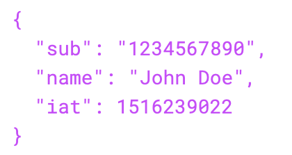

```text
一线工程师：领域服务之间还需要鉴权吗？
架构师：不需要
一线工程师：这样安全吗？
架构师：安全，而且不能因为过度设计造成性能消耗
几秒钟后
架构师：等等，你说的鉴权是什么鉴权。
```

在设计架构时，鉴权是无法避免且非常重要的一个专题内容。但是当我们说鉴权的时候说的什么呢？是认证（Authentication）、鉴权（Authorization）还是审计（Audit）?

这个问题并不复杂，一般来说：

- 认证是指系统需要识别是谁来访问。
- 鉴权是指识别出来的“谁”能不能访问特定的资源。
- 审计是指识对别出来的“谁”行为进行记录。

认证、审计可以被单独讨论，这里只讨论分布式系统下鉴权的问题。问题往往在于，当我们系统分布式化后在每层对“谁”鉴权的认知可能发生了变化，因为“分层是主体权责的让渡”，下层服务面向的已经不是最终用户了，那么鉴权的策略也应该不太一样。

这样说可能有点晦涩，举一个例子来说。用户领域服务提供了一个 API 用来查询用户信息，我们自然会想到查询用户信息是敏感信息，需要鉴权防止信息泄露。前端应用和另外一个领域服务都可能使用这个 API 时，权限应该怎么分别控制呢？

这种情况往往会出现两种流派。一种是领域服务只提供通用的能力，无需鉴权，鉴权的点应该由应用层来做。另外一种是领域服务每次的请求也需要知道用户的存在，并在领域服务内检查权限。

这两个流派都不能完全解决问题，如果鉴权只是由应用层来完成，基于不同权限展示的数据无法限制。如果将权限检查留给领域服务实现，会造成 API 的混乱。因此折中的思想是将权限设计为功能权限和数据权限，通过区分这两种权限类型来解决这个问题。

不过这样还是不够深入。

### 主客体分析

我们不妨使用主客体来分析一下这个问题：

1. 用户（前端真实的操作者）操作软件，我们识别到的权限主体是真实的用户。
2. 在系统内部，应用服务调用领域服务，对于领域服务的权限主体是前面的系统，真实操作的用户被消化成了业务的一种参数。而所谓的数据权限只不过是基于某个用户 ID 过滤数据的一种业务规则，虽然都叫权限，实际上并不相同。
3. 领域服务调用数据库等基础设施，对于数据库来说权限主体是领域服务。

经过主体的分析，我们会发现这些鉴权问题需要分开来看。这种分解并不新鲜，在一些文章中用了一组更为直观的术语：

1. H2M（Human to Machine）鉴权。人-机鉴权，需要识别的用户的身份的鉴权活动。在单体系统下，默认就是H2M 鉴权，也是大家习惯的模式。
2. M2M（Machine to Machine）鉴权。机器-机器之间的鉴权，往往是系统之间的鉴权活动。发生在应用服务-领域服务之间、领域服务-领域服务之间、第三方系统-领域服务之间、领域服务和基础设施之间。在内网环境，由于网络隔离，我们常常会忽略这部分的鉴权，并将其和 H2M 鉴权混杂起来。成熟的系统会通过 AK/SK 的方式鉴权，或者提供一种和开发者无关的账号（Service Acount）实现鉴权。
3. D2M（Device to Machine）鉴权。设备-机器（服务器）之间的鉴权，比如餐饮系统，会存在一个账号在多个收银机上登录的情况。一般设备-机器鉴权会通过接入协议转换为统一的人-机鉴权，这也是很常见但是容易忽略的鉴权方式。

基于对主体认知，我们可以将权限检查点映射到到 DDD 的分层模型上，就像下面这张图一样，当管理员管理他能访问的一组数据时，会经历几个检查点，这几个检查点由不同的主体完成：

1. 应用层处理 D2M鉴权、H2M 鉴权，识别用户的身份，并检查该用户是否能访问相关功能（可能是API）。鉴权完成后，需要提取用户的身份主体（Principal/Subject），最简单就是用户 ID。
2. 领域层拿到的用户 ID 只是一种业务参数，应用层到领域层的检查点为数据检查，根据用户 ID 过滤合适的数据。有条件的做 M2M 鉴权，但是不应该过重。
3. 领域层访问数据库的鉴权应该也是 M2M，只不过这种鉴权机制由数据库等基础设施提供，或者强制要求。



基于此，我相信关于鉴权的困惑会解决一大半。

### 主体权限分析的灵感

你可能会疑惑，我是如何将权限这样一个专题的技术方案和主客体思维挂钩的，听起来有点牵强附会。实际上，主客体思维已经成为了西方世界的基本哲学思维之一，我们可以在很多地方找到它们的影子。

我找到了一篇 1995 年古老的论文《Role-based access control (RBAC): Features and motivations》，这篇论文就是从主体、客体视角下分析了 RBAC 模型。

这篇文章对 RBAC 做了清晰的论述，简要的思想可以总结为：用户根据角色划分为不同的主体，操作（Operations）可以被看做客体。那么 RBAC 描述的是根据角色对用户群体划分，对其操作的控制。



除此之外，我们还可以在其他地方发现主体的影子。JWT 是一种自编码的鉴权载体，在令牌中就可以解出鉴权相关的用户信息。在 JWT 的 payload 数据域中，约定了一个 sub 字段，这个字段就是 “Subject” 的缩写。



这里可能有人会问，客体不在令牌中吗？令牌仅仅记录了用户的身份，就像将军的虎符，能被指挥的军队就是客体，所以客户没有在令牌上，令牌只赋予了主体的权利。

在计算机系统中，我们往往会将权限和功能绑定记录到数据库中当做客体存在，这就引出了下一个需要讨论的话题，鉴权客体的设定，会直接影响是否能开发出高效易懂的权限检查程序。

### 鉴权的几个陷阱

我们最容易掉入几个鉴权的陷阱中，有了主客体思维，可以轻松的分析它。比如，我们常常将 API 和权限控制绑定到一起，但是麻烦在于 API 不一定和鉴权的单位一一对应，这就导致了有些方案无法实现。

这里的症结在权限控制的客体没有被清晰地认识到。如果以 API 作为鉴权的客体，那么权限控制就完全和技术设计绑定了，用户在配置权限时一头雾水。

而大多数时候，我们需要控制的客体是功能、数据集。那么，就需要清醒的不要把权限的客体设计成页面、API、菜单。

除非我们权限的控制单位就是它们，这一点同颗粒度（互联网公司喜欢的用词）无关，当客体不匹配时，无论的多小的颗粒度都不能满足灵活配置权限的诉求。

另外一个陷阱是将鉴权的客体和数据的查询、增加、修改、删除绑定到一起，如果存在一个功能会涉及多个数据资源的修改也就无能为力了。

因此涉及权限系统，需要清晰的明白权限限制的主体是什么，以及权限限制的客体是什么。而由于主客体存在嵌套关系，我们需要明白是在哪一个语境下设计的。用户和系统之间？还是系统内部的服务之间？这是一个值得思考的问题。

### 更灵活的权限设计

在鉴权的上下文下，将主体和客体重新定义，可以让我们的设计更加灵活。

主体：行为的施动者。可以是一个用户、用户组、带角色的用户、有父子关系的用户、设备、第三方系统、内部系统等。

客体：行为的检查点。可以是一个方法、对象、数据、服务、基础设施等。

如果我们设计主体、客体、检查器三个接口，那么是不是可以做的万能的访问控制模型？我找到了一篇文章《A new dynamic access control scheme based on subject-object list》设想了这样一种模型，通过列表管理主体、客体清单来实现更加灵活的权限检查。

理想的情况下，实现不同的检查器就可以对不同的客体进行检查。不过如果抽象太高，就会带来更多的认知负担，实践价值降低。至于需要抽象到什么程度，就需要架构师来根据实际情况选择合适的模型和策略了。

## 参考资料


[1] Ferraiolo, David, Janet Cugini, and D. Richard Kuhn. "Role-based access control (RBAC): Features and motivations." *Proceedings of 11th annual computer security application conference*. 1995.

[2] Hwang, Min-Shiang, and Wei-Pang Yang. "A new dynamic access control scheme based on subject-object list." *Data & knowledge engineering* 14.1 (1994): 45-56.

[3] 罗俊, 刘嘉勇, 龚勋,等. 基于主客体安全性评估的访问控制模型[J]. 工程科学与技术, 2011, 43(006):140-147.

