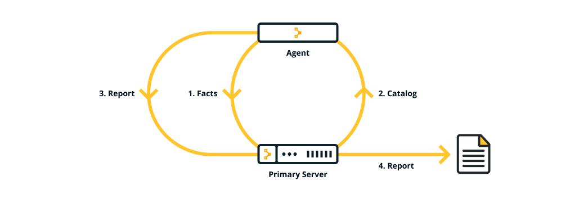
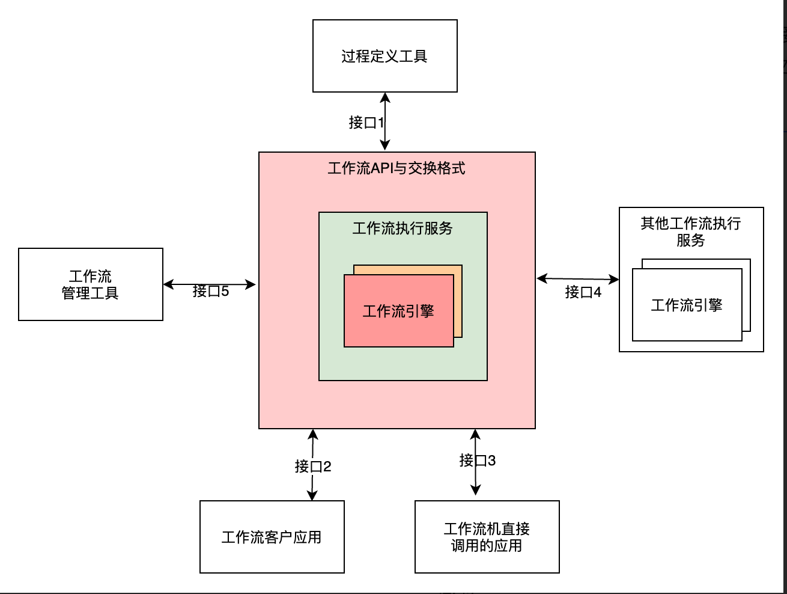
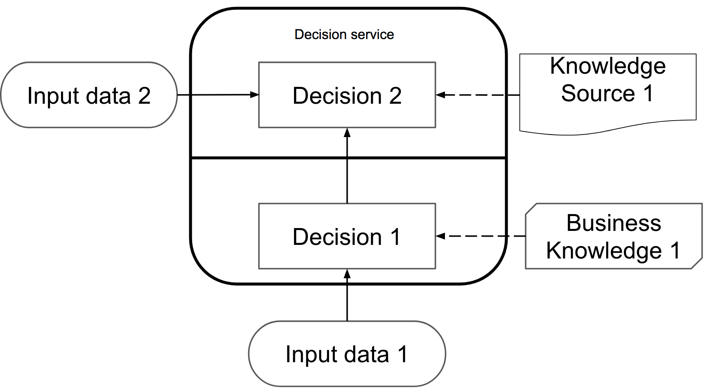

在架构设计中，经常会听到人讲编排这个概念。但实际上，在不同场景下他们说的可能不是一回事。

这期的系统设计，我们讨论几个和编排相关的场景：

- 应用编排(Application Orchestration)：将应用程序通过脚本或者配置文件统一部署到目标服务器环境，例如虚拟机、容器云平台等。
- 微服务编排(Micro-service Orchestration)：将原子化的微服务整合起来提供调用者更友好的 API，一般面向于多渠道、多种用户群的系统。
- 流程编排(Flow Orchestration)：使用流程引擎，将不同的系统或者服务组织起来，提供统一的流程控制、中心化审批等能力。
- 规则编排(Rule Orchestration)：在服务内对于多个决策任务进行编排执行，提高执行效率，简化业务规则。

在现代企业应用中，上述编排需求已经非常常见，下面介绍一些开源框架或者工具实现上述诉求，以便在遇到类似的场景时，能选择合适的方案。

## 应用编排

在多数场景下应用编排，往往说的是部署单元和服务器资源管理，通常属于 Devops 领域。

一些中小型公司通常使用 Linux 的 SSH 登录，配合自己编写的部署脚本就可以完成部署和资源管理。但是对于大公司的运维人员来说，管理成千上万的服务器就显得吃力。

早期比较流行的服务器部署编排的工具有 Puppet、Ansible，在云平台兴起后出现了 Terraform 也非常好用，这些工具均可以操作虚拟服务器并自动完成批量自动化操作。

在部署方面这些工具都可以看做应用编排工具。

所以在很多文章中，应用编排的定义是跨多个计算环境自动化的协调复杂应用软件应用程序的部署、配置和管理。

在容器和微服务兴起后，基于代码即基础设施的编排理念出现了，通过定义应用程序和基础设施的状态来管理基础设施和应用，从而保证了一致性、快速复制能力、拓展性。

常见的工具有：

- Kubernetes：当前主流的容器云编排工具，属于程序员必知必会的知识。
- Docker Swarm：Docker 原生的容器编排工具，目前在小型集群、私有化环境下非常有优势。
- Red Hat OpenShift：商业化的编排服务，适合成熟的大型企业。
- Apache Mesos + Marathon：早期的分布式集群管理工具和应用容器管理编排框架。

在 2023 年，了解学习 Docker Swarm + Kubernetes 可以应付大部分应用编排的场景和带来更多工作机会。

## 微服务编排

微服务编排往往说的是微服务之间的调用方式，以及如何给客户端提供友好的 API。这个话题我们在之前的文章：两种 BFF 设计中讨论过。

简而言之通常有两种微服务集成方式：

- 编排（orchestration）：由 BFF 或称应用网关，调用后端领域服务，领域服务尽可能少互相调用。
- 编舞（choreography）：BFF 或 应用网关尽可能做转发，后端领域服务之间自行相互调用。

## 流程编排

流程编排往往和工作流引擎有关。

流程是一组用户活动按照一定顺序组成的序列流，顺序可能是串行、并行，在流程中可能存在准入准出机制、触发机制等。

所以工作流引擎编排的对象往往是一个系统完备的 API，一个活动也可以看做一个用例，这点需要和下面的业务规则编排区分开。

在 IT 系统中，流程引擎往往适用于下面这两种场景：

- 跨应用编排逻辑和能力。例如，企业 CRM 下了采购单后需要触发供应链相关的活动启动。当然，调用供应链的活动可以由 CRM 程序发起，但是由专门的工作流平台管理会变得更灵活和弹性。
- 需要逻辑控制和审核控制的场景。在企业应用中，审批流是一个使用非常广泛的工作流。

甚至工作流管理联盟（WfMC）在 1993 年对工作流引擎进行了规范化，使其能定义统一的接口，将各个应用接入到工作流体系中来。其模型概念如下图所示：

参与到流程体系中的组件需要遵守一套规范，这样就可以流程互通。发展到现在，流程引擎的主流规范是 BPMN2.0。

主流的的流程编排引擎都支持 BPMN2.0，例如：Camunda、Activiti、Flowable 等。

BPMN 和 UML 一样是一套精确的图形化表示方法也被 OMG 组织管理，名称为”Business Process Modeling Notation”，即“业务流程建模标记法”。因此可以在前端灵活的拖拽设计生成 BPMN 文件，输出标准文件后，即可在流程引擎中动态加载和使用。

对于大型企业来说，流程引擎可以将不同的应用集成起来，并参与到企业的流程管理工作中来。

## 规则编排

规则编排和流程编排则显得不一样，规则引擎往往用管理业务规则，基于预定义的规则，当有业务输入时，根据输入获得不同的结果或者触发不同的行为。

例如，电商系统中对于不同积分和等级的会员获得的折扣可能不一样，这样就可以使用规则引擎灵活处理此类场景。

通过规则引擎可以让用户也能在一定范围进行配置，对业务结果和行为进行干预。

规则引擎的开源方案并不多，目前可以使用的有：Drools、Liteflow（国产开源框架）。Drools 是一个标准的规则引擎框架，Liteflow 偏向代码组件级别的流程编排多一些。

和 BPMN 标准类似，在规则引擎领域也有一个 DMN 规范，即 Decision Model and Notation。从名字上就能清晰地区分 BPMN 和 DMN 的关系。

Drools 完整支持 DMN 在很多业务规则，对于业务规则复杂的场景是一个非常不错的选择。快速了解 DMN 可以参考： learn-dmn-in-15-minutes.com。

## 总结

应用编排和微服务编排为大多数人熟悉，但是对于流程引擎和规则引擎来说，了解的人可能不是很多。

实际上一些系统大量在使用流程引擎和规则引擎，通过剥离流程和规则，对于复杂应用系统来说大大增强其灵活性，这一点对架构师非常有帮助。

## 参考资料

- https://www.xenonstack.com/insights/application-orchestration-tools
- https://medium.com/trueengineering/a-review-of-microservice-orchestration-frameworks-d22797b34ea5
- https://github.com/dromara/liteflow
- https://drools.org/
- https://airflow.apache.org
- https://www.puppet.com/docs/puppet/6/puppet_overview.html
- https://www.architect.io/blog/2022-06-30/microservices-orchestration-primer/
- https://xie.infoq.cn/article/201c0ac6772e07f81c31cbe07
- https://learn-dmn-in-15-minutes.com/learn/introduction
