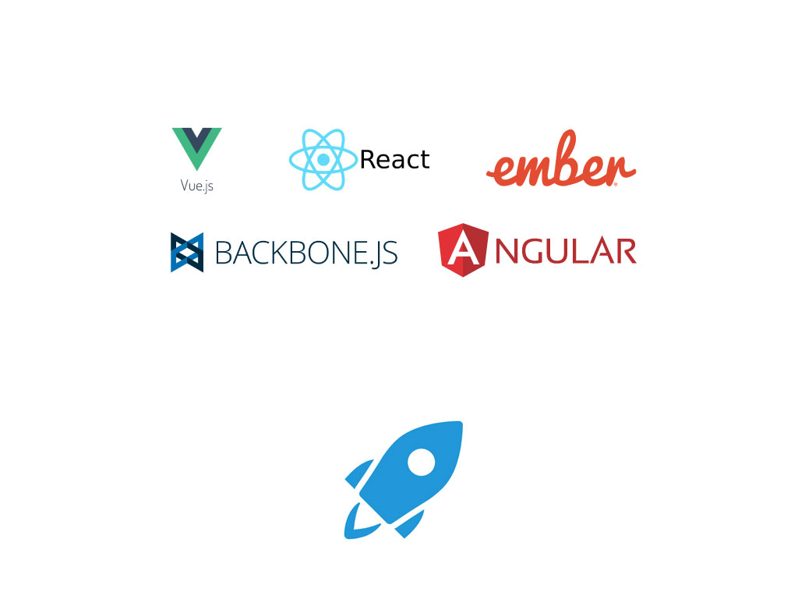
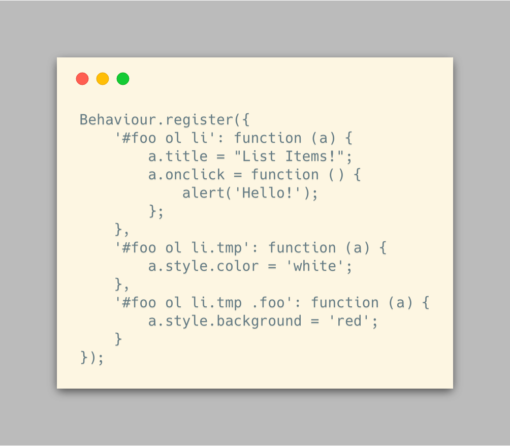
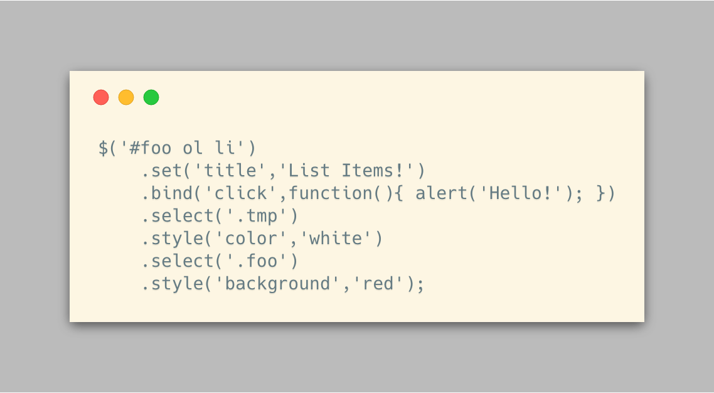
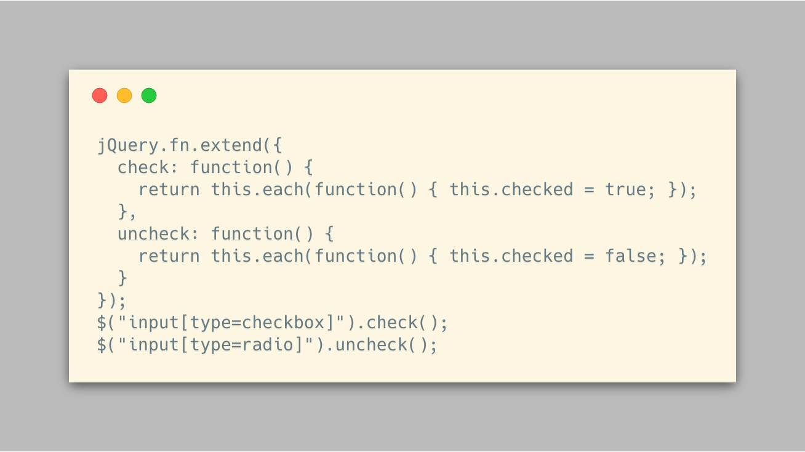
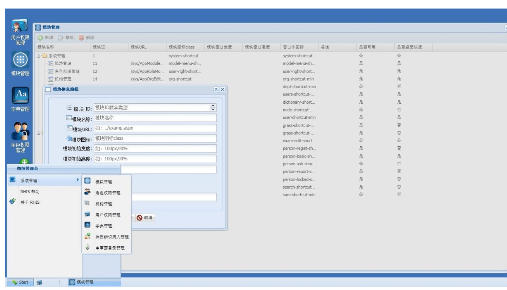
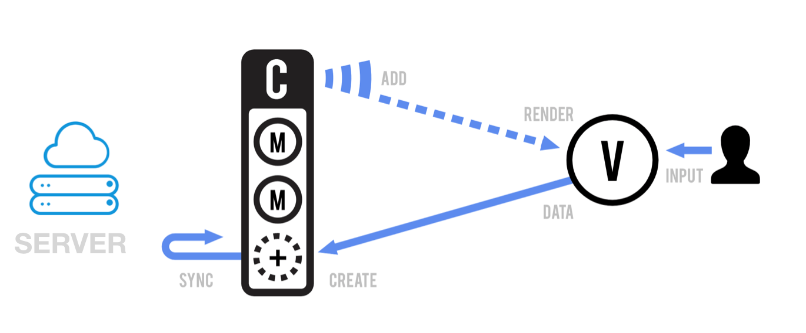
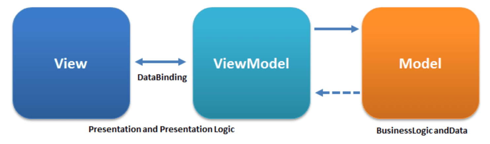
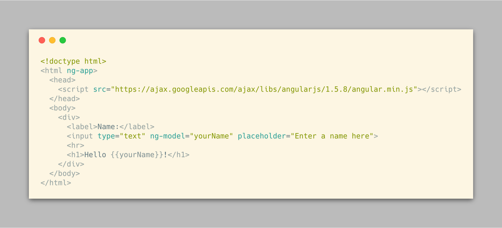
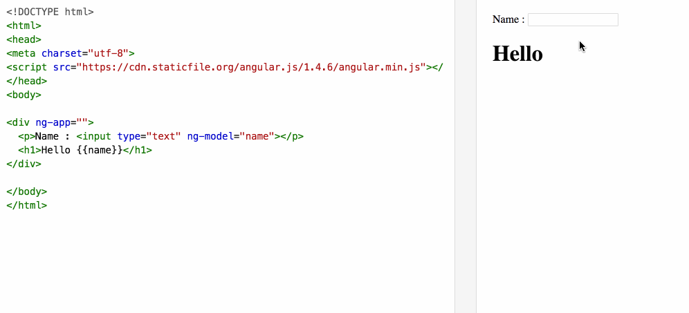
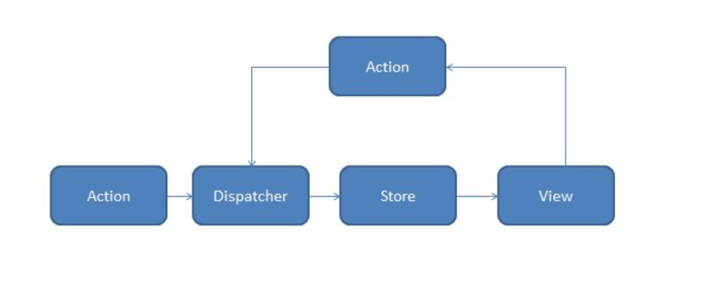

JavaScript框架的发展是一个不断带给人们惊喜的过程。JavaScript一度被认为只能做出网页上飞来飞去、令人讨厌的广告动画，到jQuery的出现人们开始用jQuery插件实现更为丰富的控件。再到后来的MVC、MVVM模式、Flux模式，让前端从制作网页变成运行在浏览器中的“应用程序”。

在不长的软件工程历史中，框架或者库影响了一门语言的思想，甚至人们因为框架改变了一门语言的的看法的的例子比比皆是，而JavaScript就是其中的代表。

思考JavaScript框架和库发展过程中的一些重要时期，对我们更好的理解前端开发或许有一些帮助。鉴于此，本篇对JavaScript发展过程中那些有深远意义的框架和库进行梳理，即使它们在历史的演变中被人们遗忘，它们的设计思想我相信也会让人受益。

## 框架之前

web前端的发展实在是迅猛，距离我大学时期也不过6-7年，那个时候的网页设计课还在使用“网页三剑客”。老师教我们使用Dreamweaver制作网页，Dreamweaver是一个类似于Word的可视化网页设计工具，使用了表格布局和行内样式，大部分是用来制作静态网页。

网页设计的高级内容就是制作JavaScript特效，制作类似文字随着鼠标浮动的特效，能独立制作一个轮播图组件已经算是厉害的角了。

在CSS3出现之前，网页设计中使用了各种“奇技淫巧”，JavaScript最大的作用就是实现一些页面特效（例如动画）。

在前端开发框架变得流行之前，开发者的主要目的是完成各种前端特效，也会使用Ajax从后端返回HTML片段实现简单的动态内容加载。因此大量的DOM操作就不可避免了，为了简化DOM操作，出现了jQuery这类工具库。

## DOM操作时期

实际上在jQuery之前已经出现了一些非常成熟的JavaScript库，如Prototypejs、Mootools以及Dojo等。（在JavaScript中有时候库和框架的界限并不明显）jQuery的大量灵感来源于Prototypejs，下面简单说下Prototypejs。

Prototypejs正如其名，通过JavaScript原型链的机制实现了继承、接口等面向对象的操作。也提供了简单的DOM选择器、Ajax工具、JSON数据操作和事件代理。某种意义来说，Prototyojs已经是一个专业的前端开发框架了，但就当时来说它的缺点也很明显：当是很多网页制作者并不是专业的程序员，Prototypejs的API过于复杂，面向对象机制太难理解，选择器也不够强大。

jQuery简化了一些操作，并提供更为人性化的API，最重要的是开创性的使用了构造器模式实现了链式调用，并且将大量方法提供到jQuery的DOM包装对象上，为jQuery插件的编写提供了更大的空间。

Prototyojs 的操作DOM并注册事件

jQuery操作的方式

(在jQuery作者John Resig博客上建议的一个例子)

jQuery不仅更为容易使用，在内功的修炼上也是出类拔萃。操作DOM的第一步是从DOM树中找到目标DOM对象，如果大量使用id来获取DOM节点，这会让代码变得难以维护。jQuery提供了一个强大的选择器引擎，能通过元素标签名、类名、属性等各种能想到的方式获取DOM元素，并注册jQuery拓展的方法。jQuery内置的选择器引擎被剥离出来，现在名叫sizzlejs，和jQuery同属于JS基金会。对于前端开发者来说，jQuery非常值得一读，开场的自执行函数非常惊艳。

于是jQuery凭借容易使用的DOM操作API、强大的选择器和插件机制普及开来，并深深的影响了JavaScript这门语言。Prototypejs是一款被低估的框架，但并不是因为技术落后被代替的，它的模块化和架构性甚至比jQuery更好，在后面要介绍的Backbone中也能找到它的影子。

## 富前端的思考

前端开发最大的特点是基于页面的开发，在浏览器中用户载入一个页面，即使有丰富的交互和特效，在离开页面的时候，网页的运行环境就被重置了。这种开发模式的好处相对于桌面和移动APP开发更为简单，页面不需要维护整个应用程序的状态和数据，但是对于用户来说体验上有巨大差别。

人们不断思考，能不能把桌面和移动APP的体验带到浏览器上呢？用户打开一个网页就像启动了一个应用程序，无需页面重新加载就可以完成所有的操作，用户当前的操作无需被页面加载打断。

事实上各种各样的网站尝试类似的做法，不过直到Gmail 的出现让这个想法变得更为现实。使用Gmail的时候，邮件列表和编辑邮件等操作无需重新加载网页，而像普通的邮件客户端一样，只不过这一切发生在浏览器中。

大家可以对比Gmail 和 QQ邮箱，你会发现体验截然不同，QQ邮箱在进行各项操作时会发生页面跳转，Gmail可以在同一个页面完成所有操作。

## 早期的富前端开发

当DOM操作和Ajax技术变得愈来愈成熟的时候，人们不仅仅满足于制作静态页面和特效了，前端开发开始慢慢地往复杂交互和类似于桌面应用的方向发展。

使用Ajax带来了全新的用户体验，用户不必刷新整个页面，就可以动态的加载HTML片段或者JSON。大量的项目开始用局部刷新来提高用户体验，比较明显的例子就是QQ空间。

同时随着jQuery的不断流行，业界出现了一大批优秀的jQuery插件，例如模态框、下拉菜单、表格、文件上传等。

伴随着jQuery和jQuery插件生态的成熟，Twitter推出的一个基于jQuery和jQuery插件的前端开发的开源工具包 Bootstrap，Bootstrap几乎成为了事实上HTML和CSS代码编写的规范。Bootstrap不仅提供了基础的CSS样式库，还通过jQuery插件的形式，提供了后台系统常用的组件。

至此前端开发进入了一个比较成熟的阶段，Bootstrap这类大而全的的前端开发框架出现，让类似表单提交等后端的逻辑演化到了前端。但是，Bootstrap依然是网页开发的模式，服务器动态脚本来加载页面和一部分数据。能不能让所有的逻辑都放到前端来，然后使用ajax和服务器统一通信呢？

此时业界还有另外一个前端框架在发展，它提供了及其丰富的控件，允许开发者通过JavaScript在前端完成几乎所交互，最后通过ajax把这些数据传回服务器。这样的框架能实现类似于桌面上的交互能力，它就是ExtJS，一款致力于构建富客户端的Ajax应用的前端框架。

不过Bootstrap和Extjs都有他们的局限性。

Bootstrap依赖jQuery和jQuery插件，其本质思想还是针对页面的DOM进行操作，当页面上存在很多数据和状态时，会显得非常吃力。并且基于多page原因，前端代码会被碎片化分割到不同的页面，没有统一的入口，使用jQuery的业务代码往往会被“意大利面式的代码”。

Extjs 因为过多特性和过强约束，让富客户端变得很容易，但这又让它的适用性变得很窄，往往适合大型的WEB行业软件或后台管理系统，例如经销存或者CRM系统。随着互联网发展，人们对交互和体验有了更多的个性化要求，Extjs也不太适合互联网公司的开发模式。

## MVC初现

随着浏览器性能的提升和各种JavaScript框架、库的发展，限制网页变成应用的瓶颈变成了如何管理数据和合理的架构。

jQuery只是一个DOM操作库，没有数据和状态管理组件。即使提供了$.data 方法，允许开发者将数据绑定到到DOM的属性上，但总归不是一个成熟的想法。

不过好在服务器编程领域已经思考过一遍类似的问题了，服务器编程经历了多入口多页面开发到业务逻辑分层的架构，最终发展成较为成熟的MVC架构。前端也出现了类似MVC架构的框架，Backbone是其中设计上比较优雅和简单的框架，Emberjs则是其中大而全和功能丰富的代表。

如果还没有了解过MVC模式，可以参考阅读[https://en.wikipedia.org/wiki/Model%E2%80%93view%E2%80%93controller](https://en.wikipedia.org/wiki/Model–view–controller)

但是在前端的MVC框架实现上毕竟只是参考了服务器端的设计思想，毕竟语言和运行环境的不同，实现上有一些不同，这里以Backbone为例指出这些不同。

- 在前端的C（controller）往往被路由和数据集合代替，在Backbone中C指的是Collection
- 在服务器端V（View）非常好理解，就是输入/输入，但是前端的输入是通过处理用户交互事件获得的，数据的输出是通过HTML模板。（这部分比较复杂，于是后面发展出了双向绑定、虚拟DOM）
- 前端开发最大的特点是大量的异步操作，因此MVC中数据的流动是异步的。虽然这两年随着Nodejs、Spring Flux的发展，后端也有同样的趋势。

简单来说使用前端MVC框架的基本逻辑是：

路由渲染视图给用户，然后通过和用户交互收集用户输入的数据，写入模型中，然后通过模型和服务器API交互。

使用Backbone开发一个Todos的例子：http://backbonejs.org/examples/todos/index.html

## 双向绑定和MVVM模式

在前端开发中，最繁琐的工作就是处理大量复杂的表单。一般的方法就是通过监听Submit事件统一收集数据，或者通过onchange事件实时的收集用户输入。

人们想象如果有什么方法能把用户界面上的元素和程序对象关联起来该多好啊，只需要改变相关对象的属性，即可得到用户的输入和更新界面上的显示。

好在，微软在WPF技术中提出了MVVM模式，实现了用户界面和程序对象的绑定和映射。WPF的出现大大提高了桌面应用的开发效率，如果从事过MFC（VC6.0 使用的这种框架，如果你对大学生活还有映像的话）框架开发的开发者应该能体会到这种巨大变化。

Google的angularjs给我们带来了浏览器环境中的双向绑定，虽然因为浏览器的某些限制，并不能带来和WPF媲美的体验，但是也属于前端领域的突破性进展了。PS：注意这里的angularjs指的事angularjs 1.x和目前的angular 不是完全相同。

Angularjs的一些特点：

- 由于低版本浏览器中的JavaScript不支持对象属性的赋值、取值钩子（setter、getter），Angular为了实现使用了定时器循环的脏检查，这对低版本和移动端的性能造成影响。
- Angularjs为了能收集用户输入，覆盖了window上一些特定的对象，造成一定的侵入性，在技术选型上需要特别注意。

总的来说Angularjs带来了能在浏览器中类似WPF的开发体验，让富客户端的开发进了一大步，于是越来越多的桌面软件被迁移到web平台。

（视图根据数据实时改变）

除Angularjs 之外，MVVM还有Knockoutjs，在某种程度上Vue也算使用了MVVM模式。

## 数据驱动视图和Flux模式

web开发者追求把桌面应用搬到浏览器中的同时，另一拨人也想把移动端APP搬到浏览器上。构建一个在APP webview中和浏览器上都能运行的APP是多么惬意的事情啊。

不过无论是jQuery到Angularjs在移动端都不好用，我曾经用Ionic(基于Angularjs的移动端前端框架)构建过应用，性能和数据管理能力（对于移动端而言）都不好。

Facebook 同样有此困扰，在移动端APP中需要管理一个全局的状态，进而渲染不同的视图。Facebook创建了通过虚拟DOM渲染视图的React，并使用Flux来驱动。虚拟DOM是指在JavaScript层面使用对象维护一个和浏览器DOM一致的数据结构，然后根据数据创建DOM节点，避免使用HTML模板。

使用虚拟DOM有几个好处：

- 性能提升，每次数据更新更新对应DOM节点即可，不会大规模造成浏览器重排。
- 便于数据驱动，因为使用虚拟DOM，视图的渲染由数据结构决定，APP状态的变化可以反映到页面上。
  

（Redux数据流，Store为APP全局状态）

为了配合React的使用，Facebook使用了Flux作为全局状态管理工具，当然社区使用Redux作为改进型被广泛使用。

使用状态驱动的APP一个最直观的体验就是用户可以自由的前进、后退，每个页面不会因为跳转销毁。因此最开发者而言也拥有了“时间旅行”这一炫酷的能力，即通过切换APP状态切换到APP不同时期的显示效果。这在移动端开发上很常见，但是在传统的MVC、MVVM上很难做到。

无论是Flux和Redux，相对于Angularjs的双向绑定，最显著的区别是数据变成了单向传递的，这就避免了双向绑定时局部状态和APP全局状态冲突的矛盾。

当然Vue生态下的Vuex让这类数据驱动的前端框架更为容易使用，不过在原理上大同小异，不再赘述。

## 几个为什么

### 为什么写这篇文章？

思考前端技术选型。每种技术的出现都有特定的背景和解决的问题，如果理解这些框架出现背后的逻辑，对技术选型可以有很好的帮助。举个例子，目前主流的前端技术是React，但是像一些门户网站并不是单页应用，同时有大量的信息展示，这种情况可能jQuery更好用。选择合适的技术比选择流行的技术更为重要，我们不能一说前端开发就是React、VUE。

充分发挥框架的优势。使用一个框架首先需要理解它背后的设计理念，React和Redux可以很好地构建数据驱动的APP。不过如果使用了大量的refs去操作DOM，甚至大量使用jQuery，会对项目带来灾难性的影响。

### 前后端分离在分离什么？

首先前后端分离的是数据和视图。我们用了React/Vue进行单页面开发，但是却从jsp/php/Aspx等服务器模板中获取数据，数据和视图耦合到一起，即使做足了前端工程实践，这也不是前端分离；由于某些原因，我们不得不多页面开发（例如webview的落地页）使用zepto从专门的API上获取数据并渲染视图，这一样是前后端分离的架构。

其次前后端分离不应该是工程师技术鸿沟。每个从事web开发的工程师都需要了解在HTTP协议两端的工作方式，前后端思想一直在不断融合和碰撞，只有对应用程序整体有一个很好的认识才能做出优秀的设计。

### 为什么提倡数据驱动视图？

技术服务于业务，在移动端的APP中很多交互需要全局状态管理和避免反复加载。我们想尽可能的让Web APP贴近原生APP，数据驱动可以带来更好地体验和更合理的开发逻辑。

### 所有的数据都需要放到状态管理吗？

当我在开发React+Redux时，这是最让我头疼的一个问题。DOM像是一棵树，理想的情况下Redux的store数据能一一对应，不过有些视图需要每次进入都要更新，那么如果把这类一次性的数据放入状态管理中是一种负担。如果把路由下的数据比喻成这个树下面的枝丫的话，决定一个下拉菜单是否展开这种状态就是叶子，如果没有特别的需求需要记录这些状态，可以不必把所有的数据放到应用状态中。

### jQuery、Backbone、Angularjs等传统框架落后了吗？

jQuery的选择器甚至被内置到浏览器中，Backbone和Angularjs 还有大量的场景需要用到这些框架，当然这些技术由于需求的演变可能用的会越来越少，但尚不能归到落后的类别中去。
