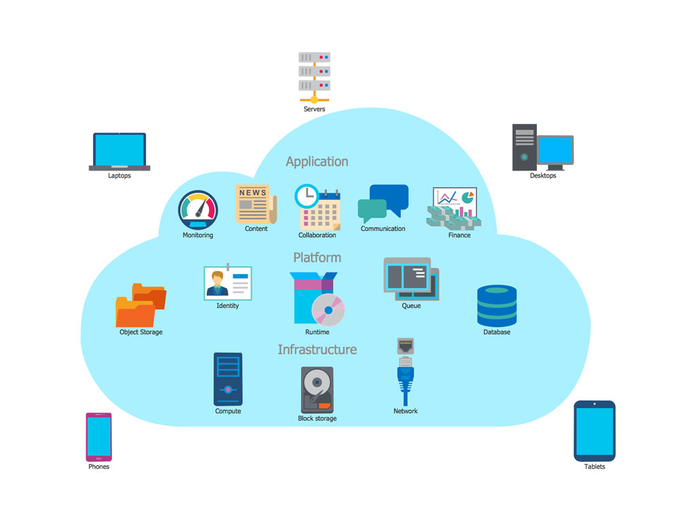
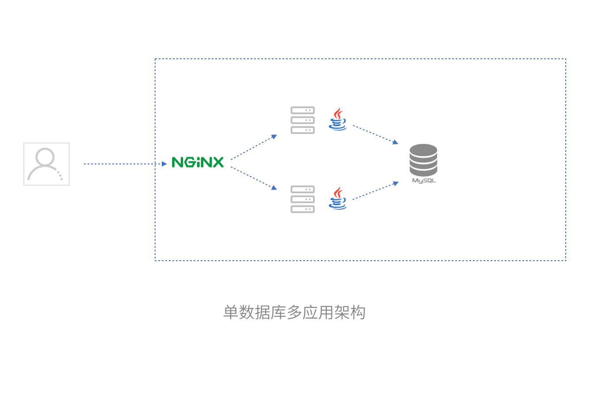
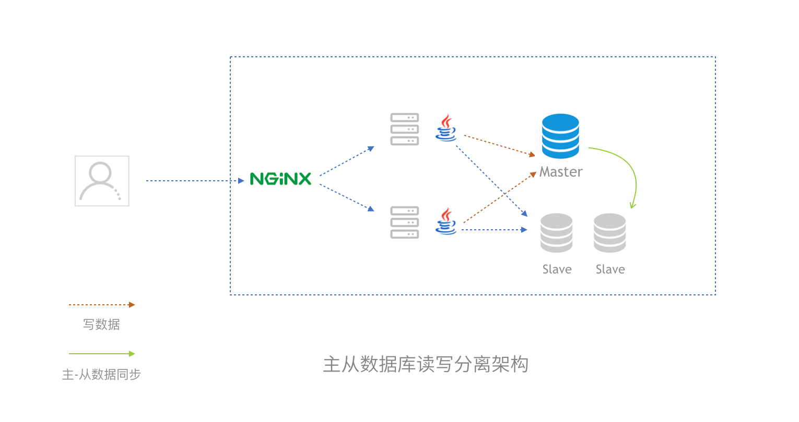
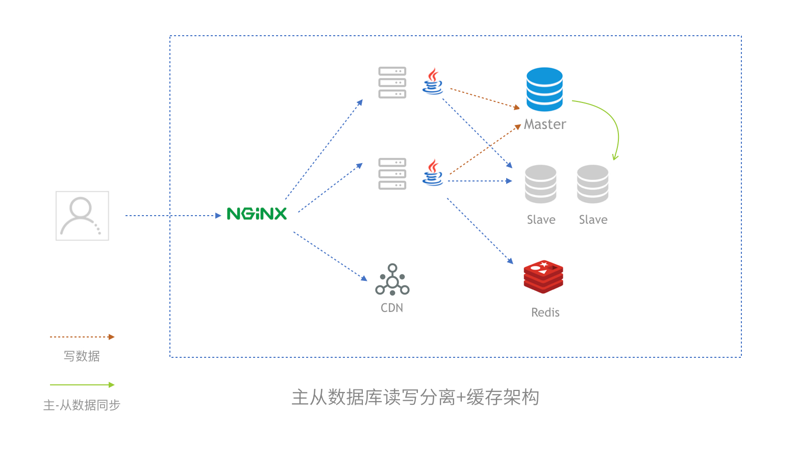
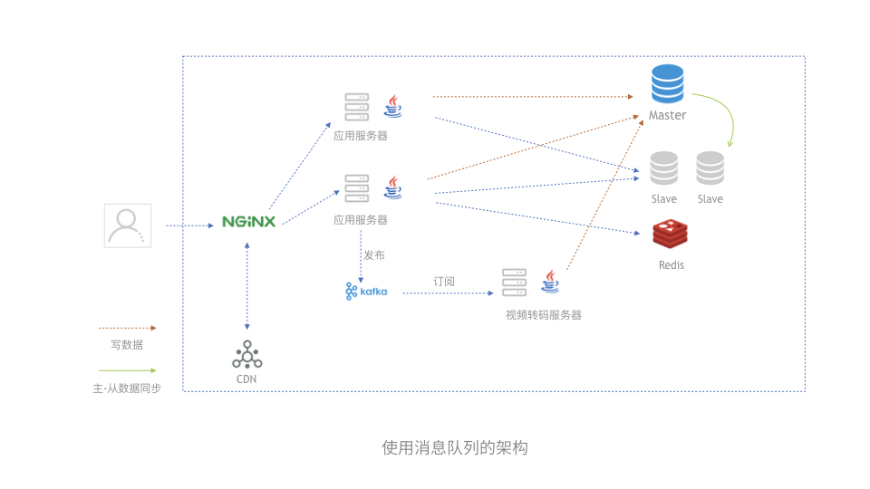
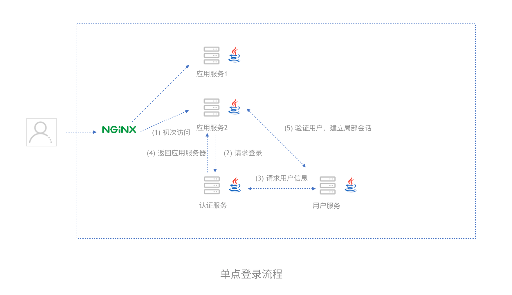
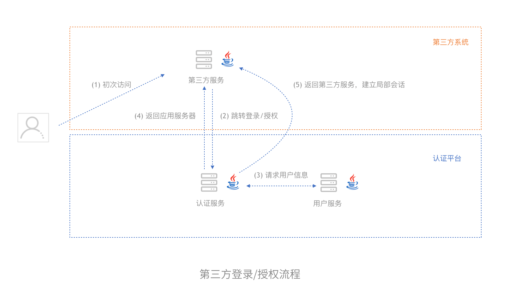
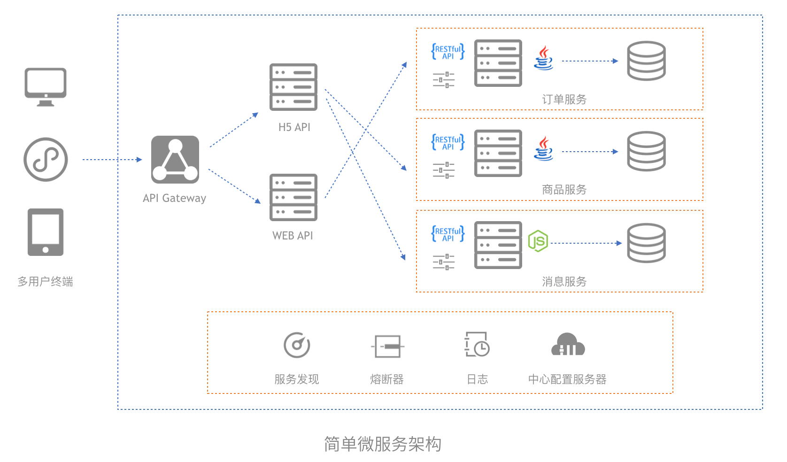

这两年业界最流行的技术架构话题已经从前后端分离，变成了分布式、微服务、DDD了。微服务架构适合所有的公司吗，业务场景演变到了什么地步才需要考虑上微服务呢？毕竟选择技术架构之前应该考虑业务是否与之匹配，否则分布式、微服务这类繁重的架构设计对一些公司来说就变成了屠龙之技，反而成为一线开发团队的负担。

在我不长的职业生涯中，经历过小型创业公司、国企般的大型项目以及在ThoughtWorks见到的各种项目。架构就像一个杂货铺，微服务也只是工具箱，不能有了锤子满世界找钉子，有可能人家只是一颗螺丝钉在等待改锥。

我想尝试让架构这个概念变得更为通俗，原谅我文中出现大量不恰当的比喻。为了描述常见互联网公司技术架构演变过程，这里设定了一个虚拟背景：

Neo是一名软件工程师，毕业后就留在这个城市加入了一家互联网创业公司，公司的业务是从事面向餐厅的食材配送服务，用户可以从APP或者微信提前订购食材，公司会在次日早晨送达。使用了Java + MySQL的技术栈，目前来说还只是使用了一台服务器，并且数据库和应用程序都还是部署在同一台服务器上。

因为用户增加和业务逐渐变得复杂，Neo的团队遇到的第一个问题就是需要对系统扩容，提高系统响应速度。扩容对于互联网公司来说一般就是“加机器”，那么第一步，怎么加机器呢？

## 单数据库多应用服务架构

增加机器方案的时候，我第一时间想到的是软件园餐厅的工作模式了。

软件系统用户就像来餐厅吃饭的顾客，而服务器就像服务员，本来服务员既可以收费也可以售卖菜品，就像有时我们在同一台服务器上同时部署了应用代码和数据库。如果在服务员同时承担结账和售饭职责的模式上增加人手的话，效率不高且最终的账目很可能无法保持一致，因此餐厅一般会有多个服务员售饭，然后由专人负责结账。

回到我们的架构问题上来，如果我们需要多台服务器响应更多的用户，同时也要保证数据的一致性。根据数据库的范式理论，数据的冗余性越低数据的一致性就越高。因此我们的第一步方案可以剥离为多个应用服务器处理用户的请求，一台数据库服务器来集中处理数据的读写，这样就能够达到分摊服务器压力的同时也能保证数据的正确。

不过在应用服务器的入口，我们需要增加一个负载均衡服务器，来分配不同的用户请求到特定的应用服务器上。这有点类似于餐厅的排队机，对用户分流。负载均衡服务器可以是普通PC服务器上配置Nginx一类的软件，也可以是F5这类专用的硬件负载均衡设备。

Neo的团队花了半个月的时间重新部署了这些服务器，通过剥离数据库和增加应用服务器的方式提高了系统性能。

## 读写分离的数据库架构

时间很快过去了半年，Neo的公司又增加了很多新的业务，系统也增加了更多的功能。预定蔬菜的商户也可以通过手机查看历史订单和各种统计信息了，这个时候Neo发现即使怎么增加应用服务器，也会出现用户需要等待很长的时间，最终数据库也出现了瓶颈。

数据库是分布式架构中最难的问题，因为不像应用服务器是不保存数据的。如果想要增加数据库服务器的数量，那么首先需要解决数据重复和一致性的问题。现实中对应的方案有很多，例如读写分离、数据库物理分区、逻辑分表、逻辑分库，但本质上讲只是拆分数据库操作的方式不同而已，而我们应对数据库性能最常用和性价比最高的方式是读写分离。

这里我又忍不住使用一个美食城的例子来说明数据库读写分离的思想了。

上文中我们提到数据的集中处理，一开始这样是挺有效的，但是随着用户的增多，负责处理数据的服务器还是忙不过来。同样的例子对于现实生活，很多美食城这类流量更大的场景，出现了另一种运作方式，美食城一般由管理公司和各个商户构成。消费者需要首先到管理公司设置的充值点充值，然后到各个商户刷卡消费，结账的人员只需要写入充值数据，然后每个商户都能读取数据。

因为数据的读取需要耗费大量的计算资源，而又不需要对数据进行修改操作，我们可以考虑把数据库的读和写这两种操作拆开。

我们可以使用数据库的主从架构来增加读的服务器，主数据库保证数据的一致性，使用从服务分担查询请求，主服务器会把数据同步到从服务器中实现数据的最终一致性。当然这个架构可以还是会遇到性能瓶颈，不过可以暂时用上很长一段时间了。

当然如果配上缓存，静态文件分离，性能会得到进一步提升。一般的项目到达这一步足以应对大多数的需求。

不过随后的日子里，产品经理提出需要给食材订购的页面中提供视频介绍，于是系统中出现了大量耗费计算资源或者耗时的视频转码操作。

## 使用消息队列的架构

电影《让子弹飞》中有一句经典的台词，“让子弹飞一会儿”。程序世界和现实生活总是相似的，如果我们要去邮局寄出一封邮件，或者是到快递公司寄出一件包裹，我们不必等待邮件或者包裹到达了收件人手上我们才离开，这可得花好几天。

相应的系统中往往存在这种类似的场景，当我们视频网站上传了一条视频后，视频网站往往会进行转码以便适合网络播放，这种操作需要耗费大量的服务器资源，不可能实时的在用户点击提交后处理完毕，否则用户需要等待很久，甚至连接超时。

对于这种应用场景，我们可以让此类任务不必是实时完成的。当用户提交请求后，系统会把任务添加到消息队列中，完成之后改变数据的状态，用户在刷新或接到通知后知道任务已经处理完毕。

前面说的系统架构，应用服务器只是被克隆多个然后分别部署不同的，每一台应用服务器上的代码都是一模一样。就像原始生物真菌，细胞没有分化所有的细胞都具有同样的功能，从这一节起，不同应用服务器承担的职责开始变化，就像植物的出现让细胞开始分化。

随着业务的发展，Neo的公司开始向新的领域扩张，开发了拓展更多商户的代理平台和物流平台，甚至需要和和第三方平台对接，而且需要保证这些平台中一些通用的数据和逻辑是一致的。

## 面向服务的架构（SOA）

如果大家看过动漫《工作细胞》，一定会对萌萌哒的血小板妹妹印象深刻，《工作细胞》通过动漫拟人的方式讲述了人体中不同细胞的职责和工作方式。每种细胞都有自己独特的功能，血小板负责止血和修复创伤，而T细胞负责吞噬异物和发现入侵者。

软件系统变得越来越复杂，参与的开发者就越多，应用系统的分离和分化就变得很有意义了。面向前端的API应用服务器不再真正的处理业务逻辑而是调用专门的服务器来完成。

单点登录（SSO）是一个典型的面向服务的架构，在互联网公司中被广泛使用。国内互联网巨头往往拥有多个系统，例如腾讯的QQ音乐、空间都可以使用同一个QQ号登陆。于是用户服务和认证服务被剥离开来，各个系统之间通过统一登录和管理用户信息，用户的体验得到了极大的提升，这就是面向服务架构的一个例子。

这些大厂不仅在自己的系统内完成了统一的认证和用户管理，并且把登录、授权的服务开放给第三方系统。例如很多网站支持微信登录，这样用户就可以使用一套用户名密码登录大量接入的系统。并且业界有一个通用规范，便于各种系接入，这就是OAuth标准。

服务调用有很多种方式，根据不同的网络协议使用RPC框架或者直接使用HTTP请求。

Neo的公司通过面向服务的架构改造，系统中分化出了用户服务、物流服务、订单服务等服务，通过OAuth的方式提供了收银机系统认证对接。一些收银机厂商也对接了这个系统，商户可以通过支持的收银设备进行下食材的预定操作了。

## 微服务架构

随着Neo的公司急速发展，越来越多的业务需求被加入到系统中，系统已经变得极为庞大。 不同应用和数据之间互相依赖，逻辑纠缠不清，项目的部署进入了混沌状态，对于大型、依赖关系复杂的系统需要一个更为有力的架构。为了解决系统复杂性和服务解耦的问题，这时候该微服务和领域驱动建模（DDD）出场了。

微服务大家都知道来自于Martin Fowler所创造并随之流行起来的概念。上面说的各种架构，应用之间依然强关联到一起，即使被拆分出来也是作为系统组件看待的，很难独立运行。

微服务的设计目的是为了让大型软件系统解耦。将不同职责的服务独立部署，从而实现服务内部高内聚，服务之间低耦合的效果，让开发变得更为灵活。当然“分开是为了更好的在一起”，为了重新组合和稳定运行这些服务，人们发明了服务发现、熔断机制、服务部署监控等一篮子工具。

曾经和同事开玩笑，微服务做的最好的是一个国家的政府。相信所有人都去过政务中心，当你需要办理一个户口或者其他市政业务时，政务大厅运转的像极了一个软件系统。

大厅的签到处就像一个API gateway，帮你排号的同时需要你的身份证（认证），如果发现你不符合这个地区的办理条件（授权或scope），会直接拒绝你。在给多个人排号的时候会分配到不同的窗口，这时候你感觉面对的不是前台的小姐姐而是一台轮询策略的负载均衡服务器。有些业务，受理业务的窗口并不会真的处理，而是提交到专门处理的部门，窗口对你来说就是BFF（Backend for Frontend）。真正受理业务的部门处理完成后会把资料递交到档案室，如同数据库的读写一般。系统中某个部门因故暂停了工作，会帖出告示（熔断）。当然这样的例子太多太多，不再赘述。

微服务甚至不是一个架构，而是像一个生态，应用与应用之间互相独立，却又彼此依赖。通过DDD的模型来设计一个地图，把合适的代码放到合适的地方去。实现微服务涉及的工具太多，其中我省略了部分，以求让架构看起来更加清晰。

## 架构的迷思

原支付宝架构师周爱民老师曾说，“真正的架构师没有title”。然而更甚一步，其实IT系统的架构也没有title，每个公司的架构都是唯一的、混合的、适合业务需要的，很难说我们目前的架构就是标准的“微服务”，一个“标准的微服务”有时候可能对一线开发的小伙伴会很难受。

架构也很难一开始就设计的完美，架构不是设计出来的，甚至不能被设计，只能在需求的变化中不断演进。架构师的工作不太像建筑师那样构建大的蓝图，更像药剂师那样对症治病、照方抓药。就像《大教堂与集市》说的那样，“软件很大程度上是一个服务行业，虽然长期以来都毫无根据地被错认为是制造行业。”

就像生命在自然环境中不断适应，才得以演化；我们的架构需要根据需求中不断改进，才得以敏捷。
