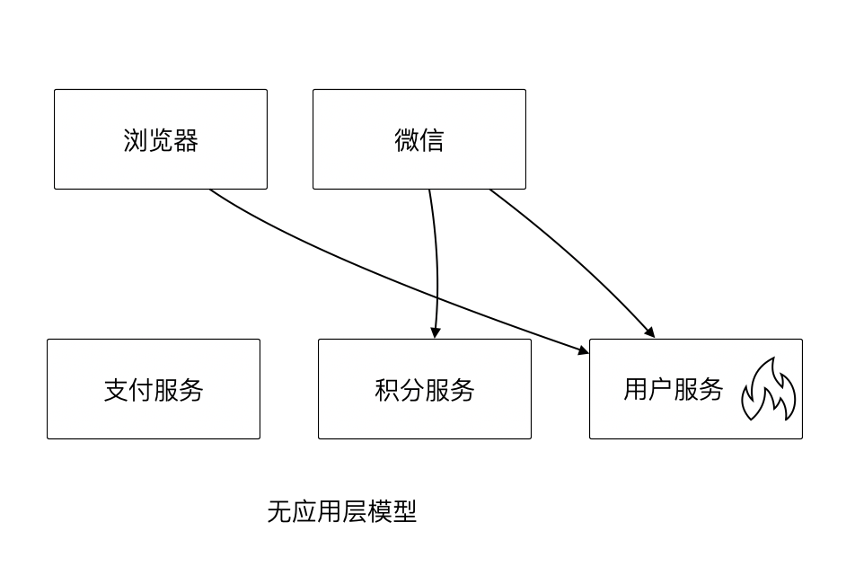
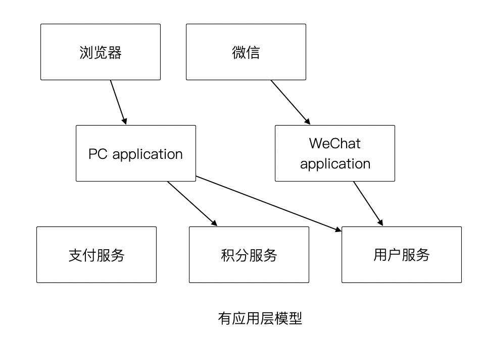
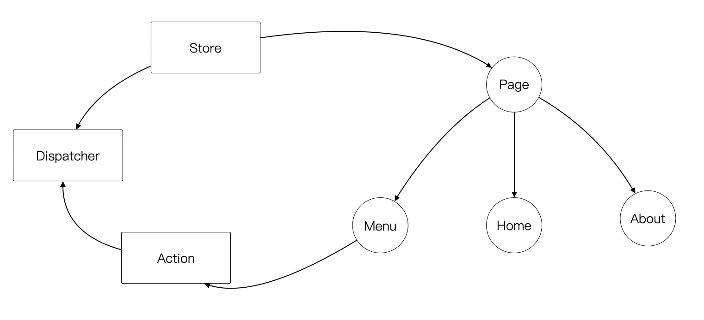
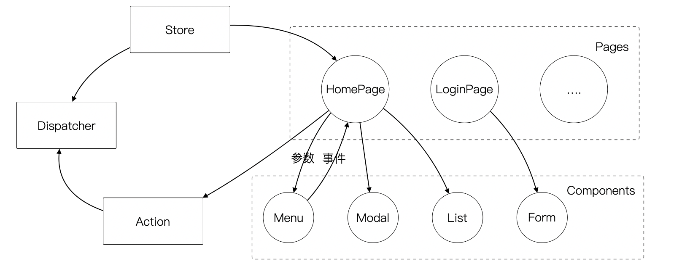

**良好组织代码的关键不是将方法划得足够小，而是对象各司其职。**

架构的本质就是将各种库、业务代码、基础设施等架构的组成部分良好的组织到一起，这是在成为架构师的路上必须想通的一环。企业架构框架把信息架构分为四层：业务架构、应用架构、数据架构和技术架构。如何把业务系统中的代码良好的组织起来，就是我们应用架构中的内容。

**应用和服务分离**是一个非常简单的原则，在各个地方都有体现，但是没有编程大师像 SOLID 原则一样明确的表述出来，但它又很重要，能给我们一个如何复用代码的准则。

## 01. 复用还是复制

“复用就一定好吗？”

当我向同事问出这个问题的时候，同事一脸茫然，好像软件开发本来就应该这样，所有的代码都应该尽可能的复用。

复用，在多数人的眼里已经是理所当然了，但有时候还是忍不住提醒一下，复用只是手段而非目的。

复用是通过消除重复代码的方式，得到一系列可以重用的代码片段，在需要的地方组合使用即可，提高开发速度的同时，也可以提高整体的一致性。

显然，组合组件用的胶水代码是不需要复用的，因为组合本身就是为了解决场景中的事情，不再具有复用价值。强行复用的后果有两个：

1. 场景特有的东西被纳入组件，导致组件的复用性降低。信息被泄露到组件中，组件和场景中的代码职责不清晰
2. 响应业务变化的能力反而降低了，说白了就是不好改。

有时候两段代码虽然看起来只有细微的差异，但是也不要复用它们。对于全栈开发者来说，这个原则对我们设计前后端的代码都有好处。在后端，我们可以使用 DDD 分层中的 application 让代码变得更清晰；在前端，我们可以将业务组件分为 pages 和 components 提升设计。

## 02. DDD 中的 application  

我们知道，在Eric DDD 的分层架构中，将系统分为了 4 层：

1. 接入层（Interface）
2. 应用层（Application）
3. 领域层（Domain）
4. 基础设施层（Infrastructure）

在 DDD 社区 《DDD 概念参考》中，对应用层的定义是：

> 应用层，组织业务场景，编排业务，隔离场景对领域层的差异。

应用层的目的是处理不同应用场景的差异，它被用于不同场景的关注点分离中。例如，用户下单可能会涉及多个原子的操作，订单、支付、积分累积等逻辑。

思考一个问题，为什么 DDD 中引入了一个应用层。没有它我们会面临什么问题？

如果缺乏应用层（在很多微服务系统中都是这样的），导致领域服务和场景绑定，复用性大大降低。例如系统接受用户自己注册，也可以使用微信登录完成一个隐藏的用户注册。另外一个例子，对于新用户，系统会为他赠送一些积分，在没有应用层的情况下，服务被前端直接调用，于是服务不得不定义来自不同渠道的 API。在下面的示例中，微信自动登录会比浏览器注册多好一些内容。

随着对接的业务越来越多，微服务中的代码的分支条件越来越多。这时，大多数架构师开始思考，添加一层来隔离差异。大多数情况下，我们把这层看待为编排层，但是这个 “编排层” 着实让人难以理解。

在一些情况下，大家只是把这层当做一个简单的代理，大量的和场景相关的逻辑进入了领域层，依然会为系统带来麻烦。

我们重新思考应用层，它到底解决了什么问题呢？

有一个典型的场景，就是管理员和普通用户，在使用场景的差异非常大，看似是具有不同的权限的同一个操作其实未必是同一个用例。例如，用户能通过 API 获得商品列表，管理员能看到未发布的产品列表。对于没有经验的工程师往往会编写一个 API 然后通过一些权限机制来限制它们的访问。

注意，这不是权限的区别！

**这是用例的区别。**

管理员查看商品列表是一个用例，用户查看商品列表是另外一个用例。

当我们不再把用例混淆的时候，就能理解应用层了。我们重新看待应用层和领域层两个层次的定位：

> 领域层，实现具体的业务逻辑、规则，为应用层提供无差别的服务能力。
>
> 应用层，组织业务场景，编排业务，隔离场景对领域层的差异。

当我们能把每层的的职责弄清楚之后，代码的组织变的如此清晰，而在此之前我们还在靠把代码划分的更小来实现的。

## 03. 前端中的 pages 和 component

在前端开发中，随着工程化的发展，开发者把组件划分的越来越小的时候，也会有类似的问题。

下图表达了 Store 模式的数据流动关系，对应的实现有 Redux、Vuex。

从技术的角度看，它的逻辑非常清晰，但是在实际的工程项目中会有一点小问题。

Action 的发生是从 Menu 等这些基础组件中发出的，也就意味者，Menu 组件和全局的状态联系到一起，这个时候 Menu 组件的复用性就降低了。

换个例子，设计一种弹窗组件，这个弹窗组件和全局的 store 数据联系到一起的话，如果想要做到基础的组件在各个地方干净的使用，那么状态的承接工作就不应该由基础组件来完成。

我经历过几个项目，设计者没有意识到这个问题，带来的后果就是，组件为了复用不得不写很多条件语句。比如模态弹窗不得不使用枚举来区分是那个用途的弹窗。

问题的关键同 “应用和服务分离” 类似。如果页面用于承载状态，组件用于复用，那么两种组件具有了清晰地定位：

> pages，用于承接页面状态，和后端通信等业务逻辑。
>
> component，用于承载 UI、交付逻辑，需要通过参数、事件和 pages 传递数据。

## 04. 总结

复用是一门艺术，需要敏锐的眼光从变化中找到不变，这些不变的才是真正需要复用的。在创业性质的项目中，这点尤为重要。我们会发现，在业务成熟的公司里，他们的代码复用程度更高。

考虑到业务变化很难预测，对于开发人员可以做到的是：**当业务剧烈演进时，分而治之；当业务成熟稳定时，抽象统一。**

## 参考链接

1. [1] DDD 社区.DDD 概念参考[EB/OL].https://domain-driven-design.org/zh/ddd-concept-reference.html.

