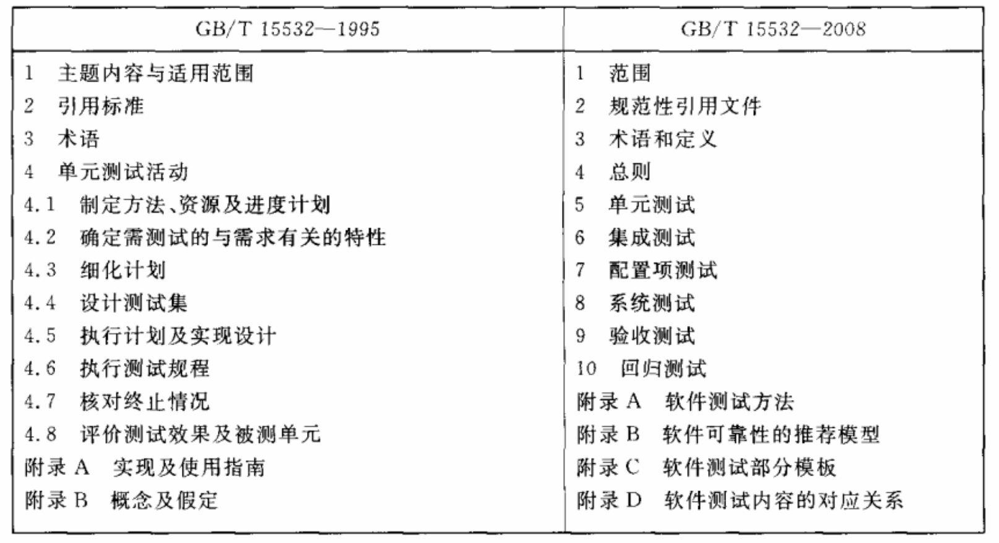
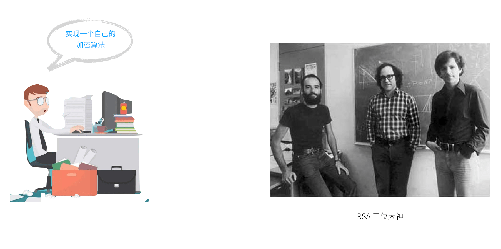
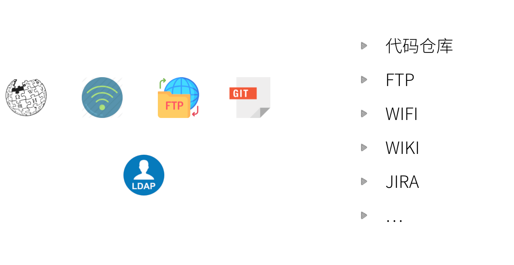
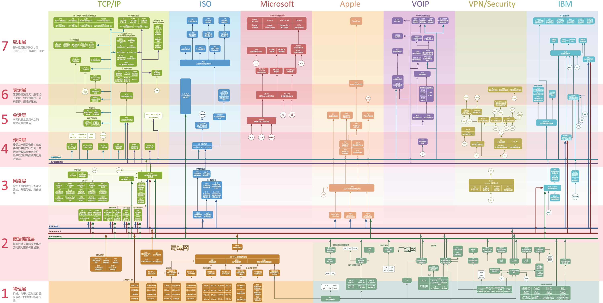

聊到集成测试、单元测试等测试分类，我想大多数人都有类似困惑或讨论，集成测试和 E2E 测试到底有啥区别。甚至还有一些系统测试、配置项测试等概念，不但让我们这种非 QA 专业的人弄不清楚，在和我们的 QA 同学讨论时也很难得到清晰地结论。

家里有一台古董级别的笔记本，掌托和键盘几乎已经被磨花了，一天突然想检查下有没有特别的资料然后好处理掉它。一份测试相关的国标文档（GB/T 15532-2008）吸引了我的注意，这份文档来自于刚毕业时在四川省软件测试中心实习期间，而我几乎已经忘记了那段经历。

翻看这份文档让我打开了一个新世界的大门，我们在讨论研究的很多问题包括测试分类的定义，已经被业界讨论过很多次，甚至被制定成清晰的文档和规范。

不仅是 GB/T 制定了相关标准和大量方法，IEEE 和 IOS 也定义了大量标准供业界参考。在软件工程中，了解相关标准给我们带来非常多的好处，能帮助我们更好地做技术选型、企业应用集成、持续演进以及借力技术生态。

## 采用标准技术的优势

### 发展成熟

在计算机科学领域，技术标准最成熟，也是和学术界最接近的是密码学。在软件行业中，最有意思的是很多人对造轮子非常感兴趣（包括我），不过有一些轮子我不建议自己造。这就是加密算法，不止一个人在聊天中谈起对信息安全的看法时说，要是我开发一个自己的加密算法只有我自己的知道（甚至很多真的这么干了），肯定是天底下最安全的。这是一种非常朴素的信息安全认识，自己的创造的“加密算法”也只是根据特定规则对信息的混淆和变换，这甚至落后于凯撒密码。

现代密码学已经有大量的对称加密、非对称加密、HASH公开算法，甚至建立了一套完整的通信信息安全基础设施（PKI），保证信息安全的是密匙而不是加密算法。与其闭门造车，不如选择 RSA 等大师们的成果。

上面的例子是想说标准的技术大多经过学术界、工业界的验证，相比自己捣腾一个，相对来说更为靠谱。

## 技术生态

选择标准技术另外一个好处是保持开放，能构建出一个技术生态。

稍具规模的公司或者组织都有一个中心化的账户管理体系，在软件公司我们有一大套内部系统和软件需要和账户系统进行对接，账户系统还被要求以很细致的粒度对权限进行管理。比如办公室的 WIFI、JIRA、邮件、wiki 等平台需要对接账户系统，一些采购的软件可能并不需要我们进行修改就能实现接入，这其中需要一个约定。

其中一个规范叫做 LDAP，JIRA、邮件、开源WIKI平台支持 LDAP 服务器的接入，甚至国内的软件产品例如禅道也支持 LDAP 接入。

LDAP 只是众多开放标准的一部分，互联网天生具有开放性，因此网络通信和互联网涉及的协议多如牛毛。例如我们的以太网协议 IEEE 802.x、HTTP 协议 RFC 723X 。仅仅网络协议就有数千条，甚至有一点不忍心放上下面这张图。

采用标准技术还有其他优势，具体的实现很容易被替换。例如实现 HTTP 协议的客户端很容易的被替换，前几天在和一个同事聊到他们在项目上把 Apache 的 HTTP client 替换成了 OK HTTP；如果在项目中使用了符合 JCP 定义的 Java bean validator 也可以容易的在某些场景下被替换。

不过值得注意的是业界事实标准有时候可能和一些标准化组织制定的标准并不一致，OSI 7 层协议被称为经典的网络协议，但是目前广泛形成的协议族是 TCP/IP 协议族。

## 日常相关的标准技术和组织

在使用开源项目做技术选型时，如果对技术标准有一些了解，可以帮我们更容易的了解一些技术的生态和工具链。比如上面的 LDAP，我们可以在采购软件时优先考虑支持 LDAP 的产品，从而降低自行接入的成本；对于自己项目上更为具体的实现如设计 API，我们可以选择一套参考标准入如 jsonapi，让沟通成本大大降低；在前后端协作上，如果采用 Swagger 的 openapi 可以容易的找到一套开源工具帮我们完成文档、SDK生成等工作。

下面让我们一起了解一些互联网常见的技术标准和组织。

### IETF

IETF 应该是互联网标准组织中名气最大的，它的全称是国际互联网工程任务组（The Internet Engineering Task Force）。IETF下属有很多工作组（WG），专门负责一个领域标准的制定，例如 OAuth。IETF 工作的产出主要是 RFC 文档（Request For Comments）。IETF 最知名的规范是 TCP/IP 协议族，但是我们日常相关更多关注应用层标准，就不介绍通信相关的协议了，下面是一些常见应用层的标准。

- **RFC 723X HTTP 协议族** HTTP 标准分为多个版本，目前在用的一般是 1.1。同时 HTTP 标准分为核心标准和拓展标准，例如缓存、会话、内容编码等内容属于拓展部分，在选择 HTTP client 时，需要注意其实现程度可能并不完整。另外 method、状态码等枚举类型在 IANA 中心可以找到。
- **OAuth 开放授权协议** OAuth 相关规范和HTTP类似，也分为核心和拓展。核心的标准文档是 RFC 6749 ，而拓展的部分例如 Bearer token 以及 token 的获取、验证和JWT相关的规范都在另外的文档中。值得一提的是，OAuth OpenID connect 不属于 OAuth 的规范，所以认证并不是 OAuth 要求的。

### JCP

JCP（Java Community Process) 是一个开放的国际组织，主要由 Java 开发者以及被授权者组成。Java 之所以能发展成目前这个规模，离不开标准化进程，JCP 中的一些规范不仅影响了 Java 世界，对其他语言，例如 PHP、Nodejs 也造成了巨大的影响。在日常服务器开发工作中，用到 JCP 标准非常多，例如数据验证、数据库访问和服务器容器：

- **Bean Validation** 在 Java 中数据校验的规范化是 JCP 一个典型的实践，从最早的 JSR 349 到 JSR 303，目前已经发展到了 Bean validation 2.0，并开始支持 2SE。Hibernate 最新的 validator 已经开始支持 2.0 的验证规范。早期讲 Java 的书谈到使用 JSR 验证容易让人感到困惑，JSR 只是验证规范，数据验证是由其他的验证器实现的。同时一些非 Java 的验证框架也在参考实现 JCP 的标准。
- **JPA Java Persistence** API JPA 定义了对象关系映射以及如何持久化到数据中，JPA、ORM、Hibernate 在 Java 开发时是非常容易被混淆的概念。其中 ORM 只是一个对象映射的概念，JPA 规范了 ORM、数据访问 API、查询语言，Hibernate 对 JPA 进行了实现，JPA 其他的实现还有 Open JPA 和 Eclipse Link 等技术。
- **JAX-RS Java API for RESTful Web Services** JAX-RS 定义了 Restful API 构建相关的规范，包括一些常见的注解都来源这个规范，例如 @Path @GET 等，关于 JAX-RS 的实现除了 Spring 全家桶之外，还有 Jersey、RESTeasy 等实现。
- **Java servlet servlet** 可以说是 J2EE 中最重要的规范之一，如果不去看 servlet 的规范很难理解 servlet 到底是什么。这也是很多公司面试一般都会问的问题。servlet 定义了 J2EE 应用和服务器容器之间的约定，所以在开发过程中就需要特别注意 web 容器提供的额外的特性，造成耦合。

### W3C

W3C 中文名称是万维网联盟，是Web技术领域最具权威和影响力的国际中立性技术标准机构，主要负责制定浏览器上一些技术细节，降低浏览器上 HTML、CSS 渲染之间的差异，以及 DOM、XML 和 SVG 等技术。但是需要注意 JavaScript 不是 W3C 的范围，但需要负责浏览器中 JavaScript API 也就是 DOM 规范的制定：

- **DOM** 在前端开发中，如果想了解更多浏览器渲染原理和处理 DOM 节点，推荐阅读 W3C 的规范文档，DOM 规范文档中描述了 DOM 节点的构建、移除以及事件等信息。
- **CSP** 内容安全策略 CSP 制定了浏览器中加载资源的策略，通过配置让浏览器是否能加载一些资源，例如脚本，能大大提高浏览器对 XSS 攻击的防御能力。
- **XML** 嗯，XML 是W3C制定的规范。

W3C 的标准更多的是指导浏览器开发，对于前端开发来说，技术选型取决于浏览器支持情况。

### ECMA

ECMA 中文名称是欧洲计算机制造联合会，主要负责计算机制造和编程相关的标准制定。ECMA 制定了许多编程语言的规范，例如 C#、C++ 等，有趣的是 Sun 公司曾经提交了 Java 相关标准给 ECMA 但是随后又撤销了。ECMA 下面有几个我们可能特别关注的规范：ECMAScript、JSON 和办公文档规范。

- **ECMAScript** ECMAScript 的前身是网景的 JavaScript 和微软的 JScript，后来网景、微软、sun 等公司提出标准化浏览器中的脚本语言，于是JavaScript 被提交到 ECMA，JavaScript 就成了 ECMA-262 标准化的脚本程序设计语言。目前实现 ECMAScript 规范的还有用来制作 Flash 的 ActionScript。
- **JSON** 是一种轻量级的数据交换格式，实际上是 ECMAScript 的一个子集，但是目前来说和语言关系不大，JSON 过于常见，就不讲了。
- **Office Open XML** ECMA 下另外一个非常重要的规范，简称 OOXML，现已成为国际文档格式标准。如果在项目中需要使用编程的方式解析 word 文档，参考这个规范下的实现。

### 其他规范

一些组织或者厂商想推广一些通用的技术方案，但是并没有注册到标准组织。其中有很多技术方案对日常工作很有价值，这里也罗列出来：

- **JSONAPI** 有时候在设计 Restful 时很头疼，Restful 只是一种设计概念，没有具体的编码实现。jsonapi.org 这个网站试图创建一个规范来定义 RESTful 请求，并且定义了一个新的 MIME 类型 application/vnd.api+json 注册到了 IANA。
- **HAL** Hypertext Application Language 于是有一些组织开始着手准备把 Restful 的请求内容规范化，形成一个统一的语言，这就是 HAL。目前不止一个组织在制定相关规范，IETF 目前都还在草案阶段。
- **RAML** 当 RESTful API 被设计出来后，如何描述 API 模型又是一个挑战，API 模型可以用于文档、契约测试和SDK生成。如果这种模型被规范化，可以带动整个工具链。API 模型目前有 RAML 和 Swagger 主导的 openAPI
- **microformat** 微格式 在 HTML 或者 XML 中，为了让标记语言更为语义化，用于第三方应用程序识别，出现了微格式这类规范。例如，航空公司通过 HTML 格式的邮件发送了机票信息，邮件客户端可以通过微格式识别其中的关键信息，并添加到提示列表中。
- **commonmark** markdown 语法规范。
- **GraphQL API 查询的语言** 通过发送 GraphQL 语句给服务器可以针对的返回特定的数据，避免多次请求和冗余数据在网络上传输。

## 总结

为技术标准化做出贡献的组织还很多，特别是在软件行业之外，建筑、医疗、金融等行业也产出了大量的标准文档。在知识的层层传递中有很多信息丢失了，标准文档给我们提供了第一手、清晰的信息和方案。

遗憾的是我们在做的一些创新型的工作目前还没有被标准化，CI/CD、敏捷实践、微服务等。在 ThoughtWorks 办公室每个人都耳熟能详的技术或者术语还没有出现在标准文档中，也可能是我还没了解到，不过各大组织的规范文档不失为一座金矿，值得持续探索。

另外，中国是第一制造业大国，也是发达的互联网国家。除了国家标准之外，参与国际标准制定还比较有限。互联网协议几乎是构建在 IEEE 贡献的协议族之上，难以看到中国的影子，不过在 5G 时代有所发展。这两年国内的开源项目发展迅速，也有一些大厂在向国际标准组织做出贡献，很期待 ThoughtWorks 也能参与其中。

## 参考资料

- https://httpwg.org/specs/
- https://en.wikipedia.org/wiki/Office_Open_XML
- https://commonmark.org/
- https://oauth.net/2/
- https://www.w3.org/TR/dom/
