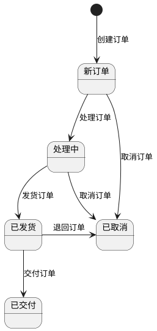

状态机是一个非常有用的设计模式，可以大大简化使用应用代码对复杂状态管理、校验、流转时的复杂性。用好状态机，可以让代码更加精致，也更简洁。

## 01 为什么需要状态机？

假设我们正在开发一个电子商务平台的订单处理系统。订单通常会经历多个状态，例如：

- 新订单
- 已支付
- 已发货
- 已交付
- 已取消

在这个场景中，订单状态的变化必须符合业务规则，比如：

- 新订单可以被取消或支付。
- 已支付的订单可以被发货或取消。
- 已发货的订单可以被交付。

如果用Java 代码来写的话，每一次状态变化都需要校验一次。如果不使用状态机，可能会通过多个if-else或switch-case语句来管理这些状态转换。这种方式不仅代码繁琐，而且随着业务逻辑的复杂化，会导致代码难以维护。


例如：

```java
public class Order {
    private OrderState state;

    public Order() {
        this.state = OrderState.NEW;
    }

    public void pay() {
        if (state == OrderState.NEW) {
            state = OrderState.PAID;
        } else {
            throw new IllegalStateException("Order cannot be paid in state: " + state);
        }
    }

    public void ship() {
        if (state == OrderState.PAID) {
            state = OrderState.SHIPPED;
        } else {
            throw new IllegalStateException("Order cannot be shipped in state: " + state);
        }
    }
    // 下面同理不浪费篇幅了
}

```

我们可以把状态控制的部分抽出来，然后提前约定一个流转规则就行了，实现这个流转规则的代码我们就成为状态机。我们可以用 UML 把上面的状态流转，绘制成状态图（使用 PlantUML 绘制）。



**状态机的本质是把流程控制逻辑和普通业务逻辑做分离**。如果流程控制逻辑没有那么明显，也就没有那么必要使用状态机，引入不必要的复杂性，同理，如果希望流程更加灵活，可以通过非编程的方式动态组织这些流程，那么可能流程引擎更适合，而不是状态机。

状态机为什么这么小众，还是因为使用的场景过于狭窄。

## 02 实现一个状态机

其实实现一个状态机很简单，可以像下面这样，一个类就能完成。

```java
import java.util.HashMap;
import java.util.Map;
import java.util.Set;
import java.util.function.Consumer;

class StateMachine<S, E> {
    private S currentState;
    private final Map<S, Map<E, S>> transitions = new HashMap<>();
    private final Map<S, Consumer<E>> entryActions = new HashMap<>();
    private final Map<S, Consumer<E>> exitActions = new HashMap<>();

    public StateMachine(S initialState) {
        this.currentState = initialState;
    }

    public void addTransition(S fromState, S toState, E event) {
        transitions.computeIfAbsent(fromState, k -> new HashMap<>()).put(event, toState);
    }

    public void setEntryAction(S state, Consumer<E> action) {
        entryActions.put(state, action);
    }

    public void setExitAction(S state, Consumer<E> action) {
        exitActions.put(state, action);
    }

    public boolean handleEvent(E event) {
        Map<E, S> stateTransitions = transitions.get(currentState);
        if (stateTransitions != null) {
            S nextState = stateTransitions.get(event);
            if (nextState != null) {
                // Perform exit action for the current state
                if (exitActions.containsKey(currentState)) {
                    exitActions.get(currentState).accept(event);
                }

                // Transition to the next state
                currentState = nextState;

                // Perform entry action for the new state
                if (entryActions.containsKey(currentState)) {
                    entryActions.get(currentState).accept(event);
                }
                return true;
            }
        }
        return false;
    }

    public S getCurrentState() {
        return currentState;
    }

    public Set<E> getAvailableEvents() {
        Map<E, S> stateTransitions = transitions.get(currentState);
        return stateTransitions != null ? stateTransitions.keySet() : Set.of();
    }
}
```

这里面有几个概念：

- 状态转换：或者叫状态流，需要定义那两个状态之间的转换是被允许的。
- 事件：能够触发的事件信息。
- 事件处理器：定义进入状态和退出状态时的钩子函数。

下面是一个使用的例子：

```java
public class SimpleStateMachineExample {
    enum OrderState {
        NEW, PROCESSING, SHIPPED, DELIVERED, CANCELLED
    }

    enum OrderEvent {
        PROCESS_ORDER, SHIP_ORDER, DELIVER_ORDER, CANCEL_ORDER, RETURN_ORDER
    }

    public static void main(String[] args) {
        StateMachine<OrderState, OrderEvent> orderStateMachine = new StateMachine<>(OrderState.NEW);

        // 定义状态转换
        orderStateMachine.addTransition(OrderState.NEW, OrderState.PROCESSING, OrderEvent.PROCESS_ORDER);
        orderStateMachine.addTransition(OrderState.PROCESSING, OrderState.SHIPPED, OrderEvent.SHIP_ORDER);
        orderStateMachine.addTransition(OrderState.SHIPPED, OrderState.DELIVERED, OrderEvent.DELIVER_ORDER);
        orderStateMachine.addTransition(OrderState.NEW, OrderState.CANCELLED, OrderEvent.CANCEL_ORDER);
        orderStateMachine.addTransition(OrderState.PROCESSING, OrderState.CANCELLED, OrderEvent.CANCEL_ORDER);
        orderStateMachine.addTransition(OrderState.SHIPPED, OrderState.CANCELLED, OrderEvent.RETURN_ORDER);

        // 定义状态处理器
        orderStateMachine.setEntryAction(OrderState.PROCESSING, event -> System.out.println("Order is being processed."));
        orderStateMachine.setExitAction(OrderState.PROCESSING, event -> System.out.println("Exiting processing state."));

        // 模拟触发一个事件
        simulateEvent(orderStateMachine, OrderEvent.PROCESS_ORDER);
        simulateEvent(orderStateMachine, OrderEvent.SHIP_ORDER);
        simulateEvent(orderStateMachine, OrderEvent.DELIVER_ORDER);

        System.out.println("Final State: " + orderStateMachine.getCurrentState());
    }

    private static void simulateEvent(StateMachine<OrderState, OrderEvent> stateMachine, OrderEvent event) {
        System.out.println("Current State: " + stateMachine.getCurrentState());
        System.out.println("Handling Event: " + event);
        if (!stateMachine.handleEvent(event)) {
            System.out.println("Event " + event + " cannot be handled from state " + stateMachine.getCurrentState());
        }
        System.out.println("New State: " + stateMachine.getCurrentState());
        System.out.println("------------------------");
    }
}
```

也可以升级一下状态机，把定义状态转换、定义状态处理器这些逻辑定义成 DSL，放到配置文件中，也可以可视化状态转换的过程、审计日志。

这就是把**状态逻辑和业务逻辑分离**的价值。

上面这个状态机太简陋了，但是大多数场景下也够用，想实现我们提到的更多功能，用于调试、管理状态变化，可以用一些更加专业的库来实现。

## 03 使用 Spring Statemachine 项目

Spring Statemachine 就是一个基于 Spring 生态的状态机库。 那么如果是 Spring 这个框架来做的话，有什么更多特性呢？

### 支持层级状态

Spring Statemachine 支持层级（嵌套）状态，这意味着一个状态机可以包含另一个状态机。这对于需要处理复杂逻辑的应用程序特别有用，可以将状态分层，减少复杂性。

### 支持并发状态

前面的状态机非常致命的一个地方就是并发，如果状态机是一个单例类就会出现并发问题，如果为每一次请求创建一个状态机实例可以避免并发问题，但是这样会频繁创建和销毁对象。

如果上锁，系统串行化更不划算。

Spring Statemachine 基于一些并发编程的模式，优化了这里，所以更加高效。

### 其它特性

这些特性一提大家都明白，就不过多展开了。

- 图形化状态图生成
- 动态添加和移除状态
- 支持条件状态转换，这个是指除了固定的状态转换外，可以带上条件。例如，报销审批单总价小于100就不用审批。
- 异步事件处理

## 04 Spring Statemachine 使用示例

Spring Statemachine 支持使用 YAML 来定义规则，这样定义状态就非常直观。

```yaml
statemachine:
  states:
    - READY
    - PROCESSING
    - COMPLETED
    - ERROR
  transitions:
    - from: READY
      to: PROCESSING
      event: START_PROCESS
    - from: PROCESSING
      to: COMPLETED
      event: COMPLETE_PROCESS
    - from: PROCESSING
      to: ERROR
      event: ERROR_OCCURRED
```

```java

@Configuration
public class MyStateMachineConfig extends StateMachineConfigurerAdapter<String, String> {

    @Value("${statemachine.states}")
    private List<String> states;

    @Value("#{${statemachine.transitions}}")
    private List<Map<String, String>> transitions;

    @Override
    public void configure(StateMachineStateConfigurer<String, String> states) throws Exception {
        // 配置初始状态和其他状态
        states.withStates()
                .initial(this.states.get(0)) // 假设第一个状态为初始状态
                .states(new HashSet<>(this.states)); // 添加所有状态
    }

    @Override
    public void configure(StateMachineTransitionConfigurer<String, String> transitions) throws Exception {
        for (Map<String, String> transition : this.transitions) {
            transitions.withExternal()
                    .source(transition.get("from"))
                    .target(transition.get("to"))
                    .event(transition.get("event"));
        }
    }
}
```
其实 Spring Statemachine 本身不直接支持 YAML 配置，但通过结合 Spring Boot 和 YAML 文件，我们可以方便地管理状态机的配置。

根据我们这个系列前面关于如何处理业务规则的文章，把状态纳入业务规则也是一种非常有用的技巧，这样业务人员就能很容易看到当前系统如何实现这些状态了。

## 05 补充：有限状态机和无限状态机

有限状态机 FSM(finite-state machine) 是一种具有有限个状态的抽象机器，它可以从一个状态转换到另一个状态。FSM 可以通过输入的事件或条件来改变其状态。FSM 通常用作控制系统和计算机科学中的逻辑电路、协议分析等。

由于很多场景下，有限状态机模型和业务非常匹配，所以是一个非常好的设计模式。其实我们写在业务代码中，也在使用这个模型，前面的 Order 类中每个方法就是事件处理函数，只不过我们并没有把业务逻辑和状态管理逻辑分离而已。

那么为什么叫有限呢？因为还有无限状态机（Infinite State Machine）。无限状态机拥有无限个状态，通常适用于状态数量是动态的或不可预见的情况。

有限状态机和无限状态机是两种描述系统行为的方法。为了更好地理解它们之间的区别，可以将它们比作现实生活中的不同场景：有限状态机常用于模型中需要管理固定数量的状态的问题，如业务单据流转、简单的游戏关卡、协议解析等。

无限状态机可以比作一个计数器，像一个水表或电表。每次用水或电（输入），计数器的读数（状态）都会增加，理论上这个数可以无限增长。无限状态机适用于那些状态不是事先固定或可以无限变化的问题，如动态内存管理、实时数据流处理、复杂软件系统的调度。

## 参考资料

- https://spring.io/projects/spring-statemachine
- 项目终于用上了Spring状态机，非常优雅！ https://zhuanlan.zhihu.com/p/632003000
- Spring状态机的介绍与使用 https://www.cnblogs.com/yunjie0930/p/17954492
- How to implement a FSM - Finite State Machine in Java https://stackoverflow.com/questions/13221168/how-to-implement-a-fsm-finite-state-machine-in-java

