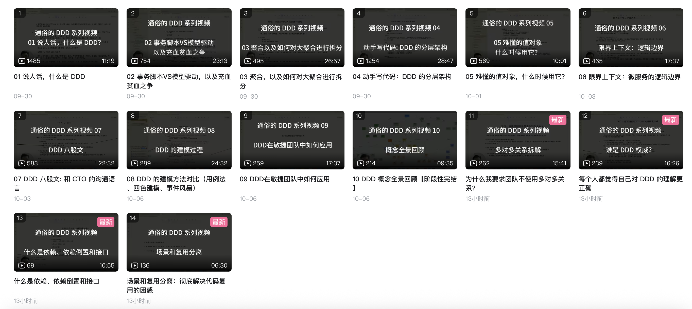

这段时间公众号没有更新，其中一个原因就是在准备一套 DDD 视频，作为多年的技术总结。

其次就是之前胆囊手术后感觉不太舒服，所以大家也要注意身体健康，这个很重要。

在一些网友的建议下，希望我出一套系统性的教程。

所以经过一段时间准备，我在国庆期间肝了一套 DDD 视频《通俗的 DDD 系列视频》，包含了 DDD 领域驱动设计的核心概念和实践方法。视频中我详细讲解了 DDD 的分层架构、领域模型、聚合根、值对象、事件驱动架构等核心概念，同时也分享了一些实际项目中的 DDD 实践经验。

我把这些内容都放到 B 站和视频号中了。

如果有什么问题可以在评论区留言，我会在后续的视频中回答。

## 目录

已经完成：

- 01 说人话，什么是 DDD， DDD 是一门技术吗？
- 02 事务脚本VS模型驱动，以及充血贫血之争
- 03 聚合，以及如何对大聚合进行拆分
- 04 动手写代码：DDD 的分层架构
- 05 值对象，其实就是“字段包”
- 06 限界上下文：逻辑边界
- 07 DDD 八股文
- 08 DDD 的建模过程
- 09 DDD在敏捷团队中如何应用
- 10 DDD 概念全景回顾【阶段性完结】
- 每个人都觉得自己对 DDD 的理解更正确
- 为什么我要求团队不使用多对多关系？
- 讲讲什么是依赖、依赖倒置和接口
- 场景和复用分离：彻底解决代码复用的困惑

正在制作：

- ArchUnit 为 DDD 架构自动化检查 
- DDD 项目单元测试和API测试
- 对象转换专题

## 内容摘要总结（AI 整理）

### 核心理念与代码风格

* DDD的本质：核心是设计出能准确反映业务的领域模型，并以此为基础构建软件，从而提升代码的可读性、可维护性，并保证业务逻辑的一致性。
* 模型驱动 vs 事务脚本：DDD 推崇模型驱动设计，与传统的“事务脚本”（面向过程的写法）和“Smart UI”形成对比。它要求我们回归面向对象的初心，将数据和操作数据的行为封装在一起。
* 充血模型是首选：DDD 倡导充血模型，即对象不仅有数据，还包含处理自身状态和业务规则的逻辑。同时要警惕“涨血”，避免将不属于对象自身职责的行为强加给它。

### 战术设计核心模式

* 聚合：将一组关联的业务对象组合成一个一致性边界，并指定一个聚合根作为唯一入口。它是程序设计的“骨架”，能保证业务规则的完整性、降低对象间的耦合。
* 值对象：没有唯一标识、通过属性值判断相等、且不可变的对象。可以理解为“字段包”，用于封装一组描述性属性，如“地址”、“金额”等，能有效减少重复定义。
* 分层架构：DDD 常用的架构有四层架构、六边形架构等，核心是分离关注点。实践中建议 ApplicationService 处理具体用例场景，DomainService 处理可复用的核心领域逻辑。

### 战略设计与建模过程

* 限界上下文：一个明确的逻辑边界，确保领域模型在这个边界内有单一、无歧义的含义。在单体中用于划分模块，在微服务架构中通常对应一个微服务。
* 建模方法：核心是通过不同线索寻找领域对象。常用方法包括用例分析法、四色建模、事件风暴等。
* 高层概念：包括战略设计与战术设计的区分、建立团队通用的语言、强调协作共创等，这些是技术走向管理需要理解的视角。

### 重要实践原则

* 警惕多对多关系：多对多关系在现实中往往不存在，它通常隐藏了某个重要的中间模型，会导致业务边界不清，应尽量避免。
* 场景与复用分离：真正的代码复用源于上下文无关的逻辑。应将特定场景的编排代码与可复用的核心领域逻辑分离开。
* 接口的意义：接口是“契约”，应该用在真正需要扩展点的地方（如策略模式），而不是为每个 Service 都创建接口。
    
## B站观看

https://space.bilibili.com/2066241928/lists/6451832?type=season

## 视频号观看

01 说人话，什么是 DDD， DDD 是一门技术吗？

https://weixin.qq.com/sph/Aj8hRQvDb

02 事务脚本VS模型驱动，以及充血贫血之争

https://weixin.qq.com/sph/AqNtqkflt

03 聚合，以及如何对大聚合进行拆分

https://weixin.qq.com/sph/AoBgDZ3JA

04 动手写代码：DDD 的分层架构

https://weixin.qq.com/sph/AVVGCBCr1

05 值对象，其实就是“字段包” - 理解值对象 

https://weixin.qq.com/sph/Am6qzEzKa

06 限界上下文：逻辑边界 - 为什么需要限界上下文？ 

https://weixin.qq.com/sph/AEpbQGW31

07 DDD 八股文 - 程序员可能不太喜欢但管理者非常关心的概念

https://weixin.qq.com/sph/AASWAMqCT

08 DDD 的建模过程 - 系统词汇法（OOA）

https://weixin.qq.com/sph/AQWPGjto5

09 DDD在敏捷团队中如何应用

https://weixin.qq.com/sph/AVhjDjYb2

10 DDD 概念全景回顾【阶段性完结】

https://weixin.qq.com/sph/AgktPDKBB

为什么每个人都觉得自己对 DDD 的理解更正确？ 【番外篇】

https://weixin.qq.com/sph/AQXYznrma

讲讲什么是依赖、依赖倒置和接口【番外篇】

https://weixin.qq.com/sph/Aah8bO2Lq

为什么我要求团队不使用多对多关系？【番外篇】

https://weixin.qq.com/sph/AejBkXZY0

场景和复用分离：彻底解决代码复用的困惑【番外篇】

https://weixin.qq.com/sph/Am9pWhpGj