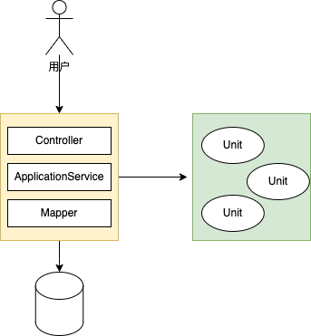
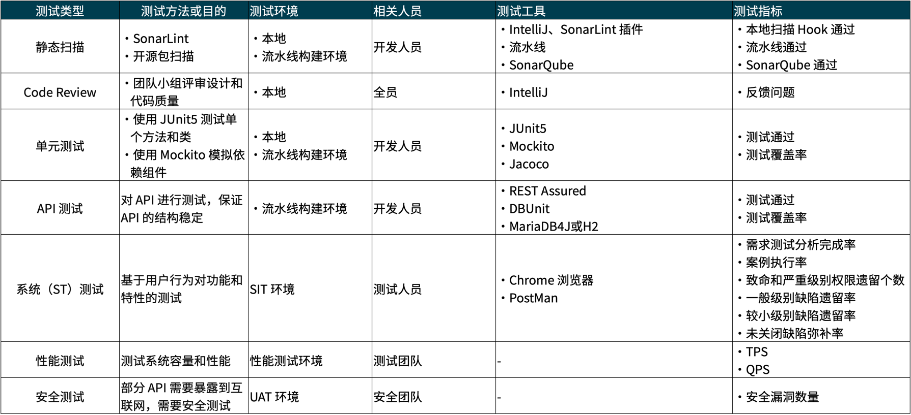

## 单元测试推广的难题

前几天被一些朋友问到怎么提高测试覆盖率，并同时有人表示在国内推广单元测试几乎不可能。

诚然在国内的项目中，推广单元测试非常困难。

其实这里面有一个误区，如果单元测试不能起到助力开发团队作用，而是一种政治任务，那么很难推广。

我所在的海外和国内的项目都还保持不错的测试覆盖率，所以我是这样回复这个问题的：

```java
提高测试覆盖率需要设计足够好的测试策略，让单元测试或自动化 API 测试起到它的作用，而又不带有过多的负担。

其核心原理是：单元测试只关注上下文无关（领域）的测试，结合 API 测试做集成测试（E2E），并驱动团队把逻辑从上下文剥离并挤压到领域内。 
```

如果单元测试关注上下文无关的逻辑，那么带来的好处显而易见。

当程序出现错误且大概能猜到某些组件的问题时，可以通过快速运行该处的测试，这样可以快速修复问题，可以加速代码的调试。

另外，单元测试与上下文无关的好处是减少 Mock，让单元测试写起来简单容易上手。

单元测试难以被推广的原因是编写测试会占用大量的时间，而国内的项目往往时间又比较赶。

从我个人体验来说，编写单元测试可以明显减少调试时间。一方面，有单元测试覆盖的代码更加健壮，另一方面，需要调试时，可以快速启动单元测试调试，无需启动整个应用，并准备大量的测试数据库。

不过要做到这一点需要在项目框架搭建时充分考虑，并提前制定测试策略。

下面介绍一种基于 E2E + Unit 结合的研发自测测试策略，在开始介绍之前这里先啰嗦几句，让我们在程序设计时就考虑到编写测试的方便性。

## 上下文剥离的编程思想

在入行时，我问过我的领导一个问题: 如何合理设计一个公用方法，能适应各种场景？

他的回答是保持方法短小精简，一个方法只做一件事，并让我去看一些面向对象设计的书。

这个回答对我帮助并不大，因为无论设计方法多小，某些场景下还是需要修改方法参数来适应不同的场景。

真正让我备受启发的还是《领域驱动设计》（然后现在 DDD 的讨论走向了某种极端的方向，但是这本书还是非常有价值），在该书中提到了上下文（Context）这个概念，以及应用、领域分层的思想。

我认为这些思想的价值比 SOLID 原则更大。

我们并不需要追求方法大小是否足够小，也不用追求微服务是否足够小，只需要遵守一个编程原则：

**需要复用代码，尽量上下文无关。**

这个思想我在《架构原则：应用和服务分离》单独提到过，不过这里是为了补充这个原则对测试策略的意义。

用一个汽车建造的例子来比喻软件开发。

我们无法像积木一样把汽车拆分为模块化的（虽然理想很丰满），而是将各种零件附着在车架上。

我们可以把这个车架看做一种上下文，那么某些标准件零件看做第三方库提供的 API，这些零件依赖对方的出厂测试。

一些定制化本厂非标准零件，就像自己代码库中的一些和上下文无关的领域逻辑、Util 方法。

车架上无法拆分下来的活动件，可以看做私有方法。

那么我们复用和测试逻辑是：

**尽可能的从上下文中剥离逻辑，这样在复用和测试上都能获得便利。**



上图左边很难拆分出单元，而右边非常容易的看做单元测试，并且右边很容易被组合。

## 基于 E2E + Unit 的研发自测策略

基于上图我们可以获得一个简单的测试策略：

1. 使用自动化的 E2E 测试（一般是 API 测试）和上下文有关的代码
2. 使用单元测试处理和上下文无关的领域代码或者静态方法

这个测试策略已经在《研发自测》的开源电子书中 API 测试章节提到了，参考相关链接：https://java-self-testing.github.io/java-self-testing-book/

仅仅为 API 覆盖常见场景的自动化测试（Happy Path），如果程序中存在分支，应该将其抽到领域或其它和上下文无关的类中，然后通过单元测试覆盖这些异常分支。 

避免为 API 测试准备太多的测试数据，尽可能将分支语句拆分到独立的领域服务、Util、Checker、Assembler 这类职责鲜明的类中，再由单元覆盖。由于和上下文无关的代码模拟更简单，工作量和运行时间都比较少。

在长期实践过程中，API 测试可以用如下技术选型：

1. 使用一套专用的测试框架，例如： REST Assured、Karate Framework、Mock MVC
2. 使用内嵌的数据库，例如 H2、MariaDB4J（完美兼容 Mysql）
3. DBUnit 备份和还原数据库状态
4. 使用 Mockito 的 MockBean 或者 WireMock 第三方系统
5. 使用 JaCoCo 统计测试覆盖率

在单元测试方面，使用的测试工具选型简单很多，可以复用 API 测试的基础设施，主要包括：

1. JUnit：作为一套主流的单元测试框架，目前主流版本是 JUnit 5 
2. Mockito：使用单元测试对依赖进行模拟必不可少，可以使用 Mockito 和 Powermock 解决依赖模拟的问题
3. AssertJ：补充 JUnit 自带的断言能力，实现链式断言

基于 E2E + Unit 的测试策略，我将其比喻为"瓜藤"模型。

可以把"瓜"看做和上下文无关的业务逻辑，这样可以通过单元测试方便快速覆盖；把"藤蔓"看做和框架、上下文紧密耦合的逻辑，这些逻辑使用单元测试来覆盖其可靠性的性价比太低了，索性我们就不再覆盖。


"瓜藤"模型是一个很好的比喻，用来给开发团队解释为什么我们要这样设定，从而驱动出良好清晰的代码结构。

## TDD 和 Tasking

"瓜藤"模型顺便也解决了另外一个问题：如何更好地理解 TDD 和 Tasking。

TDD 的含义是测试驱动开发（Test-driven development），倡导先写测试再写实现，这样可以获得较好的代码设计。

然而，TDD 操作起来并不容易，其中最大的原因就是开发者很难一开始做出合理的任务拆分（Tasking），进而编写出有效的测试。

原因其实很简单，普通人拆分任务依然是线性拆分，这在面向过程（C 或者 Python 等）的程序中没有问题，但是在 Java 这样的面向对象语言中操作很困难。

例如如果一个任务，我们可以拆分为 A、B、C 三个方法，按照面向过程和先后顺序的思想是，A → B → C。

而另外一种思路是，A → B，得到结果后再 A 直接调用 C，这样 A、B、C 很容易被拆分到不同的类中，履行不同的职责。

这两种思路在使用 TDD 时，会有明显区别。如果是 A → B → C 的模式，需要模拟和准备数据的工作会更多。而 A → B,C 模式则会少很多。

我们可以把 A → B,C 模式中的 A 看做编排流程，B,C 则都是原子性的业务逻辑。为 A 编写一个 E2E 测试，并将更细节的实现逻辑拆分为 B,C，使用单元测试来完成验证。

A 看做"藤"，B 和 C 可以看做"瓜"。

所以，Tasking 拆分的重点不是分割前后关系，而是怎么尽可能从整体上剥离出可以分解出和应用上下文无关的业务逻辑。

我整理了一个顺口溜来描述 Tasking 技巧： TDD 不着急，先写一个 E2E；Tasking 要分析，拆分多个 Unit；

## 和测试人员配合的测试策略

除了研发自测的测试策略外，还需要配合测试人员整理出整个团队的测试策略。

整个团队的测试策略需要包括测试类型、测试方法和目的、测试环境、相关人员、测试工具和测试指标能内容。

好的测试策略是团队就软件质量达成的共识，可以减少不必要的团队冲突。

结合测试人员的测试策略，这里整理了一张表可以参考：



## 参考资料

- https://en.wikipedia.org/wiki/Test-driven_development
- https://en.wikipedia.org/wiki/Test_strategy

