开发者在刚开始尝试实现自己的微服务架构时往往会产生一系列问题 ：

- 微服务到底应该怎么划分？
- 一个典型的微服务到底应该有多微？
- 如果做了微服务设计，最后真的会有好处吗？

回答上面的问题需要首先了解微服务设计的逻辑，科学的架构设计应该通过一些输入并逐步推导出结果，架构师要避免凭空设计和“拍脑门”的做法。

**解耦的单体应用和微服务系统在逻辑上是一样的。** 对于服务拆分的逻辑来说，先设计高内聚低耦合的领域模型，再实现相应的分布式系统是一种比较合适的方式。服务的划分有一些基本的方法和原则，通过这些方法能让微服务划分更有操作性。最终在微服务落地实施时也能按图索骥，无论是对遗留系统改造还是全新系统的架构都能游刃有余。

## 微服务拆分的几个阶段

在开始划分微服务之前，架构师需要在大脑中有一个重要的认识：微服务只是手段，不是目的。

微服务架构是为了让系统变得更容易拓展、更富有弹性。在把单体应用变成靠谱的微服务架构之前，单体系统的各个模块应该是合理、清晰地。也就是说，从逻辑上单体系统和微服务没有区别，某种理想情况下微服务只是把单体系统的各个模块分开部署了而已（最近流行的monorepo把多个服务的代码仓库以模块的形式组织到了一起，证明了这一点）。

大量的实践教训告诉我们，混沌的微服务架构，比解耦良好的单体应用会带来更多麻烦。

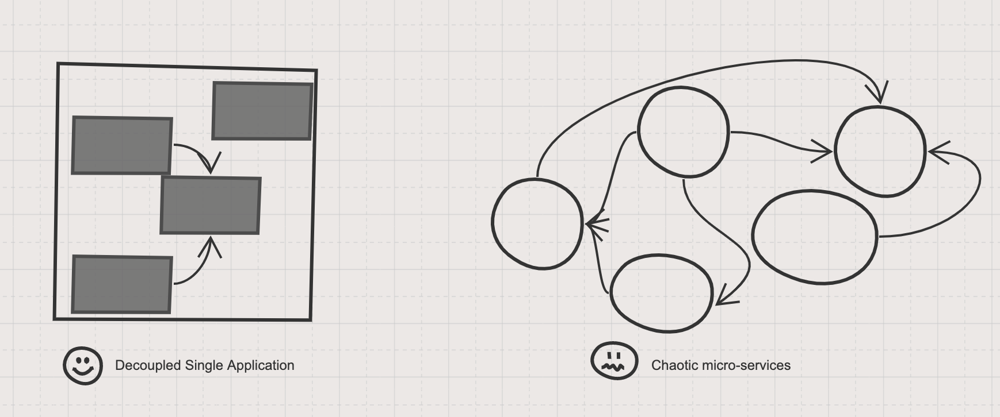

（混乱的微服务VS良好的单体）

开源社区为此进行了大量讨论，试图对系统解耦寻找一种行之有效的方法，因此具有十几年历史的领域驱动设计（DDD）方法论被重新认识。领域驱动设计立足于面向对象思想，从业务出发，通过领域模型的方式反映系统的抽象，从而得到合理的服务划分。

采用 DDD 来进行业务建模和服务拆分时，可以参考下面几个阶段：

- 使用 DDD（领域驱动建模） 进行业务建模，从业务中获取抽象的模型（例如订单、用户），根据模型的关系进行划分限界上下文。
- 检验模型是否得到合适的的抽象，并能反映系统设计和响应业务变化。
- 从 DDD 的限界上下文往微服务转化，并得到系统架构、API列表、集成方式等产出。

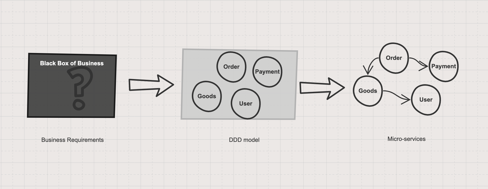

（使用DDD划分微服务的过程）

## 如何抽象？

抽象需要找到看似无关事务的内在联系，对微服务的设计尤为重要。

假设有一天，你在某电商网站购买了一台空调，当你支付了空调订单的费用后，又让你再次支付安装订单费用，你肯定大为光火。原因仅仅可能是架构师在设计系统时，为空调这种普通产品生产了一个订单，而安装作为了另外业务逻辑生成了单独的订单。

你一定觉得这个例子太傻了，架构师不会这点都没考虑到，”安装“ 应该被抽象成一个产品，而”安装行为“可以作为另外一个服务实现。然而现实的例子比比皆是，电信或移动营业厅还需要用户分两步办理号卡业务、宽带业务。原始是不合适的抽象模型造成的，并最终影响了微服务的划分。

我们可以使用概念图来描述一些概念的抽象关系。

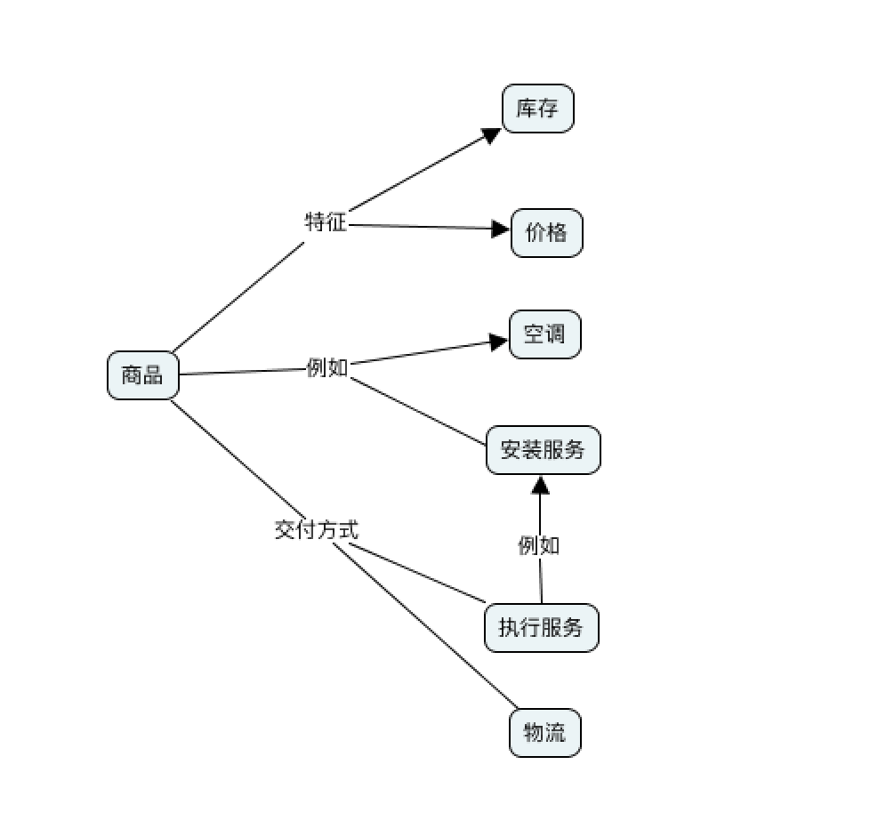
（商品这一概念的概念图）
如果没有抽象出领域模型，就得不到正确的微服务划分。

## 使用DDD进行业务建模

通过利用DDD对系统从业务的角度分析，对系统进行抽象后，得到内聚更高的业务模型集合，在DDD中一组概念接近、高度内聚并能找到清晰的边界的业务模型被称作限界上下文（Bounded Context）。

限界上下文可以视为逻辑上的微服务，或者单体应用中的一个组件。在电商领域就是订单、商品以及支付等几个在电商领域最为常见的概念；在社交领域就是用户、群组、消息等。

DDD的方法论中是如何找到子系统的边界的呢？

其中一项实践叫做事件风暴工作坊，工作坊要求业务需求提出者和技术实施者协作完成领域建模。把系统状态做出改变的事件作为关键点，从系统事件的角度触发，提取能反应系统运作的业务模型。再进一步识别模型之间的关系，划分出限界上下文，可以看做逻辑上的微服务。

事件是系统数据流中的关键点，类似于电影制作中的关键帧。在未建立模型之前，系统就像是一个黑盒，不断的刺探系统的状态的变化就可以识别出某种反应系统变化的实体。

例如系统管理员可以登录、创建商品、上架商品，对应的系统状态的改变是用户已登录、商品已创建、商品已经上架；相应的顾客可以登录、创建订单、支付，对应的系统状态改变是用户已登录、订单已创建、订单已支付。

于是可以通过收集上面的事件了解到，“哦，原来是商品相关事件是对系统中商品状态做出的改变，商品可以表达系统中某一部分，商品可以作为模型”。

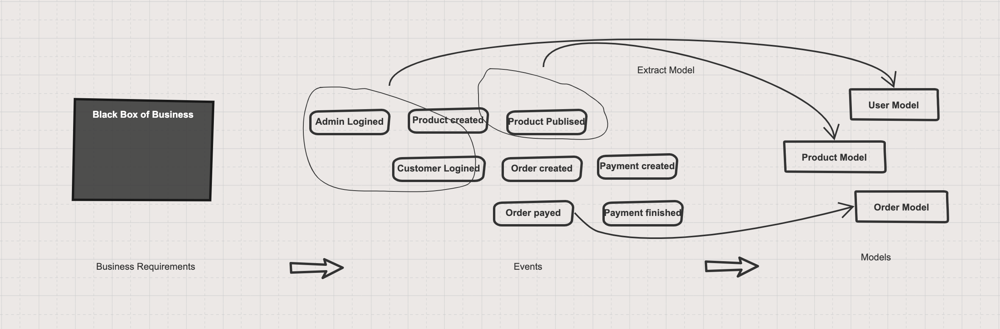

（利用事件刺探业务黑盒并抽象出模型）

在得到模型之后，通过分析模型之间的关系得出限界上下文。例如商品属性和商品相对于用户、用户组关系更为密切，通过这些关系作出限界上下文拆分的基本线索。

其次是识别模型中的二义性，让限界上下文划分更为准确。

例如，在电商领域，另外一个不恰当设计的例子是：把订单中的订单项当做和商品同样的概念划分到了商品服务，但订单中的商品实际上和商品库中的商品不是同一个概念。当订单需要修改订单下的商品信息时，需要访问商品服务，这势必造成了订单和商品服务的耦合。

合理的设计应该是：商品服务提供商品的信息给订单服务，但是订单服务没有理由修改商品信息，而是访问作为商品快照的订单项。订单项应该作为一个独立的概念被划分到订单服务中，而不是和商品使用同一个概念，甚至共享同一张数据库表。

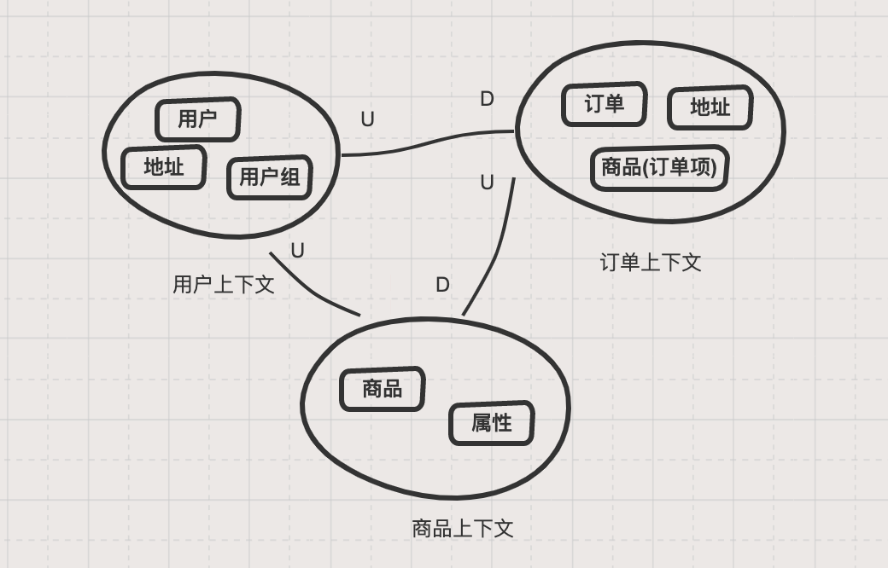

（典型具有”二义性“陷阱的场景）

”订单下的商品“和”商品“在不同的系统中实际上表达不同的含义，这就是术语”上下文“的由来。一组关系密切的模型形成了上下文（context），二义性的识别能帮我们找到上下文的边界（bounded）。同样的例子还有 “订单地址” 和 “用户地址”的区别。

当然，在DDD中具体识别限界上下文的线索还很多，例如模型的生命周期等，我们会在后面的文章中逐步展开。在后续的文章中，我们会介绍更多关于 DDD 和事件风暴的思想和原理。

## 验证和评审领域模型

前面我们说到限界上下文可以作为逻辑上的微服务，但并不意味着我们可以直接把限界上下文变成微服务。在这之前很重要的一件事情是对模型进行验证，如果我们得到的限界上下文被抽象的不良好，在微服务实施后并不能得到良好的拓展性和重用。

限界上下文被设计出来后，验证它的方法可以从我们采用微服务的两个目的出发：降低耦合、容易扩展，可以作为限界上下文评审原则：

原则1，设计出来的限界上下文之间的互相依赖应该越少越好，依赖的上游不应该知道下游的信息。（被依赖者，例如订单依赖商品，商品不需要知道订单的信息）。
原则2，使用潜在业务进行适配，如果能在一定程度上响应业务变化，则证明用它指导出来的微服务可以在相当一段时间内足以支撑应用开发。

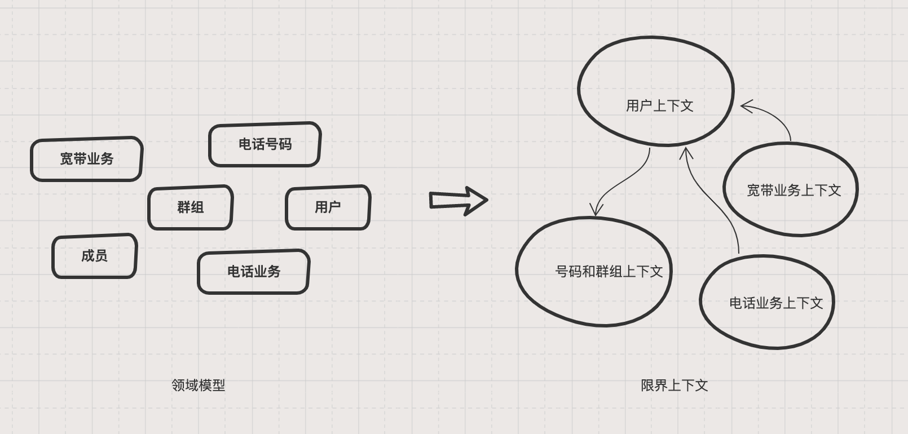
（一般抽象程度的领域模型）

上图是一个电信运营商的领域模型的局部，这部分展示了电信号码资源以及群组、用户、宽带业务、电话业务这几个限界上下文。主要业务逻辑是，系统提供了号码资源，用户在创建时会和号码资源进行绑定写卡操作，最后再开通电话或宽带业务。在开通电话这个业务流程中，号码资源并不需要知道调用者的信息。

但是理想的领域模型往往抽象程度、成本、复用性这几个因素中获取平衡，软件设计往往没有理想的领域模型，大多数情况下都是平衡各种因素的苟且，因此评审领域模型时也要考虑现实的制约。

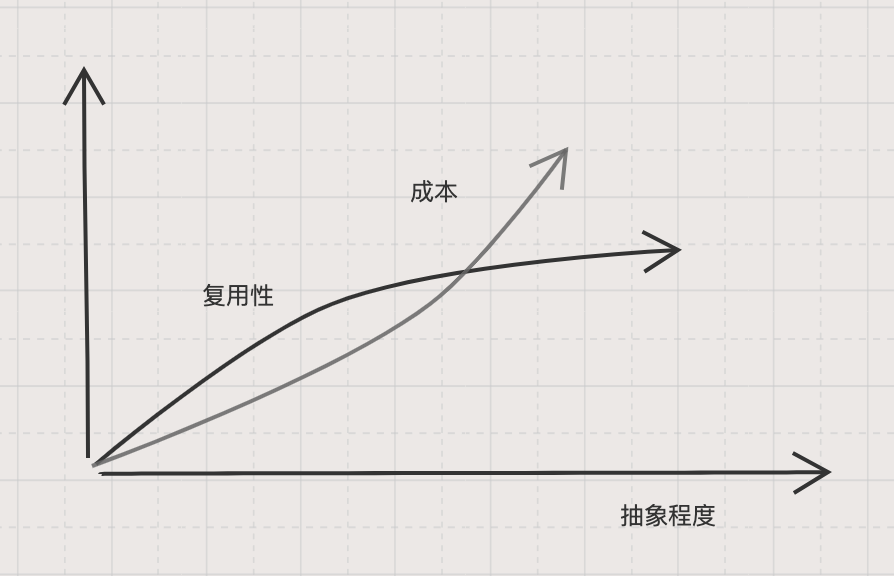
（”抽象”的成本）

用一个简单的图来表达话，我们的领域模型设计往往在复用性和成本取得平衡的中间区域才有实用价值。前面电信业务同样的场景，业务专家和架构师表示，我们需要更为高度的抽象来满足未来更多业务的接入，因此对于两个业务来说，我们需要进一步抽象出产品和订单的概念。

但是同时需要注意到，我们最终落地时的微服务会变得更多，也变得更为复杂，当然优势也是很明显的 —— 更多的业务可以接入订单服务，同时订单服务不需要知道接入的具体业务。对于用户的感知来说，可以一次办理多个业务并统一支付了，这正是某电信当前的痛点之一。

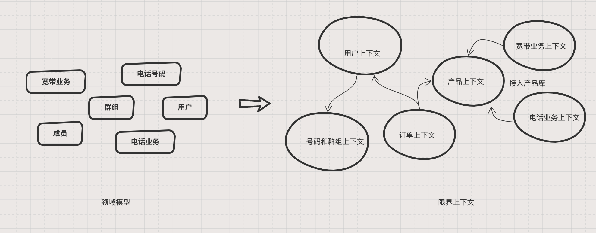
（高度抽象的领域模型）

## 几个典型的误区

在大量使用DDD指导微服务拆分的实践后，我们发现很多系统设计存在一些常见的误区，主要分为三类：未成功做出抽象、抽象程度过高、错误的抽象。

### 未成功做出抽象

在实际开发过程中，大家都有一个体会，设计阶段只考虑了一些常见的服务，但是发现项目中有大量可以重用的逻辑，并应该做成单独服务。当我们在做服务拆分时，遗漏了服务的结果是有一些业务逻辑被分散到各个服务中，并不断重复。

以下是一个检查单，帮助你检查项目上常见的抽象是否具备：

- 用户
- 权限
- 订单
- 商品
- 支付
- 账单
- 地址
- 通知
- 报表单
- 日志
- 收藏
- 发票
- 财务
- 邮件
- 短信
- 行为分析

### 错误抽象

对微服务或DDD理解不够。模型具有二义性，被放到不同的限界上下文。例如，订单中的收货地址、用户配置的常用地址以及地址库中的标准地址。这三种地址虽然名称类似，但是在概念上完全不是一回事，假如架构师将”地址“划分到了标准地址库中，势必会造成用户上下文和系统配置上下文、订单上下文存在不必要的耦合。

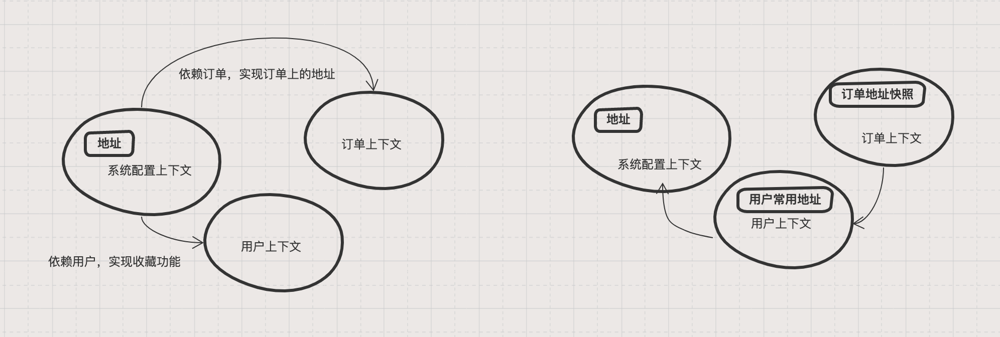
（左边为抽象错误带来的依赖，右边为正确的依赖关系）

上图的右边为正常的依赖关系，左边产生了不正常的依赖，会进一步产生双向依赖。

在系统设计时，领域模型的二义性是一个比较难以识别和理解问题。好在我们可以通过画概念图来梳理这些概念的关系，概念图是中学教辅解释大量概念的惯用手段，在表达系统设计时一样有用。

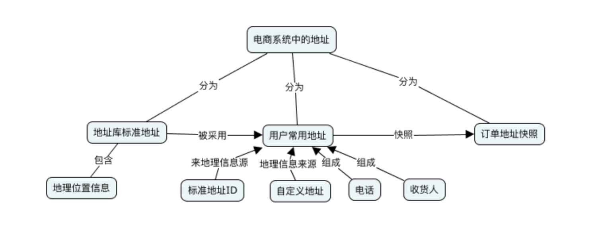
（电商系统中“地址”概念的梳理）

与地址类似的常见还有商品和订单项中的商品；用户和用户组之间有一个成员的概念；短信的概念应该更为具体到一条具体的短信和短信模板的区别。

### 组织对架构的干预

另外一种令人感到惊讶的架构问题是企业的组织架构和团队划分影响了领域模型的正确建立。有一些公司按照渠道来划分了团队，甚至按照 To C （面向于用户）和 To B（面向企业内部）划分的团队，最终设计出来的限界上下文中赫然出现 ”C端文章服务“，”B端文章服务“。

不乏有一些公司因为团队职责的关系，将本应该集中的服务不得已下放给应用或者BFF（面向前端的backend）。对于这类问题，其实超出了DDD能解决的范围，只能说在建模时警惕此类行为对系统造成很严重的影响。

另外企业组织架构和技术架构的关系，请参考康威定律的叙述。一个由无数敏捷团队组成的企业，和微服务有天然的联系；传统实时瀑布模型的企业，在大型软件时代竞争力十足，但是在互联网时代却无力应对变化。

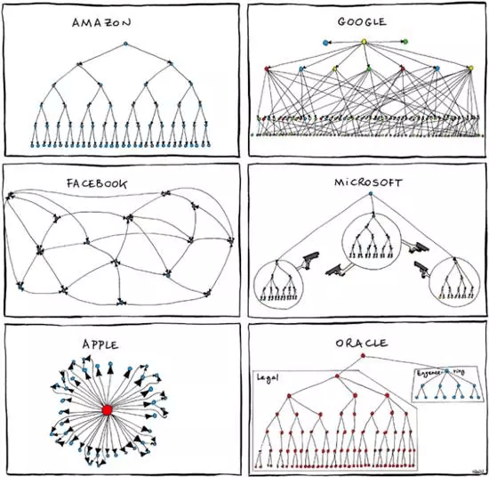
（常见一些公司的组织架构）

### 抽象程度过高

抽象程度过高最典型的一个特征是得到的限界上下文极端的微小。回到我们成本、复用性和抽象程度这几个概念上来，上面我们讨论过，抽象程度虽然可以带来复用性的提高，但是带来的成本非常高，甚至不可接受。

抽象程度过高带来的成本有：更多的微服务部署带来的运维压力、开发调试难度提高、服务间通信带来的性能开销、跨服务的分布式事务协调等。因此抽象不是越高越好，应根据实际业务需要和成本考虑。

那相应的，微服务到底应该多小呢？

业界流传一句话来形容，微服务应该多小：“一个微服务应该可以在二周内完成重写“。这句话可能只是一句调侃，如果真的作为微服务应该多微的标准是不可取的。

微服务的大小应该取决于划分限界上下文时各个限界上下文内聚程度。订单服务往往是很多IT系统中最为复杂、内聚程度最高的服务，往往比较庞大，但无法强行分为 ”订单part1“ ”订单part2“ 等多个微服务；同样，短信服务可能仅仅负责和外部系统对接，表现的极为简单，但我们往往也需要单独部署。

## 从限界上下文到系统架构

在通过 DDD 得到领域模型和限界上下文后，理论上我们已经得到了微服务的拆分。但是，限界上下文到系统架构还需要完成下面几件事。

### 设计微服务之间的依赖关系

一个合理的分布式系统，系统之间的依赖应该是非常清晰地。依赖，在软件开发中指的是一个应用或者组件需要另外一个组件提供必要的功能才能正常工作。因此被依赖的组件是不知道依赖它的应用的，换句话说，被调用者不需要知道调用方的信息，否则这不是一个合理的依赖。

在微服务设计时，如果 domain service 需要通过一个 from 参数，根据不同的渠道做出不同的行为，这对系统的拓展是致命的。例如，用户服务对于访问他的来源不应该知晓；用户服务应该对订单、商品、物流等访问者提供无差别的服务。

因此，微服务的依赖关系可以总结为：上游系统不需要知道下游系统信息，否则请重新审视系统架构。

### 设计微服务间集成方式

拆分微服务是为了更好的集成到一起，对于后续落地来说，还有服务集成这一重要的阶段。微服务之间的集成方式会受到很多因素的制约，前面在讨论微服务到底有多微的时候就顺便提到了集成会带来成本，处于不同的目的可以采用不同的集成方式。

- **采用 RPC（远程调用） 的方式集成。** 使用RPC的方式可以让开发者非常容易的切换到分布式系统开发中来，但是RPC的耦合性依然很高，同时需要对RPC平台依赖。业界优秀的RPC框架有dubbo、Grpc、thrift等
- **采用消息的方式集成。**使用消息的方式异步传输数据，服务之间使用发布-订阅的方式交互。另外一种思想是通过对系统事件传递，因此产生了 Event Sourcing 这种集成模式，让微服务具备天然的弹性。
- **采用RESTful方式集成。**RESTful是一种最大化利用HTTP协议的API设计方式，服务之间通过HTTP API集成。这种方式让耦合变得极低，甚至稍作修改就可以暴露给外部系统使用。

这三种集成方式耦合程度由高到低，适用于不同的场景，需要根据实际情况选择，甚至在系统中可能同时存在。服务间集成的方式还有其他方式，一般来说，上面三种微服务集成的方式可以概括目前常见系统大部分需求。

### 可视化架构和沉淀输出

第一次读DDD相关的资料和书籍时，没有记住DDD的很多概念，但是子域划分像极了潮汕牛肉火锅的划分图，给我留下深刻的印象。DDD 强调技术人员和业务人员共同协作，DDD 对图的绘制表现的非常随意自然。

但是在做系统设计时，应该使用更为准确和容易传递的架构图，例如使用 C4 模型中的系统全景图(System Landscape diagram)来表达微服务之间的关系。当然你也可以使用UML来完成架构设计。C4 只是层次化（架构缩放）方式表达架构设计，和UML并不冲突。

系统架构图除了微服务的关系之外，也需要讲技术选型表达出来。

微服务集成方式除了通过架构图标识之外，最好也通过API列表的方式将事件风暴中的事件转换为API；除此之外，可以将DDD领域模型细化成聚合根、实体、值对象，请参考DDD的战术设计。

## 总结

逻辑往往比经验更为重要。写这篇文章的初衷是为了回答一个问题：如果老板问我，你这个微服务划分的依据是什么，我该怎么有说服力的回复？

我该回答 “具体情况具体分析？By experience？”还是说，我是通过一套方法对业务逻辑进行分析得到的。当没有足够的经验直接解决问题，或问题庞大到不足以使用经验解决时，能支撑你做出决策就只有对输入问题进行有效的分析。

使用 DDD 指导微服务划分，能在一定程度上弥补经验的不足，做出有理有据的系统架构设计。

## 参考链接

- c4模型中的全景图 https://c4model.com/#supplementaryDiagrams
- 概念图 https://cmap.ihmc.us/
- 康威定律 [https://zh.wikipedia.org/wiki/%E5%BA%B7%E5%A8%81%E5%AE%9A%E5%BE%8B](https://zh.wikipedia.org/wiki/康威定律)
