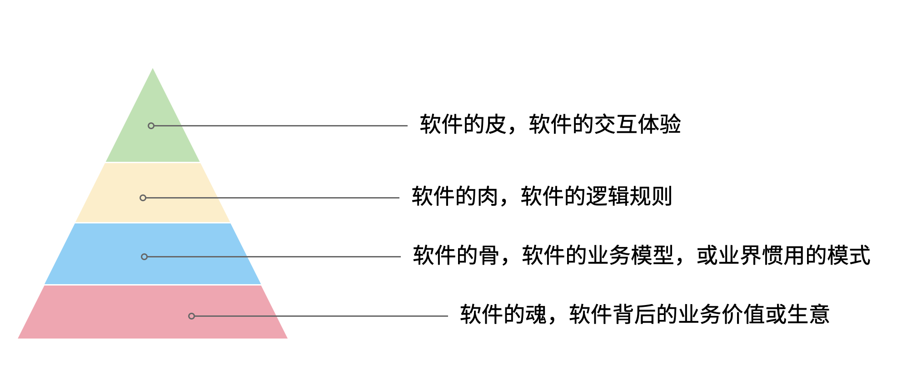

需求变化是软件工程师最难以容忍的一件事，为了做好软件设计，不得不猜测未来需求的变化方向。猜中了就是 “正交分解”，猜不中就是冗余设计。

那么需求变化背后的逻辑是什么呢？

## 01. 为什么软件的需求会容易变化呢？

首先我们不得不承认，从客观上讲软件它是有区别于硬件的，为什么叫软件，因为它本身就是能改的，并且修改的成本是低于硬件。硬件涉及电路设计、制版、开模等流程，在开发的过程当中，需求变化会带来巨大的成本。这是为什么软件能够提高效率的原因，因为通过软件搭建在通用计算机平台上，能够很快做出业务应用和实现。通用软件的出现，软件开发和硬件开发分离是信息社会的一个关键节点，所以软件被发明出来就是为了容易改。

但是事物总是矛盾的，容易改的软件相比硬件降低了成本，但软件容易修改的能力被滥用后，给软件工程也带来负担。

对于软件来说，修改并不是没有成本的，只是相对硬件而言小了许多。对软件工程师来说，业务的变化往往会带来困扰，因为它会让软件的架构设计和模型的建立变得非常复杂。

但并不是所有的软件需求变化，我们都不能接受。对于一些软件的交互和界面 UI 样式等这些细节上面的修改不影响主体的业务变化，这种修改是没有任何问题的。

我们说的软件需求变化带来的困扰是指的是在软件开发过程中随意变更软件的逻辑，让软件的整体性和逻辑性受到了破坏，这是我们不喜欢，不能接受的软件修改的方式之一。

对于专业的产品经理来说，软件的修改是非常谨慎的，因为修改一个地方，可能会影响其他地方。

那么在软件开发和迭代的过程当中，我们可能难以意识到一个小小的修改会影响整个开发、测试、上线等不同的环节，造成项目的延期，这是开发团队人员不喜欢软件被修改的根本原因。

那么怎么应对软件需求的变化呢？

## 02. 软件价值模型

如果我们对软件的需求进行分层，我们可以把软件所存在的价值分为 4 层。

最底层是软件所存在的业务价值，或者是通俗来说它是软件的生意。我们在构建一个点餐软件、构建一个电商软件、构建一个物流软件，那么软件帮我做的事情就是取代原来传统商业活动中人需要做的事情。提高这些行为的效率，为社会创造更多的价值，这些软件背后的需求就是我们的生意。业务价值，可以看做软件的灵魂。

那么在这层软件需求之上的，是我们软件的架构，软件的架构承载了对我们的软件的生意或者商业模式的一种提取，可以看做软件的骨骼。比如说电商里面就有订单等这些关键的一些模型，或者一些惯用模式。类比起来就相当于我们人体的一个骨架或者建筑物的一些承重结构。

还有一些是软件的一些具体的逻辑细节，比如说约束电商系统确认收货时间是多少天。软件这些业务规则，就像人体的血肉一样，丰满了软件。业务规则填充了软件的一些交互逻辑细节，让软件工程师在不修改主体结构的情况下去，改这些逻辑细节，有时候并不是非常困难的，软件工程师对于这类需求的变化也是乐于接受的。

还有一种软件的需求，就是软件的交互方式和 UI 样式，这些就好像动物的皮肤。不具备特别的功能性，而是负责软件的美观性。这些需求的变化，修改成本也是非常低的。

所以我们总结一下的软件的价值可以分为 4 层：

当我们软件的业务架构和业务价值发生翻天覆地的变化时，修改这个软件的难度，会呈指数上升，不亚于重新设计一个软件。

我曾经听过一个故事，有一个公司构建了一个财经的软件，但后来希望这个财经软件上面具有社交的功能，能够有直播，有聊天，有打赏。对于这个软件来说，已经侵害了它原有的逻辑。社交作为业务流程中天然不具有的一个能力，如果强行加上，软件整体的逻辑性和完整性，已经发生了变化。这种软件的业务价值没有被确定，那么它的业务架构就很难确定，需求也会翻天覆地变化。

对于创业公司来说，他们的业务架构和生意，或者说它的商业模式，还不确定，还在探索当中。对于这样的业务来说，他们的需求几乎每天都会发生变化，因为他们的生意会变，一旦生意会变，“上层建筑就会变化”。

对于成熟的公司来说，软件这个公司业务流程的沉淀，业务流程可能不会发生特别大的变化，比如说银行、保险或者会计，这些特定的业务流程基本上已经形成了行业的规范或者标准，他们的变化情况是不会特别大，那么软件的架构也就不容易受到破坏。业务需求的变化就会非常少。

## 03. 软件价值模型对产品竞争力的启示

对于一些传统的公司来说，他们过去的业务价值或者是商业模式被新的模式受到一些冲击，他们会认为应该去探索新的环境下的业务模式，于是他们对业务的定位发生了变化。这个时候，已经在赚钱的业务模式可能不是他们的重点，他们探索新的业务价值，在很多方向就变得和创业公司一样，都想去尝试，这些尝试的方向都是对软件的未来重新定位。麻烦在于尝试的方向很多，软件的定位就会变得混乱，甚至开始伤害原有正常在运行的业务流程。

但是这些传统的软件他们又不得不去转型，这就陷入了一个逻辑的悖论。还没有确定的新的业务，去侵害了原来的业务的定位和方向，让整个转型过程当中充满了风险和不确定性。有一些数字化转型的企业认识到这一点，他们通过构建一个新的公司或者新的软件来重新开始，并代替原来的业务流程和软件。如果失败了，对原来的业务流程和商业模式并没有任何的影响，这是一种新的探索形式和方向。

总之，软件需求的变化，需要客观的看待。如果是上层的变化，比如说简单的一个规则和UI界面，这可能来自于客户的一些反馈或者优化，对软件背后存在的商业模式和业务价值没有没有破坏。反之，如果我们的商业模式发生了变化，也就是软件背后所存在的业务价值改变，我们就很难保证我们的软件架构不会重新被推翻。这个时候我们就需要去权衡或讨论，是构建一个新的软件，还是将原有的软件重构成我们目标的样子，而不是简单的说我们的软件需求变化了。

软件在市场中存活和生物适应生态环境非常相似，如果一个物种对生态的适应性非常强，或者自身的改造性非常强，它一定程度上在某个特定的环境下的竞争力就会被削弱，如果他在某一个特定环境下具有强烈的竞争能力，那么他就会牺牲适应其他环境的能力。

**特定环境的竞争力和对广泛环境的适应性存在矛盾。**

架构的背后就是权衡的艺术，适者生存。软件也是这样，因此我们软件需要有清晰的定位和适应市场的领域。如果我们需要重生，重新构建一个新的软件，繁衍下去，还是改造原来的软件，这是一个值得思考的话题。

## 03. 软件价值模型对软件工程师的启示

软件价值模型给了软件工程师 2 点启示。

首先，我们可以通过这种方式来快速理解一个软件的架构和需求。一个能够在市场上存活的软件，一定有它背后的业务逻辑和业务价值。那么我们从底层出发，找到了一个软件的业务价值，也就是它的生意，我们就可以快速的理解软件的架构。

其次，我们可以真正的挖掘出业务分析师或产品经理希望的业务。基于软件价值模型，软件背后的逻辑和生意总是存在的，但是产品经理不一定能够用自己的语言或合适的方式讲给软件工程师。

对于软件工程师来说，只有两个选择。要么给自己的软件的架构设计提供足够的灵活性，这也是很多软件设计思想提倡的。但它背后的代价很明显，我们需要留出 “冗余设计”，在特定的环境下，软件的竞争力被削弱。一个有灵活或者弹性的软件架构，背后是付出一定的代价，但往往我们没有意识到这一点。

另外一个选择就是真正的理解软件背后的生意，通过软件价值模型的启示从变化中找到不变。
