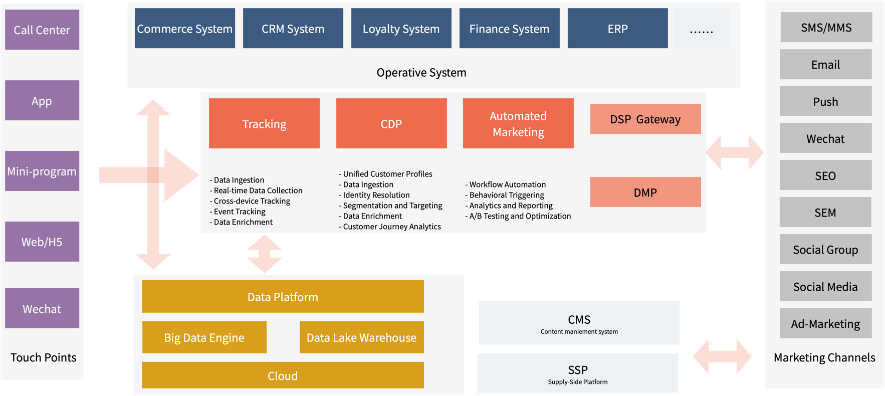

> 本文根据 06-15 晚的技术研讨会整理总结，如需看完整的笔记和视频，可以访问少个分号的网站：https://shaogefenhao.com/libs/webinar-notes/

## 01 数字化营销技术(MarTech) 是什么？

数字化营销技术是一种新的营销理论，通过把数字化和营销结合的方式，整体全面地提高营销效果，从某种程度上来说属于降维打击。

举个例子来说，Mike 多次在网站上购买了奢侈品类的商品，购买金额规模巨大，被识别为高潜用户，在后续的营销活动中，为 Mike 等群体推荐专属相关的商品，并提供更独有的服务。

另外一个场景是，当用户注册成为会员后，但是在1周左右都没有下单，识别到此类客户，为客户发送一条专属的促销短信，将其转化为付费用户。

这些场景可以大大提高营销精确性和效果，在没有数字化技术前，实现的成本高非常高，在算力和大数据能力成熟的今天，这类应用开始爆发。

从实现上来说，典型的模式就是：用户数据收集 → 用户标签更新和用户画像建立 → 客群划分 → 自动化营销 → 全域营销渠道对接 → 营销效果验证和收集。

下图是一张 MarTech 技术全景图：

下面分别解释这张图中的一些内容。

### 用户数据收集

用户数据收集有两个部分，一部分是采集用户的行为数据。通过 SDK 埋点，在用户界面端，捕获用户的行为数据；另外一方面可以通过获取交易数据、会员数据等途径，分析用户历史购买情况。

这部分可以通过一些埋点工具实现，例如百度统计、Google 统计等。

### CDP

CDP 是 MarTech 最重要的组成部分之一。CDP 是指 Customer Data Platform，它的职责是聚合所有和用户相关的数据，并通过 ID Mapping 识别用户的身份，通过离线分析的方式，计算用户的标签，并最终获得客群数据。

### 自动化营销

自动化营销（Automated Marketing） 是指根据客群或者用户行为，制定相关的营销策略和自动化的流程，一旦某些事件被触发，自动化营销就会开始工作，为用户发送营销信息或者投放广告。

营销的类型有两种：

- 触达营销：通过某种通知机制发送营销信息到用户终端。
- 广告营销：通过投放广告来展示活动给用户。

### DSP 集成和 SSP 的概念

一般来说 MarTech 的产品都会集成 DSP，但不会集成 SSP。

- DSP：Demand-Side Platform，广告联盟为品牌方提供的流量市场。
- SSP：Supply-Side Platform，广告联盟为流量主提供的流量市场。

这样广告联盟就可以撮合双方完成流量的买卖，实现营销效应最大化。

MarTech 技术的功能全景比较多，本文只能挑选一些重点来讲，详细的技术能力清单可以看附录1。

## 02 有哪些产品可以收集用户的行为数据？通常的收集方式是什么？

国内市场的常见产品有：

- 友盟+ (UMeng+)
- 神策数据 (Sensors Data)
- GrowingIO
- 百度统计

海外市场的产品例如：

- Google Analytics
- Adobe Analytics

这些产品通常会提供 SDK，通过埋点的方式收集用户行为数据。

收集方式： 

- 手动收集：嵌入统计代码，调用 SDK 的方法
- 全埋点技术：自动收集常见事件，主要是用户浏览事件
- 无埋点技术 （感觉和全埋点没啥区别，可能是商业产品的营销用词）

常见的事件有：

- 用户行为事件：页面访问、点击事件、输入事件、滚动事件、热点点击区域等
- 交易和转化事件：购买事件、注册事件、付款事件等
- 应用操作事件：应用启动和退出、应用功能使用等
- 社交和分享：分享事件、评论和点赞等
- 广告和营销事件：广告点击、优惠券使用等
- 客服和支持事件： 客服对话、问题反馈等
- 设备和环境事件： 设备信息、地理位置等
- 服务器端时间：从后端获取业务事件，例如积分变动，这些事件前端不方便收集。

## 03 收集用户行为时，用户的许可（Consent）如何管理？

用户许可是指应用在收集用户行为数据钱需要告知用户，并获得用户的同意，这是法律监管合规要求。

在不同的公司用户许可的存储有不同的策略。

- 每个端使用一个许可，这些许可单独存放，可能会导致用户重复提交许可。
- 整个系统共享一个许可，建立一个许可平台，避免多次许可，并提供撤销许可的能力。
- CDP 中一般需要一个过滤机制，如果没有捕获到许可数据，忽略掉该用户的事件，并不能在后续的营销活动中打扰用户。

收集许可应当是一个严肃的行为，在极端情况下可能会被用于法律责任举证。不能仅仅在数据库中存放一个字段表明是否通过了许可，而需要存储用户同意许可时的相关信息，例如用户的 ID 地址，鼠标轨迹等。

## 04 收集用户行为时，PII 数据如何识别和处理？

PII（个人识别信息）非常重要，通常来说 PII 数据包括：

- 姓名：包括名字和姓氏。
- 地址：包括家庭地址、工作地址等详细位置信息。
- 电子邮件地址：个人或工作用电子邮件地址。
- 电话号码：包括家庭电话号码、移动电话号码、工作电话号码等。
- 身份证号码：包括国民身份证、驾驶执照号码等。
- 社会保险号码（SSN）：某些国家或地区使用的社会安全号码或类似标识符。
- 银行账号信息：包括银行账户号码、信用卡号码等财务信息。
- 生物特征信息：如指纹、面部识别数据、视网膜扫描等。
- 健康信息：如病历号、医疗保险号码等。
- 生日和年龄：特别是当生日与其他识别信息结合使用时。
- 车牌号码：机动车或其他交通工具的牌照号码。

但是有一个开放问题是， 用户ID 是 PII 数据吗？

欧盟的通用数据保护条例（GDPR）将用户ID视为可能导致个人身份被识别的数据，这个判定非常模糊，一般实践是用户 ID 是否结合了其他信息，例如姓名、地址、电子邮件。

取决于是否被可使用，是否被还原为其它 PII 信息。一个不合理的例子，假如在 Discord（一款聊天软件） 中使用 ID 可以邀请他人，但在邀请时，通过 ID 可以搜索出相关用户的信息，那么就暴露了 PII 信息，这时用户 ID 就属于 PII 信息。

## 05 如何实现多渠道的用户 ID 识别和整合？

通过 ID-Mapping 实现将不同数据源中的多个标识符（ID）映射和关联到统一的用户或实体上，这样可以将多端收集到的信息建立统一的画像。

主要方法操作：

- 主要标识符选择
- 多标识符映射
- 标识符的匹配和关联：精确匹配（如精确的电子邮件地址匹配）或模糊匹配（如姓名和地址的部分匹配）
- 处理冲突和合并：根据ID权重，进行合并和丢弃，主要通过 ID 权重来实现。

示例：小程序、公众号获得 open_id,union_id,登录后获得 app_user_id, web 登录前可以获得 session_id，禁用后可以使用浏览器指纹技术来追踪。

通常可以通过大数据引擎来计算，例如 Spark，一些分布式数据库（如阿里云Tablestore、MongoDB等）提供内置的映射功能。

## 06 如何通过用户行为数据和交易数据计算用户的标签和画像？

这是 CDP 主要的功能，有下面几个主要的步骤：

- **清洗用户行为数据**，包括 Tracking 数据 + 交易数据，一般通过周期性调度任务计算，根据**数据中自带的时间来切割数据**，只计算周期内的数据。
- **特征提取**： 定义行为特征，例如用户的基本信息、行为特征（如浏览频率、点击率、购买频次）、交易特征。这一步可以通过一些营销模型来完成。
- **标签计算**：根据用户的行为数据和交易数据，计算用户的标签，大数据技术处理。标签可以被多次使用和计算。
- **用户画像建模**：基于计算得到的标签数据，建立用户画像模型。画像可以包括静态属性（如基本信息）和动态属性（如兴趣、购买意向），通过机器学习算法或规则引擎进行建模和更新。一般使用传统机器学习的算法，例如决策树、梯度下降、决策森林等。
- **数据分析和挖掘**: 旅程重现（例如桑基图可以显示用户因为哪些渠道走向了购买节点）、归因分析（例如哪些特征造成购买）、关联规则挖掘、行为预测（购买行为，是否在后续是否会购买，优化用户体验、优化供应链库存等）。

离线计算相关框架和技术: 

- Apache Hadoop
- Apache Spark
- Amazon EMR
- Alicloud MaxCompute

实时计算、ID-mapping：

- Apache Flink
- 有些数据库可以自带 ID mapping 例如 MongoDB、Tablestore

实时计算限制：

- 实时一般是处理单人，单个行为事件
- 不太可能实时计算客群，基本是指实时 ID-Mapping，判断是否在哪个客群
- 一般 Flink 一般处理 microbatch 数据，单个事件也不用 Flink，介于大数据离线分析和应用（OLTP）在线业务之间的操作。计算某个窗口的数据，比如一个小时内容的客群。

## 07 有哪些标签？用户通过营销模型计算用户标签？

一般标签分为静态和动态的标签，动态的标签为从用户数据中提取到的标签。

- 基本信息标签，Demographic 人口统计标签
- 行为标签：根据行为统计频次计算
- 兴趣标签：描述用户的兴趣和偏好，基于其在平台上的行为模式推断出来的。
- 动态标签：根据历史数据统计出来的标签，这里可能算法和机器学习有关。
- 营销模型标签
    - RFM模型标签：高价值客户、活跃客户、沉默客户
    - 用户生命周期标签：如新用户、活跃用户、流失用户等
    - 情感分析标签：正面用户、负面用户
- 自定义标签：组合上述标签，再次迭代

用户标签数据之间会有一套非常复杂的血缘关系，数据关系会比较复杂，需要有可视化的血缘树呈现，通常来说 CDP 都会提供相关的能力。

在计算标签时，有定量和定性的两个区别。

- 定量方法：基于统计和指标的结果。
- 定性方法：以人的业务知识根据特征，建立规则。

例如，判断一个人是否是消极、积极。定性是指根据人的知识来定义的规则，定量是通过用户产生的关键字来判断。

在实践中计算标签会根据定量和定性结合完成。

## 08 如何实现营销自动化触发，例如发送微信消息和短信？

如果我们需要开发一个自动营销平台，可以通过流程引擎 + 流程界面开发框架。

流程引擎的框架有：

- Zeebe
- Netflix Conductor
- Apache Airflow
- Activiti
- Camunda

流程界面开发框架：

- React Flow
- Vue.Draggable

## 09 如何实现 A/B Testing?

A/B 测试是一种通过对比两个或多个版本的页面或功能，以确定哪个版本对用户产生更好效果的方法。 随机将人群分为一组或者多组，然后进行营销。

A/B 测试消除了对营销策略的主观判断，是一种有效验证成效的方法。

## 10 如何实现个性化推荐？怎么实现不同客群看到到的内容不同？不同个体看到的东西不一样？

在 MarTech 中讨论个性化时，有三个维度。

- 触达内容个性化、页面显示个性化（某种程度上也可以看做触达）
- 静态内容、动态内容
- 客群内容、个体内容

对于触达内容个性化来说，通过自动化营销的流程工具就可以完成；而页面显示的个性化需要页面显示的应用来集成实现。营销工具 Adobe Target 由于可以集成它自家的 CMS Adobe AEM，所以可以轻松实现页面显示个性化。否则，需要从 CDP 中获取客群、用户画像数据来实现页面差异化显示。

对于静态内容、动态内容来说，动态内容需要使用推荐引擎完成推荐。在这个场景下有两种推荐：

- 基于客群的推荐
- 基于个体画像的推荐

他们的标签更新频次不同，运算量也不同。基于客群的推荐，基本上是静态配置的，特征比较固定；而个体的推荐就更加动态。不过都是人对物的推荐算法实现，通过向量相似度完成（这部分比较专业）。

## 附录1 

### MarTech 技术的功能全景

- 数据管理
    - 客户数据平台 (CDP): 集成和管理客户数据,创建统一的客户视图
    - 数据管理平台 (DMP: Data Management Platform): 受众数据收集和管理,数据分析和细分
- 数据分析
    - 分析工具: 代表性的是 PowerBI
        - 即席分析
        - 仪表板
        - 复杂表格填报
    - 跨源分析
        - 数据整合和可视化
        - SQL建模
- 用户标签管理
    - 创建和管理客户标签
    - 标签规则和分类
    - 用户行为数据整合
    - 营销模型
        - RFM模型（Recency, Frequency, Monetary）：RFM模型通过分析用户的购买行为，按照最近一次购买时间（Recency）、购买频率（Frequency）和消费金额（Monetary）三个维度，识别用户的购买潜力。
        - AIPL 模型： (awareness)、兴趣(interest)、购买(purchase)和忠诚(loyalty)，根据用户的认知阶段来识别用户的忠诚度。这个是建立在漏斗模型上的。
        - ABC分析（Activity, Behavior, Cost）：分析用户的行为模式和贡献。
        - 用户生命周期模型（Customer Lifecycle Model）：生命周期阶段通常包括潜在客户、新客户、活跃客户、忠诚客户和流失客户。
- 自动化(MA)
    - 营销自动化
        - 营销活动触发
        - 自动化邮件营销
        - 销售线索跟踪
    - 工作流自动化
        - 数据同步和整合：例如系统增加了一个注册会员，任务自动更新客群和标签
- 客户体验管理
    - 个性化
        - A/B测试
        - 实时个性化推荐
    - 跨渠道管理
        - 全渠道营销策略
        - 多渠道客户互动
    - 归因分析：比如年轻的客群和某些品类的购买有关系
    - 用户旅程重建
- 广告技术(Ad-Marketing)
    - 需求方平台 (DSP：Demand-Side Platform): 流量主
        - 程序化广告购买，和预算控制有关
        - 受众定位和细分
    - 广告追踪和分析
        - 广告监测和反馈
        - 广告效果分析。跟踪关键指标，如点击率、转化率、客户获取成本（CAC）和客户终身价值（CLV）。
- 内容管理
    - 内容管理系统 (CMS)
        - 内容创建和发布
        - 多渠道内容分发
    - 内容个性化
        - 动态内容推荐
        - 个性化内容营销
- 客户互动 (SCRM：Social Customer Relationship Management)
    - 社交媒体管理
        - 社交媒体监测和分析
        - 社交媒体内容发布
    - 社群营销
    - 客情监控：识别频繁投诉的场景
- 安全和隐私
    - 数据加密
        - 电话号码和其他敏感数据加密
    - 身份验证
        - 单点登录 (SSO)
- 整合与扩展
    - API整合
        - 数据服务API
    - 平台互操作性
        - 对接钉钉/企业微信/飞书等企业通讯工具
- 性能监控和报告
    - 实时系统监控
    - 异常行为告警
- AI 和智能化
    - 自动化内容生成和推荐
    - ChatBot 智能客服

### 参考资料(推荐阅读)

- https://advertising.amazon.com/library/guides/what-is-martech
- https://www.btelligent.com/en/blog/martecharchitectureamapinthetechnologylabyrinth/
- https://www.credera.com/en-us/insights/crederas-martech-reference-architecture-part-1-overview-works