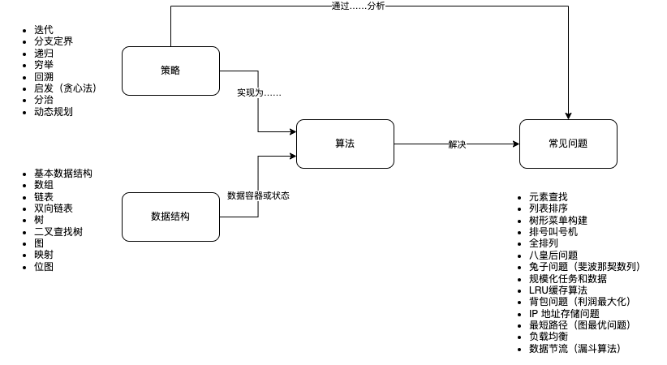

在几次求职找工的时候看过很多次算法方面的内容，但是都没有整理成系统性的材料。为了更加深度的理解计算机科学中的算法部分，我把常用或者面试常见的算法整理出来，贯穿这些算法解决的问题、策略、以及用途。

这样一来，可以用较低的认知负担理解核心的算法逻辑。（其实是看了很多类似的书，总要自己整理一遍才是自己的。）

## 算法地图

下图就是算法和策略之间的关系，只有我们通过问题，把这些策略想清楚了，再选择合适的数据结构，就能举一反三掌握更多的算法，解决更多的问题，这就建立了编程思想。

## 从问题出发

### 如何实现字符串？

使用策略：迭代

### 如何实现从列表中查找指定的元素？

使用策略：迭代、分支定界

### 如何对列表排序？

1. 排序的用处
2. 

## 参考资料

- 《一只青蛙跳出来的分治法、回溯法与动态规划》 https://zhuanlan.zhihu.com/p/95525781
