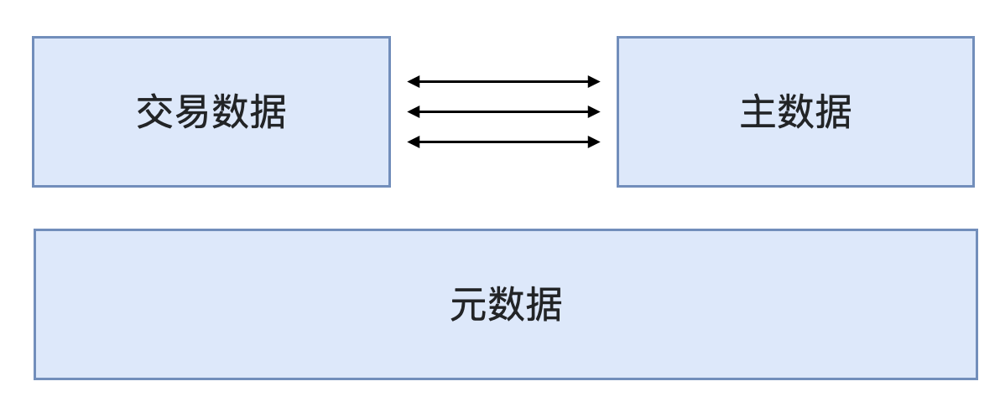
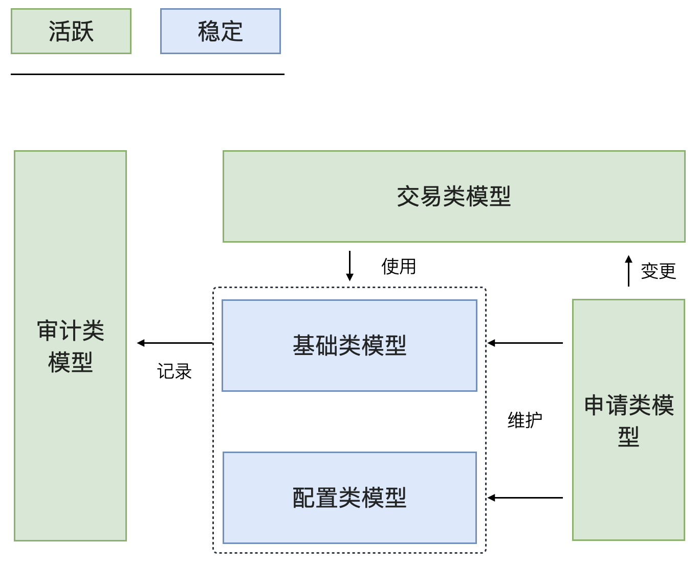

在最近的几个项目中，发现可以通过对领域模型进行分类来识别出重要模型信息，给建模工作带来一些启发。
但是每个人对模型的分类方法不同，这些不同带来了一些沟通上的争论——每个人都以自己的理解的维度看待模型，而领域模型和数据其实也难说分得开。

# 01. 从数据分类说起

比较典型的是最近很火的一本书，《华为数据之道》提出了对数据的不同分类方法，将主数据的概念重新提出了。信通院的《主数据管理实践白皮书（1.0）》也将数据分为主数据、元数据和交易数据。 含义分别如下：

- 元数据：元数据是指描述数据的数据，描述数据库表结构的 DDL 就是一种元数据，描述了数据结构本身的信息。
- 主数据：主数据是指在系统中、或者系统间通用共享的数据。比如，在很多企业中，用户数据、供应商等数据是所有系统共享。
- 交易数据：交易数据是指日常业务发生的数据，而元数据和主数据往往都只在维护时期变化，相对稳定，数据量也不会太大。

主数据的并不是一个新的概念，早在 1960 年代数据处理服务组织协会 (ADAPSO) 就提出了这个概念（Master Data）。
并且很快就有相关的程序支持，用来专门管理主数据。在 ADAPSO 中将主数据描述为组织的核心数据，包含开展业务所需的基本信息。主数据是相当稳定的信息，只有在发生重大事件时才会发生变化，例如客户搬到新位置。

# 02. 模型分类

其实领域模型和数据结构设计本来就应该对齐，让系统"熵"降低。所以，对于数据的分类方法，也可以应用到模型分类上。

在模型设计上，我们也可以沿用这个思路，将模型分为下面几类：

- 配置类模型：对应元数据。PS（元模型这个词已经有其他含义了，所以避免混淆没用元模型这个词）。
- 基础类模型：对应主数据，为生命周期极其稳定的数据，往往表达业务中的主体身份。
- 申请类模型：对应交易数据，履行业务中的契约，驱动基础数据、配置、业务的变更，但是严格来说不算交易。
- 交易类模型：对应交易数据，履行业务中的契约从而完成交易。
- 审计类模型：用来记录交易行为和用户行为。

下面使用一些实例盘点一下这几类模型的设计思路。

## 配置类模型

配置类模型的特点往往是孤立的，没有特别多的关系，比较适合将其设计为聚合根。

但是配置类的模型有几个常见问题：

- 当配置发生变化时，什么时候发布和生效？
- 当配置发生变化时，过去使用该配置的业务单据如何追溯？

所以配置类的数据在需要的情况下需要设计版本，必要的情况下可以在交易类模型中冗余使用该配置的快照信息。

## 基础类模型

基础类模型不算配置，而是系统中可能都会使用到的模型。强行用主客体的思路来看待的话，它描述的是发生交易时需要涉及到的主体、客体。

所以我们是不是可以将其分类为主体类基础模型、客体类基础模型。例子如下：

- 主体基础模型：用户、商户、员工、供应商、仓库、公司、账户等。
- 客体基础模型：产品、产品分类等。

基础类模型需要被设计成聚合根、实体。但是需要特别注意的是：

维护基础类模型使用的申请单、审批单相关的模型不应该和基础类模型混为一谈，也不要将其设计为同一个聚合，这样会导致聚合庞大，生命周期不一致。

基础类数据尽量不要冗余，这样带来一致性问题比较多。

## 申请类模型

申请类模型一般不算系统中非常核心的模型，缺少它系统也可以运行。所以申请类模型做的轻量级一点，尽量和基础类模型进行剥离。

申请类模型通常和审批流关系非常密切。

## 交易类模型

在很多系统中交易类模型是非常重要的，比如订单、保单、预约单、工单等模型。

交易类模型需要注意的是需要显示的记录交易参与方的身份，在交易类模型上应该找到明确的主体基础模型，而由于一次交易会涉及多个客体，所以交易类模型多以头行结构出现，并呈现一对多的关系。

- 头：记录交易双方的信息，汇总信息，多关注现实世界中的主体。
- 行：记录交易涉及的内容，多关注现实世界中的客体。

有一些建模思想，刻意签强调交易类模型，忽略了其他类型的模型，可能导致模型不完整。

交易类数据尽量降低范式设计，多冗余基础数据，这样在基础数据变更后，依然能起到契约的作用。

比如，我们通过合同购买大件商品后，不会因为身份证上的名字变更后合作就是失效了，也不会要求更新合同上的内容。

## 审计类模型

由于交易类模型具有强烈的契约属性，同时会产生金额、库存相关敏感信息的变更，因此在系统中也需要审计类的模型。

常见的有库存流水、账户流水、用户操作记录、审批记录等。

审计类模型如果和交易场景关联密切可以作为实体存在，否则建议作为聚合根使用。

# 03. 总结

最后，使用图表将几种模型的关系串一下。

（数据分类）

（模型分类）

## 参考资料

[1]: 《主数据管理实践白皮书（1.0）》
[2]: https://www.dataversity.net/a-brief-history-of-master-data/
[3]: 《华为数据之道》

