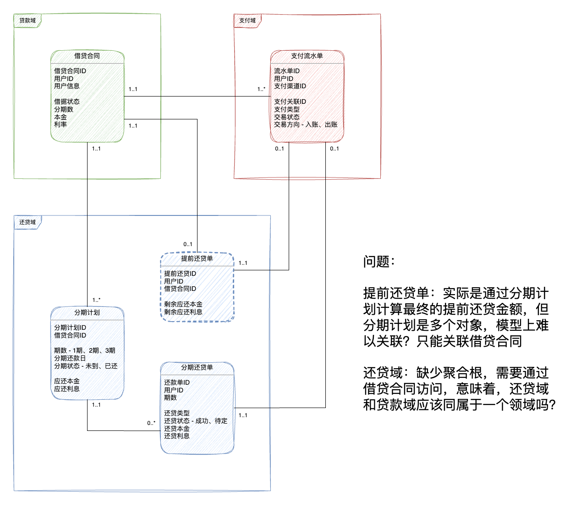

5.1 假期前，有朋友发了我一个问题，刚好引发出一些对领域模型的讨论和思考，顺便总结下来。

问题在下图中，这是关于一个存贷款业务的领域模型。其中，一个借据（假设叫做 LoanBill ）具有多个分期计划，因为借据和分期计划在不同的领域（用上下文更准确），因此分期计划很难关联借据，由于分期计划具有多个在编程上不太好处理状态和生命周期的问题。

因此询问，是不是缺少对象或者借据和分期计划是应该合并为一个上下文？

我们来分析一下，其实这里本质上还是概念定义的问题，将分期计划和计划中的阶段混淆了：

- 借据的生命周期和分期计划生命周期基本上一致的，但是确实两个领域或者上下文
- 意味着，分期计划作为集合整体看做和借据一样的对象
- 这个"集合"应该有个独立对象来承担和借据幂等同步、状态等问题，所以如果把还款计划拆分出去就需要一个具有独立身份的对象

解决方法也很清晰：

- 还款计划定义为和借据一一对应的模型，可以叫做 RepaymentPlan。
- 按照分期长短设计一个还款项或者还款阶段，可以叫做 RepaymentPlanItem
- 这样 LoanBill 和 RepaymentPlan 一一对应，RepaymentPlan 和 RepaymentPlanItem 构成一对多关系
- RepaymentPlanItem 可以具体在还款时生成还款单 RepaymentBill

这样做的好处非常多。不同的上下文中对等对象可以方便做状态的一致性处理，我一般把这种对象的 ID 叫做幂等因子。

> 幂等因子（Idemfactor）：在微服务设计中用来标记是否为同一次事务的业务编码叫做幂等因子。

这样的类似的问题非常多，在我们的咨询和交付项目经验中，经常遇到边界模型如何设计的问题。例如：

1. 一个订单需要根据不同的 SKU 操作库存，因此需要对库存多个进行库存操作，需要使用出库单作为对等的模型，订单可以作为幂等因子。而如果一个订单有多次发货，需要使用发货单作为幂等因子。
2. 一个 CRM 系统需要对客户经理的大合同进行年度回检，那么一个合同可能会对应一个回检计划，一个回检计划对应多个按年度的项目。

如果在两个服务中需要实现最终一致性，却找不到幂等因子，说明模型设计可能有一些问题，这在边界模型设计上需要特别注意。有了幂等因子就能非常简单和轻松的实现最终一致性，我们会在后续的文章中继续讨论。
