模型，是人类重要的思维工具，在历史长河中不亚于火的使用。历法是一种认识气象变化的模型，通过 24 节气可以描述四季并指导农业生产；太极是阴阳家和道家认识世界的思维模型，通过阴阳描述了事物的两个方面，建立了朴素唯物主义的辩证体系；”君君臣臣父父子子“ 的儒教社会模型，建立了相对稳定的封建社会。

认识世界和改造世界是我们每个人的日常活动，但是世界太复杂了。股神巴菲特的精神导师查理芒格说，我们必须在头脑中拥有一些**思维模型**，通过模型来认识世界。现代社会经济学模型就更多了，波特五力模型、金字塔、四象限、2-8 定律等模型被各种培训和咨询广泛使用。

我相信几乎每一个程序员都听说过 ”编程思维“，但是又没人敢说自己已经掌握了 ”编程思维“，甚至说不清 ”编程思维“ 是什么。我们编写应用程序时，每个人都有自己一套方法来设计软件，但是随着需求的不断变化，程序的逻辑会慢慢变得混乱，不再简洁。计算机科学和软件设计慢慢变成了哲学化、玄学化，衍生出很多形而上的概念，这是因为计算机科学体系变得过于复杂造成的。计算机科学明明是一门实践科学，计算机无非就是一台由半导体组成的电器而已，那么也可以通过模型理解计算机科学并指导编程。

从影响计算机科学建立的基本模型来看，有图灵模型、冯诺依曼体系、TCP/IP 网络模型等；从应用程序设计上来看有 RBAC、MVC 模型等；从业务设计上来看有具体业务领域的的模型，比如电商、SNS 等。

业务设计上往往没有建立起特定的领域模型，这是我们架构腐化和软件开发困难的关键原因。**业务领域建立好的模型，并指导代码实践，这就是 ”编程思维“。** DDD 领域驱动设计就是解决这部分问题，与其叫领域驱动设计，不如叫做模型驱动设计。

## 理解模型

模型这个词常常会听到，通常出出现在某个 PPT 或者一篇商业评论中，社会和经济学中的模型往往比较朴素，金字塔、V 型图、四象限会以各种形式出现在不同场合中；软件工程师的模型会更加形式化，UML、E-R 图等，能用较为精确的形式语言描述；数学模型就更加精确，马尔可夫、蒙特卡洛等模型可以用数学语言描述。

广义来说这些都叫模型，甚至是你随手在白板上画的一个用来解释当前程序结构的图形，通过这种方式表达思维框架。哲学家库恩将这种思维框架叫做范式，也就是模型。维基百科将广义的模型定义为：

>  ”用一个较为简单的东西来代表另一个东西，这个简单的东西被叫做模型。“

我们天生就有用简单的东西代表另外一个东西的能力，比如幼儿园数数用的竹签，学习物理时的刚体、真空中的球形鸡，都是模型。通俗来说模型就是经验的抽象集合，平时听到的谚语、公式、定理，本质上都是一种模型。

为了理解模型，斯科特·佩奇在 《模型思维》一书中给出了模型的几个特征：

1. **模型是简化的。**正是因为我们要认识的事物非常复杂，因此需要通过简化找出最一般的规律，才能一语中的。”天圆地方“学说就是最简单的古人认识世界的模型之一；毛主席的”阶级划分论“ 简单、直接的指出旧中国的社会状态。
2. **模型是逻辑的**。例如用金字塔原理描述社会阶层，每层的定义是明确的而非模糊的，数学模型能用数学符号系统和公式描述，模型中的元素能用一种逻辑关系做到自洽。
3. **模型是错误的。**因为模型是一种抽象，所有的模型都是错误的，只能在一个方面反映事物的特征。场景变了，模型就需要修正，连牛顿、爱因斯坦的定律都没能逃脱。好的模型能尽可能简单的情况下较好的拟合事物，完全匹配的模型就不再满足简化特征了。

为了建立和利用模型，模型思考有几个层次：

1. **数据。**我们能直接观察到的现实情况，比如下雨了，并且雨下的很大。
2. **信息。**信息需要从观察到的情况中采样，转换成具体的的数字，比如某个地区某年的降雨量。
3. **知识。**知识是面对信息的处理方式，比如我们利用信息，将信息中的一般规律找出来，建立模型。比如某地区降雨量和年度呈现一定相关性，建立一个周期性降雨模型。
4. **智慧。**面对不同情况需要使用不同的模型和修正模型的能力，并能用它指导实践，比如根据周期性降雨模型修建水利设施。

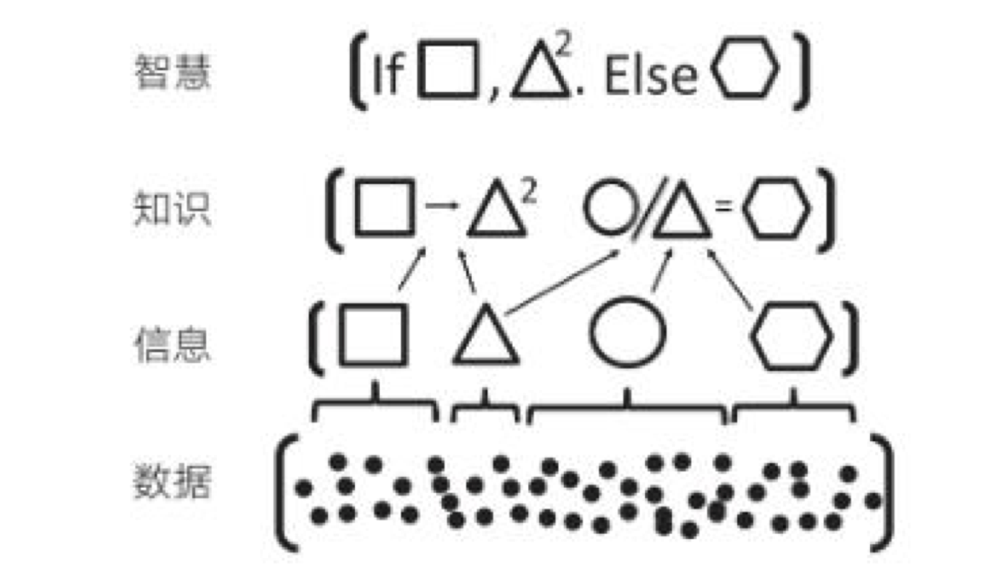

## 理解计算机科学中的模型

从算盘到计算机，人类走过了漫长的历史。计算机发展的转折点往往都是一些大师提出关键模型的时期，了解这些模型可以帮我们更好理解计算机世界。

计算机是数学的延伸和应用，图灵机模型是一个分水岭，图灵机和可计算性让理论自动计算具有了理论基础。虽然在此之前的模型也很重要，但是还停留在数学上，比如数理逻辑中最重要的一部分布尔代数。

### 图灵 - 自动计算模型

图灵机，原始的计算机就是一个图灵模型，理论上任何具备可计算的问题都可以用图灵机解决。图灵在 1937 发表了论文阐述可计算性这个概念，并给出了计算机的抽象模型。有意思的是，图灵模型比计算机出现的晚一点，但它的出现为计算机奠定了理论基础。

对中国人来说理解图灵机非常简单，我们可以使用算盘来类比。当算盘归零后，算盘的**状态**为初始状态，每一次拨动算珠就是一个**指令**，当所有的的指令下发完成，算盘上最终状态就是计算结果。指令序列就是算法，算盘就是一个状态机。

图灵的描述是，一个虚拟的机器，由一个一条无线长的纸带和读写头组成。纸带上分布有连续的格子，并能被移动，读写。机器能读取一个指令序列，指令能对格子纸带进行移动和读写。和算盘的逻辑一样，机器每执行一个指令，纸带的状态就发生了变化，最终完成计算。

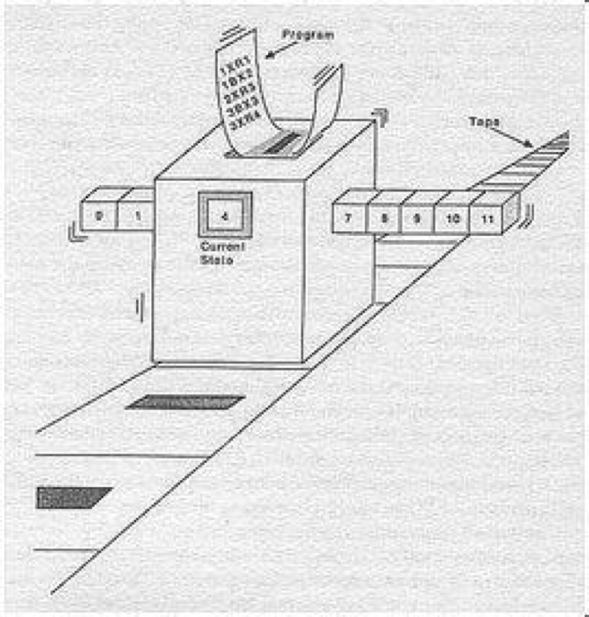

通过图灵机，为所有的可计算问题建立了一个通用的模型。除量子计算机和其他理论中存在的超计算模型之外，目前所有计算机都是图灵机。

图灵机模型描述的是一个可计算性问题如何被自动解决，输入的程序执行完成后就结束了，大家会发现和我们现实中开机后就一直运行的计算机并不太一样，所以图灵模型会给人造成困惑。我们现在的计算机是图灵模型上加了一点东西，下面来看下冯诺依曼的模型。

**通过图灵模型，可以理解计算机是怎么运算的。**

### 冯诺依曼 - 存储程序模型

现代的计算机实际上是一个死循环，可以类比为冲程发动机没什么区别。

ENIAC 是公认第一个满足图灵模型的计算电子计算机（机械计算机已经出现了），ENIAC 通过纸带编写程序，并拨动开关执行和获得结果。冯诺依曼在比 ENIAC 更先进的计算机项目 EDVAC 中描述了另外一种模型，他认为程序本质上也是一种数据，将指令和数据共同存放到内存中，这些指令中存在特殊的跳转指令，让程序周而复始的运行。

存储程序模型构建了一个能自我运行计算模型，构成了一个系统。处理器和内存之间使用总线连接，用来给这个系统提供输入的设备叫做外设，每一次指令循环的可以访问一次外设传入的信号，这就是中断。

想象一台由继电器组成的计算机，如果每一次执行指令计算机会发出 ”嘚“ 的声音，图灵模型就是程序开始运行后线性的 ”嘚嘚嘚……嘚嘚停“。冯诺依曼的模型就是上电后 ”嘚嘚嘚嘚嘚……中断……嘚嘚嘚嘚嘚“。

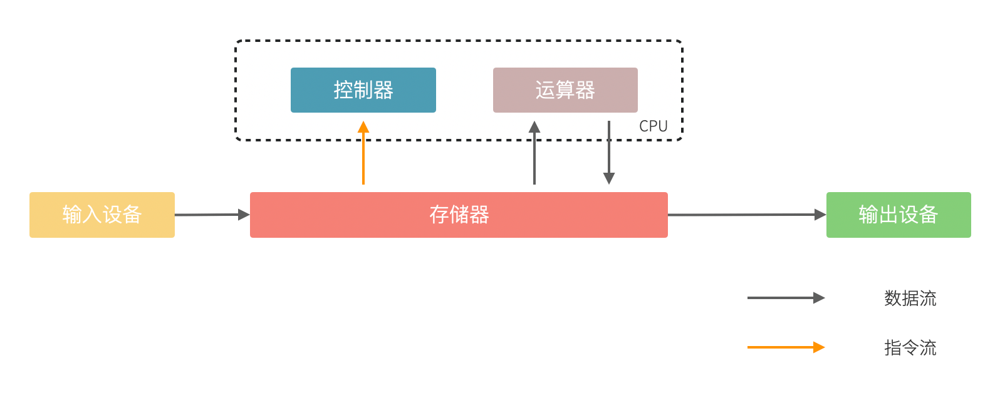

**通过冯诺依曼模型，可以理解计算机是怎么组成的。**

### TCP/IP - 分层模型

网卡是一种外设，对计算机来说，其输入信号是电平的跳变，和键盘类似。计算机网络的就是计算机 + 电报的模型，不像图灵模型这样对计算的本质做出陈述。

计算机网络的问题在于随着技术发展这个体系太复杂了，从交换机、路由器、无线基站到操作系统、浏览器等这些软硬件产品都属于计算机网络需要考虑的范畴。

国际标准组织(ISO)制定了OSI 模型，将网络分为 7 层，每层解决特定的问题，网络设备和组件之间通过协议来完成协作，最终组成一个大的系统。理想和现实的差距总会出现，实际厂商实现上变成了 4 层也就是我们常说的  TCP/IP 协议族。通过网络分层和协议让计算机网络体系中的各个厂家能分头研发，并最终通过电信运营商整合成计算机网络系统。

分层模型在系统软件开发用处广泛，几乎所有的软件都会进行分层。关键是需要软件设计者理解分层模型的意义，分层的本质是隔离差异，分层过少会造成单一职责、关注点分离受到影响，而无意义过多的分层会带来系统复杂性的上升，样板代码增加。

**分层模型，可以理解复杂系统是如何组成的。**

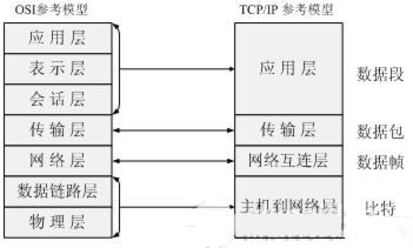

### 面向对象 - 对象模型

面向对象的用途是业务软件，解决现实业务问题的模型，是现实世界在计算机上的投影。

为什么在编写软件的时候面向对象有时候好使，而有时候不好使？这取决于你要解决的问题，如果单纯是处理计算或数据问题，面向对象并不合适。计算机中其实没有对象这种东西，计算机中只有数据，在内存中是线性存在的，各种列表、树、图数据结构都是被模拟出来的，也是被连续存储的。

编译器通过面向对象的模型，让程序开发者能站在现实世界的角度思考问题，而不是直接用计算机思维思考。做一个餐饮软件，我们可以把关注点放在分析订单和菜品之间的关系，以及状态上，而不用关注过程、算法和内存。支持面向对象语言的编译器，最终编译出来二进制代码，依然会被线性执行。

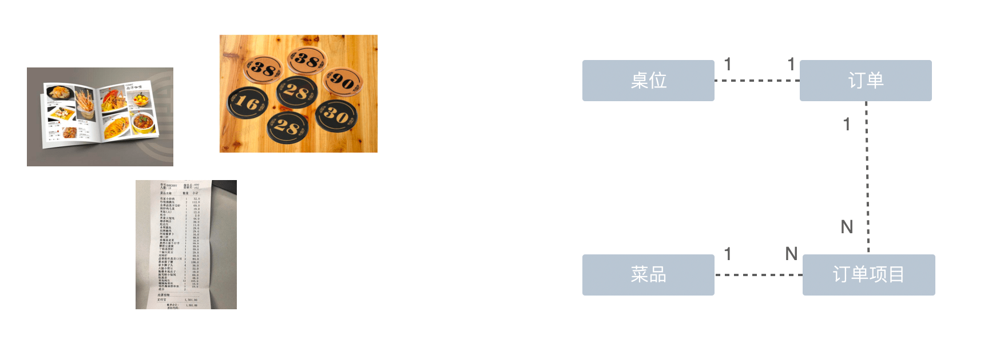

利用好面向对象模型，最重要的不是 5 大原则，而是能不能对现实业务进行抽象，识别业务对象的主体、客体，一个业务概念的内涵和外延。软件设计的能力也是业务抽象的能力的体现，这部分能力往往取决于设计者的哲学和逻辑思维，这也是讲面向对象的文章容易搞出 ”编程哲学“、”编程之禅“的原因。

**对象模型，可以理解现实业务逻辑是如何在计算机中表达的**。

### 关系数据库 - 关系数据模型

关系模型解决的是通过集合组织结构化数据的模型，利用集合可以解决大量现实中的业务需求，比如分页、排序、统计、搜索。集合在数学上有大量成熟的理论可以使用，可以通过设计职责单一的集合，再通过集合的运算实现各种复杂的需求。

设计单一职责的集合并通过集合运算达到目的，可以减少数据冗余，提高数据的一致性。

数据库理论用到了大量数理逻辑、集合论的知识，如果不是数据库产品封装了这些特性，我们应用程序员很难搞定这些问题：

- 条件查询用到了数据逻辑中的大量逻辑演算知识
- 联表查询用到了 n 元关系
- SQL 语句解析用到了词法分析

数据库的实现难度不亚于操作系统，好在应用开发者无需关心。但是应用开发者总是需要解决的问题是：如何将数据在对象模型和关系数据模型之间转换？ORM 就是为了解决这个问题而出现，ORM 是集合模型和对象模型的桥梁。用好 ORM 是一个挑战，其本质是对对象模型和关系数据模型的理解。

关系数据模型也有局限性，如果数据量过大，集合运算性能会急剧下降，以至于不可使用。这也是高并发、大流量的互联网项目逐渐对业务做出一些妥协，降低对关系型数据库特性的使用，大量应用非关系型数据库的原因。

另外一个问题是，如果对关系设计的不合理，会对应用程序造成根本破坏，并很难重构。

**关系数据模型，可以理解关系型数据库是如何工作的。**

### 编程语言和编译器 - 自动推理模型

有人说代码是写给人看的，其次是写给机器执行的。这话只对了一半，对大部分人而言，代码是写给人看的，其次是写给编译器看的。

高级计算机语言，尤其是面向对象语言（区别于 C），语法的设计对象是程序员而非计算机。高级编程语言是为了给程序员一个能表达业务逻辑的的能力，再由编译器编译成指令序列。

了解点形式逻辑就不难理解编程语言了，形式逻辑就是用符号和公式表达逻辑推理的逻辑学分支。

- 编程语言实际上是一种形式语言，和数学公式、逻辑表达式类似
- 编译器是一种自动推理系统，能解析形式语言的结构、语法树，做词法分析和语义分析，然后自动推理成指令序列

适合人类理解的形式语言，经过编译器编译成计算机能处理的形式语言（指令序列），这个过程都没有改变形式语言的本质。这也是为什么编程语言只能无限逼近自然语言，而无法完全通过自然语言编程的原因，因为自然语言不是一种形式化语言，而非形式化语言无法被自动推理。编程语言和编译器，是一种自动推理模型的应用，本质上只是对形式语言的处理和分析。

两个程序员吵架，用的是自然语言，自然语言充满了歧义和逻辑漏洞，只有形式化的语言才能精确的推理和用于计算。难怪 Linus 会说: 

> Talk is cheap. Show me the code.

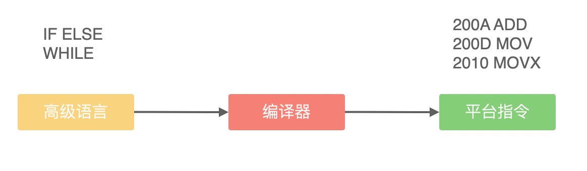

**自动推理模型，可以理解编程语言和编译器中繁琐特性的设计初衷，避免落入编程语言奇巧淫技的陷阱。**

## 理解应用程序设计中的通用模型

应用程序设计中有很多套路，一些书叫做范式、模式或者其他词汇，如果按照模型思维的逻辑，我们可以叫它们模型。根据场景找到合适的模型就能把应用程序设计的很好。

### RBAC 权限模型

我们一般把权限问题分功能权限和数据权限两种。

- 功能权限，用户是否能访问某个功能，叫做功能权限，比如编辑文章。
- 数据权限，用户有权限访问某个功能的前提下，能否对特定数据有权限访问，比如自己或者团队的文章。

一般的应用系统适合 RBAC，RBAC 是 Role-BasedAccess Control 的英文缩写，意思是基于角色的访问控制。RBAC 有几个组成元素：

- 用户（User）
- 角色（Role）
- 许可（Pemission），或者称权限
- 访问控制策略 

系统不直接对用户赋予权限，而是将权限赋予给角色，如果用户拥有某个角色，则拥有这个角色能访问的许可。访问控制策略可以是定义好的规则、注解或者其他形式，由开发人员控制。

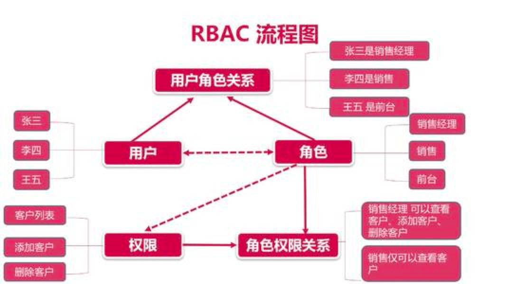

RBAC 模型让权限设计变得非常简单，开发起来容易实现，但是几个误区需要注意：

- 注意 RBAC 权限模型适合的场景，在当前模型下只能对功能权限进行约束，数据权限一般在会受限于业务逻辑，可以不必抽象成通用逻辑（此处争议较大）。
- 许可只能被赋予给角色，不能将许可同时赋予用户角色，否则会造成混乱。
- 设计访问控制策略时，尽量不要和 URL 规则、菜单等具体技术细节挂钩，因为一个权限往往和 URL 规则没有对应关系

不合理使用 RBAC 和在错误的场景下使用 RBAC都会给程序设计带来灾难，权限设计除了 RBAC 之外还有 ABAC 等模型。

### 三户模型

用户，是所有稍大的应用程序无法绕过的一部分。电信、业务运营等系统对用户模型十分看重，一般会有用户资料、扣计费、积分、清算等相关业务。这类系统需要对用户、账户、客户相关逻辑进行充分的分析，往往使用用户、账户、客户这三个概念为关注点的三户模型。

- 客户是一个社会化的概念，一个客户可能是一个自然人，或者一个组织、机构。类似于民法体系，组织或者机构在集体行使法律责任时需要以**法人**的身份出现，法人的代表才是自然人。在应用程序中，客户也是类似概念，往往体现为客户资料。
- 账户是为扣计费设计的，账户是客户在系统中用来处理资金、计费等业务的一个实体，一个客户可以有多个账户，相关的账单、消费明细都关联到账户，而客户资料的变化不影响账户的业务逻辑。
- 用户是使用产品时的身份，用户可以登录、修改口令等操作。在使用整个系统的过程中，行为审计、用户追踪往往也是和用户相关。

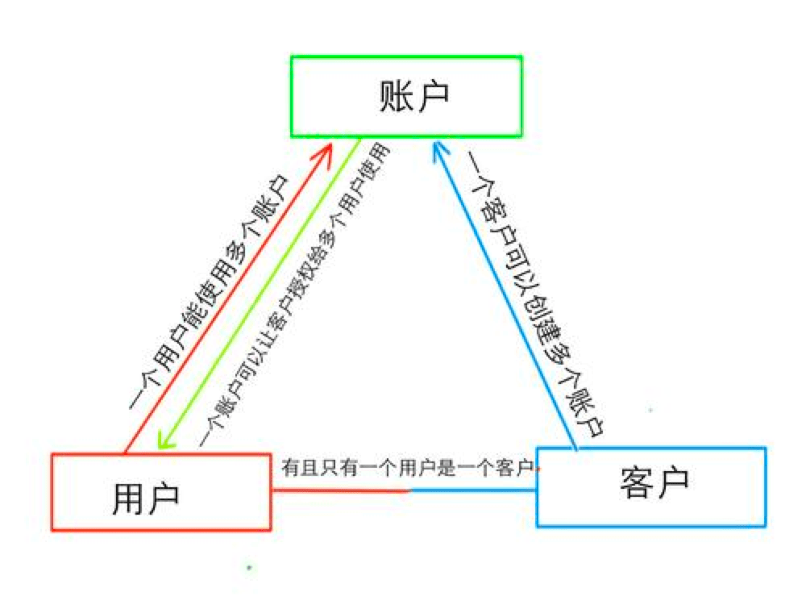

对于非常小的系统而言，客户、用户、账户三户合一，但是大的系统需要分开设计，典型的特征是用户登录后，往往在会话中存放用户信息，这样可以随处取用，但是客户、账户则在特定的场合下才从数据库中获取。

内部 ERP 系统往往体会不到三户模型的意义，当一个互联网产品需要设计计费策略时，会出现一个常见错误：如果一个产品有对组织收费、对个人收费两种，有的架构师会将收费策略关联到用户、组织等多个实体上，这会带来意想不到的麻烦。正确设计是抽象出账户或者客户的模型，收费策略只关心自己服务的实体（无论是个人还是组织）。

不完全恰当的类比是，无论是公司还是个体对外提供营业服务时，都需要进行工商注册获得营业执照才能办理后续的发票事项，这就是自然人和法人的区别。

###  MVC 模型

我要是说现在实际上没什么人用 MVC 模型了可能会被喷，但是事实如此，以前确实是 MVC 模型，随着前后端分离逐渐发生了变化。所以在写前后端分离的项目时，MVC 模型有点奇怪但是又不知道是哪里奇怪。

MVC 模型是早期编写 WEB 应用程序经典模型：

- M（Model） 用来承载业务实体的对象，比如 User
- V（View） 用来渲染 UI 显示和输出的对象
- C （Controller） 用来响应请求和分发业务逻辑的对象

早期编写网站，MVC 非常好用，MVC 代表的是单一入口（相对于多入口程序）程序模型。Controller 是处理请求和分发业务必不可少的部分，View 往往需要处理模板引擎以及给模板引擎环境上赋予变量。

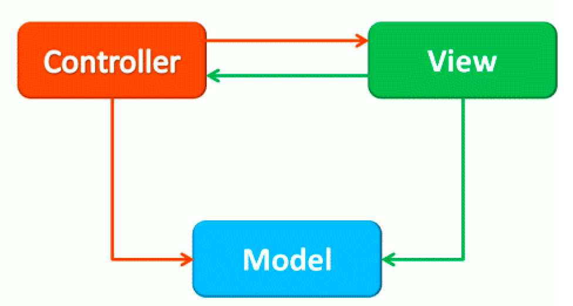

在现在主流 Restful API 和单页应用场景下，MVC 变成了 MSC 模型。

- M（Model） 还是用来承载业务实体的对象，比如 User
- S（Service） 用来渲染 UI 显示和输出的对象
- C （Controller） 用于表达 Restful URL

View 层几乎已经被框架吸收了，在应用程序中几乎找不到，也没有必要了。

### DDD 分层模型

随着应用变得复杂，MVC 模型出现了一个问题。MVC （或者 MSC）模型没有考虑多端的情况。也就是说以前只做一个网站，MVC 完全没有问题，但是如果是复杂的业务系统就不够用了。

正如 TCP/IP 协议分层一样，应用程序分层是为了隔离差异。复杂的系统往往有多端接入，这些多端并不是指通信介质和协议的不同，而是交互方式都不同。比如后端需要提供 PC、小程序、桌面、管理后台、外部系统等多端 API。

如果这些端都是用同一套 API 会陷入无休无止的混乱，会在内部各种判断，请求来自哪里并给出特定的业务逻辑。这违反了面向对象中的关注点分离原则。

在一些大厂，为了处理这些差异，提出了一个概念叫做 ”面“ （”端“会和交互介质混淆）。这个概念和 DDD 中的应用层不谋而合。

- Interface 层，接入层处理 API 协议，可以对比 Controller 层
- Application 层，处理各个 ”面“ 的差异，比如小程序API、PC
- Domain 层，处理业务通用逻辑，维护业务模型
- Infrastructure 层，适配底层基础设施

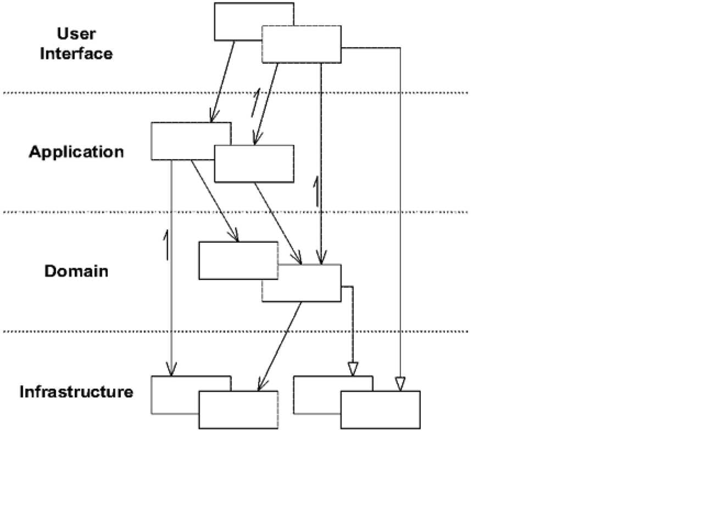

如果一个系统有多个面，但是接入方式没有差异可以把 Application 层和 Interface 层融合，Infrastructure 可以交给框架打理，这样在避免样板代码的同时提高对业务能力的响应。

### Servlet 模型

Servlet 模型虽然不复杂，但是对初学者理解有一定困难。我在刚开始学习 Java EE 时，非常困惑。为什么不能像其他应用程序一样直接运行启动，而是打成一个 war 包再放进一个容器。同样的困惑在培训毕业生时也遇到了。

后来找到一个通俗的解释：war 包并不是一个完整的应用程序，Tomcat 等应用容器才是一个完整程序并在后台持续运行。编写 war 包应用时，需要遵守一个契约去响应用户发送的请求，并按照契约返回，剩下的事情 Tomcat 容器帮助完成即可，Servlet 就是这样一个契约。

这里有一个我喜欢的比喻，小时候家里有一个粮食加工作坊，这套系统由柴油机、打米机、磨面机等组成。柴油机就像 Tomcat 持续运行，打米机和磨面机可以动态的通过皮带接入，类似于 war 上传到 Tomcat 中进行部署。

Spring Boot 的出现打破了 war 这种规范，而使用 jar 包，这就是另外一种模型了。随着 Spring Boot 和 Webflux 的使用，未来可能 Servlet 模型会被淘汰。

### 前端开发的几个模型

前端开发其实也有一些典型的模型，通过这些模型可以容易理解整个前端框架目前的状态，以及为项目选出合适的模型。

接触过的前端开发几个模型有：

- JQuery 的包装元素模型。早期使用原生 JavaScript 操作页面的时代，JQuery 通过选择器将匹配到的元素进行包装，在这个包装对象上提供了大量、便捷的功能，理解包装元素就能很快的理解 JQuery。
- Backbone 的 MVC 模型。JQuery 会带来意大利面条式的代码，Backbone 借鉴后端 MVC 思想实现了 前端的 MVC 模型。这里的 C 变成了 Collection。
- Vue、React、Angular 的 MVVM 模型。如果对象中的数据能和渲染出来界面动态绑定可以大大的提高开发效率，MVVM 模型，本质就是数据绑定模型，来源于 .net 为 WPF 技术。
- Redux、Vuex 的 Store 模型。也就是常说的单向数据流模型，更准确的说应该是单一数据源，其本质是将数据托管给一棵树，各个页面都从这颗树上获取数据、通过统一入口修改数据，保持数据的一致性和完整性。

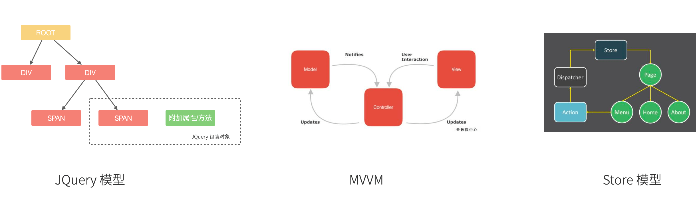

做前端时候的两个注意点：

- 原本的 MVVM 是双向绑定，双向绑定会造成数据源（应用当前数据和用户输入）冲突的问题。现在的框架都是单向绑定，并通过事件触发收集用户输入，即使有双向绑定，也是通过事件触发模拟而成，使用时需要注意。比如 Vue 中 v-model 就是模拟 onInput 事件。
- 如果对应用数据状态的一致性和完整性没有做出要求，Store 模型（Redux、Vuex）实际上没有必要被使用，会给应用带来不必要的复杂性。典型的特征是明明可以从后端直接获取数据，非要从 state 中中转一遍。

## 理解应用程序业务设计中的常用模型

做应用程序设计，除了特定领域外，大部分应用都有有一些通用的的内在逻辑，我们可以尝试把这些内在的逻辑找出来，通过模型可以帮助分析业务问题。

通俗来说，系统分析的关键是怎么找到一根线把系统的大部分元素串起来，达到逻辑自洽目的。串的东西越多，能分析的系统就越复杂。系统的类型往往由商业价值决定的，一般有这几类：

- 电商类。业务的关键逻辑是电商，即使看起来和电商无关。像 Keep、抹茶美妆这类垂领域的 APP 看似是生活类 APP，实际上也是电商应用。对于电商类，订单就是贯穿整个用户操作逻辑，我们可以围绕订单串整个系统。
- 协作工具类。一些项目管理系统，比如禅道、JIRA、worktitle 等，都属于协作工具类。这些工具类应用中最核心的是工作流，任务的状态和流转是贯穿整个系统的主线。
- 社交类。校内网、微博这类应用，属于典型的社交应用，其实也应该把像知乎这类 UGC 应用算进去。社交类以用户关系和内容串联整个系统。

当然从分类上来说不可能做到尽善尽美，只能说常见的产品属于上面三类，还有一些难以划分在这几类之中。

### 订单模型

在互联网产品中我们会发现大部分产品都是电商平台，即使是类似文化、阅读的产品也会有产商品的概念贯穿其中。即使是我工作早期做的餐饮系统，也发现无论怎么变化关键的部分都是围绕订单和订单的状态设计的。

订单的状态是分析此类系统很好的着手点，从已下单、已支付、已收货、已完成等状态，串联整个系统的其他元素。在处理业务逻辑的时候，考虑订单的状态是否能保持一致，基本能保证系统的逻辑大方向一致。

分析订单模型可以侧重使用 UML 中的状态图，以及 E-R 图建立对象模型。为了降低局部复杂性尝试使用 DDD 的思想进行领域划分、上下文划分。

### 工作流模型

我们做的内部 ERP 系统大多数都可以抽象成工作流模型，工作流模型的关键元素是任务、参与者、角色。

- 任务。一个工作流的客体，任务的状态变化体现业务逻辑的推进。
- 参与者。一个工作流的主体，参与者的活动体现工作流过程中关键的方法。
- 角色。参与者的分类，用于管理参与者的组织架构和权限。

工作流模型业务分析的关键是参与者角色的识别，往往这类系统角色、关键活动非常多。通过对角色+关键活动组成的用例进行识别，大量系统逻辑都能被分析的清晰并容易理解。

分析工作流模型可以借鉴一些开源工作流产品，除了直接使用这些工作流框架（例如 Apache activiti）之外，可以直接借用它们的定义的概念来自己设计模型。

### 信息流 (Feed) 模型

设计社交类应用时，无法绕开的模型就是 Feed 模型。信息流模型一般包含信息、信息生产者、信息消费者、推送平台等元素。

- 信息。用户产生的内容，比如文章、心情、图片或者视频。
- 信息生产者。产生信息的角色，比如发帖、评论、转发代表的角色。
- 信息消费者。阅读信息的角色，比如拉取个性化 Feed 流、读取热榜列表时代表的角色。
- 推送平台。负责将信息从生产者推/拉发送到信息消费者的视图中。

社交类应用往往信息生产者和信息消费者是同一个人，但是在设计时有需要分开看待，否则会混乱。通过信息流模型可以让技术实现更有方向感，比如将精力放在推送平台的建设和性能优化上，否则普通的技术选型无法支撑信息流模型。

### 租户模型

除了通过上面的几个模型方式之外，还有一种模型需要考虑，就是租户模型。租户模型与前面讨论的三类应用无关，所有应用都有可能存在多租户的情况。多租户指的是客户希望复制一套属于他自己内容的软件产品，例如多用户建站系统可以开通后复制一套自己的 CMS 系统，通过修改域名和模板就能建站。
互联网产品或多或少都有一些多租户的要求，常见的就是一些 SaSS 平台，比如建站系统、企业微信、用友 ERP、收银系统等。通过租户隔离可以实现双赢的局面。

- 对软件提供者来说，可以低成本实现倍增收益
- 对于软件使用者来说，相对于自行研发来说，可以享受到基础设施共享带来的低成本

但是多租户带来的最大的问题是：每个租户潜在的个性化需求和软件提供者希望打造通用解决方案之间的矛盾。认识这个矛盾后，租户一般会使用服务级别协议模型。服务级别协议（SLA）将使用者分为几个级别，一般互联网产品付费策略都会一定程度类似如下划分：

- 基础版本，共享数据库等所有资源，数据、应用程序不隔离，通过数据字段区分数据集合，后期考虑通过租户
- 数据隔离，共享同样的应用程序，开通专用的数据空间
- 应用隔离，私有化部署，数据和应用租户完全物理网络隔离
- 定制开发，除了私有化部署外，提供额外的定制开发

在产品设计初期，租多租户模型容易陷入的误区是把个别租户的个性化需求当做通用需求来做，导致基础版本的业务逻辑混乱，体验复杂。
根据 2-8 定律，大部分租户基础版本已经能满足需要，定制需求往往只是小部分租户需要。使用 SLA 模型可以较好地控制定制需求，当租户确实需要个性化功能，并能接受定制开发成本时，开发定制化需求并进行私有化部署，但不应该污染基础版本。如果产品经理认为这些个性化需求能满足大多数租户的需求时，优化并合入基础版本即可。

另外应用租户模型成本非常高，尤其是多租户下用户打通时带来的复杂性会导致程序难以维护，需要谨慎考虑。

## 建立业务模型

我们从计算机运行的模型聊到了应用程序设计的模型，还谈了业务设计中几种常用的模型。到这里可能有一个疑问，为什么现实工作中很少人一本正经的对业务进行建模呢？

其实是有的，这些模型存在于产品经理的脑子里，以及汇报给老板的 PPT 中，还有一些可以体现在数据库的关系结构中。我们在参与收银系统设计时，对数据库关系结构的调整非常重视，还好老板懂技术，我们能通过表的关系摹绘这个产品应该做成什么样子。

业务模型的建立有两个难点：

- 用什么形式表达业务模型
- 业务模型的守护和更新

通常来说，在白板上通过图形表达模型是很好的一种途径，但是往往白板绘画比较凌乱，所以最好的方式用 UML 维护一套模型。现在的软件公司业务人员往往非常抗拒或者不会使用 UML，这是一件非常奇怪的事情，毕竟 UML 就是设计给系统分析师使用的。这可能和一些没有技术背景的产品经理进入软件开发领域有关，他们认为他们的工作只是提出需求和 UI 原型，系统分析的工作应该由开发人员完成。我认为这是不负责任做法，并导致应用程序缺乏模型，提出的需求充满了逻辑矛盾。

UML 也不是没有缺点，UML 被作为业务建模工具出发点很好，希望能找到一种图示打破业务专家和技术专家之间的鸿沟。但是 UML 过于关心技术实现，并想做到生成代码。违背了模型的简单、抽象的原则，这是 UML 无法持续推进的原因。以至于我更多的选择了使用 E-R 模型来表达模型，虽然 E-R 模型的设计初衷是用来设计数据库。

E-R 图至少能解决业务模型的守护和更新问题，毕竟它是和数据库实现一一对应的。就目前来说 E-R 图和 UML 图是表达业务模型比较好的方式，唯一需要注意的是 UML 图例过多，选择少量的简单图例即可。

### 业务模型建立的步骤

业务建模也有一个的步骤也可以看做一个模型，对于模型的模型可以称作为 ”元模型“。下面就是我整理的一个简单的 ”元模型“，业务模型建立的方法 Eric写了《领域驱动设计》整整一本书，这里就不过多展开。

这个模型根据过程串起来，包含问题出发、提炼、拟合、预测，并最终不断修正和迭代。

- **问题出发**。搞清楚这个产品解决的问题是什么，是卖给谁，有什么痛点等。一种叫做电梯演讲的思维方法可以帮助分析，30秒电梯理论所要求的是麦肯锡要求他的每一个业务人员，都必须有在30秒的时间向客户介绍方案的能力。这也是一种思维模型，可以参考设计思维相关的书籍了解更多。

- **提炼**。提炼是指业务人员需要将需求和开发人员进行沟通，统一软件需求中的语言，比如名词、概念等。对这些属于进行定义，并根据这些属于建立对象模型（领域驱动设计一书中认为对象模型只是业务模型的一种，这个理论没有问题，但是过于复杂）。

- **拟合**。检查这个业务模型（可能是 UML 或者 E-R模型），是否能满足当前的所有业务逻辑，并保持业务逻辑的一致性和完整性。

- **预测。**通过这套模型预测未来的需求，匹配产品演进的方向。如果这套模型能在不修改或者较少修改的情况下满足产品未来演进的需求，说明是一套良好的模型，能满足软件设计要求。

- **修正**。如果产品方向发生了较大的调整，业务模型则需要进行调整，目标是适应新的场景。

  

## 总结（Takeaways）

- 模型用简单的东西类比复杂的事物，如果模型失去了简单性，也就失去了作为模型的意义。
- 理解计算机科学的重要模型有图灵模型、冯洛伊曼模型、网络分层模型、面向对象、关系数据模型、自动推理模型等，理解这些模型可以帮助我们理解计算机如何工作的。
- 找不到一种好的形式表达和维护业务模型是应用软件开发建模的难点。
- 好的业务模型应该能拟合业务需求，并能一定程度上响应未来的变化，匹配产品演进的方向。

## 参考文章

- 《模型思维》—读书笔记导图分享https://zhuanlan.zhihu.com/p/107287604 
- https://www.coursera.org/learn/model-thinking
- 芒格学院 https://www.madewill.com/thinking-model/multiple-thinking-model.html
- ThinkingFocus   https://thinkingfocus.com/the-thinking-model/
- 常见思维模型 https://www.madewill.com/thinking-model/top-thinking-model.html
- 图灵机模型 https://mp.weixin.qq.com/s/oKrsznBAumrNvz4_xtktXw
- Feed 数据架构模型 https://www.jianshu.com/p/eb9dd5ff65e9
- 订单模型 https://www.jianshu.com/p/ad3a4ebd774d
- 电商系统 --  订单模型 https://www.cnblogs.com/hzhuxin/p/11305298.html
- Feed系统架构与Feed缓存模型 https://mp.weixin.qq.com/s/RmDLqQmXQAmtQrajoanNuA?spm=a2c4e.10696291.0.0.4f9219a4FAVuGm&utm_medium=hao.caibaojian.com
