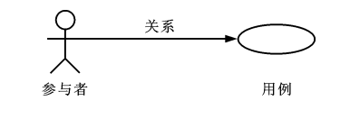

在微服务时代，由于分布式系统的要求，对软件模型的要求越来越苛刻。虽然架构师们对领域驱动设计的理念重新重视起来，但是靠拍脑袋得到的模型往往不能恰当的服务于业务需要。

Eric DDD 中阐述了领域驱动设计的重要意义和一些基本实践，但是并没有给出一套具体的建模过程方法。这给架构师巨大发挥空间，各种建模方法就都可以拿来使用，比如事件风暴、 四色原型等建模过程方法。

于是有一些朋友会产生疑惑，这些建模方法背后的逻辑是什么呢，它们有没有什么共通之处？本文会和大家一起探讨软件建模过程方法的基本逻辑，以及如何设计一套简单的建模过程。

## 01. 解构建模方法

目前进行领域建模方法使用的最多的是事件风暴。事件风暴的发明人是 Alberto Brandolini ，它来源于 Gamestorming，通过工作坊的方式将领域专家和技术专家拉到一起，进行建模。事件风暴非常有意思的地方在于，它先从事件开始分析，捕获事件。然后分析引发事件的行为和执行者，从这些信息中寻找领域模型，最终进一步展开。关于事件风暴的详细过程可以参考： [《DDD 建模工作坊指南》](https://domain-driven-design.org/zh/ddd-design-workshop-guide.html)

Event Storming 的逻辑是什么？为什么需要先从事件开始分析？这是事件风暴工作坊中遇到过最多的问题。

带着这些问题请教了很多专家，甚至发送了邮件给 Alberto Brandolini，有幸得到回复。根据 Alberto Brandolini 理解，他认为系统中事件是一种容易寻找到的元素，通过头脑风暴，容易打开局面，仅此而已。

带着同样的问题，分析了几种建模方法（为了减少争议避开了公司同事发明的建模方法）。

**系统词汇法（OOA）**

系统词汇法就是面向对象分析方法。这种面向对象建模的方法比较原始和直接，直接通过经验提取领域模型，就是简单的面向对象分析方法。其操作过程简化如下：

1. 首先，从需求陈述中找出所有的名词，将它们作为 ”类—对象“ 的初步候选者。去掉不正确和不必要的对象（不相关的、外部的和模糊的对象），做出合理的抽象。
2. 为上一步的模型做出定义，构建数据字典，描述对象的范围、成员和使用场景。
3. 聚合，把业务一致性强的对象聚合到一起。
4. 使用合适的关联方式设计对象之间的关系。

系统词汇法建模的优点和缺点都比较明显。优点是没有过多的建模过程，对于简单的系统有经验的架构师马上就能观察出合适模型。相应的，缺点也很明确，没有对业务充分分析，直接得到模型，容易错误理解业务和过度设计模型。

**用例分析法**

用例模型是一种需求分析模型，是需求分析后的一种输出物，通过对用例再加工可以得到我们的领域模型。1992 年,  Jacobson 中提出了用例的概念和可视化的表示方法用例图。

> 用例（UseCase）是对一个活动者使用系统的一项功能时所进行的交互过程的一个文字描述。

用例由参与者、关系、用例三个基本元素构成，用例图的基本表示方法如下：

通过用例图来提取领域模型的方法如下：

1. 梳理用例的用词，统一用例中所有的概念，避免混淆。
2. 从用例中提取出名词，作为备选模型，这个时候不区分对象或者属性。
3. 找动词，通过动词和用例关系分析模型之间的关联关系，比如：用户结账用例，会触发累积积分的用例，说明用户账户和积分有关联。
4. 对名词进行抽象、展开，把用例中作为属性的名词归纳到对象中，补充为完整模型。

因为用例图是从不同的参与者出发的，非常适合表达表达业务行为，可以避免错误的复用。在很长一段时间你，很多软件架构师对的模型的建立都依赖用例图。用例分析法的特点是不容易漏，缺点是由于名词的二义性，往往会设计出一些过度复用的模型。

**四色建模法**

四色建模法的思路和用例略有不同，它的理念是:

>  “任何业务事件都会以某种数据的形式留下足迹”。

四色建模法其实是以数据驱动，通过挑选一些关键数据（类似于办事过程中的存根），来还原整个业务流程。然后基于这个线索，找出时标性对象（moment-interval）、实体（party/place/thing）、角色（Role）、描述对象（description）。

1. 以满足业务运营的需要为原则，寻找需要追溯的业务事件。
2. 基于这些业务事件发生的的存根，建立时标性对象，比如订单 -> 发货单 -> 提货单等。
3. 基于时标性对象反推相应的实体，比如订单 -> 商品，发货单 -> 货物和发货员。
4. 最后把描述的信息放入描述对象，附着在需要补充的对象上。
5. 梳理为最终的模型。

四色建模法由 Peter Coad  提出，其实并不是一种非常主流的建模方式，其原因为存根和时标性对象在很多业务系统中并不容易找到。

**事件风暴**

事件风暴相对其他的建模方法非常独特，所以放到最后来说，但是简单来说，它的思路是： 

>  “事件是系统状态变化的关键帧”。

事件是比较使用找到的，它的建模过程有点逆向思维。

1. 寻找事件。事件（Event）是系统状态发生的某种客观现象，事件格式参考 “XXX 已 YYY”，比如 “订单已创建”。
2. 寻找命令和执行者。命令可以类比于 UML 分析中的业务用例，是某个场景中领域事件的触发动作，执行者是命令的发生者。
3. 寻找模型。为了在这个阶段保持和业务专家的良好沟通，寻找 “领域名词” 。
4. 设计聚合。对领域名词进行建模，获得模型的组合、关系等信息。
5. 划分限界上下文。对模型进行划分，在战略上将模型分为多个上下文。

事件风暴在获得模型的深刻性上具有优势，但是在操作上更为困难。另外由于它不从用例出发，和四色建模一样，可能有一些遗漏，所以对工作坊的主持人要求较高。

## 02. 建模方法元模型

元模型是关于模型的模型，我们可以为建模方法建立一个模型。在计算机领域中，研究元模型的资料和书籍较少，因为涉及到更高的抽象层次，理解起来比较困难。在有限能查到的资料中，《本体元建模理论与方法及其应用》一书介绍了如何建立软件建模的元模型。

通过对这些建模方法进行分析，发现他们有一些共同特点。都是围绕着参与者、行为、事件、名词这几个元素展开的，通过对这些方法的总结，我们可以尝试建立一个简单的建模方法元模型，为建模方法的改进提供依据。

其实，面向对象中的模型是现实世界在计算机系统中的一种比喻，类似的比喻还有函数式等其他编程范式。对于现实世界的分析，我们可以使用认识论建立一个非常简单的模型。

> 主体 + 行为 + 客体 = 现象
>
> 主体：主体是有认识能力和实践能力的人，或者，是在社会实践中认识世界、改造世界的人。
>
> 客体：客体是实践和认识活动所指向的对象，是存在于主体之外的客观事物。

在认识论中，每一个客观现象的出现，都可以使用主体、客体来分析。找到导致这个客观现象的行为背后的主体、客体，就能清晰的描述事件，也更容易看到问题的本质。从认识论的角度出发，建模的过程就是找到确定的客体作为模型的过程。

基于元模型把 4 种建模方法实例化一下：

|      | 系统词汇法（OOA） | 用例分析法 | 四色建模法                 | 事件风暴       |
| ---- | ----------------- | ---------- | -------------------------- | -------------- |
| 主体 | -                 | 参与者     | 角色                       | 执行者         |
| 行为 | -                 | 用例关系   | -                          | 命令           |
| 客体 | 名词，模型        | 名词，模型 | 时标性对象、实体、描述对象 | 领域名词、模型 |
| 现象 | -                 | -          | 业务事件                   | 事件           |

从这个图我们可以看出，系统词汇法的建模线索不够清晰，直接获得模型，没有从业务行为中抽取的过程。而事件风暴可以这样理解：

**执行者作为业务主体，在系统中发出了一个命令作为业务行为，对模型的状态发生了改变，最终导致了事件的发生。**事件风暴是从事件、命令和执行者为线索推导出模型，整个过程更加完整。

## 03. 为特定领域调整建模过程

在识别模型的过程中，模型这个词太过于宽泛，因此不适用于业务专家找到这些模型。于是有咨询师认为不应过早强调模型，建议先使用 ”领域名词“、”业务概念“ 等和业务相关的概念，甚至可以直接使用 "合约"、“单据” 这类和行业相关的词汇。

因此，在和业务专家的交流时候，我们可以换成和当前业务相关的词汇系统。不仅可以让建模方法发挥更好的作用，还可以为客户定制一套建模方案。

我们以事件风暴为蓝本，针对餐饮行业设计一个特有的建模法，我把它叫做  cake flow。餐饮行业的过程中，围绕大量的单据展开，这些单据的本质是业务凭证。业务凭证意味着业务中各个参与者的责任转移，所以我们可以寻找模型的阶段调整为 “寻找业务凭证”。

我们依然可以使用事件风暴的结构：

1. 寻找事件。这些事件的线索是业务凭据被改变或者转移。
2. 寻找命令。找出那些业务参与者发生了什么行为修改业务凭证、生成了新的凭证。
3. 寻找业务凭证。比如：菜单，是餐厅能提供产品的凭证；桌位，是接待客人的凭证；订单，是一次产品供应的凭证；出餐小票，是后厨生产的凭证；发票，是交税的凭证。

在建模的过程中，先不引入计算机中的技术概念，通过走访餐厅、收集它们的单据、调研优秀餐饮公司的工作流。避免需求叙述过程中制造的新概念、重新命名的业务名词，根据奥卡姆剃刀的原则，减少 “伪需求”的产生。

同样的，架构师需要意识到为特定领域调整建模方法的局限性，只有在特定的范围内才能发挥作用，如果把 “合约”、“业务凭证” 这类词汇系统带入其他行业，会让业务专家更加迷惑。

## 04. 设计自己的建模方法

根据元模型，选取一个建模视角（从主体、行为、客体和现象选择），可以轻松的设计一个适合自己的建模方法。cake flow 的结构还是先从事件出发，那么我们这次选择另外一个视角出发会有什么好玩的事情发生呢？

比较少的建模方法从主体出发，这次我们选择从主体出发，先找出业务的参与者，通过角色扮演的方式建模，我把这个方法叫做 **“play 建模法”。**这次的建模方法的流程完全不同于 Event Storming 的结构，而且更为有趣。

1.  寻找业务参与者。将业务的参与者全部找出来，在工作坊中找到熟悉该角色工作内容的人扮演。如果让工作坊更为有趣，可以用 A4 纸跌一个帽子，写上该角色的名字。
2. 每个业务参与者需要有两个人来扮演，一个人扮演按照正常操作者，另外一个人扮演异常操作者。
3. 选择一个场景开始，正常操作者在墙上用便利贴逐步写上该角色工作过程中的行为，这些行为需要产生业务凭证。异常操作者需要寻找任何可以退出、停止的行为触发异常流程。
4. 扮演做够多的场景，从这些行为中提取业务凭证。如果异常操作者发现流程漏洞，需要梳理合适的分支流程。
5. 对业务凭证进行细化、展开得到领域模型。
6. 回顾扮演者的职责转移，业务凭证的转移往往意味着上下文的切换。比如，订单生成后，需要分解为不同后厨的出餐单，凉菜、中餐、甜品在后厨由不同的厨师完成，订单和出餐单发生了业务凭证的转移。

play 建模法有几个特点。有明确的职责转移，容易找出上下文；角色扮演的方式比较真实和有代入感，避免单纯的业务叙述带来误解；异常操作者可以用来提前发现流程中问题，让流程更加完善。

当然，play 建模法只是通过元模型设计出来的一个例子，在实战中需要继续打磨。根据元模型，我们可以根据一些特殊的场景设计出合适的建模方法，更进一步可以为客户设计专属的建模方法。

## 05. 参考资料

2. 《用例分析建模》https://www.jianshu.com/p/d74ce3f7848a
2. 《用例驱动需求建模过程的探讨》 陈枢茜,李 辉
3. 《运用四色建模法进行领域分析》徐昊
5. 《本体元建模理论与方法及其应用》何克清
