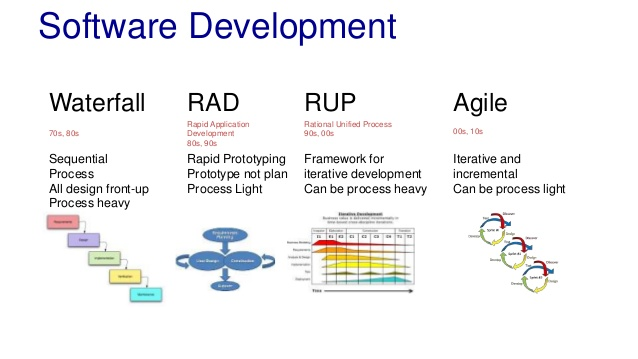

敏捷方法追求单件工作流和响应变化，需求按照故事卡拆分，容易造成业务模型、架构设计碎片化。

在按照敏捷方法运作的团队工作时，比较麻烦的事情是怎么继续坚持软件建模的这些实践。BA （业务分析师）们按照迭代把分析好的用户故事给到开发，开发会按照情况认领任务并开始开发。

因为每个用户故事都是单独计算工作量，有单独的生命周期，所以使用用户故事来描述业务需求，会造成业务需求的整体性缺失。

但是，软件开发的本质是知识性工作，如果没有整体性设计的过程，软件架构会很快腐化和混乱。

软件建模，在软件开发过程中指的是数据库设计、UML 图例的更新、架构的调整和领域对象的设计。建模的专业性，往往决定了一个项目的成败。建模清晰的开发团队，效率和开发成本都会小很多。

项目很小时，不太能体会到建模的优势，当业务复杂到几十上百个数据库表、几百个用例、7-8 个服务时，没有有效的建模，软件项目将无法继续。

因此，必须想办法既要敏捷迭代式的开发，也要持续维护模型的完整和一致性。

解决敏捷项目中整体性设计的问题有几种运作方法：

1. 将用户故事拆解粒度变大
2. 固定的人认领批量的用户故事
3. 在迭代期间增加软件设计和持续建模的过程
4. 增加专门的软件建模任务卡，并排在每个迭代前

1、2 两种方法可以看做一体，是对当前的敏捷过程调整，对敏捷的一些实践进行裁剪。固定的人批量的认领一些任务，由一个人来负责整体性设计。

3、4 两种方法是我从一种叫做 RUP 的软件开发方法中受到的启发，对敏捷过程进行改进。每个迭代都应该进行模型的修正，并持续建模。

**软件建模，也需要迭代更新，这就是持续建模。**

## 持续建模方法

其实 UML、ER 图等常用软件建模的方法使用起来都比较简单，也很容易学会。但是实际开发过程中很少看到有团队再认真的画 UML 相关图形来设计对象，也基本上很难看到大规模使用 E-R 图的情况。

原因很简单，这些图形难以随着代码和业务的变更而同步更新。如果一个软件模型不能正确的表达业务逻辑和真实的架构情况，团队就很难有动力去更新它了。软件建模大多数都发生在项目启动的时候，以及大规模重构的时候，难以持续整个软件周期。

背后的逻辑分为技术、开发过程两个方面：

1. 从管理上，敏捷方法中每个迭代周期没有一个过程留给去做架构调整、更新模型这些事。
2. 从技术上，模型的更新成本比较高，修改代码时需要记得同步更新模型，尤其是一些图形的方式更新就更麻烦了。

简单来说，模型的创建很简单，但是保持和代码同步更新很麻烦。这也是很多代码生成器难以发展的根本原因，使用代码生成器会造成一旦手动修改部分生成的代码，就无法再使用代码生成器了。

### RUP 方法

先说从开发过程上解决每个迭代模型更新和架构调整的问题。

RUP（Rational Unified Process），即 Rational 统一过程。它是一种比较重的开发方法，并提供了一整套软件工程相关的文档、规范，以及相关的工具。

正是因为 RUP 比较重，需要每个团队的项目经理根据自己的情况进行裁剪，所以在竞争中不如敏捷方法。我们不必学习 RUP，只需要提取出 RUP 中有价值的的方法和实践到敏捷开发中。

RUP 将开发过程划分为了初始阶段、细化阶段、构造阶段和交付阶段 4 个阶段。RUP 按照迭代的方式运行，商业建模、需求、分析和设计、实现、测试、部署 6 个步骤，每个迭代都有这 6 个步骤。

RUP 和敏捷的不同是，敏捷强调单个用户故事的流动（WIP），RUP 可以理解为每个迭代内实际上还是瀑布的方式在运作。

其中：

- 商业建模和需求的过程为 BA 或者产品经理输出原型图、用户故事、业务用例等
- 分析和设计步骤为开发人员进行系统设计的过程，前期迭代为初始化系统设计，后期的迭代为修正系统设计的过程。系统设计的输出为 E-R 图、UML 中的类图等整体性设计。

RUP 的几个步骤都发生在同一个迭代。敏捷的一些实践，实际上是穿插完成的。

比如以两周一个迭代为例，前一个迭代的第二周，BA 们应该开始为下一个迭代的工作进行业务分析工作，完善功能的细节和约束条件。迭代的末尾 2 - 3 天应该进入封包整体回归和修复 bug 阶段，可以开始下个迭代的系统设计和模型修正。

### 代码化的 UML 工具

再从技术的角度来说，如何持续维护模型。

表达模型的工具很多，Microsoft Visio、draw.io、starUML 都是比较好的选择。但是，持续建模要求每个迭代都对模型进行修正，因此模型最好能通过版本管理工具管理。

在调研各种绘图工具后，能通过代码化的方式表达 UML 图形的工具不多，其中有 markdown 的 UML 拓展、plantuml。实际使用的情况来看，比较建议使用 plantuml。

plantuml 可以绘制基本的时序图、类图等，以及架构图、E-R 图等非 UML 规范的图形。在实际工作中，我们绘制的图形中，有 5 种比较常用于表达软件模型：

- 用例图
- 类图
- 时序图
- E-R 图
- 架构图

用例图、时序图在分析业务逻辑时使用，架构图、E-R 图在做整体性设计时候使用，类图则往往用于具体实现阶段。从维护成本的考虑，保持架构图和 E-R 图持续维护，其他图例在必要时使用即可。

使用 plantuml 非常简单，只需要安装 Java，并现在一个 jar 文件就可以将文本的 UML 代码转换成图形，还可以借助一些工具进行代码生成。 除时序图和活动图以外的图，还需要需要安装 Graphviz 依赖。

以 Mac 为例，安装 graphviz：

> brew install graphviz

下载 planuml :

> wget https://nchc.dl.sourceforge.net/project/plantuml/plantuml.jar

用官网的例子绘制一个时序图，将下列文本保存为 sequence.txt。

> @startuml
> 用户 -> 认证中心: 登录操作
> 认证中心 -> 缓存: 存放(key=token+ip,value=token)token
>
> 用户 <- 认证中心 : 认证成功返回token
> 用户 -> 认证中心: 下次访问头部携带token认证
> 认证中心 <- 缓存: key=token+ip获取token
> 其他服务 <- 认证中心: 存在且校验成功则跳转到用户请求的其他服务
> 其他服务 -> 用户: 信息
> @enduml

然后用 java 执行 plantuml.jar 即可运行，并得到序列图。

> java -jar plantuml.jar sequence.txt

## 总结

为了解决敏捷项目中，业务模型和架构碎片化的问题，可以通过开发过程和技术两方面进行优化。

过程方面，可以在敏捷过程中加入建模的环节，实际上在一些大的公司类似于方案评审环节。技术方面，可以尝试改进模型的维护方式，尽可能的将模型简化，并通过代码化的方式持续演进。

## 参考文章

- 《UML Made Easy with PlantUML & VS Code》https://www.codeproject.com/Articles/1278703/UML-Made-Easy-with-PlantUML-VS-Code
- 《plantuml 入门指南》 https://plantuml.com/zh/starting
- graphviz 下载页 https://www.graphviz.org/download/

