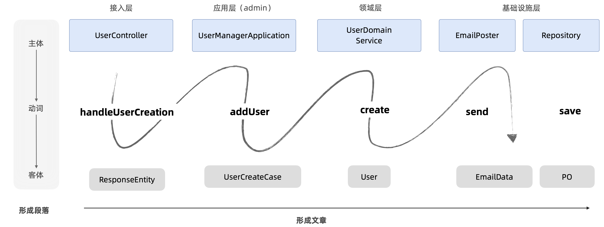

## 01. 主客体命名法

曾经我也纠结命名的问题，想使用简单快速地方法解决，但是由于没有意识到**命名也是设计的一部分**，为此吃了不少的亏。我希望读到这篇文章的朋友不要犯我同样的问题，命名真的不是通过某些 ”AI“ 工具、插件能自动生成这么简单。

在这套方法里面，我延续主客体思维，如果不了解的朋友可以先去看 [《主客体建模法》](https://mp.weixin.qq.com/s/SOqmCZIZFQuzj7wBuLt7Mg)。使用主客体命名法，不仅可以写出主谓宾结构的语句，还能通过命名改善软件设计。

主客体命名法可以做到下面这样，代码如诗一样优美。

首先，我们将需要起名字对象进行分类：

- 对客体命名
- 对主体命名
- 对行为命名

**对客体命名**

根据 DDD 的统一语言原则，名词往往代表着一个业务概念，并需要在团队中和开发人员、业务人员对齐。编程就是使用特定的算法操作一组数据，这些数据代表着业务中的某些概念。

读过《主客体建模法》的朋友可能知道我要说什么了，这些概念就是代码中的客体。如果想要获得良好的命名，就需要对这些概念进行定义。

> 一个对象就是一个概念，对象中的属性就是这个概念的内涵，这个对象被用来表达的范围就是它的外延。

这里需要普及一下逻辑学中内涵和外延。内涵是指一个概念的典型特征，外延是指它能描述事物的集合。比如兔子有长长的耳朵是内涵，兔子在地球上指代的动物就是它的外延。

当我们说白色的兔子不是兔子的时候，说的是“兔子”这个概念不是“白色兔子”的概念；当我们说白色的兔子是兔子的时候，说的是“白色兔子”概念表达的集合是概念“兔子”表达的集合的子集。

所以对客体起名字的关键在于定义这个客体的概念，**使用拟物的方式起名**。

我们可以通过概念图（可以搜索概念图相关的文章）来定义，也可以直接用语言来表达。比如当我们给系统中用户相关起名字的时候可以这样定义：

- 用户：在系统中用来标识软件使用者身份的对象，可以通过关键属性来进行登录。
- 客户：在系统中关于参与人的个人资料，不具备登录能力，客户可以关联用户也可以不关联。
- 账户：用户拥有用于存放资金的对象，关键属性为余额。
- 用户组成员：用户在某个用户组下的身份，持有这个用户组的权限。
- 商户：在系统中表达一个资源的空间，在实际业务中对应法人。
- 商户管理员：用户在一个商户下的身份，具有管理这个商户资源的权限。

对于容易混淆的”地址"，也可以这样定义：

- 地址：地址库中的地址，属于站点元数据。
- 用户地址：用户个人资料下保存的地址，可能引用自地址库也可以不引用。
- 收获地址：在订单中使用的地址，可以引用自用户地址也可以不引用。

**对主体命名**

在代码操作中操作这类客体的就是主体，那么主体怎么命名呢？

其实很简单，我们只需要区分好他们的功能就行了。假如有 A、B、C 三个人去荒野求生，他们到了一个小岛靠打猎为生。A 负责打猎，B 负责加工，C 负责存储。反应快的朋友可能知道我要说什么了，这不就是代码中的分层吗。看看这样命名是否合适：

- A：Hunter
- B：Processer
- C：Storekeeper 

看下我们代码是不是类似的：

- 负责处理 API 请求的类叫做 Controller
- 处理业务逻辑的类叫做 Service
- 负责生成 SQL 的类叫做 Mapper

所以对主体起名字的关键在于定义他们的能力或者职责，然后**使用拟人的方法起名**。

**对行为命名**

有了主体、客体，只要给行为一个动词，也就是我们的方法名，我们就可以像主谓宾一样写出句子了，是不是很简单？

但是这个时候很多朋友就犯难了，我除了会 get、take、do 这类词汇之外，找不到其它词汇了。

实际上这是对业务理解不够，或者英语词汇量的限制。这类词汇在英语中叫做小词，往往威力无穷，但表达能力拉胯。这里介绍一个学习英语的技巧，如果我们出国旅游，其实也只需要 get、take、do、I、it 等几个词就够了。如果想要买东西，就指着想要买的东西说，I take it，老板自然就知道你的意思。然后不断用更准备的词去代替这些词，然后英语就可以渐进提升。

**英语的学习的关键不是背单词，关键在于表达能力。**但是不使用更准确的词汇，表达能力就会受限。同理，我们可以使用 doXXX 来完成所有的业务，也能写出整洁的代码，但是表达能力非常弱。

所以对方法进行命名，只需要找一个合适的动词即可。

那么，动词如果真的不够用怎么办？

试想，如果有两个方法，类名、方法名、参数都相同，那么需要思考一个问题，这两个方法的区别是什么？这也是方法签名为什么这样定义的原因。

## 02. 关于命名的反模式

下面通过一些命名的反模式，来对比主客体命名法的优点。

**命名毫无意义**

使用 a、b、c 进行命名，就像四川人使用 “大娃、二娃、幺娃子”来命名一样，只能算小名，没人能看得懂。

还有使用拼音（甚至粤语拼音）、符号、不统一的风格，批评这类命名的文章已经很多了，不是本文的重点。

**不遵守主客思维**

下面几个是需要重点介绍的反模式。

不遵守主客思维的命名有拿物品作为主语，这类命名我称为“成精”命名法。比如我总喜欢用的例子，订单中的结账方法、商品中的发货方法，可读性非常差。

提示一下，由于主客体具有相对性，拟人的不一定不能作为客体，就好比理发师也能被其他理发师理发一样。但是主体我们尽量使用拟人法，特殊情况是当一个对象操作它自己的属性时候，我们能看做一个局部的主客关系，也能作为主体。

**过于抽象**

在一个系统中，如果看到命名全是 xxxData、xxxMessage、xxxInfo 等非常通用和抽象的词汇，基本没有表达能力，造成混乱。

这是由于我们对客体认识不足造成的，按照前面对客体进行重新定义，这也是设计的一部分。

**主体或者客体冗余**

在主客体命名法中，行为只需要一个动词，或者动词短语即可，如果你的方法名形如：

- createUser 保存用户
- merchantUpdate 商户更新

当我们的方法被调用时，带上参数，会看起来别扭：

> orderService.createUser(user)

如果能熟练的掌握主客体命名法，就能写出这样的代码：

> orderService.create(user)

如果主体、客体能表达完整的含义，行为就是用一个动词即可；如果不能，就使用一个动词短语。

## 03. 起名字可以反思设计

很多建模和架构问题甚至不需要费神去解决，找到一个恰如其分的名字可能就解决了。

命名是编程中非常让人头疼的事情，但是你可能不会相信，取一个好名字你的建模问题也解决了，这个问题说起来还真是挺有意思，否则也不值得写一篇文章了。

在保险领域，业务有一个需求是在正式提交签约后，保单才具有法律效应，正式生效。但是在受理签约之前，用户会提交一些材料，这些材料几乎和最终的保单一模一样。

最初的开发人员设计了 Policy 这个对象，并增加了一个状态属性，但状态为生效后保单才成为合法的保单。这样做看起来没有问题，但是随着业务的变化，签约前和签约后慢慢开始有了差异，仍然使用 Policy 这个对象不是很好。开发人员准备准备将这些差异分离，这个时候出现了两个派别，并发生了争吵。

主分派：签约前后，这是两个不同对象应该分离。

主合派：他们明明都是 Policy，怎么能分了，再说分开了签约前叫什么呢？

主分派：…… 好像确实不知道叫什么。

主合派：看吧，你都不知道叫什么，还是别拆吧。

这类对话在我培训或者咨询工作中，听到不下 10 次，如果有明确的命名来区分概念，往往大家很认同拆分，但是在不知道如何起名的时候，问题就变得模棱两可。

所以说，**命名的问题，本质是一个设计问题。**

上面问题最终通过找到一个业界公认的词汇得以解决——投保单，英文中叫做 insurance slip。类似的概念还有客户、用户、账户的三户设计，当我们找到了命名后，建模问题往往迎刃而解。

小的时候几乎每家都有一本书《姓名与人生》，用来给新生儿起名字。它提供了一套根据笔画来判断名字是否足够好的理论，虽然现在看来有点扯，但是也意味着人们对名字的重视情况。

优秀的开发者对待命名应该像对待自己孩子的名字一样，毕竟他们有一个共同点就是，被广泛使用后基本上很难被修改。

在开源社区，优秀的图形库 mxGraph 为了命名这事儿讨论了好几年，直到 2021 才开始下决心修改它。

“反者道之动”，反过来想也能帮我们更好的发现问题。

当我们无法给出一个良好的命名的时候，反过来思考，当我们无法给出一个良好的命名的时候，是不是意味着我们的软件设计需要改善呢？

## 04. 总结

1. 给行为的主体命名，使用拟人法，想象在给人起名字。比如 Manager、Handler、Controller。
2. 给行为的客体命名，使用拟物法，想象在给物品起名字。
3. 对行为起一个符合主体、客体 ”身份“的动词，比如 handle、save、process 等。
4. 尝试连成一个句子，避免冗余和重复。主体 + 行为 + 客体 =  主谓宾结构。
5. 使用具象化的命名，不使用抽象的名字。

