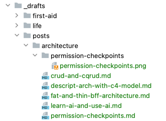

由小伙伴好奇我如何写作的时候管理文章的一些工具。

我整理了一个简单的方案：

- 使用 Markdown、Adoc 作为写作语言
- 使用 Github 托管内容（文字和图片）
- 使用 Intellij 和 Markdown 插件作为写作工具
- 插图跟着文章中，不用图床
- 使用 Intellij 的 Draw.io 插件直接绘图，并生成可以编辑的 png 图（之前的文章已经分享过 http://shaogefenhao.com/posts/architecture/editable-architecture-diagrams.html） 
- 使用 Vuepress 或者其它静态网站生成工具生成个人网站或者知识库

插图放置目录结构如下：

