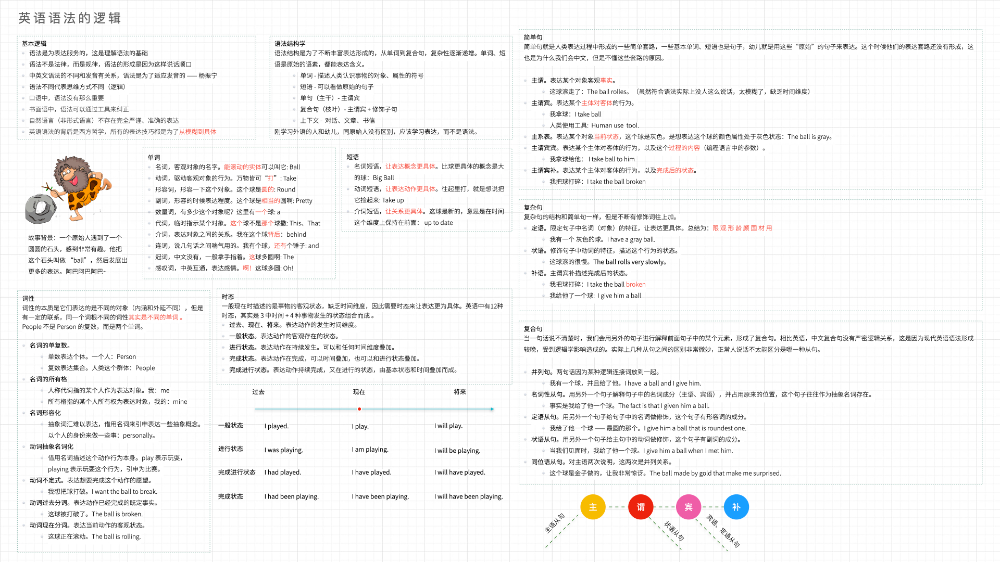

我算是英语学习的受益者，从 2016 年开始在一家外企工作接近了 78 年，虽然工作平平，但是好在压力适中。

英语学习除了工作上的优势外，在技术学习上可以接触最新、最全的资料，对于母语汉语的人来说，懂英语相当于直接接触了东西方两套世界观和知识。还避免了很多翻译的问题，尤其是计算机这类翻译过后反而变得更难理解。

有时候并不是为了装逼一定要用 Google 搜索资料，而是掌握一定的英文能力，可以同时在中英文资料库中检索需要的材料。

从开始参与到海外项目开始到现在，对于英文能力刚好在 IT 团队中使用，有朋友希望我写写这方面经验。

本文把 IT 行业场景下，学习英语的经历、经验和教训总结下来，希望对大家有帮助。

## 计算机英语需求分类

对于程序员来说，我们学习英语往往从实用角度讲，我根据市场招聘的经验要求，做出简单的分级：

1. 能阅读英文材料
2. 能听懂英文 IT 技术演讲和课程
3. 能基本使用英语工作，包括阅读材料、邮件回复、参加会议（听说）
4. 能专业的编写邮件、英文文章

对于程序员来说，建议根据这个分级学习。原因是每阶段的学习都能带来正向反馈，而且 IT 领域内词汇量要求不高，很快就能用起来。

限定在 IT 领域内，阅读英文材料并不难，配合翻译软件几乎每个人都能做到；听懂 IT 技术演讲配合英文字幕经过学习也能达到；但是通过使用英语作为工作语言需要前面两项熟练掌握的情况下还能做到流畅的听说，这一步开始有门槛了；最后一个阶段经过大量的训练，才能从蹩脚的英语达到专业、地道水平。

下面就来聊聊学习经验和误区。

## 误区一：英语不是获取知识，而是体育训练

我是一个理工科思维很重的人，这是一开始关于英语最大的挑战。

英语不像其它学科，你需要先知道很多东西，然后就能使用。英语学习不同，它是少量的内容，经过大量的练习形成语言区的神经反射的过程。

语言学习逻辑完全不像其它文化学科，反而更像体育、舞蹈。

举个例子，在于听力来说，我们不可能背好单词、记下音标，再识别声音→分割单词→识别句子→翻译成中文→理解意思。

强烈推荐的一场关于语言学习的演讲：TED 经典演讲《如何在6个月内学会一门外语》。

这里面有一个例子，如果你听到 fire 这个词，需要先翻译成火，那么说明语言学习的反射回路建立在错误的回路上了。 相当于音频软件明明可以通过音频编解码芯片硬件解码的，还需要通过 CPU 软解码，学习效果当然非常差。

语言学习需要直接建立大脑语言区域的神经回路。 训练自己听到或者看到 fire 时候想到的是一幅画面 🔥而不是中文。

我自己体会非常明显，我必须花一点时间从中文环境切换出来，进入到英文语境才能不加思考的完成听说读写，甚至使用英文久了看到 🔥第一时间想到的不是"火"，而是 fire。

达到这种效果没有其它办法，一般的方法就是"泡脑子"：

- 找一段材料精听，比如电影，将其每个词都听明白，先弄明白这套材料，然后反复听 30 遍
- 听写
- 口语识别训练，一些软件支持发音打分，叙述一段句子让机器识别准确性，如果机器能识别到，基本上人也能听懂
- 将娱乐方式全部换成英文的，例如看电影、把抖音换成 YouTube 等

## 误区二：去表达，不要组装

学习英语的另外一个误区，特别受到理工科影响特别大的人容易犯的错误，就是公式化的研究英语语法。

在和大量英语母语人士聊天后，发现他们一个规律：

英语语法很重要，但是表达方便性更重要。

例如，非常简单的句子，"我没有主意"。

按照中文拆解翻译为：我（I） 没有（do not）主意（idea）。

其实这样虽然符合语法规则，但是真正符合表达习惯的是：I have no idea。

语言的语法是一种规律，并不是语言法律，因为会有很多不遵守语法规则的地方和表达，尤其是在口语中非常严重。

在英语中，语法的本质是表达习惯，而表达习惯取决于人们的思维方式。

在现代英语被逻辑学改造后，其主要结构为：指代的主体 + 动词 + 客体 + 额外补充信息 + 修饰词或者短语

所以我们会发现大部分语法结构都是围绕主谓宾定状补来的，即使是主系表结构也可以视为主客关系的思想，只是系动词是一种特殊的动词。

例如，我吃苹果。主体是我，客体是苹果，动作是吃。只要表达清楚主客关系，那么所有的事情就能说明白，这就是英语（现代）的逻辑。

这里有一个思考题，为什么下雨了，需要使用 It 开头表达为：It's raining？

这是因为西方哲学中，认为所有的行为都会有一个主体存在，对于自然现象这种没有主体推动的自然行为是上帝作为"第一推动"完成的。类似于中文的"天老爷要下雨"中的"天老爷"。

然后另外一个句子又会让人困惑，"The rain was on time" 为啥这里又不用 it 了呢？

这里的 "The rain" 描述了这个事实作为主体，它的状态是准时的。

关于使用简单的逻辑表达复杂的内容，这里根据"原始人"为了表达一件事情的多种情况，进行了推导，梳理了语法逻辑。

对于口语初学者，避免一开始学习很多高级的表达方式，尽量使用非常基础的词汇和用法，像小孩一样学习。

另外，我们也需要尽可能使用非语言交流方式作为桥梁。

比如，出国旅游时，使用极其简单的词汇（I、You、Buy、Do、It）配合肢体语言就可以完成生活中常见的交流。买东西时，你可以用手指来指出需要买的东西，然后说 buy。因为是你自己说出来的，店家识别到主体是你，然后你指向了某件商品，那么自然客体是这件商品，只需要补充 buy 这个词，区分 "抢" 这个词，店家自然知道你的意图。

不断组合这些简单的词汇，只要能表达清楚主客关系，慢慢就具有了初级的语言能力，这就是小孩子学习语言的逻辑。

## 经验：人不能记住无法理解的内容

我们在学习英语时，有一个常见的观点，就是背单词是否有用。

有些人会说单词为王，必须要背大量的单词，而有些人会说单词没用。

在实践中我逐渐意识到**要背有上下文和能理解的单词**，比如 Starving 这个词，单独去背这个词很难记住，因为我们会想到已经可以使用 Hungry 为什么还会使用另外一个词。

如果将这个词带入到场景中，情况完全不同。你可以想想一个画面，动物农庄的故事中，动物因为酗酒的农场主没有来喂食濒临饿死，作者使用了 Starving 这个词，表达完全和 Hungry 不同的氛围。

如果为了考试单独背这个词，你会建立 Starving 和"快饿死"之间的联系，这种联系非常脆弱。

但是如果先看到了这个故事，再学习这个词，那么会直接在脑海中浮现一个饿殍满地的画面，其记忆效果完全不同。

因此除了主流的词根、联想等词汇记忆方法外，通过寻找自己喜欢的材料，然后手动或自动的方法提取出单词预习或者复习，都可以让单词记忆非常深刻。

我把这种方法命名为滤词法，顾名思义，从场景中提取单词来背。

一种实践方式是先将语料（书或者字幕脚本）进行提取和分析，提取出高频词汇并和自己的词汇水平比较，找出生词然后导入单词软件背诵。

我自己会使用 Python 脚本或者一款 ijingyue 软件提取需要的阅读材料中的词汇，并通过脚本导入有道单词本中（Windows 客户端有导入功能，Mac 上没有提供需要自己写脚本）。

## 经验：人是通过语言思考的，背后是思维方式和哲学

最后这条经验有点虚和玄学，不过我认为这是英语学习最大的价值。

电影降临（Arrival）中外星人的思维方式是其语言决定的，通过理解了外星语言获得了预测未来的能力。

虽然这个理论充满幻想，但是语言决定了思维方式这是哲学家一直认同的。 

维特根斯坦说，语言的边界就是世界的边界。他对日常语言充满不信任感，希望找到一种精确的人工语言来推动哲学和科学进步。

这类事情频繁发生在工作中，如果我们不能用中文解决的问题，我们尝试用英文去聊聊，发现往往能获得新的思路。

比如白马非马，我们可以说白马是一种马，也可以说白马是马，这其实就是中文的语言习惯导致了思维习惯进而产生的矛盾。

如果我们换成英文来思考，"白马是一种马" 可以视为： "A white horse is a horse"。而说"白马是马"时，可以视为： "The concept of the white horse is equivalent to the concept of the horse"。

我们并不能说那种语言更好，而是学习外语可以增加一种思维维度，通过翻译的方式更加深刻地理解事物和避免二义性。

最近在开发一个非常专业的金融系统，我发现可以通过翻译来理解业务知识。例如在单位换算时，有个概念：折人民币；另外在计算价格时，有个概念叫做折后金额。

虽然都叫"折 xxx"，实际上天差地别。

折人民币可以理解为： Converted into RMB amount 简写为 RMB Amount；而折后金额可以理解为： Discounted amount。

所以需要尽可能建立英语思维，更准确的来说是 Think in English，避免大脑中翻译动作的出现，才能真正理解英语的乐趣。

## 总结
最后，英语学习是一个长期的过程，和学习任何东西一样，需要快速建立自己的反馈环：学习→使用→获得信心→继续学习。如果没有建立自己的反馈环，很难坚持不说，学习和使用英语是一件非常痛苦的事情。

本文简单的介绍了我学习英语的经历，没有太多高大上的东西，希望能对大家有所帮助。

