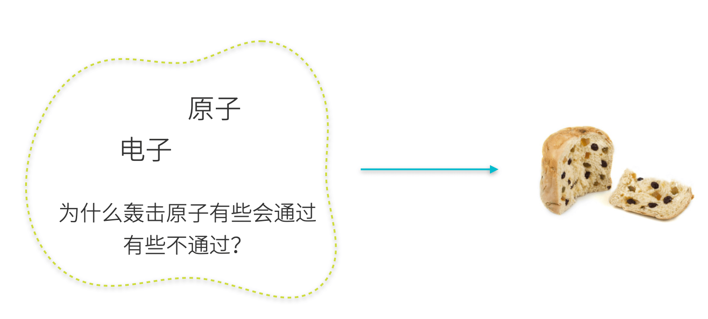
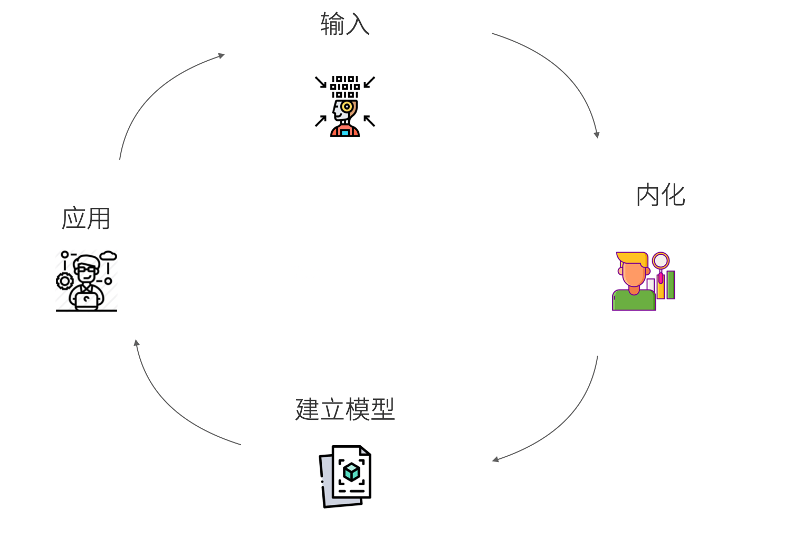

## 通过模型学习

我不是一个善于学习的人，我的大脑发展并不均衡：喜欢把一些问题载入大脑慢慢思索，但是记忆力非常差。

用计算机来类比的话，我是那种 CPU 尚可但是硬盘极差，以至于很长一段时间内成绩都不是很好，但是遇到喜欢的科目成绩有特别好。于是在读书生涯中成绩总是起起伏伏。

学习，不仅仅是读书时候的事，工作以后大部分人都必须成为一个终生学习者，否则就会被当前的岗位淘汰。我们应该见过各种各样的学习方法，这篇文章不会成为一种新的学习方法，而是总结前人的经验。

在读书和工作后，我使用过各种各样的学习方法，包括但不限于：

- 思维导图
- 费曼学习法
- 联想法学习英语
- 写作驱动法

这些方法都非常有效，但不得不承认人的学习能力和智力水平从客观上是有一定差距的，有时候别人可以通过一节课学会微积分的基本方法，而我却需要整整一年去理解和消化微积分到底是什么回事。

智力不够，方法来凑。

硬件不够，软件来凑。

于是我了解了各种各样的学习方法，通过寻找方法来弥补理解能力、记忆方面的不足。慢慢的我了解到，这些学习方法只是一种形式，其背后都是在建立一种让人容易理解的模型。

回忆一下我们的幼儿园是怎么学习算数的？老师会让我们用手指来代替数字，并进行计算。一个中学老师把联想、比喻使用的越好，对学生来说学习效果越好。我们天生难以理解抽象的概念，因为抽象的内容是人定义出来的，是建立在他人的知识背景之上的。对从来没有社会经历的高中生来说，没有为资本家工作过的经历，难以理解什么是“资本主义对人的异化”。在无法理解的情况下，就只能死记硬背，记忆力不好的人处于学习的劣势。

联想和比喻是我们理解事物最重要的方法之一，我们研究的对象是需要学习的知识，被用来联想和比喻的事物就是模型。

## 模型是什么样的？

在我细致的观察中发现，模型有一些有趣的特点。

模型是多样的。能帮助人理解知识的东西都是模型。教学条件好的地方老师会有各种各样的教具，地理课上老师会拿来地球仪，化学课老师会拿来分子模型，生物学老师会拿来人体模型。因为这些模型和教具，在理解一些知识的时候变得更加容易。但是给了我们一个印象，只有摸得着的东西，用塑料、木材等实物制作而成的才是模型。

这限制了我们的思维。中学时，我特别喜欢物理，为了理解物理学的一些知识，偶然间我在网上找到了一些关于物理学公式的 gif 动图，很多难以理解的东西变得容易理解了。

模型生活中无处不在，只要能拿来联想和比喻的东西都可以作为模型，或纸上、或电脑里。实际上数学、物理公式也是数学、物理的模型，而数学、物理则是宇宙的模型。

模型是简单的。因为知识和概念是复杂、难以理解的，因此我们需要通过类比、比喻来理解，如果我们找了一个模型，本身也很复杂和难以理解，可以说这个比喻并不恰当，或者这个模型并不成功。

模型的简单性是帮助理解的基础，所思维导图做得过于复杂还不如不做，简单性随之而来的是，模型都是错的。模型只能帮助理解知识，但是不能代替知识。

六祖慧能说过：“真理是与文字无关的，真理好像天上的明月，而文字只是指月的手指，手指可以指出明月的所在，但手指并不是明月”。对我们学习来说，模型是手指，而知识是天上的月亮。

## 什么可以当做模型？

书的目录就是一种模型。

我们把思维导图转换成文字版本就会发现，它和书的目录没有什么区别，只不过突出的重点不同。

对于工作后的人来说，大部分学习都是在电脑上完成的，用来承载知识模型的途径很多。

1. 思维导图
2. PPT、keynote 或者一些在线画图工具
3. markdown 的清单

如果不使用电脑，小抄是一种很好的表达模型的方法。我在一些考试的时候发现，小抄不是为了作弊，而是为了让自己对知识有一个全局的印象，并记住关键知识点，以及知识点之间的练习。

最巧妙的记录小抄的方法是使用一张 A4 纸（只能用一张，不能多），把尽可能关键的信息写在这个纸上。如果写不下，说明这个模型太过于复杂，换一张纸重新整理知识点，直到必要的知识点能在一张 A4 纸上呈现才算完成。

## 操作方法

模型法学习的关键在于知识的压缩和形象化。压缩是为了提炼出最重要的信息，形象化是为了能真正理解知识。

金岳霖先生在《知识论》中提到过很多处理知识的方法，简单来说，学习就是把凌乱的信息整理成有序的知识，并加以实践和应用的过程。

所以模型学习法有几个过程：

1. 输入
2. 压缩、理解、内化
3. 建立模型
4. 应用

### 输入

学习首先得有信息来源，不然理解和内化无法发生，即使能发生也是自己空想。最简单的输入过程就是阅读，除了阅读外和别人交谈、问问题都可以。

刚开始学习一个新东西的时候，需要大量的泛读，即使部分内容无法理解也可以跳过，先积累和寻找大量语料库。我的阅读速度一直都很快，也坚持阅读了大量的材料，有时候会发现前面无法理解的东西，读到后面就能理解了，所以不能因为部分无法理解就停滞不前，因为学习是一个整体性的过程。

个人建议在刚开始泛读时候不要过于在乎笔记，这样会让自己的思维被打断，可以用笔做一些标记或者折叠相应的页码。

### 压缩、理解、内化

当大量的速读和泛读之后，在脑海中可能会建立起来一个对知识的模糊轮廓。这个时候，需要尝试理解学习的知识到底是个什么？这个时候需要寻找能类比的事物，建立联系。比如 DNA 双螺旋结构的分子式非常像两条缠绕在一起的蛇；波尔的原子模型，可以类比为太阳系的行星结构，它的形象和能级结构非常相似。

理解这些知识后，尝试按照上面的说法，做出思维导图或者写在一张 A4 纸上，我一般喜欢压缩到一页 keynote 中，超过一页的内容就缺乏全局观和简单性。

### 建立模型

压缩后的知识点可以作为模型的草稿，如果没有什么问题其实就可以当做模型了。不过为了让模型起到帮助记忆和理解的作用，可以通过连线建立起元素之间的关系，画出概念之间的关系，这有点概念图的味道。

删减掉无关重要的的信息，尽可能的让模型保持简单。

### 应用

除了应试的用途外，如果我们学习到的知识不是为了拿来应用，那么知识也没有什么用处。

应用和实践是让知识记忆的更牢固，“纸上得来终觉浅,绝知此事要躬行”。并且我们建立的模型在实际使用过程中会遇到这样或者那样的问题，当模型并不能很好指导实际应用的时候，我们需要进行修正，并重新投入实践。

应用中获得的反馈也可以作为第一个步骤的输入，而且这个输入更为准确和重要。

## 写在后面

这篇文章相当于也是我对学习方法建立的一个模型，通过写作来检验这个模型发现还是有效的，所以可以将学习过程总结为：输入、内化、建模和应用。

当然，如果这篇文章对你有用的话，你也可以建立一个自己的学习模型。

