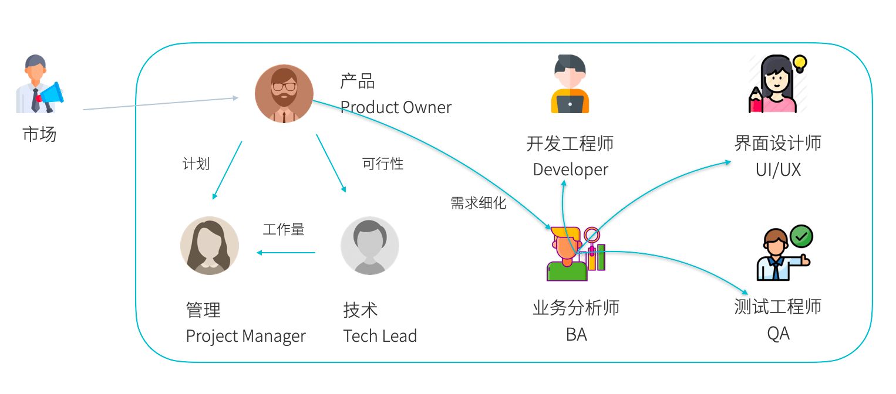

IT 团队出现管理上的问题几乎是必然的，工作多年的软件工程师总归需要面对技术管理和团队相关的问题。作为一名 Tech Lead，有一点思考分享给大家，如果你的团队刚好出现了一些问题希望有所帮助。

欢迎补充和批评。

## 团队问题都是管理者的问题

首先，想要分享的一条原则是："所有团队问题都是管理者的问题"。 这条原则来自于几年前在一个海外交付团队工作时，当时的 Team Lead 告诉我的。

在很多年前，软件行业流传着一条关于海外交付项目的传说：如果一个团队存在加班的情况，这个团队的管理者会被问责，因为是管理不善才出现加班的问题。

直到我有幸在一个远程海外交付团队上工作时才深有体会。当时的 Team Lead 是一位移民到澳洲的印度人，也正是他让我对印度人的印象发生改变。

由于远程工作时，Skype 会自动显示在线状态。因为某些原因我加班很晚，Team Lead 发现我还在线，于是他找到我聊了一下想知道原因。我就告诉他是因为流水线不太稳定，导致修复的问题经常无法正常部署，我起初并没有在意就并告诉没关系，多等会儿就好了。

没想到他非常重视这个问题，并在第二天马上提交了工单给相应的支持团队修复，并告诉我以后遇到类似的问题一定要告诉他，因为 Team Lead 有责任去推动解决。

在 IT 国内交付、咨询项目，经常会听到一种声音：团队存在什么问题，是因为开发/BA或什么角色能力不行，是因为客户要求不合理。

虽然这些问题是客观存在的，但最终这些问题还是"管理者的问题"，因为即使一些人员能力不足，管理者也需要去处理和应对这些问题，加强培训、高低搭配、结对编程，甚至换人也是一种解决方法。

总之，团队问题最终都是管理者的问题。因为团队是一个系统，而管理者处于这个系统的关键节点，其他人即使有能力、有意愿去解决也会困难重重。

## 权责利问题

团队问题另外的一个核心原因是权责利匹配问题。

权利和责任一致，且付出和回报一致，统称为权责利一致原则，这是团队管理的基本原则。 趋利避害是团队参与者的天性和客观规律，不以意志转移，短期或许可以为爱发电，长期则不行。

有权利做出决策的，必须为决策的后果担责，这样做出决策才会慎重，否则团队中全是指手画脚，而逃避责任的人。

反过来，如果让一个人承担很多责任，但是没有任何权利。他根本无法履行这些责任，并且团队平衡被打破。

例如，有一些团队会聘请外部的项目经理作为 Scrum Master，这个角色处于非常微妙的情景。一些领导期望 Scrum Master 可以履行团队按时交付的责任，但是整个团队的人员安排、需求分析、技术架构决策的权利都没有，于是变成了一个只会催促进度的"伪项目经理"，对项目的进度其实毫无办法。

这类角色很容易被真正控制团队的人作为推卸延期责任的工具，如果处于这类处境又没有额外的回报，那么基本上不会干太久。

划分权责利其实挺难，所以有条件的在项目前期就达成契约，划分好团队不同角色的职责和工作方式，减少权责利冲突。

## 纪律

一个出现问题的 IT 团队最大的特点是丢失节奏感，没有纪律。

这里的纪律不是说到点上下班，而是整个工作流程中，**该发生的事情一定要发生**。

团队是一个机器，每个参与者都是齿轮和螺丝钉，所以同进同推团队才能转起来。

站会必须按时进行才能了解每个人手上的工作是否阻塞，是否需要支援，是否有人处于空闲。

因为站会没有及时暴露问题，所以流水线挂掉大家不知道，进而让测试环境无法部署，导致测试延迟，进一步阻塞了代码冻结时间。 因为纪律的原因造成蝴蝶效应，一系列失控的场景屡见不鲜。

纪律另外一方面是**该做的事情每一步都不能糊弄**。

例如，因为一次上线比较简单，所以没有准备上线清单，没有按照流程操作，备份数据库造成线上事故。

再例如，因为业务需求临时加塞一个"很简单"的需求，没有走需求评审，也没有走技术评审的流程，没有体现在工作量评估上，私自临时的改变造成质量不佳的需求放进来造成系统性逻辑混乱。

为什么 IT 团队必须坚持纪律，不能将就，因为计算机在执行代码时也不会将就。

而有的时候管理者把"纪律"理解为考勤、在总办公室不能吃东西等行政管理，于是让出现问题的团队雪上加霜。

## 重建信任

一个有问题的团队往往信任缺失，需要及时重建信任。

需求提出者（PO）对开发团队丢失信任，可能会干预技术方案，打压工作量估算，想尽办法加塞额外需求；反过来，开发团队对需求提出者（PO）丢失信任，也会超额估算工作量，逃避需求，尽量按照简单的方式做。

其实建立信任的方式很简单，只需：专业、透明。

开发人员对 PO 的需求严苛的审核、评估，甚至能提出比 PO 更高的要求，很容易和 PO 建立良好的关系。

即使在开发过程中出现一些错误，及时暴露出来，透明化处理，也很容易消除误会。

不投机取巧，按规则办事，严格要求输入输出的质量，如果规则不合理就修正规则，长期下来就能建立信任。

## 信息流动

信息流动要在 Owner 之间流动，避免群拥而上，一哄而散。

团队信息流动方面经常出现的一个糟糕问题是，遇到问题一群不相干的人冲上去瞎忙活，关键的人却被丢在一边，人们的热情过去后又没人管，问题陷入公地悲剧。

管理者需要在团队中建立一套信息流动网络。比如需求从哪里来，怎么走，到那里去，由谁经手，责任人是谁，最终如何验收。

一些创业公司以团队规模小为由，觉得管理不重要，其实是没有把这笔账算清，经常导致重复跟进、多人跟进、跟进无结果等问题。

比如下面这张图就是一个信息流动的例子：

图片来源：[http://shaogefenhao.com/column/agile-team/20.team-role.html](http://shaogefenhao.com/column/agile-team/20.team-role.html)

## 向上管理

向上承接压力，向下指挥。

引发团队问题的另外一个原因是管理者把上级任务、焦虑、压力不经加工直接传递到了团队成员，造成恐慌混乱。

某种程度上来说，Tech Lead 有点像微服务中的 BFF（Backend for frontend），而开发人员像后端的领域微服务。

上级交代的任务不一定都是对的，因为上级有时候缺乏一线信息。需要做出一些取舍、加工变成可以执行的任务分发到具体的团队成员上。

换句话说，过滤上级不靠谱的要求、想法和焦虑本来就是 Tech Lead 工作的一部分。

## 团队习惯

《老子》中关于管理有一句话："太上,不知有之;其次,亲而誉之;其次畏之;其次侮之!"

最高级的管理是团队成员做了一些事情是他们觉得理所当然的，主动去做；其次是用个人能力说服他们做；再其次是用恐吓的方式驱动他们做，最后是靠辱骂批评让他们做。

有时候一个团队的文化往往和其 Lead 的风格相关，所以特别需要注意团队习惯的养成。

一个养成了准时参考站会、Code Review 等活动习惯的团队，如果有一天 Tech Lead 请假外出，团队也会自发进行。 尽可能把一切能变成机制的内容变成团队习惯，让团队机器自行运转。

如果该发生的活动和实践准时发生，一般也不会太差。

## 重拾信心

事情理顺后，带团队赢一次。

在很多团队事件报出后，我们可以分析出一个现象。一些IT 工作者，并不是因为工作压力大、辛苦而抱怨团队，而是因为没有意义的辛苦付出和毫无止境的加班而抱怨。

哀莫大于心死，对管理者和未来失去信心的团队是最难纠正的，只有想办法在某些方面赢一次，形势就会扭转。

带他们赢，是比给团队带来利益（比如涨薪，毕竟这个事情很多时候一线管理者说了不算）还能激发士气的一种方式。

比如，一个每次上线都会出问题的团队，如果进行治理后，规范上线流程，严格在预发环境演练，减少上线变更量。只需要顺利上线成功一次，那么团队就会被激活。

赢一次很重要，甚至值得不惜一切代价和更多成本只为赢一次，从此拨云见雾，收益也很大。

## 拓展阅读

最后文末补充了一些之前写的团队管理的心得，补充作为参考。

- 《敏捷团队的关键角色》 http://shaogefenhao.com/column/agile-team/20.team-role.html
- 《团队系统论：用分布式系统思考团队管理》http://shaogefenhao.com/posts/team/team-and-distributed-system.html
- 《好领导，本来应是挖渠人》 http://shaogefenhao.com/posts/team/manage-method.html
