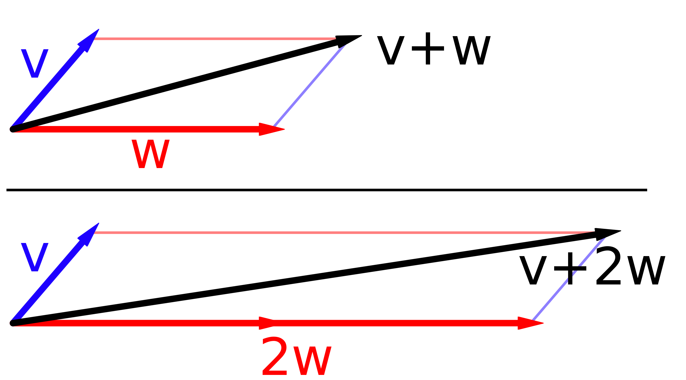
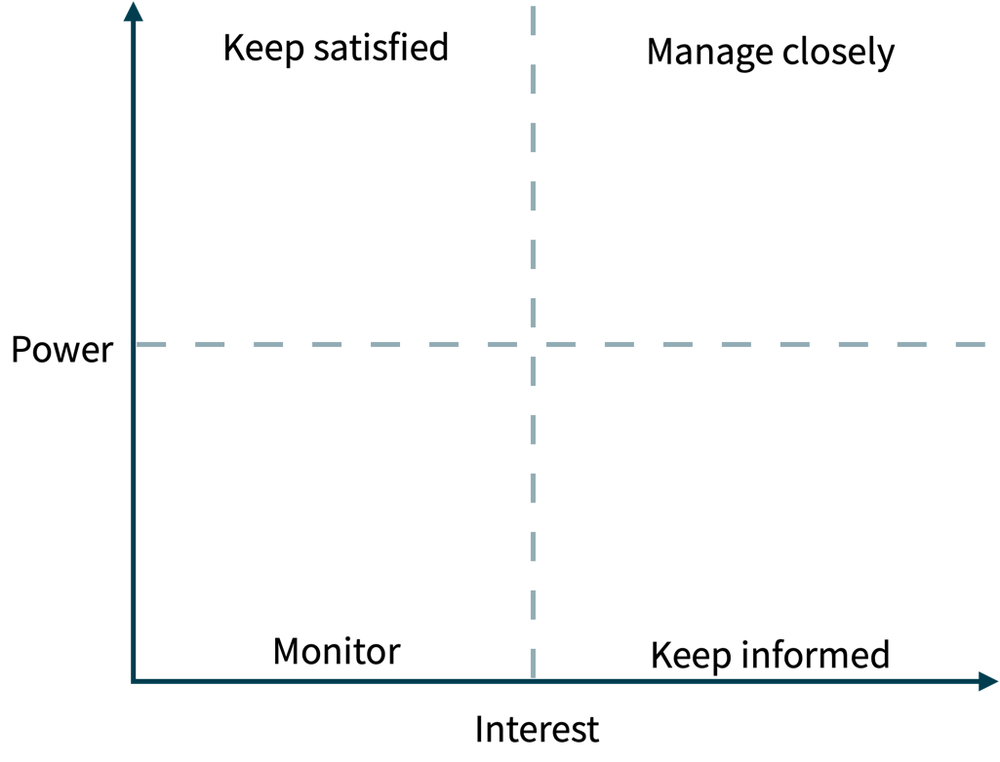
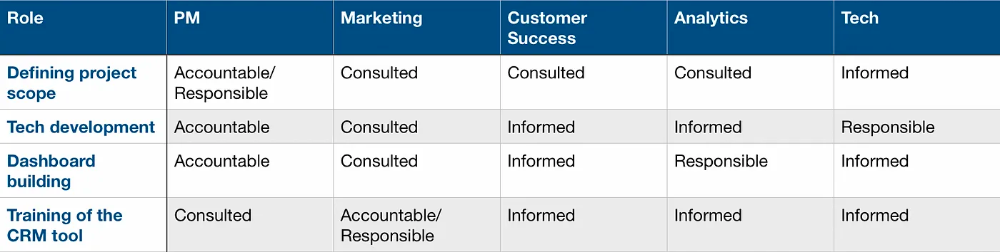

技术管理有时候应该反过来说，其实先是人的问题再是技术的问题。

干系人管理对于开发人员来说往往都不擅长，但是对于技术管理来说就不得不学习了。

## 为什么干系人管理如此重要？

在前面的文章中我举过一个例子，一个小孩想要更多的零花钱，虽然平时和爸爸关系更好但是他不得不找妈妈要，因为他妈管钱。

通俗的说这就是干系人管理。

实际情况是，我们经常找错了人。 明明经费在业务侧，我们却总是把工作重心放到 IT 侧，没经费怎么推动工作。

同样的例子在于各级政府也类似，能落地的政策往往也都是有财政支持的，否则就是口号，听听就可以了。

当然，财政在这里代表的只是干系人对事情影响的一方面，只不过是比较大的一方面。

我们常常会从两个维度来看干系人：

- 影响力：影响力包括对目标期望的促进作用，找到影响力大的人能决定成败的关键。
- 动机：动机是指干系人和既定目标的利益诉求是否同步，如果利益诉求一致的话，可以取得极大的支持。

一个有趣的比喻就是向量，如果把干系人比喻成物体受力分析的话，影响力就是向量的加法。

影响力可以看做向量的模，而动机可以看做向量的方向。

图片来源：维基百科

有些厉害的人在干系人方面非常敏感，往往能快速识别关键干系人。

对于普通人来说，可以找一些关键分析模型帮助我们提高这方面的能力。例如干系人地图、RACI 模型等，甚至在中国传统文化中，易学的分支奇门术也有这类作用，不过考虑到其迷信成分，这里就只讨论前面两个。

## 干系人地图模型

干系人地图是一种分析干系人的工具，通过坐标轴的方式分析和目标相关的干系人，以及这些干系人的影响力。

这是咨询思维中常见的用法，即矩阵（Matrix）。

我在几乎一些重大的项目上都会整理一个干系人矩阵。有时候对干系人矩阵的分析可能比较敏感，往往私下进行。

下面是一个干系人矩阵的模板：

总之来说，我们会更多关注 Manage closely 象限中的内容。

## RACI 模型

RACI 从另外一个维度划分干系人，是单词 Responsible、Accountable、Consult、Inform 的首字母缩写。

RACI 的出发点是权责一致的逻辑，责任更大的干系人自然兴趣也越高，而权利越大的人影响力也越高。

比干系人地图更进一步的是，RACI 一般是拆分到更细的事项上来看的，它比干系人地图更具体，也更具有操作性。

这里有一个，RACI 的例子：

从这个例子中很容易说明 RACI 的用法，只需要拆解相关职责、任务或者事项，并通过表格映射到干系人或者角色上即可。

这几个指标分别解释如下：

- R: 谁负责（Responsible）。负责执行任务的角色，具体负责运营项目和解决问题。
- A: 谁批准（Accountable）。 对任务的后果负责，并具有批准执行的权力。
- C: 咨询谁（Consult）。对任务能提出指导性意见的人。
- I: 通知谁（Consult）。需要及时通知的人，可以不用向其咨询意见或者看法。

RACI 更像是第一视角，而干系人矩阵像是俯视图，这两种常见的干系人管理思维工具往往足够使用，且可以相互配合。

## 如何影响你的干系人？

当我们分析完干系人后，一般可以通过什么方法去影响干系人呢？

在项目管理中，影响干系人的方法有这么几个：

- 共赢。如果干系人的动机和既定目标相匹配，那么这个没什么说的，能找到这样的干系人就很顺利。其关键是做真正有价值的事情，而不是自己觉得有价值的事情。
- 上升。如果干系人配合度不高，就从其他地方借力，如果他的领导能认同既定目标，这样对于干系人的 KPI 就有了保证，也就有了驱动力。
- 造势。如果大家都往前走，如果某些干系人不动，其实就是后退。找到办法制造既定目标的趋势，这样对于其他干系人就会产生危机感，进而也可以推动。

## 写在最后

干系人管理是一项很硬的软实力，由干系人管理带来价值可能比很多开发人员加班合起来还大。

虽然在国内有独特的干系人管理文化（酒桌），但是在 IT 行业中更多的是以技术影响力作为干系人管理的支点。

在职场环境中，每个人都喜欢"懂我所想"、"行我所不行"这类人，需要在技术之外懂得一些心理学、哲学的思想。

而这些工作有时候甚至看起来像是一场艺术。

## 参考资料

[1] 如何管理干系人？ https://cloud.tencent.com/developer/article/2126579

[2] Impact Mapping https://www.productplan.com/glossary/impact-mapping/

[3] Drawing impact maps https://www.impactmapping.org/drawing.html

[4] impactmapping Book  https://www.impactmapping.org/book.html

[5] https://medium.com/the-symmetry/stakeholder-management-for-product-managers-raci-model-c4864d984267

[6] 菲利普·津巴多,迈克尔·利佩.影响力心理学[M].人民邮电出版社,2008.
