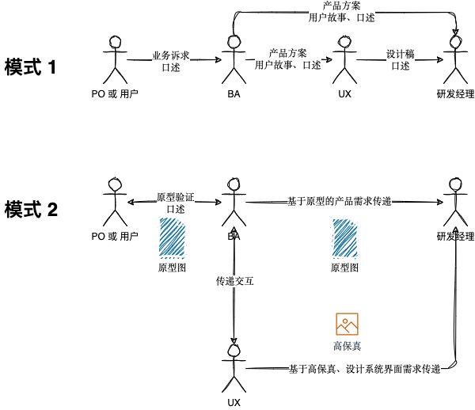
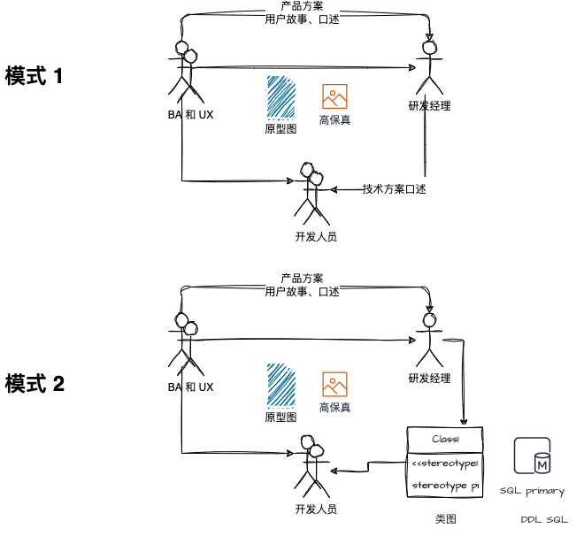
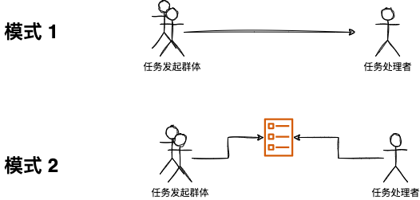
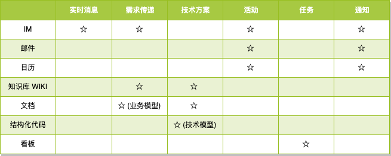

本文用于一个新的团队搭建沟通方式。

在软件工程中，我们不得不接受一个事实：人们无法清楚地表达想要表达的所有信息，而信息的接收方也很难在短时间内接收所有的信息。

由人类组成的团队是一个非常不靠谱的系统，在这个系统中通过充满二义性的自然语言传递需求、方案、问题，往往工作中大量的问题都是信息传递的问题。

为了描述本文的问题，我把信息分为了三类：

- 能被文字和图形清晰表述的内容。
- 不容易被文字表述，但是容易通过演示和解说表述。
- 既不容易被文字表述也不容易被演示和解说，这部分信息往往被称为"不可言说的知识"。

某些激进的敏捷支持者认为文档是形式主义的产物，无法起到知识传递的作用。可能他们认为团队中信息主要是不容易被文字表述和不可言说的知识。

实际上在日常工作中，不可言说的知识只是占非常小的一部分，因此我们还是可以挑选合适的媒介来传递知识，这里的媒介可以是语言、文字、图表或者其它更为规范化的形式。

能被文字和图形清晰表述的内容占比越大，团队对人的依赖就越小，在团队成员请假、离职时带来的影响就越小。

## 需求传递的媒介

**使用原型或者业务模型可以提高需求传递的质量。**

一般来说，在 To B 端的项目中，需求分析师(BA)的需求来自于 PO 或者用户。如果需求传递过程中，只使用文字、表格作为媒介传递介质（见下图模式 1）会有几个弊端：

1. PO 对软件"长什么样"缺乏直观了解，无法立马给出反馈。
2. BA 需要将业务传递给 UX、研发人员，UX 对 BA 和 PO 关于页面交互的设计意图会丢失一部分，研发经理没有拿到交互和页面信息无法准确进行技术方案。
3. UX 输出的结果往往会和 BA、研发经理的预期不一致。

模式 1 中，BA 传递产品方案缺乏有效介质，不能快速获取反馈和表达产品设计意图。

在 模式 2 中，有一些互联网公司有类似 BA 产品经理岗位，通过原型图（只有字段和布局信息，不关心样式），通过原型图传递产品设计意图到 UX 和 研发经理。

除了原型之外，还有一些业务的模型可以作为需求传递的介质，例如：

- 服务蓝图
- 需求 PRD 文档
- 用例图

## 技术方案传递的媒介 

**使用结构化模型传递技术方案。**

一般来说，研发经理会对产品方案初步分析，进行技术方案设计，并传递给开发人员（模式 1），如果直接将未经过整体设计、评审的产品方案给到具体的开发人员，会造成混乱。

技术方案的传递可以使用：领域模型图、DDL 图、API 文档等形式传递需求。

## 任务传递的媒介

**如果需要追溯一件事情的进展，就创建一个任务或者工单（Ticket）。**

虽然任务管理系统已经非常普遍，但是依然有很多团队通过口头的方式（模式 1）发出任务。例如，一名售后工程师每天需要处理非常多来自市场的反馈，如果通过 IM 即时消息传递信息，对任务的发起者和接受者都会痛苦。

高效的团队对于需要追踪的沟通问题可以通过创建任务来解决（模式 2）。

常见的任务管理工具（看板工具）有：

- Trello 看板
- Jira
- 禅道

## 日程信息的媒介

**如果需要预定一个人的时间参会，就创建一个日历。**

第一次在海外公司工作感受最为深刻的就是日历，几乎很多办公系统都有日历系统。例如，Google 的 Calendar，微软的协作工具 Teams 或者 Skype 都可以预定日历。

这样团队就可以共享日程、活动，并能检查需要参会的人员繁忙程度。

现在国内的一些办公系统也能创建这些功能，但是有使用团队日历的团队不多，需要培养团队的习惯才能用起来。

## 共享知识的媒介

**如果需要团队共享知识，就创建一套知识库。**

在 IT 团队中，共享知识几乎是团队沟通中的必备需求，知识的对齐拉通、工作交接、长期维护都需要知识库。

有条件的团队可以购买 Confluence 配合一些绘图插件、代码插件使用。没有条件的团队搭建知识库也非常简单，创建一个基于 Markdown 的代码仓库即可，使用 Markdown 渲染为 HTML 页面作为团队知识库即可。

## 正式通告的媒介

**事关重大，就发邮件。**

邮件一般作为正式通知、关键信息留痕的用途。对于敏捷团队来说，全功能特性团队用到邮件的地方不多，更多用于团队之间的沟通。

但是邮件对于公司层面，以及跨团队协同时非常必要，这里就不再赘述。

## 总结

我把常见信息传递方式和信息载体整理了一个表格：

培养团队习惯，将团队引导为"写作驱动型团队"，而不是"口述沟通型团队"，让知识能被沉淀下来，提高团队的竞争力。
