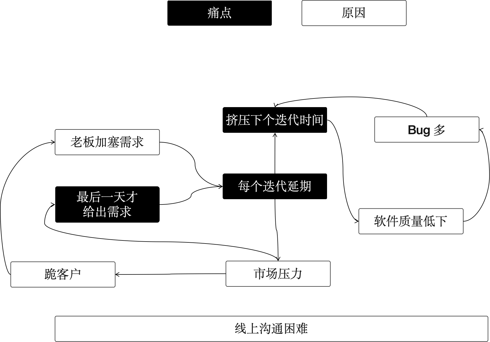
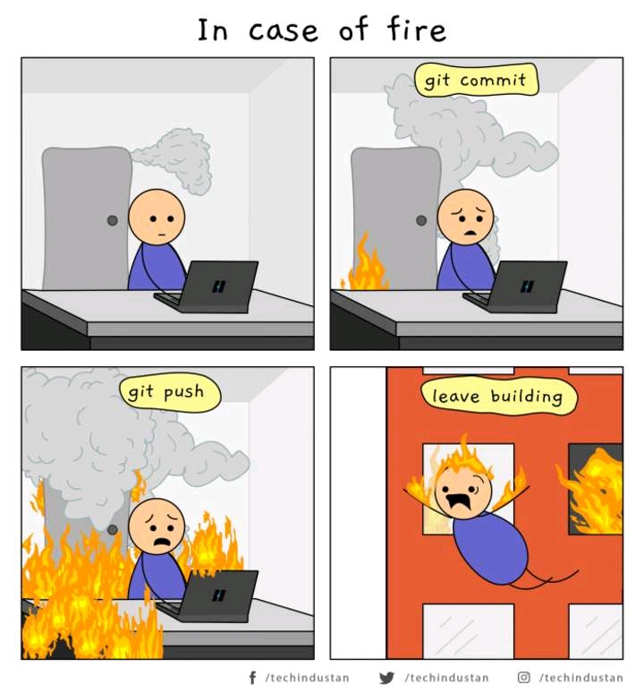

在开始这篇文章之前，我想借此机会重申这个专栏的定位和目标。我的技术管理之路并非一帆风顺，所幸经历了“生活的磨砺”。我希望通过分享、反馈和深化这些经历、见闻和领悟，将它们整理成有用的内容。

因此，我希望这个系列的文章能做到：

1. **直面问题**：致力于解决管理工作中的实际困难，尤其是基层管理工作中的挑战。例如，冲突管理就是一个非常棘手的问题。
2. **真实且实用**：避免空洞的套话，提供管理者在工作中可以直接应用的技巧。例如，如何建立核心团队是一个常见的管理策略。
3. **深入本质**：即便问题的本质触及人性冰冷的一面，管理者也需要勇敢面对。

这也是我没有像“穿西装的人”那样使用真名的原因。我希望在网络上发表更真实、有价值的内容，有时甚至揭露一些管理者的问题。使用网名不仅方便，也很酷。这样，读者可以对文章做出更客观的评价，不受我工作身份的影响。。

上面啰嗦这么多。

今天我们讨论的问题是：**为什么需要有纪律的团队，且如何构建有纪律的团队？**

## 无组织和无纪律

在这里，我虚构了一个疫情期间的远程团队，并自封为 TechLead，把这个团队叫做 Punctuation（标点符号团队），负责知了咨询平台的开发。

由于某些原因，前任 TechLead 离职了，虽然原因很多，但估计与这个团队的工作方式有很大关系，接手这个团队显得有些棘手。

我开始参与每天的站会，并尝试作为一名开发人员去体验整个开发过程。

得出了一些有趣的发现：

1. 团队使用敏捷开发，开发人员抱怨产品经理会把他觉得紧急的任务**塞到迭代**中。
2. 产品经理抱怨团队总是开发人员总是导致**每个迭代延期**，所以不知道是估算不够准确还是他们在家划水，所以并不信任他们的估算。这样如果想要完成 10 个功能，那么最好安排 12 个功能，这样他们实际完成 10 个功能也算不错了。
3. 同时开发人员也在抱怨，产品经理往往在迭代的**最后一天才给出需求**，他们来不及整体设计，所以导致方案经常变化，这是延期的主要原因。
4. 测试人员也抱怨 Bug 太多，而且**大家经常找不到**。
5. 老板也在抱怨，落后市场太多，给客户承诺的交付时间经常延期，需要去**跪客户**。
6. ……

当然，经常上班的朋友都知道，抱怨属于正常现象，不抱怨反而不正常。前面的抱怨还没写完，比如前端抱怨后端没有及时给出 API 无法联调，后端开发抱怨 UX 给出的字段信息和产品给出的不一样，等等。

但是抱怨开始产生内部矛盾，并让大家有离开的心理时就不正常了。我识别了一些这些抱怨中的关键字，尝试分析抱怨背后的问题和归因：

- 产品人员无法准时交付合格的需求分析产物，即使延期也好像没有引起管理者重视。
- 开发人员无法提前开始方案设计，导致迭代启动后无法并行工作，并及时集成。
- 因为延期和市场上线要求，导致质量可能被放水。

这些问题会造成恶性循环，愈演愈烈。团队就像一台发动机，齿轮之间的公差太大，导致齿轮无法精确咬合。

我们发现团队缺乏协同机制，即没有组织，而没有组织通常源于缺乏纪律，这就是我们老师经常说的“无组织无纪律”。

只有通过重整纪律，才能打破循环，把处于崩溃边缘的团队拉回来。

## 纪律的本质

这里想探讨真正的纪律是什么？不是什么？

**纪律是承诺（Commitment）。** 在每个岗位上的人需要对工作进行承诺，什么时候能交付，何时预警，何时呼叫队友支援。这里并不是说生病了也得完成任务，而是在无法达成承诺时，需及时预警，获取团队支援。

在项目管理中，需要有承诺的假设，并预留一些弹性，这样团队工作才能健康。

**纪律是秩序的基础** 没有纪律无法建立秩序，尽管秩序是一个大的话题，但纪律仍是其重要基础。

秩序描述的是，谁应该在什么时候做什么事，做到什么标准。如果团队每个人都能明白自己要做什么，何时做到合格，秩序就建立了。

**纪律是克制** 克制的意思是，当我们建立了一个秩序就必须遵守。例如，在敏捷项目中，迭代开启前需求和方案需要通过评审，才能进入开发。

需求提出者需要克制，不在锁定的需求上做变更，若需要变更需放到下个迭代中。而很多管理者没有意识到这点，他们拥有权力，肆意修改需求，导致秩序崩溃。

**纪律不是考勤打卡。** 即使在家工作，无需考勤，只要能满足 Commitment 也能被团队接受。很多管理者意识到纪律的重要性，就开始“整风运动”，例如对考勤进行苛刻惩罚。

考勤是一种手段，而非目的。如果考勤会打击团队的积极性，即使所有人准时到岗也没有意义。

如何把握这个度？

以秩序是否被破坏为标准。例如，很多公司鼓励弹性工作时间，但将会议迟到视为严重的纪律破坏，因为远程工作很难约到合适时间，错过会议机会，再约人是非常麻烦的。

**纪律不是个人英雄主义。** 有一些公司存在一些“个性的大神”，这些人往往按照自己喜好努力做一些额外的工作，而且能力都非常强。

比如，悄悄在晚上用工作之外的时间重构一个微服务，但没有和 TechLead 以及团队报告。

大多数情况下，不会造成太大影响，但有时因未理解系统设计意图，随意修改会导致严重问题。

PS：以前某团队以此为荣，但后续造成失控影响。

**纪律不是政治正确。** 团队纪律无关道德，不应对团队成员工作之外的生活做出评价，纹身、复杂的感情史，这都与工作纪律无关。

例如，把下班前修复未通过的流水线，这是一条敏捷工作纪律。但强制大家 TDD 就可能是政治正确的纪律了。

**纪律不是法律** 不应对违反纪律的团队成员进行攻击。纪律是为团队秩序服务，让团队顺利运行，若因特殊原因违反纪律也无可厚非。

比如，必须通过流水线才能部署制品，但某天流水线崩溃，必须上线，通过其它途径解决问题，也不算破坏纪律，只是某些公司需特殊审批。

因为地震没有 PUSH 也算违反纪律的话，我也不知道该说什么。

## 把团队训练成特种兵

我承认在职业生涯中，组建特种兵式的团队的机会不多，大多数情况下是草台班子。

老实说，开发团队往往非常给力，前提是 TechLead 不瞎折腾。

### 把成功和纪律挂钩

一个重要的经验是，把成功和纪律挂钩。比如，Punctuation 团队每次上线都很难一次成功，往往需要搞一两个通宵新版本才稳定。

这是一个未养成纪律习惯团队的表现，因为一开始没有上线清单！

人们太聪明了，每次上线的任务都在执行的人脑中。

“没事，这点问题很简单” 然后是一个小的配置错误折腾一宿。

后来我们开始要求以一次上线为例，把上线做到位，整理上线清单，事无巨细记录下来，在 UAT 环境演练几次。希望这次上线成功一次，给团队建立纪律的重要性。

幸好如愿，这次上线虽然有些问题，但比之前好多了。上线后，我们赶紧复盘，这次问题在哪里，希望下次一步到位。

无论如何，团队开始相信纪律的重要性，以至于后续迭代中，大家主动提前整理上线清单。

### 领导的带头作用

另一个重要因素是 TechLead 的习惯。

很多团队的文化，在某种程度上就是 TechLead（在有些团队是 PM）人格的投影。

如果 TechLead/PM 每天准时到公司，从不迟到，团队也会慢慢准时上班。

团队纪律最大的问题是领导者自己的问题，因为领导者拥有权力，如果无法自律，就无法律他。

### 训练团队的习惯

在之前讨论的潜移默化的管理方法之外，还有一种更为直接且普遍采用的方法：奖惩机制。

在这个问题上，我们可以借鉴古人的智慧。孙武训练宫女成为战士的故事就是一个经典案例。

> 孙武将宫女训练成战士的故事发生在春秋时期，当时吴王阖闾听闻孙武的军事才能，邀请他展示其军事才能。孙武提出以宫女为士兵进行演练，吴王同意并派出一百八十名宫女给孙武。起初，这些宫女不愿配合，嘻笑不止。孙武将其分为两队，任命吴王最宠爱的妃子为队长，并严格按照军法训练。当宫女们再次嘻笑时，孙武严厉处罚了两位队长，以示军纪。随后，宫女们开始认真对待训练，迅速掌握了军事技能。这一举动不仅证明了孙武的军事才能，也展示了纪律和规则在军队中的重要性，深得吴王信任，孙武随后被任命为大将，辅佐吴王四处征战。

总的来说，奖励优于惩罚，但惩罚总比不惩罚好。

正如我在之前的文章中提到的，所有的制度和管理机制都应遵循一个原则：

> 放大人性的闪光点，约束人性的弱点。

无论是通过成就感来激励，还是通过领导者的表率作用，这两种方式都是在放大人性的闪光点。但如果不对人性的弱点加以约束，就可能导致劣币驱逐良币。如果不遵守纪律的人可以提前休息、工作较少，那么长期下来，遵守纪律的人可能会产生不满。

尽管在短期内职业素养可以让人克服这些问题，但从长期来看，问题容易恶化。我们不鼓励对不遵守纪律和团队约定的人进行惩罚，但这个基准必须存在。

## 参考资料

- https://www.jianshu.com/p/bf5ac72fe1b0
