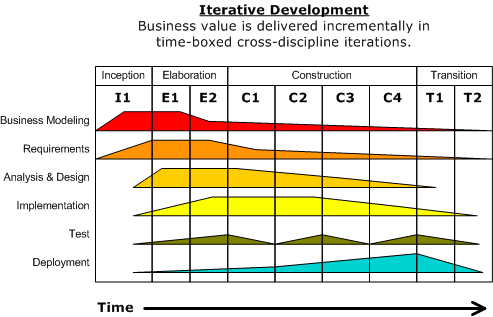
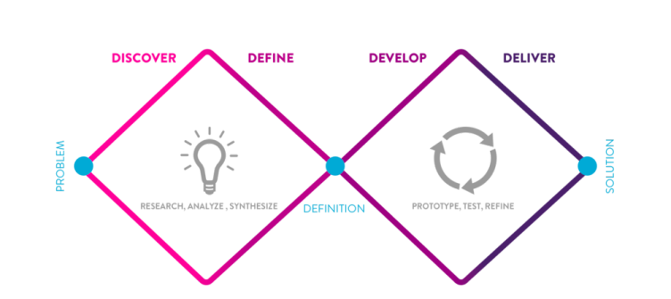
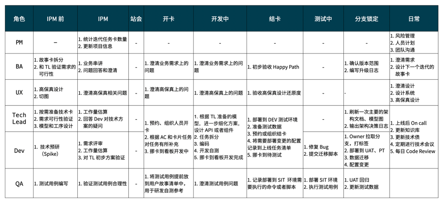

在应用开发领域，作为 Tech Lead 说的出来的技术亮点往往并不多，更多的是一些工程经验，看似没有什么技术含量却可以少走一些弯路。在最近几年里，作为项目的技术方，几乎每年都在参与新项目的启动，这里总结了一些关键软件项目启动过程的检查清单和经验，希望获得一些评论或者反馈。

在项目启动阶段一般会有项目团队的关键角色参与，由于我的角色一般是 Tech Lead，里是站在 Tech Lead 的视角讨论这些问题，也符合公众号订阅者的群体。

## 启动阶段的定位

敏捷的特点是快速启动、响应变化和着手行动，避免事无巨细的设计和规划，来应对软件这种特殊的工程对象。因此项目的快速启动阶段或者说准备阶段在敏捷项目中也明显区别于瀑布的工作模式。

敏捷项目的快速启动阶段不会要求字段级的 PRD 文档，强调不要花费过多的时间以阻塞交付工作，在业务分析和规划到一定程度时就应该"动手做起来"，并快速根据实际情况响应变化。如果要强行类比的话，可以看做瀑布模式中的概要设计阶段。瀑布模式从概要设计、详细设计、进入开发阶段，而简单来看敏捷就是快速启动阶段、迭代阶段，在迭代阶段进行详细设计。

快速启动这个概念在英文中叫做 Quick Start，更为精炼的用词是 Inception，Paulo Caroli 给的定义是"Inception, the beginning of an agile project" [2]。在 RUP [3] 方法论中，在软件项目前期也会有 Inception 的概念。

RUP 方法有一张非常形象的图来描述软件开发的过程。软件开发的本质就是知识消化并沉淀到软件上的过程，不像建筑、硬件工程那样，前期自然也不需要事无巨细的分析才开始行动。

总之，启动阶段不要做太多，也不能做太少。做太多会导致过于详细的设计导致交付受阻；不要做太少很多本应该提前决定的事情没有决定下来，对架构造成伤害。虽然这是一句废话，但是参考点就是把影响大的内容提前尽可能决策下来。

从结果倒推来看，项目启动阶段需要充分完成的工作有：

- 定义项目的目标、范围和期望
- 输出业务模型和原型
- 输出领域模型和架构规划
- 预研部分技术方案
- 输出任务清单和框架
- 工作量预估和人员计划
- 交付工作方式和流程制定

注：关于项目启动 Inception 的内容在 Thoughtworks 内部有一套完整的工作方法，不过由于涉及公司信息，不能发出来。后面基于公开可溯的材料，整理更符合业界认知的详细内容。

我们可以把项目启动这个特定阶段叫做 Quick Start。

## Quick Start 前期准备

在开启 Quick Start 前需要做一些准备工作，主要是进行调研、时间计划、参与人邀约和物料准备。

调研的目的是尽可能了解当前项目的现状。调研现状的核心元素可以总结为**人、钱、事**。人是最关键的要素，是后续所有工作的关键，决定了后续所有活动是否值得发起、什么时候发起；钱一般在软件工程中按照人天计算，可以视为项目的投入，要了解一个项目真正的规模、复杂性就看领导愿意投入多少预算，钱不会骗人；最后才是会有哪些事情需要调研，比如行业事件、领域知识、竞品等内容。

时间计划和参与人邀约是为了提前计划好所有的会议，因为有一些关键人物需要到场并达成共识，需要提前邀约。一般来说 Quick Start 会持续 2-4 周左右完成所有的活动。

物料准备是因为某些会议形式为工作坊（Workshop，要求参会者动手参与的会议形式），那么需要准备物料，比如：场地、便利贴等办公文具、ZOOM 等会议设施。

## 目标、范围和期望

目标、范围和期望在很多地方又被称为愿景（Vision），不过需要谨慎的使用愿景这个词，它会把会议带向高大上且空洞的方向去。

比如"让人们的生活更美好"，是一个不错的广告宣传语，但是对于项目启动来说没有任何用处。

识别愿景目的是让参与各方对目前要做的工作做出定位。比如，该项目是为了开发一个网站还是一个 APP，在一开始就得澄清。那么，为**农业从业者**开发一个**农技交流和农具销售**的**APP**的愿景就准确得多。

定义目标、范围可以使用电梯演讲来描述，而期望可以使用干系人地图来表达项目参与各方的立场和动机。

在愿景部分需要明确：

- 软件项目的用户、主要功能、边界
- 用户规模或者交易规模
- 干系人和干系人的期望
- 其它限制条件和因素
- 软件项目背后的商业价值和定位

除了电梯演讲之外，还有一些思维工具可以使用：

- 商业模式画布
- 精益价值树

## 业务需求分析

Quick Start 的业务需求分析不是详细的需求设计，更多的是验证一些假设，从而挖掘出真正的需求。

业务需求分析中有一个较大的误区，**把用户、客户陈述的内容当做真实的需求**，因此在这个阶段，应该将口述的需求当做假设，并对假设进行验证。

其工作过程为：

- 先发散，收集尽可能多的需求信息，包括用户调研、访谈和实地考察
- 再收敛，挖掘用户痛点、问题，并做出归因、优先级排序
- 再次发散或者头脑风暴，做出产品设计来解决这些痛点和问题
- 最终收敛，根据用户偏好、实现成本、可行性约束等方面选择比较合适的方案

这种思路叫做：双菱形模型。

因为 Quick Start 的业务分析是一种高阶的业务分析产出，所以没法做到非常细节的 PRD 文档输出，一般会叫做**高阶产品方案**。其表现形式有：

- 用户画像
- 用户旅程
- 服务蓝图
- 业务流程图
- 低/中保真原型图
- 信息架构（菜单、页面布局）
- 用户验证、技术专家验证结果
- 史诗级（Epic）用户故事

这些内容都有专门的咨询方法论描述。如果项目规模非常大，也会先将需求按照场景结构化的表述，然后再汇总成完整的高阶产品方案。

业务分析往往成拆分为 AS-IS 和 TO-BE 两种模式来完成。AS-IS 是指通过现有系统或者线下的方式完成既有任务，TO-BE 则是引入新规划的软件系统后的相关流程。通过前后对比，比如前后两种用户旅程对比，来体现当前软件项目的特点和价值。

## 技术现状和开发环境调研

技术现状和开发环境可以和需求分析的工作平行，主要目的是为了了解项目实施环境下的一些基础设施，现有系统的一些指标。

这些内容包括：

- 技术决策干系人
- 技术期望和目标
- 基础设施和公共服务
- 现有系统（可选）
- 技术约束（可选）
- 现有技术规范
- 非功能性需求

如果是乙方作为供应商参与到甲方公司的情况，这部分工作尤为重要，而甲方公司自研的项目则容易得多。

## 领域建模

领域建模可以看做是结构化的业务需求和形式化的代码之间的桥梁，处于问题空间和解决方案空间中间的位置。领域建模在很多地方被叫做业务建模，被划分到产品或者业务的范畴。

但大多数情况下一般是技术人员来驱动的，因为需要在到后续交付环节中使用。在过去的经验里，领域建模就是找出有哪些对象，这些对象的关系是什么。在 Quick Start 期间，对象中的属性不太能准确的整理出来，放入一些关键属性即可。

可以参考文章《建模方法元模型》里面提到了很多种建模的方法，以及优劣。也可以参考网站：http://domain-driven-design.org 上有一个基于事件风暴的简单工作坊指南。

在 Quick Start 期间的领域建模工作有一些注意事项：

- 统一语言非常重要，包括中文、英文和常见简写。统一术语表或者词汇表，可以让大大增强开发体验，避免了很多无畏争吵。
- 模型一定会改。在 Quick Start 阶段，领域专家、技术专家对业务的认识不足，产出的模型往往需要修正很多次才能在交付中勉强能使用。
- 界面设计会影响模型。一些理想的架构师会认为，领域模型设计需要保持和界面无关。这种思想过于理想，很多时候界面设计就是业务需求最直观的呈现，也会决定模型如何被抽象、是否能被抽象才能支持界面设计。
- 领域模型使用准确的 UML 作为产出，利于交付阶段进一步细化修改。

## 架构规划

架构规划的目的是为了澄清和定义有多少服务或者组件，来宏观的描述未来需要设计的系统。 

架构规划的来源有：

- 业务需求转化过后的领域模型
- 技术需求转换成的非功能性需求清单，作为技术设计指标

通过领域模型的抽象、依赖关系划分限界上下文，辨析限界上下文提供的能力来设计出领域微服务。通过技术调研的结果，根据实际情况，再考虑是否需要 BFF、Open API 等其它服务，最终获得架构图。

在传统的架构设计中，可以使用 4+1 view 来呈现架构图。但是在微服务时代，4+1 view 变得有一些不合适。更多的架构师使用 C4 模型，通过不同的颗粒度和缩放来描述架构。

一般来说我也会绘制另外的 4+1 张图来描述架构：

- 架构全景，对应 C4 中的 Landscape 图。将关键架构信息放到一张图上，用于后续汇报、团队沟通、On boarding 时快速介绍架构全貌。
- 上下文图，对应 C4 中的 Context。用来描述当前系统和外部系统的关系，关注集成架构。
- 容器图，对应 C4 中的 Container。用来描述微服务和这些微服务需要的基础设施，例如数据库，关注进程间结构。
- 组件图，对应 C4 中的 Component。用来描述典型服务中的代码分层结构和调用关系，关注进程内结构。
- 部署图，C4 中也有 Deployment。从另外的角度描述网络、DMZ 区、CDN 等部署和网络访问视角的信息，也可以包含测试环境、流水线设计等信息。

C4 中的 Class 图，在 Quick Start 阶段还无法给出，实际上维护也比较困难，可以维护比较有代表性的领域模型的 Class 图，这也是为什么我们在领域建模后就需要输出较为准确的 UML 图形。

总结一下架构规划产出物可以参考：

- 非功能性需求，决定了一些关键指标，如性能、容量、安全、国际化等要求
- 技术选型
- 架构图 C1-C4 
- 部署图

## 技术专题方案

一些技术设计内容难以在架构图中表述，比较好的处理方式是通过专题来完成，更适合 Quick Start 期间的任务分解和图形呈现。

通过技术访谈收集技术需求整理出相关痛点，对于这些痛点结合非功能性需求的设计指标，可以整理一些专题，并专项攻克、材料表达、评审。

例如，数据规模大的痛点，可以输出系统容量设计的专题，通过分库分表的解决方案来呈现并评审。这类方案往往不太好体现在架构图中。

在项目启动过程中，常见的一些技术专题会有：

- 鉴权
- 服务治理（配置中心、限流、熔断、灰度发布）
- 安全建模
- 测试策略（代码检查、单元测试、API 测试）
- 数据容量拓展策略（分库分表）
- 性能规划和服务器规格测算
- 国际化需求（多语言、多时区、本地化）
- 报表
- 分布式系统一致性处理

## 工作量估算和人员计划

当业务方案好技术方案稳定后，在 Quick Start 期间需要进行工作量估算、迭代计划、人员计划。

工作量估算有两种方式：基准点、人天。在敏捷工作方法中，更多的推荐基准点来估算消除人的差异。实际工作中，一般会将团队中一名普通开发能完成的人天作为基准点，以人天来估算，但一般是以团队平均水平为基线的人天估算。

在估算的过程中，需要补充一些技术工作项目，比如服务治理、分库分表、缓存、性能优化、API 联调、安全扫描和处理等工作，也可以参与估算，并排入迭代计划。

迭代计划会根据任务清单（包括业务需求项目和技术项目）根据优先级排入各个迭代。在敏捷项目管理中，一般一个迭代持续 2-4 周，在迭代计划制定时就需要澄清单个迭代的持续时间。

根据迭代计划可以制定出人员计划。整个交付期间需要多少开发人员、测试人员、UX 设计人员等。

## 交付启动：对齐工作方式和开发环境搭建

在 Quick Start 结束前后，需要准备交付相关准备工作，然后顺利进入迭代开发。一般会预留 1-2 周的时间来完成这些准备工作，这个阶段被称作 I0 或者设计迭代（Designer Iteration）。

工作方式（Way of Working） 对新团队的搭建和磨合来说是一个非常重要的事项，它必须包括团队有那些角色、这些角色的职责边界是什么，更高级的可以补充一些团队信息流动、人员梯队策略等内容。

开发环境搭建则需要包括：

- 代码仓库
- 流水线搭建
- 代码示例和最佳实践（这样存在多个服务可以保持统一的风格）
- 看板
- 知识库
- 代码规约
- 多个服务通用的 common 包，比如每个服务的鉴权、异常逻辑

## 汇报和评审

和交付启动过程平行要做的可能是评审和汇报。

一般来说评审需要尽可能在日常工作中做，但是往往由于一些公司的管理机制，需要邀请架构委员会对架构材料进行评审，因此可以提前获取相关要求和材料格式。

Quick Start 的汇报的听众往往是上级领导，那么需要仔细准备汇报材料。有几个常见注意事项：

- Quick Start 的材料可能内容会比较多，可以划分为正文和附录，将一些设计细节放到附录中
- 统一汇报材料中的字体、设计风格、保持美观
- 版本化管理，记录修改内容，用于追溯关键决策变化

## 总结

项目启动过程其实是比较紧张和辛苦的，对于 Tech Lead 来说需要快速的了解基础设施、业务背景（甚至商业背景）、识别关键干系人，并能在几周内做出合理的技术方案。

整个过程非常像一次咨询，需要储备非常多的材料才会比较顺利的完成，因此我们可以最常见的一些技术方案进行收集和整理，这样在此期间做出的判断更为准确可靠。

当然从另外一个方面来说，项目启动是非常有意义的经历，并一定程度决定了项目的成败。 

祝大家在自己的软件项目启动过程中顺利并有所收货。

## 参考资料

[1] 梁瑾.敏捷软件开发项目的快速启动方法[J].电子技术与软件工程,2017,No.99(01):52-53.

[2] https://martinfowler.com/articles/lean-inception/

[3] http://enterpriseunifiedprocess.com/essays/phases.html

[4] 《Agile Scrum: Your Quick Start Guide with Step-by-Step Instructions》

[5] 双菱形模型 https://www.linkedin.com/pulse/double-diamond-model-what-why-should-you-use-ionut-catalin-condruz 

## 打个广告

为了积累一些常见的技术方案，我们每周六会选一些系统设计（System Design）相关的话题进行讨论和整理，目前已经进行了 17 期，后续会陆续整理成文章发送到微信公众号中，也欢迎加入我们（详询文章头部的微信号） 。
